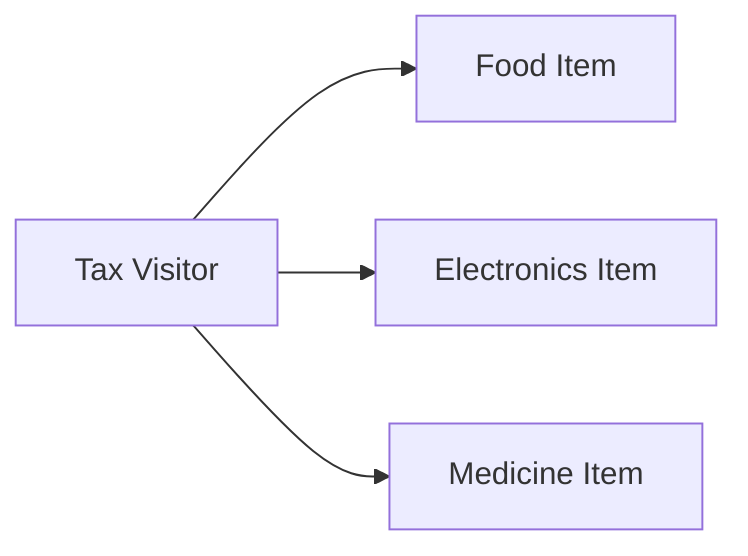

# Visitor Pattern in Go

## Complete notes

Visitor separates operations from the object structure they operate on.

In Go, this is less common than in Java, but useful for stable structures with many operations.

## Diagram



## Go code

```go
package catalog

type Visitor interface {
    VisitFood(Food) int64
    VisitElectronics(Electronics) int64
}

type Item interface {
    Accept(v Visitor) int64
}

type Food struct { Price int64 }
func (f Food) Accept(v Visitor) int64 { return v.VisitFood(f) }

type Electronics struct { Price int64 }
func (e Electronics) Accept(v Visitor) int64 { return v.VisitElectronics(e) }

type TaxVisitor struct{}
func (TaxVisitor) VisitFood(f Food) int64 { return f.Price * 5 / 100 }
func (TaxVisitor) VisitElectronics(e Electronics) int64 { return e.Price * 18 / 100 }
```

## How main calls it

```go
func main() {
    visitor := TaxVisitor{}

    foodTax := Food{Price: 1000}.Accept(visitor)
    electronicsTax := Electronics{Price: 1000}.Accept(visitor)

    fmt.Println(foodTax)
    fmt.Println(electronicsTax)
}
```

## Example output

```text
50
180
```

## Real-life example

Different product categories may have different tax, shipping, or compliance calculations. Visitor can add operations without changing traversal logic.

## When to use

- stable object types
- many operations over same structure
- AST processing
- tax/compliance calculations

## When not to use

If object types change frequently, Visitor becomes painful because every visitor must be updated.

## Interview answer

I would use Visitor when the data structure is stable but I need to add many operations over it, such as tax, validation, and export.

## Common mistakes

- using Visitor for simple type switches
- too many object types changing often
- making code harder than direct methods
