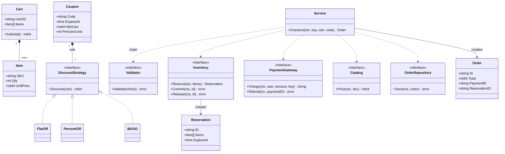
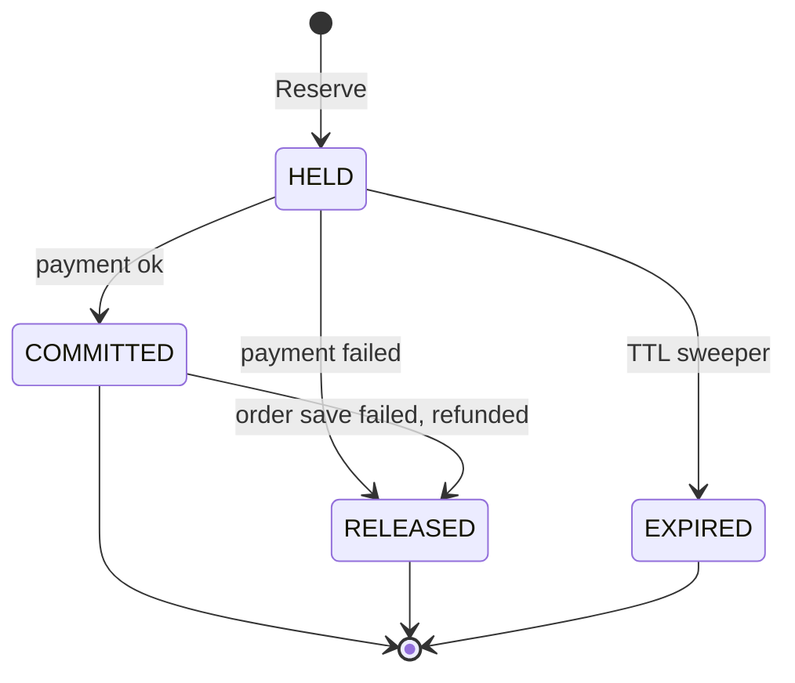
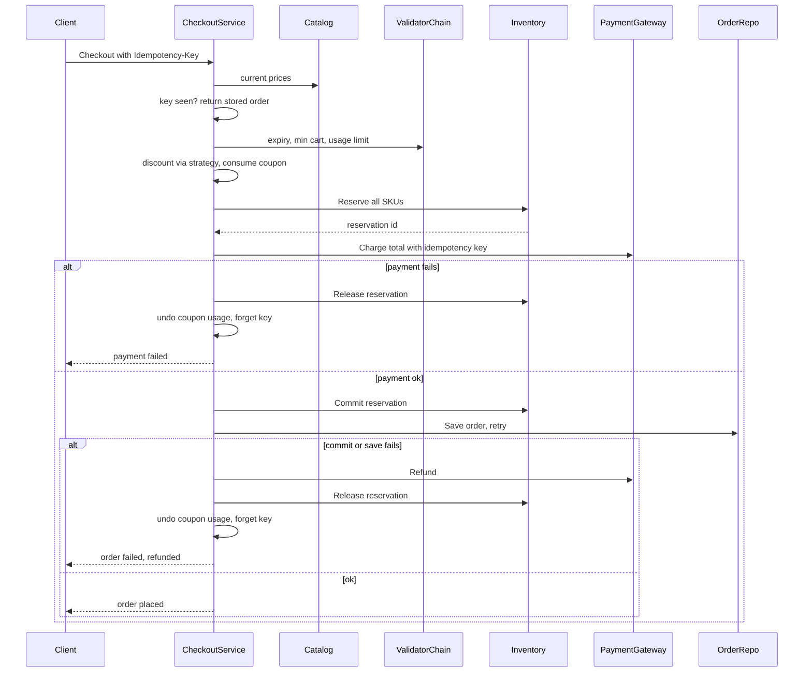

# Cart Checkout with Coupons LLD in Go

## Problem statement

```text
Design the cart and checkout of a Zepto / Swiggy Instamart style app.
A user has items in a cart and may apply a coupon. Checkout must price the cart,
validate the coupon, reserve inventory, charge payment, and create the order.
If payment fails, the reserved stock must be released. A retried checkout must
not charge twice. Code the Checkout method.
```

- It tests a **pricing pipeline** (Strategy + Chain of Responsibility), atomic **inventory reservation**, and a checkout Facade that runs a small **saga with compensation** when a later step fails.
- The senior signal is the failure cases: payment fails after reserve, payment succeeds but the order save fails, price changed, and duplicate retries (idempotency).

## How to use this note

- Open the drawing ([[Cart Checkout LLD Drawing.excalidraw]]), study it for one minute, then close it and redraw the saga with every red failure box yourself.
- Attempt each step before reading it. Cover the step, write your answer, then compare.
- Time box it like the roadmap's daily method (60 min): 10 min requirements and entities (Steps 1-4), 10 min APIs and storage (Steps 5-6), 25-40 min core code (Steps 7-8), 10 min edge cases (Step 9), 5 min explaining out loud.

## Step 1: Clarify requirements

### Questions to ask

- Is stock reserved at add-to-cart or at checkout? *Assume: at checkout, with a TTL (10 min) so abandoned holds come back.*
- Prices: snapshot at add-to-cart or recompute at checkout? *Assume: recompute; if any price changed, stop and show the new total (`ErrPriceChanged`).*
- One coupon per order, or stackable? Is the percent cap per order? Is BOGO "buy 1 get 1" on the same SKU? *Assume: one coupon; cap per order; BOGO on one SKU.*
- Payment sync (wallet/card) or async with webhook? *Assume: sync call that returns paymentID or error; async is a follow-up.*
- What if payment succeeds but we cannot save the order? *Assume: retry the save; if it still fails, refund and release. If refund also fails, flag for reconciliation, never charge again.*
- Should a failed checkout with the same idempotency key be retryable? *Assume: yes after a clean failure (payment declined); no after "money taken but stuck".*
- Money format? *Assume: int64 paise; percentages in basis points.*

### Functional

- Add / remove / update items in a cart (cart CRUD is simple and not coded here).
- Price the cart: subtotal from current catalog prices, coupon discount, final total.
- Coupon types: FLAT (Rs 100 off), PERCENT with cap (20% up to Rs 50), BOGO on a SKU.
- Coupon validation: not expired, min cart value, per-user usage limit.
- Checkout: validate, reserve stock (all-or-nothing), charge, commit the reservation, save the order.
- On any failure after a side effect: undo it (release stock, give coupon usage back, refund).

### Non-functional

- Money in `int64` paise; discount never exceeds subtotal.
- Retried checkout (double tap, network retry) must not double-charge: idempotency key.
- Two parallel checkouts by the same user must not both use a "1 use per user" coupon.
- Two users buying the last unit: only one gets it.
- No mutex held during slow I/O (payment call).
- Easy to add new coupon types and validation rules.

### Out of scope

- Delivery fee, taxes, stacking coupons (follow-ups).
- Async payment webhooks (follow-up).
- Cart persistence and the cart REST CRUD implementation.

## Step 2: Actors and use cases

| Actor | Use case |
|---|---|
| Customer | Add / update / remove cart items |
| Customer | Apply a coupon and preview the discount |
| Customer | Checkout and pay (may retry / double tap) |
| Payment gateway | Charge, refund |
| Inventory | Reserve, commit, release stock |
| System (sweeper) | Release expired reservations from crashed or abandoned checkouts |
| Ops | Reconcile "paid but no order" cases |

Hardest use case (the one to code): **Checkout**, because it touches 4 systems in order and each failure point needs a different undo.

## Step 3: Entities

| Entity | Key fields | Why it exists |
|---|---|---|
| `Cart` / `Item` | UserID; SKU, Qty, UnitPrice (paise, price the user saw) | Input; UnitPrice lets us detect price changes |
| `Coupon` | Code, Rule, ExpiresAt, MinCart, PerUserLimit | Constraints (when it applies) + rule (how much off) |
| `DiscountStrategy` | `Discount(cart) int64` | FlatOff, PercentOff (bps + cap), BOGO |
| `Validator` (chain) | `Validate(CouponCheck) error` | Each rule is one link: expiry -> min cart -> usage |
| `Reservation` | ID, Items, ExpiresAt; state HELD / COMMITTED / RELEASED / EXPIRED | A hold on stock that can be committed or undone |
| `Order` | ID, UserID, Subtotal, Discount, Total, PaymentID, ReservationID | The result; links payment and reservation for reconciliation |
| Idempotency entry | key `userID|idemKey`, state inProgress / done / stuck, order | Makes retries safe |
| `Catalog`, `Inventory`, `PaymentGateway`, `OrderRepository` | interfaces | Dependencies, faked in tests |

Modeling insight: **separate "how much" from "may I"**. A coupon has a `DiscountStrategy` (how much) and is checked by a `Validator` chain (may I use it). And **a reservation is its own entity with a lifecycle**, not just a number: you need its ID to commit or release exactly that hold, and its expiry to clean up after crashes.

## Step 4: Relationships





- **Composition**: Cart has Items; a Coupon has exactly one DiscountStrategy.
- **Dependency on interfaces**: Service uses Catalog, Validator, Inventory, PaymentGateway, OrderRepository; all are faked in tests.
- **Creation**: Inventory creates Reservations; Service creates the Order.
- Service is the Facade over pricing, coupon, inventory, payment and orders.

## Step 5: APIs and public methods

```text
GET    /cart                          -> items + priced breakdown
POST   /cart/items                    -> {sku, qty}
DELETE /cart/items/{sku}
POST   /cart/coupon                   -> {code}; returns discount preview or reason
POST   /checkout                      -> header Idempotency-Key: <uuid>; body {coupon_code, payment_method}
                                         200 {order_id, total_paise, status}
                                         409 price_changed {new_total} | 409 out_of_stock {sku}
                                         402 payment_failed | 202 in_progress (same key still running)
GET    /orders/{id}
```

The question bank's `Checkout(ctx, userID)` loads the cart by user; here the cart is passed in so the core logic is testable.

```go
func (s *Service) Checkout(ctx context.Context, idemKey string, cart Cart, code string) (Order, error)

type Inventory interface {
    Reserve(ctx context.Context, items []Item) (Reservation, error) // ReserveInventory
    Commit(ctx context.Context, reservationID string) error
    Release(ctx context.Context, reservationID string) error        // ReleaseReservation
}

type PaymentGateway interface {
    Charge(ctx context.Context, userID string, amount int64, idemKey string) (paymentID string, err error)
    Refund(ctx context.Context, paymentID string) error
}
```

## Step 6: Storage and repositories

```sql
CREATE TABLE inventory (
    sku       TEXT PRIMARY KEY,
    available INT NOT NULL CHECK (available >= 0),
    reserved  INT NOT NULL DEFAULT 0 CHECK (reserved >= 0)
);

CREATE TABLE reservations (
    id         TEXT PRIMARY KEY,
    user_id    TEXT NOT NULL,
    status     TEXT NOT NULL,            -- HELD | COMMITTED | RELEASED | EXPIRED
    expires_at TIMESTAMPTZ NOT NULL
);
CREATE INDEX reservations_sweep ON reservations (status, expires_at);

CREATE TABLE reservation_items (
    reservation_id TEXT REFERENCES reservations(id),
    sku            TEXT REFERENCES inventory(sku),
    qty            INT NOT NULL CHECK (qty > 0),
    PRIMARY KEY (reservation_id, sku)
);

CREATE TABLE coupons (
    code           TEXT PRIMARY KEY,
    type           TEXT NOT NULL,       -- flat | percent | bogo
    value          BIGINT NOT NULL,     -- paise or basis points
    max_discount   BIGINT,              -- cap for percent
    min_cart_paise BIGINT NOT NULL DEFAULT 0,
    per_user_limit INT NOT NULL DEFAULT 1,
    expires_at     TIMESTAMPTZ NOT NULL
);

CREATE TABLE coupon_usage (
    user_id TEXT,
    code    TEXT REFERENCES coupons(code),
    used    INT NOT NULL DEFAULT 0,
    PRIMARY KEY (user_id, code)
);

CREATE TABLE orders (
    id              TEXT PRIMARY KEY,
    user_id         TEXT NOT NULL,
    idempotency_key TEXT NOT NULL,
    status          TEXT NOT NULL,      -- pending | paid | failed | needs_reconcile
    subtotal_paise  BIGINT NOT NULL,
    discount_paise  BIGINT NOT NULL,
    total_paise     BIGINT NOT NULL,
    coupon_code     TEXT,
    payment_id      TEXT UNIQUE,
    reservation_id  TEXT REFERENCES reservations(id),
    UNIQUE (user_id, idempotency_key)
);

-- Reserve one SKU (all SKUs in one tx, sorted by sku to avoid deadlocks); check rows affected = 1
UPDATE inventory SET available = available - $1, reserved = reserved + $1
WHERE sku = $2 AND available >= $1;

-- Commit: held -> sold
UPDATE inventory SET reserved = reserved - $1 WHERE sku = $2;
UPDATE reservations SET status = 'COMMITTED' WHERE id = $3 AND status = 'HELD';  -- 0 rows = expired

-- Release / sweeper: give stock back
UPDATE reservations SET status = 'EXPIRED'
WHERE status = 'HELD' AND expires_at < now() RETURNING id;   -- then add qty back per item

-- Consume coupon atomically, check rows affected = 1
INSERT INTO coupon_usage (user_id, code, used) VALUES ($1, $2, 1)
ON CONFLICT (user_id, code) DO UPDATE SET used = coupon_usage.used + 1
WHERE coupon_usage.used < $3;
```

```go
type Catalog interface {
    Price(ctx context.Context, sku string) (int64, bool)
}

type OrderRepository interface {
    Save(ctx context.Context, o Order) error // idempotent on order ID (upsert)
}

type CouponRepository interface {
    Get(ctx context.Context, code string) (Coupon, error)
    Consume(ctx context.Context, userID, code string, limit int) error // conditional upsert, ErrUsageLimit
    Unconsume(ctx context.Context, userID, code string) error
}
```

## Step 7: Patterns

| Pattern | Where | Why here |
|---|---|---|
| [[Facade Pattern in Go]] | `Service.Checkout` | Hides catalog, coupon, inventory, payment, orders behind one call |
| [[Strategy Pattern in Go]] | `DiscountStrategy`: FlatOff, PercentOff with cap, BOGO | New coupon type = new struct, no `switch` in checkout |
| [[Chain of Responsibility Pattern in Go]] | coupon validators: expiry -> min cart -> per-user limit | New rule (first order only, city) = one new link |
| [[Repository Pattern in Go]] | Inventory, OrderRepository, CouponRepository | Swap in-memory for Postgres |
| [[Adapter Pattern in Go]] | Razorpay / UPI SDKs behind `PaymentGateway` | Gateway SDK types do not leak into the domain |
| [[Factory Pattern in Go]] | build a DiscountStrategy from the coupon row `type` | DB row -> right strategy in one place |
| Saga with compensation | each step after a side effect has an undo | No distributed transaction across inventory, payment, orders |
| [[Observer Pattern in Go]] | extension: `OrderPlaced` event | Notify, analytics, delivery assignment without touching checkout |

Patterns NOT used and why:

- **State pattern** objects for Reservation: four states, three transitions, all inside the inventory; a status field with conditional updates is enough.
- **Distributed transaction (2PC)** across payment and DB: the gateway does not support it and it couples availability; compensation is simpler.

## Folder structure

```text
checkout/
  model.go        -> Item, Cart, Coupon, Order, Reservation, errors
  pricing.go      -> DiscountStrategy + FlatOff, PercentOff, BOGO
  validator.go    -> Validator, ValidatorFunc, chain, DefaultChain
  inventory.go    -> Inventory interface + MemInventory (reserve, commit, release, sweeper)
  ports.go        -> Catalog, PaymentGateway, OrderRepository interfaces
  service.go      -> Service.Checkout (the saga), commitAndSave
  service_test.go -> table-driven failure cases + concurrency tests
cmd/demo/main.go  -> wiring: real catalog, Postgres repos, Razorpay adapter, sweeper ticker
```

- One file per concern so a new coupon type touches only `pricing.go` and a new rule only `validator.go`.
- The Step 8 block below merges them so it compiles standalone.

## Step 8: Core code

Main logic only. Full runnable code is folded below.

```go
type DiscountStrategy interface{ Discount(c Cart) int64 }  // FlatOff, PercentOff, BOGO
type Validator interface{ Validate(CouponCheck) error }     // chain: expiry -> min cart -> usage

type Inventory interface {
    Reserve(ctx context.Context, items []Item) (Reservation, error) // all-or-nothing
    Commit(ctx context.Context, reservationID string) error         // held -> sold
    Release(ctx context.Context, reservationID string) error        // give stock back, idempotent
}

// Checkout = reprice -> idempotency -> coupon -> reserve -> charge -> commit -> save.
// Every step after a side effect has an undo (saga with compensation).
func (s *Service) Checkout(ctx context.Context, idemKey string, cart Cart, code string) (Order, error) {
    // ... 0. reprice from catalog: ErrItemUnavailable / ErrPriceChanged
    key, useKey := cart.UserID+"|"+idemKey, cart.UserID+"|"+code
    // 1. Idempotency + pricing + atomic coupon consume, all under one lock.
    s.mu.Lock()
    // ... key seen: done -> stored order, stuck -> ErrNeedsReconcile, else ErrCheckoutPending
    o := Order{ID: "ord-" + key, UserID: cart.UserID, Subtotal: cart.Subtotal()}
    if code != "" {
        c, ok := s.coupons[code]
        // ... !ok -> ErrCouponNotFound
        chk := CouponCheck{Cart: cart, Coupon: c, Now: s.now(), Used: s.usage[useKey]}
        if err := s.validator.Validate(chk); err != nil {
            s.mu.Unlock()
            return Order{}, err
        }
        o.Discount = min(c.Rule.Discount(cart), o.Subtotal) // never negative total
        s.usage[useKey]++                                 // consume now, undo on failure
    }
    o.Total = o.Subtotal - o.Discount
    s.idem[key] = &entry{st: inProgress}
    s.mu.Unlock()
    // compensate := undo coupon usage + delete(s.idem, key), under s.mu

    // 2. Reserve stock (slow I/O, outside the lock).
    r, err := s.inv.Reserve(ctx, cart.Items)
    if err != nil {
        compensate()
        return Order{}, err
    }
    o.ReservationID = r.ID

    // 3. Charge. On failure: release stock, give coupon back.
    pid, err := s.pay.Charge(ctx, cart.UserID, o.Total, key)
    if err != nil {
        _ = s.inv.Release(ctx, r.ID)
        compensate()
        return Order{}, fmt.Errorf("%w: %v", ErrPaymentFailed, err)
    }
    o.PaymentID = pid

    // 4. Money is taken: Commit hold, then Save (retried 3x). If either fails:
    //    Refund ok   -> Release + compensate, return cause
    //    Refund fails -> mark key stuck, ErrNeedsReconcile (a retry never charges again)
    // ...
    s.mu.Lock()
    s.idem[key] = &entry{st: done, order: o}
    s.mu.Unlock()
    return o, nil
}
```

### Walkthrough

`Checkout(ctx, idemKey, cart, code)`:

1. **Reprice.** For each item ask the catalog for the current price. Missing -> `ErrItemUnavailable`; different from what the user saw -> `ErrPriceChanged`. Nothing has been changed yet, so no undo is needed. The client shows the new total and the user confirms.
2. **Idempotency.** Key = `userID|idemKey`. Done -> return the stored order (no second charge). In progress -> `ErrCheckoutPending`. Stuck -> `ErrNeedsReconcile`.
3. **Price + coupon under one lock.** Subtotal -> validator chain (expiry -> min cart -> usage) -> discount via the coupon's strategy, clamped with `min(discount, subtotal)`. **Consume the usage in the same critical section** as the check, so two parallel checkouts cannot both see `used = 0`. Mark the key in progress, then unlock before slow I/O.
4. **Reserve stock** all-or-nothing; the hold has a TTL. Failure (`ErrOutOfStock`) -> `compensate()`: give the coupon back, forget the key.
5. **Charge** with the idempotency key passed to the gateway, so a retried charge is deduped there too. Failure -> `Release` the reservation, then `compensate()`.
6. **Money is taken now. Commit the hold, then save the order** (`commitAndSave`). Commit fails if the hold expired during a slow payment; save is retried 3 times (it must be idempotent on order ID).
7. If step 6 fails: **refund** first. Refund ok -> `Release` (also undoes a commit) + `compensate()`, return the cause (`ErrReservationExpired` or `ErrOrderSaveFailed`). Refund fails -> do NOT release and do NOT forget the key: mark it `stuck` and return `ErrNeedsReconcile`, so a retry can never charge again and ops can finish it.
8. Success -> store the order under the key as `done` and return it.



> [!example]- Full runnable code (click to open)
> ```go
> package checkout
>
> import (
>     "context"
>     "errors"
>     "fmt"
>     "sync"
>     "time"
> )
>
> var (
>     ErrEmptyCart          = errors.New("cart is empty")
>     ErrItemUnavailable    = errors.New("item no longer sold")
>     ErrPriceChanged       = errors.New("price changed since added to cart")
>     ErrCouponNotFound     = errors.New("coupon not found")
>     ErrCouponExpired      = errors.New("coupon expired")
>     ErrMinCartValue       = errors.New("cart below coupon minimum")
>     ErrUsageLimit         = errors.New("coupon usage limit reached")
>     ErrOutOfStock         = errors.New("out of stock")
>     ErrReservationExpired = errors.New("reservation expired or not found")
>     ErrPaymentFailed      = errors.New("payment failed")
>     ErrOrderSaveFailed    = errors.New("order could not be saved")
>     ErrNeedsReconcile     = errors.New("payment taken but order not saved and refund failed")
>     ErrCheckoutPending    = errors.New("checkout already in progress")
> )
>
> type Item struct {
>     SKU       string
>     Qty       int
>     UnitPrice int64 // paise, the price the user SAW when adding to cart
> }
>
> type Cart struct {
>     UserID string
>     Items  []Item
> }
>
> func (c Cart) Subtotal() int64 {
>     var s int64
>     for _, it := range c.Items {
>         s += int64(it.Qty) * it.UnitPrice
>     }
>     return s
> }
>
> // ---- Strategy: how much discount ----
> type DiscountStrategy interface{ Discount(c Cart) int64 }
>
> type FlatOff struct{ Amount int64 }
>
> func (f FlatOff) Discount(Cart) int64 { return f.Amount }
>
> type PercentOff struct{ BPS, Cap int64 } // 2000 bps = 20%
>
> func (p PercentOff) Discount(c Cart) int64 {
>     d := c.Subtotal() * p.BPS / 10000
>     if p.Cap > 0 && d > p.Cap {
>         d = p.Cap
>     }
>     return d
> }
>
> type BOGO struct{ SKU string }
>
> func (b BOGO) Discount(c Cart) int64 {
>     for _, it := range c.Items {
>         if it.SKU == b.SKU {
>             return int64(it.Qty/2) * it.UnitPrice
>         }
>     }
>     return 0
> }
>
> type Coupon struct {
>     Code         string
>     Rule         DiscountStrategy
>     ExpiresAt    time.Time
>     MinCart      int64
>     PerUserLimit int
> }
>
> // ---- Chain of Responsibility: may this coupon be used? ----
> type CouponCheck struct {
>     Cart   Cart
>     Coupon Coupon
>     Now    time.Time
>     Used   int
> }
>
> type Validator interface{ Validate(CouponCheck) error }
>
> type ValidatorFunc func(CouponCheck) error
>
> func (f ValidatorFunc) Validate(c CouponCheck) error { return f(c) }
>
> type chain []Validator
>
> func (ch chain) Validate(c CouponCheck) error {
>     for _, v := range ch {
>         if err := v.Validate(c); err != nil {
>             return err // first failing link stops the chain
>         }
>     }
>     return nil
> }
>
> func DefaultChain() Validator {
>     return chain{
>         ValidatorFunc(func(c CouponCheck) error {
>             if !c.Now.Before(c.Coupon.ExpiresAt) {
>                 return ErrCouponExpired
>             }
>             return nil
>         }),
>         ValidatorFunc(func(c CouponCheck) error {
>             if c.Cart.Subtotal() < c.Coupon.MinCart {
>                 return ErrMinCartValue
>             }
>             return nil
>         }),
>         ValidatorFunc(func(c CouponCheck) error {
>             if c.Used >= c.Coupon.PerUserLimit {
>                 return ErrUsageLimit
>             }
>             return nil
>         }),
>     }
> }
>
> // ---- Inventory reservation: HELD -> COMMITTED | RELEASED | EXPIRED ----
> type Reservation struct {
>     ID        string
>     Items     []Item
>     ExpiresAt time.Time
> }
>
> type Inventory interface {
>     Reserve(ctx context.Context, items []Item) (Reservation, error) // all-or-nothing
>     Commit(ctx context.Context, reservationID string) error         // held -> sold
>     Release(ctx context.Context, reservationID string) error        // give stock back, idempotent
> }
>
> type resv struct {
>     Reservation
>     committed bool
> }
>
> // MemInventory: available is what can still be reserved; a reservation
> // already took its units out of available, so two buyers can never get the last unit.
> type MemInventory struct {
>     mu        sync.Mutex
>     available map[string]int
>     resv      map[string]*resv
>     ttl       time.Duration
>     now       func() time.Time
>     seq       int
> }
>
> func NewMemInventory(stock map[string]int, ttl time.Duration, now func() time.Time) *MemInventory {
>     return &MemInventory{available: stock, resv: map[string]*resv{}, ttl: ttl, now: now}
> }
>
> func (m *MemInventory) Reserve(_ context.Context, items []Item) (Reservation, error) {
>     m.mu.Lock()
>     defer m.mu.Unlock()
>     for _, it := range items { // check all first: all-or-nothing
>         if m.available[it.SKU] < it.Qty {
>             return Reservation{}, fmt.Errorf("%w: %s", ErrOutOfStock, it.SKU)
>         }
>     }
>     for _, it := range items {
>         m.available[it.SKU] -= it.Qty
>     }
>     m.seq++
>     r := Reservation{ID: fmt.Sprintf("res-%d", m.seq), Items: append([]Item(nil), items...), ExpiresAt: m.now().Add(m.ttl)}
>     m.resv[r.ID] = &resv{Reservation: r}
>     return r, nil
> }
>
> func (m *MemInventory) Commit(_ context.Context, id string) error {
>     m.mu.Lock()
>     defer m.mu.Unlock()
>     r, ok := m.resv[id]
>     if !ok {
>         return ErrReservationExpired // already released by the sweeper
>     }
>     r.committed = true
>     return nil
> }
>
> // Release gives stock back for a held OR committed reservation (rollback after
> // a failed order save). Releasing twice is a no-op.
> func (m *MemInventory) Release(_ context.Context, id string) error {
>     m.mu.Lock()
>     defer m.mu.Unlock()
>     r, ok := m.resv[id]
>     if !ok {
>         return nil // already released: idempotent
>     }
>     for _, it := range r.Items {
>         m.available[it.SKU] += it.Qty
>     }
>     delete(m.resv, id)
>     return nil
> }
>
> // ReleaseExpired is the sweeper for crashed/abandoned checkouts. Run on a ticker.
> func (m *MemInventory) ReleaseExpired() int {
>     m.mu.Lock()
>     defer m.mu.Unlock()
>     n, now := 0, m.now()
>     for id, r := range m.resv {
>         if !r.committed && !now.Before(r.ExpiresAt) {
>             for _, it := range r.Items {
>                 m.available[it.SKU] += it.Qty
>             }
>             delete(m.resv, id)
>             n++
>         }
>     }
>     return n
> }
>
> func (m *MemInventory) Available(sku string) int {
>     m.mu.Lock()
>     defer m.mu.Unlock()
>     return m.available[sku]
> }
>
> // ---- Other dependencies (Adapter / Repository) ----
> type Catalog interface {
>     Price(ctx context.Context, sku string) (int64, bool) // current price in paise
> }
>
> type PaymentGateway interface {
>     Charge(ctx context.Context, userID string, amount int64, idemKey string) (paymentID string, err error)
>     Refund(ctx context.Context, paymentID string) error
> }
>
> type Order struct {
>     ID                        string
>     UserID                    string
>     Subtotal, Discount, Total int64
>     PaymentID                 string
>     ReservationID             string
> }
>
> type OrderRepository interface {
>     Save(ctx context.Context, o Order) error
> }
>
> type state int
>
> const (
>     inProgress state = iota
>     done
>     stuck // money taken, no order, refund failed: ops must reconcile
> )
>
> type entry struct {
>     st    state
>     order Order
> }
>
> // ---- Facade ----
> type Service struct {
>     mu        sync.Mutex
>     coupons   map[string]Coupon
>     usage     map[string]int    // userID|code -> times used
>     idem      map[string]*entry // userID|key -> result
>     validator Validator
>     catalog   Catalog
>     inv       Inventory
>     pay       PaymentGateway
>     orders    OrderRepository
>     now       func() time.Time
> }
>
> func NewService(cat Catalog, inv Inventory, pay PaymentGateway, orders OrderRepository, now func() time.Time, coupons ...Coupon) *Service {
>     s := &Service{coupons: map[string]Coupon{}, usage: map[string]int{}, idem: map[string]*entry{},
>         validator: DefaultChain(), catalog: cat, inv: inv, pay: pay, orders: orders, now: now}
>     for _, c := range coupons {
>         s.coupons[c.Code] = c
>     }
>     return s
> }
>
> // Checkout = reprice -> idempotency -> coupon -> reserve -> charge -> commit -> save.
> // Every step after a side effect has an undo (saga with compensation).
> func (s *Service) Checkout(ctx context.Context, idemKey string, cart Cart, code string) (Order, error) {
>     if len(cart.Items) == 0 {
>         return Order{}, ErrEmptyCart
>     }
>     // 0. Price changed? Recompute from the catalog; never trust client prices.
>     for _, it := range cart.Items {
>         p, ok := s.catalog.Price(ctx, it.SKU)
>         if !ok {
>             return Order{}, fmt.Errorf("%w: %s", ErrItemUnavailable, it.SKU)
>         }
>         if p != it.UnitPrice {
>             return Order{}, fmt.Errorf("%w: %s %d -> %d", ErrPriceChanged, it.SKU, it.UnitPrice, p)
>         }
>     }
>
>     key := cart.UserID + "|" + idemKey
>     useKey := cart.UserID + "|" + code
>
>     // 1. Idempotency + pricing + atomic coupon consume, all under one lock.
>     s.mu.Lock()
>     if e, ok := s.idem[key]; ok {
>         s.mu.Unlock()
>         switch e.st {
>         case done:
>             return e.order, nil // replay: same order, no second charge
>         case stuck:
>             return Order{}, ErrNeedsReconcile
>         default:
>             return Order{}, ErrCheckoutPending
>         }
>     }
>     o := Order{ID: "ord-" + key, UserID: cart.UserID, Subtotal: cart.Subtotal()}
>     if code != "" {
>         c, ok := s.coupons[code]
>         if !ok {
>             s.mu.Unlock()
>             return Order{}, ErrCouponNotFound
>         }
>         chk := CouponCheck{Cart: cart, Coupon: c, Now: s.now(), Used: s.usage[useKey]}
>         if err := s.validator.Validate(chk); err != nil {
>             s.mu.Unlock()
>             return Order{}, err
>         }
>         o.Discount = min(c.Rule.Discount(cart), o.Subtotal) // never negative total
>         s.usage[useKey]++                                 // consume now, undo on failure
>     }
>     o.Total = o.Subtotal - o.Discount
>     s.idem[key] = &entry{st: inProgress}
>     s.mu.Unlock()
>
>     // undo coupon usage and free the key so the client can retry.
>     compensate := func() {
>         s.mu.Lock()
>         if code != "" {
>             s.usage[useKey]--
>         }
>         delete(s.idem, key)
>         s.mu.Unlock()
>     }
>
>     // 2. Reserve stock (slow I/O, outside the lock).
>     r, err := s.inv.Reserve(ctx, cart.Items)
>     if err != nil {
>         compensate()
>         return Order{}, err
>     }
>     o.ReservationID = r.ID
>
>     // 3. Charge. On failure: release stock, give coupon back.
>     pid, err := s.pay.Charge(ctx, cart.UserID, o.Total, key)
>     if err != nil {
>         _ = s.inv.Release(ctx, r.ID)
>         compensate()
>         return Order{}, fmt.Errorf("%w: %v", ErrPaymentFailed, err)
>     }
>     o.PaymentID = pid
>
>     // 4. Money is taken. Turn the hold into a sale, then save the order.
>     //    If either fails: refund, release stock, give the coupon back.
>     if err := s.commitAndSave(ctx, o); err != nil {
>         if rerr := s.pay.Refund(ctx, pid); rerr != nil {
>             // Do NOT release or forget the key: a retry must not charge again.
>             s.mu.Lock()
>             s.idem[key] = &entry{st: stuck, order: o}
>             s.mu.Unlock()
>             return Order{}, fmt.Errorf("%w: payment %s: %v", ErrNeedsReconcile, pid, rerr)
>         }
>         _ = s.inv.Release(ctx, r.ID) // also undoes a commit
>         compensate()
>         return Order{}, fmt.Errorf("payment refunded: %w", err)
>     }
>
>     s.mu.Lock()
>     s.idem[key] = &entry{st: done, order: o}
>     s.mu.Unlock()
>     return o, nil
> }
>
> func (s *Service) commitAndSave(ctx context.Context, o Order) error {
>     // Commit fails if the hold expired while the user was paying.
>     if err := s.inv.Commit(ctx, o.ReservationID); err != nil {
>         return err
>     }
>     var err error
>     for attempt := 0; attempt < 3; attempt++ { // Save is idempotent on order ID
>         if err = s.orders.Save(ctx, o); err == nil {
>             return nil
>         }
>     }
>     return fmt.Errorf("%w: %v", ErrOrderSaveFailed, err)
> }
> ```

## Test cases

| Test | Proves |
|---|---|
| `TestCheckout`: percent coupon, bogo | Discount math in paise, stock decremented, one charge, usage counted |
| `TestCheckout`: expired, below min, unknown coupon, empty cart | Each validator link returns its typed error; no side effects |
| `TestCheckout`: price changed, item delisted | Repricing catches stale cart prices before anything is reserved or charged |
| `TestCheckout`: out of stock | All-or-nothing reserve fails; coupon usage given back |
| `TestCheckout`: payment fails | Reservation released, coupon usage back to 0 |
| `TestCheckout`: save fails twice then ok | Save retry works, single charge |
| `TestCheckout`: paid but save keeps failing | Refund called, stock released, `ErrOrderSaveFailed` |
| `TestCheckout`: paid, save fails, refund fails | `ErrNeedsReconcile`, stock and coupon kept, no undo |
| `TestCheckout`: hold expired while paying | Commit fails, refund called, `ErrReservationExpired` |
| `TestRetryIsIdempotent` | Same key returns same order with one charge; key reusable after payment failure; stuck key never charges again |
| `TestSweeperReleasesAbandonedHolds` | Holds are released only after TTL |
| `TestConcurrentLastUnits` | 20 buyers, 5 units: exactly 5 win, 15 get `ErrOutOfStock`, stock 0 |
| `TestConcurrentCouponLimit` | 50 parallel checkouts, 1-use coupon: exactly 1 wins |

> [!example]- Full test code (click to open)
> ```go
> package checkout
>
> import (
>     "context"
>     "errors"
>     "fmt"
>     "sync"
>     "sync/atomic"
>     "testing"
>     "time"
> )
>
> type catalog map[string]int64
>
> func (c catalog) Price(_ context.Context, sku string) (int64, bool) { p, ok := c[sku]; return p, ok }
>
> type fakePay struct {
>     mu         sync.Mutex
>     fail       bool
>     refundFail bool
>     charges    int
>     refunds    int
>     onCharge   func() // hook to simulate time passing during payment
> }
>
> func (p *fakePay) Charge(_ context.Context, _ string, _ int64, k string) (string, error) {
>     p.mu.Lock()
>     defer p.mu.Unlock()
>     if p.onCharge != nil {
>         p.onCharge()
>     }
>     if p.fail {
>         return "", errors.New("declined")
>     }
>     p.charges++
>     return "pay-" + k, nil
> }
>
> func (p *fakePay) Refund(context.Context, string) error {
>     p.mu.Lock()
>     defer p.mu.Unlock()
>     if p.refundFail {
>         return errors.New("gateway down")
>     }
>     p.refunds++
>     return nil
> }
>
> type fakeOrders struct {
>     mu       sync.Mutex
>     failLeft int // fail this many Save calls first
>     saved    map[string]Order
> }
>
> func (r *fakeOrders) Save(_ context.Context, o Order) error {
>     r.mu.Lock()
>     defer r.mu.Unlock()
>     if r.failLeft > 0 {
>         r.failLeft--
>         return errors.New("db timeout")
>     }
>     r.saved[o.ID] = o
>     return nil
> }
>
> type env struct {
>     s      *Service
>     inv    *MemInventory
>     pay    *fakePay
>     orders *fakeOrders
>     now    *time.Time
> }
>
> func newEnv(stock int) *env {
>     now := time.Unix(1000, 0)
>     e := &env{now: &now, pay: &fakePay{}, orders: &fakeOrders{saved: map[string]Order{}}}
>     clock := func() time.Time { return *e.now }
>     e.inv = NewMemInventory(map[string]int{"milk": stock, "bread": stock}, 10*time.Minute, clock)
>     e.s = NewService(catalog{"milk": 6000, "bread": 100}, e.inv, e.pay, e.orders, clock,
>         Coupon{Code: "P20", Rule: PercentOff{BPS: 2000, Cap: 5000}, ExpiresAt: now.Add(time.Hour), MinCart: 10000, PerUserLimit: 1},
>         Coupon{Code: "BOGO", Rule: BOGO{SKU: "milk"}, ExpiresAt: now.Add(time.Hour), PerUserLimit: 5},
>         Coupon{Code: "OLD", Rule: FlatOff{Amount: 100}, ExpiresAt: now.Add(-time.Hour), PerUserLimit: 5})
>     return e
> }
>
> func milk(user string, qty int) Cart {
>     return Cart{UserID: user, Items: []Item{{SKU: "milk", Qty: qty, UnitPrice: 6000}}}
> }
>
> func TestCheckout(t *testing.T) {
>     tests := []struct {
>         name       string
>         setup      func(e *env)
>         cart       Cart
>         code       string
>         wantErr    error
>         wantTotal  int64
>         wantStock  int // milk left after the call
>         wantCharge int
>         wantRefund int
>         wantUsage  int // uses of code by user u after the call
>     }{
>         {name: "percent coupon", cart: milk("u", 3), code: "P20",
>             wantTotal: 14400, wantStock: 7, wantCharge: 1, wantUsage: 1},
>         {name: "bogo", cart: milk("u", 2), code: "BOGO",
>             wantTotal: 6000, wantStock: 8, wantCharge: 1, wantUsage: 1},
>         {name: "expired coupon", cart: milk("u", 1), code: "OLD", wantErr: ErrCouponExpired, wantStock: 10},
>         {name: "below min cart", cart: milk("u", 1), code: "P20", wantErr: ErrMinCartValue, wantStock: 10},
>         {name: "unknown coupon", cart: milk("u", 1), code: "NOPE", wantErr: ErrCouponNotFound, wantStock: 10},
>         {name: "empty cart", cart: Cart{UserID: "u"}, wantErr: ErrEmptyCart, wantStock: 10},
>         {name: "price changed since add to cart",
>             cart: Cart{UserID: "u", Items: []Item{{SKU: "milk", Qty: 1, UnitPrice: 5500}}},
>             wantErr: ErrPriceChanged, wantStock: 10},
>         {name: "item delisted", cart: Cart{UserID: "u", Items: []Item{{SKU: "eggs", Qty: 1, UnitPrice: 10}}},
>             wantErr: ErrItemUnavailable, wantStock: 10},
>         {name: "out of stock gives coupon back", cart: milk("u", 11), code: "BOGO",
>             wantErr: ErrOutOfStock, wantStock: 10},
>         {name: "payment fails: release stock and coupon", setup: func(e *env) { e.pay.fail = true },
>             cart: milk("u", 2), code: "BOGO", wantErr: ErrPaymentFailed, wantStock: 10},
>         {name: "save fails twice then ok (retry)", setup: func(e *env) { e.orders.failLeft = 2 },
>             cart: milk("u", 1), wantTotal: 6000, wantStock: 9, wantCharge: 1},
>         {name: "paid but save keeps failing: refund + release", setup: func(e *env) { e.orders.failLeft = 99 },
>             cart: milk("u", 2), code: "BOGO", wantErr: ErrOrderSaveFailed, wantStock: 10, wantCharge: 1, wantRefund: 1},
>         {name: "paid but refund fails: keep stock, needs reconcile",
>             setup: func(e *env) { e.orders.failLeft = 99; e.pay.refundFail = true },
>             cart: milk("u", 2), code: "BOGO", wantErr: ErrNeedsReconcile, wantStock: 8, wantCharge: 1, wantUsage: 1},
>         {name: "hold expired while paying: refund",
>             setup: func(e *env) {
>                 e.pay.onCharge = func() { *e.now = e.now.Add(11 * time.Minute); e.inv.ReleaseExpired() }
>             },
>             cart: milk("u", 2), wantErr: ErrReservationExpired, wantStock: 10, wantCharge: 1, wantRefund: 1},
>     }
>     for _, tc := range tests {
>         t.Run(tc.name, func(t *testing.T) {
>             e := newEnv(10)
>             if tc.setup != nil {
>                 tc.setup(e)
>             }
>             o, err := e.s.Checkout(context.Background(), "k1", tc.cart, tc.code)
>             if !errors.Is(err, tc.wantErr) {
>                 t.Fatalf("err = %v, want %v", err, tc.wantErr)
>             }
>             if err == nil && o.Total != tc.wantTotal {
>                 t.Fatalf("total = %d, want %d", o.Total, tc.wantTotal)
>             }
>             if got := e.inv.Available("milk"); got != tc.wantStock {
>                 t.Fatalf("stock = %d, want %d", got, tc.wantStock)
>             }
>             if e.pay.charges != tc.wantCharge || e.pay.refunds != tc.wantRefund {
>                 t.Fatalf("charges=%d refunds=%d", e.pay.charges, e.pay.refunds)
>             }
>             if got := e.s.usage["u|"+tc.code]; tc.code != "" && got != tc.wantUsage {
>                 t.Fatalf("usage = %d, want %d", got, tc.wantUsage)
>             }
>         })
>     }
> }
>
> func TestRetryIsIdempotent(t *testing.T) {
>     ctx := context.Background()
>     e := newEnv(10)
>     o1, err := e.s.Checkout(ctx, "k1", milk("u", 1), "")
>     if err != nil {
>         t.Fatal(err)
>     }
>     o2, err := e.s.Checkout(ctx, "k1", milk("u", 1), "") // double tap / network retry
>     if err != nil || o1 != o2 || e.pay.charges != 1 || e.inv.Available("milk") != 9 {
>         t.Fatalf("replay: %v %v charges=%d", o2, err, e.pay.charges)
>     }
>     // after a payment failure the same key may be retried and succeed
>     e.pay.fail = true
>     if _, err := e.s.Checkout(ctx, "k2", milk("u", 1), ""); !errors.Is(err, ErrPaymentFailed) {
>         t.Fatal(err)
>     }
>     e.pay.fail = false
>     if _, err := e.s.Checkout(ctx, "k2", milk("u", 1), ""); err != nil {
>         t.Fatal(err)
>     }
>     // stuck checkout never charges twice
>     e.orders.failLeft, e.pay.refundFail = 99, true
>     if _, err := e.s.Checkout(ctx, "k3", milk("u", 1), ""); !errors.Is(err, ErrNeedsReconcile) {
>         t.Fatal(err)
>     }
>     if _, err := e.s.Checkout(ctx, "k3", milk("u", 1), ""); !errors.Is(err, ErrNeedsReconcile) || e.pay.charges != 3 {
>         t.Fatalf("%v charges=%d", err, e.pay.charges)
>     }
> }
>
> func TestSweeperReleasesAbandonedHolds(t *testing.T) {
>     e := newEnv(10)
>     if _, err := e.inv.Reserve(context.Background(), []Item{{SKU: "milk", Qty: 4}}); err != nil {
>         t.Fatal(err)
>     }
>     *e.now = e.now.Add(5 * time.Minute)
>     if n := e.inv.ReleaseExpired(); n != 0 || e.inv.Available("milk") != 6 {
>         t.Fatal("released too early")
>     }
>     *e.now = e.now.Add(5 * time.Minute)
>     if n := e.inv.ReleaseExpired(); n != 1 || e.inv.Available("milk") != 10 {
>         t.Fatal("not released")
>     }
> }
>
> func TestConcurrentLastUnits(t *testing.T) {
>     e := newEnv(5)
>     var wins, sold atomic.Int32
>     var wg sync.WaitGroup
>     for i := 0; i < 20; i++ {
>         wg.Add(1)
>         go func(i int) {
>             defer wg.Done()
>             _, err := e.s.Checkout(context.Background(), "k", milk(fmt.Sprint("user", i), 1), "")
>             switch {
>             case err == nil:
>                 wins.Add(1)
>             case errors.Is(err, ErrOutOfStock):
>                 sold.Add(1)
>             default:
>                 t.Error(err)
>             }
>         }(i)
>     }
>     wg.Wait()
>     if wins.Load() != 5 || sold.Load() != 15 || e.inv.Available("milk") != 0 {
>         t.Fatalf("wins=%d outOfStock=%d left=%d", wins.Load(), sold.Load(), e.inv.Available("milk"))
>     }
> }
>
> func TestConcurrentCouponLimit(t *testing.T) {
>     e := newEnv(1000)
>     var ok atomic.Int32
>     var wg sync.WaitGroup
>     for i := 0; i < 50; i++ {
>         wg.Add(1)
>         go func(i int) {
>             defer wg.Done()
>             // same user, 50 different keys, 1-use coupon (min cart 10000 -> 2 milk)
>             if _, err := e.s.Checkout(context.Background(), fmt.Sprint(i), milk("u", 2), "P20"); err == nil {
>                 ok.Add(1)
>             }
>         }(i)
>     }
>     wg.Wait()
>     if ok.Load() != 1 {
>         t.Fatal(ok.Load())
>     }
> }
> ```

## Step 9: Edge cases

| Edge case | What happens | How the design handles it |
|---|---|---|
| Two users buy the last unit (race) | Both could see stock 1 | Reserve checks and decrements under one lock; DB: `UPDATE ... WHERE available >= qty`, rows affected = 1. All SKUs in one tx, sorted to avoid deadlocks |
| Stock changes during checkout | Item sells out between cart view and pay | Reserve is the truth: `ErrOutOfStock` names the SKU; coupon usage is given back |
| Same user, 1-use coupon, 2 parallel checkouts | Both could pass `used < limit` | Check + increment in one critical section; DB: conditional upsert `WHERE used < limit` |
| Double tap / network retry (idempotency) | Could charge twice | `userID|idemKey` entry; DB `UNIQUE (user_id, idempotency_key)`; same key passed to the gateway |
| Payment fails after reservation | Stock stuck as reserved | `Release(reservationID)` + undo coupon + forget key so the user can retry |
| Payment succeeds but order save fails | Customer charged with no order | Retry save (idempotent); then refund + release + undo coupon (`ErrOrderSaveFailed`) |
| ...and refund also fails | Money taken, no order, no refund | Keep key as `stuck`, keep stock, return `ErrNeedsReconcile`; ops/reconciler job creates the order or refunds later |
| Payment timeout (unknown result) | Do not know if money was taken | Do not release blindly; query gateway status by idempotency key, or wait for webhook; the key makes a retry safe |
| Hold expires during a slow payment | Sweeper gave stock back; commit fails | `ErrReservationExpired` -> refund. Set TTL > payment timeout so this is rare |
| Crash between reserve and charge | Hold never committed or released | Reservation TTL + `ReleaseExpired` sweeper on a ticker |
| Cart item price changed | User would pay a price they did not see | Reprice from catalog; `ErrPriceChanged` before any side effect; client shows new total |
| Discount bigger than subtotal | Negative total | `min(discount, subtotal)` |
| Float money | Rounding errors | int64 paise, percent in basis points |

### Common mistakes

- Float money and percentages; use paise and basis points.
- Discount larger than subtotal giving negative totals.
- Checking per-user usage, then incrementing after payment: parallel checkouts both pass.
- No compensation: stock stays reserved after payment fails.
- Releasing stock and forgetting the key when the refund failed: the retry charges again.
- Holding a mutex while calling the payment gateway.
- Trusting the price sent by the client.
- One giant `switch couponType` with all validation rules mixed into checkout.
- No idempotency key, so a retry charges twice.

## Step 10: Tradeoffs and extensions

| Follow-up | Design change |
|---|---|
| Stack multiple coupons | Pricing pipeline applies an ordered list of discount steps; rules for which types combine; clamp after each step |
| Delivery fee and taxes | More pipeline steps after discount: fee strategy by distance/cart value, GST per item category |
| Coupon only for first order / one city | New validator link; no change to existing links or strategies |
| Global coupon budget (first 1000 users) | Atomic counter: `UPDATE coupons SET remaining = remaining - 1 WHERE code=$1 AND remaining > 0`, or Redis DECR |
| Async payment with webhook | Save order as `pending` with reservation ID BEFORE charging; webhook (idempotent on payment_id) moves it to paid/failed and commits or releases; timeout job handles silence |
| Avoid "paid but no order" entirely | Same as above: the order row exists before money moves, so success is only a status update; a reconciler compares gateway payments with orders |
| Explain why a coupon failed | Each validator returns a typed error mapped to a user-facing reason |
| Flash sale on one hot SKU | Redis `DECRBY` for the hold, async write to DB; or a per-SKU queue |
| Notify downstream (delivery, email) | Publish `OrderPlaced` via an outbox table in the same tx as the order |

### Tradeoffs I chose

- **Reserve at checkout, not at add-to-cart**: carts are abandoned often; holding stock for them hurts other buyers. Cost: the item can sell out before pay.
- **Saga with compensation vs one DB transaction**: payment is an external system, so it cannot join a DB transaction. Each step has an undo instead.
- **Commit then save**: a saved order always has committed stock, so a failed save is undone by `Release`, and a saved order never needs deleting.
- **Refund on save failure vs pending-order-first**: refund keeps the sync code simple; pending-order-first (follow-up) is safer at scale because no money moves without an order row.
- **In-memory mutex vs DB conditional updates**: the mutex shows the idea in one process; in production the `WHERE available >= qty` and `WHERE used < limit` conditions are the real guards.
- **Fail on price change vs silently use the new price**: failing is honest and avoids disputes; it costs one extra tap.

## Drawing

![[Cart Checkout LLD Drawing.excalidraw]]

What the drawing shows:

- Section 1: CheckoutService facade, Cart, Coupon with DiscountStrategy (FlatOff | PercentOff | BOGO), Validator chain, Catalog, Inventory, PaymentGateway (Razorpay adapter), OrderRepository, Reservation, Order.
- Section 2: the saga: reprice -> idempotency + coupon -> reserve -> charge -> commit + save, with a red box for every failure and its undo.
- Section 3: Reservation states HELD -> COMMITTED / RELEASED / EXPIRED, and COMMITTED -> RELEASED on save failure.
- Section 4: inventory, reservations, coupon_usage, orders tables with their key constraints.

Redraw it from memory:

- [ ] The 5 checkout steps in order, and which undo each failure runs
- [ ] Strategy (how much) vs Chain (may I) for coupons
- [ ] Reservation state machine incl. the sweeper
- [ ] `UPDATE ... WHERE available >= qty` and `UNIQUE (user_id, idempotency_key)`
- [ ] The "paid but order save failed" path: refund, and what happens if refund fails

## Interview explanation

```text
Checkout is a Facade that runs a pricing pipeline and a small saga. First I reprice from the catalog and stop with price-changed if anything differs, then under one lock I check the idempotency key, run the coupon validator chain, compute the discount with the coupon's strategy in int64 paise clamped to the subtotal, and consume the coupon use atomically. Then I reserve all SKUs all-or-nothing with a TTL, charge with the same idempotency key, commit the reservation and save the order; if payment fails I release the reservation and give the coupon back, and if payment succeeded but the commit or save fails I refund, release and give the coupon back. If even the refund fails I keep the key as stuck so a retry can never charge twice and ops reconcile it. In SQL, the reservation is UPDATE ... WHERE available >= qty with rows affected checked, retries are guarded by UNIQUE (user_id, idempotency_key), and a sweeper releases expired holds.
```

## Related

- [[LLD Practice Roadmap]]
- [[LLD Question Bank with Answers]]
- [[Facade Pattern in Go]]
- [[Strategy Pattern in Go]]
- [[Chain of Responsibility Pattern in Go]]
- [[Repository Pattern in Go]]
- [[Adapter Pattern in Go]]
- [[Factory Pattern in Go]]
- [[Observer Pattern in Go]]
- [[Concurrency in Go LLD]]
- [[Testing LLD Code in Go]]
- [[UML for LLD Interviews]]
- [[Error Handling and Interfaces in Go LLD]]
- [[Inventory Order Assignment LLD in Go]]
