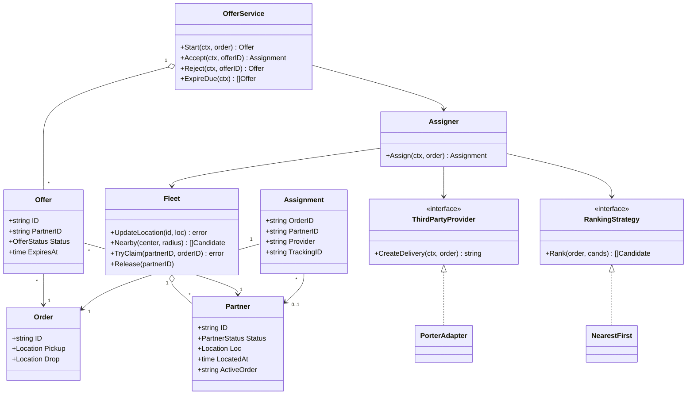
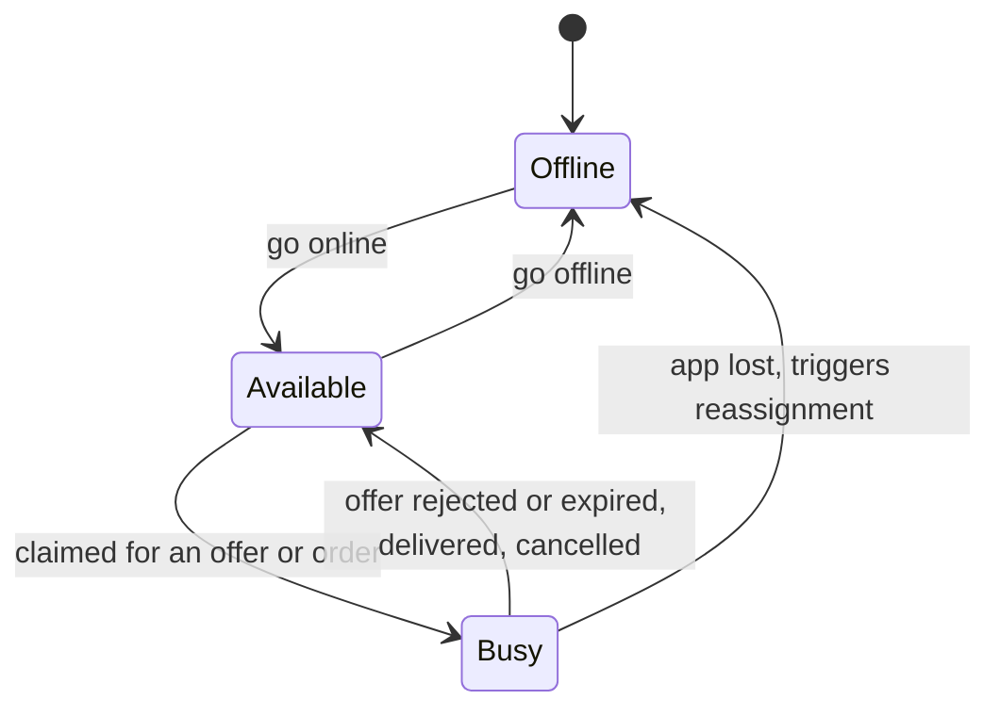
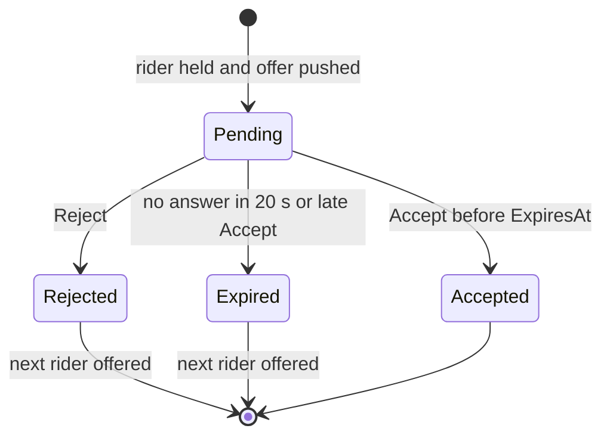
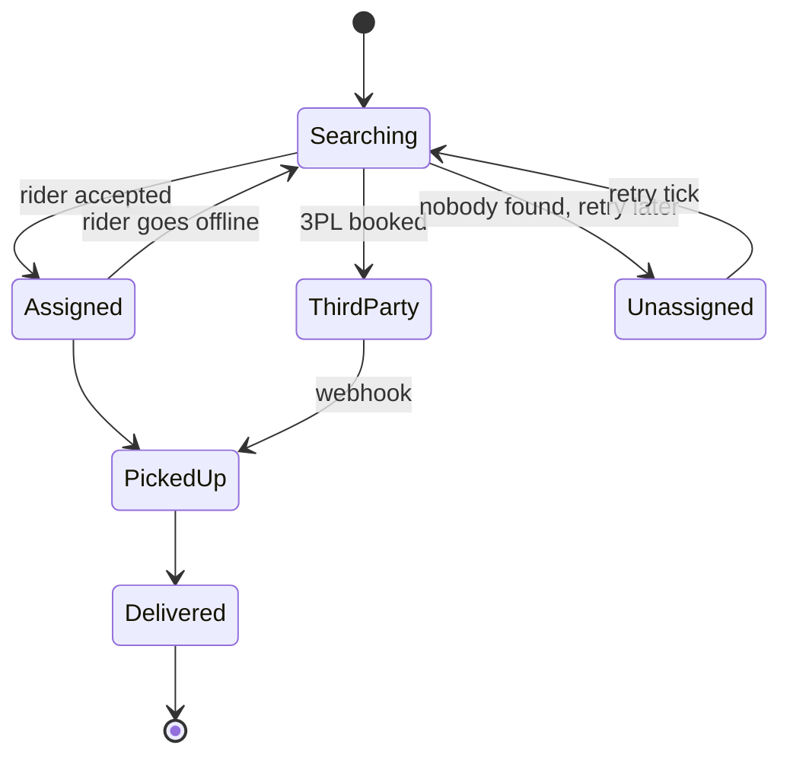
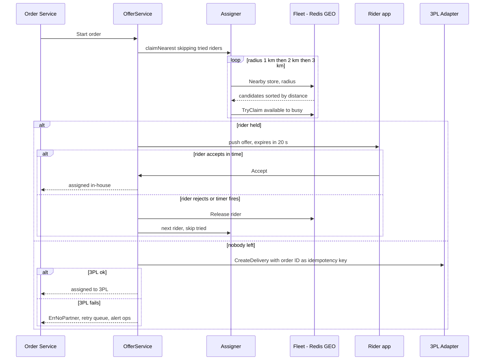
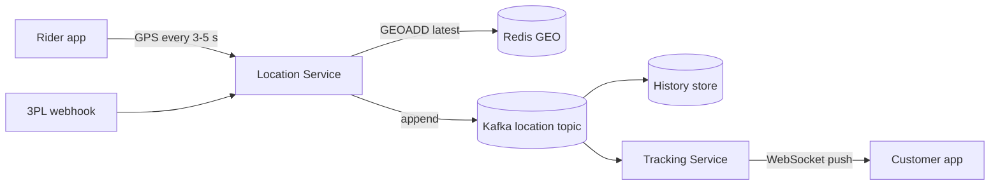

# Delivery Partner Assignment LLD in Go

## Problem statement

```text
An order is ready at a dark store. Assign a delivery partner within 1 km of the store.
If nobody is free nearby, handle it gracefully. Some orders may go to a third-party
logistics company. The rider can accept or reject an offer, and an offer that is not
answered in time goes to the next rider. The customer must see the rider's live
location until delivery. Design the classes, relationships, patterns, and DB schema.
Code the core assign method and AcceptAssignment / RejectAssignment with timeout.
```

What it really tests: a **race on a shared resource** (two orders must never get the same rider), a fallback chain (1 km -> wider radius -> 3PL -> retry queue) with an external system behind an adapter, and an offer state machine with timeouts.

## How to use this note

- Open the drawing below ([[Delivery Partner Assignment LLD Drawing.excalidraw]]), study it for 2 minutes, close it, and redraw it yourself. Use the checklist below as your drawing list.
- Attempt each step before reading it. Ask yourself the clarifying questions first and write your assumed answers.
- Time box 60 minutes, as in the [[LLD Practice Roadmap]] daily method: 10 min requirements and entities, 10 min APIs and storage, 25-40 min core code (`Assign` + the offer flow), 10 min edge cases, 5 min explaining out loud.

Drawing checklist (produce all of these in your 60 minutes):

- [ ] **Requirements**: functional + non-functional list, and 5 clarifying questions
- [ ] **Class diagram**: Partner, Order, Assignment, Offer, Location, Fleet, Assigner, OfferService, RankingStrategy, ThirdPartyProvider with multiplicity
- [ ] **State diagram**: Partner (offline / available / busy)
- [ ] **State diagram**: Offer (pending -> accepted / rejected / expired) and Delivery (searching -> assigned -> picked up -> delivered, plus third party / unassigned)
- [ ] **Sequence diagram**: happy path, order ready -> partner found in 1 km -> claimed -> offered -> accepted
- [ ] **Sequence diagram**: no rider in 1 km -> expand radius -> 3PL fallback -> queue + retry
- [ ] **Architecture sketch**: live location flow from rider app -> location service -> Redis GEO / Kafka -> customer WebSocket
- [ ] **ER diagram**: tables with keys and indexes
- [ ] **Code**: `Assign(ctx, order)`, the atomic claim, `Accept` / `Reject` / `ExpireDue`
- [ ] **Edge cases**: two orders racing for the same rider, late accept, rider goes offline mid-trip, stale GPS, 3PL timeout

## Step 1: Clarify requirements

### Questions to ask

- Is 1 km measured from the store (pickup) or the customer? *Assume: from the store, because the rider must first reach the store.*
- Straight-line distance or road distance / ETA? *Assume: straight-line (Haversine) for v1; ETA ranking is a follow-up strategy.*
- Do we assign directly, or **offer** the order and wait for the rider to accept? *Assume: offer with a 20 s timeout; on reject or timeout try the next rider. Direct assign is also coded for comparison.*
- Can one rider carry multiple orders (batching)? *Assume: no, one active order per rider in v1.*
- How often does the rider app send location? How many riders per city? *Assume: every 3-5 s, about 10k riders per big city.*
- Which 3PL providers, and are they sync (instant booking) or async (webhook)? *Assume: one provider (Porter-like), sync booking API, status updates by webhook.*
- What if nobody is found at all? *Assume: expand 1 km -> 2 km -> 3 km, then 3PL, then retry queue + ops alert.*

### Functional

- Riders go online/offline and send GPS location every 3-5 seconds.
- When an order is packed, find the best **available** rider within 1 km of the store.
- If none, expand the radius in steps (1 km -> 2 km -> 3 km).
- Offer the order to one rider at a time; the rider is held while the offer is pending.
- Rider accepts (assignment done), rejects, or does not answer in 20 s; on reject or timeout, release the rider and offer to the next one, never the same rider again for this order.
- If no in-house rider is left, book a third-party logistics (3PL) provider.
- If the 3PL also fails, queue the order for retry and alert ops.
- Customer and ops can see the rider's live location.

### Non-functional

- A rider must never be assigned to two orders by mistake (race between orders).
- Assignment should finish in under 1-2 seconds (excluding the rider's think time).
- Location writes are very high volume (10k riders x 1 update every 4 s = 2.5k writes/s per city).
- Ignore riders whose last GPS ping is stale (app killed, no network).
- 3PL calls must be idempotent and have a timeout and circuit breaker.
- Timeouts must be testable: inject the clock.

### Out of scope

- Route optimization and multi-order batching.
- Rider payouts, incentives, ratings.
- Customer serviceability check (done at checkout).
- Maps / ETA service internals.

## Step 2: Actors and use cases

| Actor | Use case |
|---|---|
| Rider app | Go online/offline, stream location, accept or reject an offer |
| Order service | Ask for a rider when the order is packed |
| Dispatcher (system) | Search nearby, claim, offer, expire offers, fall back to 3PL |
| 3PL provider | Book a trip, send status and location webhooks |
| Customer app | Track the rider live |
| Ops | See unassigned orders, get alerts |

Hardest use case, the one to code: **Assign with offer and timeout**: search within 1 km, claim a rider atomically, offer, and on reject/timeout release and try the next rider, ending in 3PL.

## Step 3: Entities

| Entity | Key fields | Why it exists |
|---|---|---|
| `Partner` | ID, Status, Loc, LocatedAt, ActiveOrder | The rider and their live state |
| `Location` | Lat, Lng | Value object for store, customer, rider |
| `Order` | ID, Pickup, Drop | What must be delivered, from where to where |
| `Candidate` | PartnerID, DistanceM | Search result before ranking |
| `Offer` | ID, OrderID, PartnerID, Status, ExpiresAt | One "will you take this order?" ask, with a deadline |
| `Assignment` | OrderID, PartnerID or Provider + TrackingID, RadiusM | The final result: in-house rider or 3PL |
| `Fleet` | partners map, staleAfter, clock | Live location + status store (prod: Redis GEO + Postgres) |

Modeling insight: **Offer is separate from Assignment.** An order can have many offers (rider A rejected, rider B timed out, rider C accepted) but one assignment. Keeping offers as their own rows gives the "who said no" history, the timeout per offer, and a clean answer to a late accept. Second insight: the rider is **held** (claimed `busy`) while the offer is pending, so two orders cannot offer the same rider at once.

## Step 4: Relationships



- **Aggregation**: Fleet aggregates Partners: partners exist on their own; the fleet only tracks live state. OfferService aggregates Offers.
- **Association**: Assignment links one Order to either one in-house Partner **or** a 3PL tracking ID. Offer links one Order to one Partner.
- **Dependency on interfaces**: Assigner depends on `RankingStrategy` and `ThirdPartyProvider`, so we can swap the algorithm and the vendor.
- **Realization**: `NearestFirst` implements `RankingStrategy`; `PorterAdapter` implements `ThirdPartyProvider`.

State diagrams:







## Step 5: APIs and public methods

```text
# rider app
POST /partners/{id}/online
POST /partners/{id}/offline
POST /partners/{id}/location          {lat, lng, ts}   (or WebSocket / MQTT stream)
POST /offers/{offerId}/accept         -> 200 assignment | 409 offer closed | 410 offer expired
POST /offers/{offerId}/reject         -> 200

# internal (order service -> dispatch service)
POST /deliveries                      {order_id, store_id, drop}  -> starts assignment
GET  /deliveries/{orderId}

# customer
GET  /deliveries/{orderId}/track      -> WebSocket, pushes rider location

# 3PL callback
POST /webhooks/3pl/{provider}         {tracking_id, status, lat, lng}  (verify signature)
```

```go
// direct assignment
func (a *Assigner) Assign(ctx context.Context, order Order) (Assignment, error)

// offer flow (AcceptAssignment / RejectAssignment in the question bank)
func (s *OfferService) Start(ctx context.Context, order Order) (Offer, error)
func (s *OfferService) Accept(ctx context.Context, offerID string) (Assignment, error)
func (s *OfferService) Reject(ctx context.Context, offerID string) (Offer, error) // returns the next offer
func (s *OfferService) ExpireDue(ctx context.Context) ([]Offer, error)          // ticker, every second

// fleet
func (f *Fleet) GoOnline(id string, loc Location)
func (f *Fleet) UpdateLocation(id string, loc Location) error
```

## Step 6: Storage and repositories

```sql
CREATE TABLE delivery_partners (
    id                 TEXT PRIMARY KEY,
    name               TEXT NOT NULL,
    phone              TEXT NOT NULL UNIQUE,
    vehicle_type       TEXT NOT NULL,
    status             TEXT NOT NULL,      -- offline | available | busy
    active_delivery_id TEXT NULL,
    updated_at         TIMESTAMPTZ NOT NULL DEFAULT now()
);

-- latest position only; hot data, also mirrored in Redis GEO
CREATE TABLE partner_locations (
    partner_id  TEXT PRIMARY KEY REFERENCES delivery_partners(id),
    lat         DOUBLE PRECISION NOT NULL,
    lng         DOUBLE PRECISION NOT NULL,
    recorded_at TIMESTAMPTZ NOT NULL
);

-- full trail for disputes/analytics; partition by day, or keep in a time-series store
CREATE TABLE partner_location_history (
    partner_id  TEXT NOT NULL,
    lat         DOUBLE PRECISION NOT NULL,
    lng         DOUBLE PRECISION NOT NULL,
    recorded_at TIMESTAMPTZ NOT NULL
);
CREATE INDEX plh_partner_time ON partner_location_history (partner_id, recorded_at);

CREATE TABLE deliveries (
    id                   TEXT PRIMARY KEY,
    order_id             TEXT NOT NULL UNIQUE, -- one delivery per order, retries are no-ops
    store_id             TEXT NOT NULL,
    provider             TEXT NOT NULL,        -- inhouse | porter | shadowfax ...
    partner_id           TEXT NULL,
    external_tracking_id TEXT NULL,
    status               TEXT NOT NULL,        -- searching | assigned | third_party | picked_up | delivered | failed
    radius_m             INT,
    attempts             INT NOT NULL DEFAULT 0,
    created_at           TIMESTAMPTZ NOT NULL DEFAULT now(),
    updated_at           TIMESTAMPTZ NOT NULL DEFAULT now()
);
-- one active delivery per rider
CREATE UNIQUE INDEX one_active_per_rider ON deliveries (partner_id)
    WHERE status IN ('assigned', 'picked_up');

-- one row per offer: "who rejected" history and offer timeouts
CREATE TABLE assignment_attempts (
    id           TEXT PRIMARY KEY,
    delivery_id  TEXT NOT NULL REFERENCES deliveries(id),
    partner_id   TEXT NOT NULL,
    result       TEXT NOT NULL,       -- pending | accepted | rejected | expired | lost_race
    offered_at   TIMESTAMPTZ NOT NULL,
    expires_at   TIMESTAMPTZ NOT NULL,
    responded_at TIMESTAMPTZ NULL,
    UNIQUE (delivery_id, partner_id)  -- never offer the same order to the same rider twice
);
CREATE INDEX attempts_pending_expiry ON assignment_attempts (expires_at) WHERE result = 'pending';

CREATE TABLE third_party_requests (
    id              TEXT PRIMARY KEY,
    delivery_id     TEXT NOT NULL,
    provider        TEXT NOT NULL,
    idempotency_key TEXT NOT NULL UNIQUE,
    request         JSONB,
    response        JSONB,
    status          TEXT NOT NULL,
    created_at      TIMESTAMPTZ NOT NULL DEFAULT now()
);
```

Atomic claim, so two orders cannot take the same rider:

```sql
UPDATE delivery_partners
SET status = 'busy', active_delivery_id = $2, updated_at = now()
WHERE id = $1 AND status = 'available';
-- rows affected = 0  -> someone else got this rider, try the next candidate
```

Accept is also a conditional update, so a late accept loses to the expiry job:

```sql
UPDATE assignment_attempts SET result = 'accepted', responded_at = now()
WHERE id = $1 AND result = 'pending' AND expires_at >= now();
```

Geo search in Redis (latest positions only):

```text
GEOADD riders:available:<city> <lng> <lat> <partnerId>
GEOSEARCH riders:available:<city> FROMLONLAT <lng> <lat> BYRADIUS 1 km ASC COUNT 20 WITHDIST
```

Alternatives: PostGIS `ST_DWithin`, or geohash / H3 cells (look up the store's cell plus its neighbors).

```go
type PartnerRepository interface {
    TryClaim(ctx context.Context, partnerID, orderID string) error // conditional UPDATE above
    Release(ctx context.Context, partnerID string) error
}

type LocationIndex interface { // Redis GEO
    Upsert(ctx context.Context, partnerID string, loc Location, at time.Time) error
    Nearby(ctx context.Context, center Location, radiusM float64) ([]Candidate, error)
}

type OfferRepository interface {
    Create(ctx context.Context, o Offer) error
    CompareAndSetStatus(ctx context.Context, id string, from, to OfferStatus) error
    DuePending(ctx context.Context, now time.Time) ([]Offer, error)
    TriedPartners(ctx context.Context, orderID string) (map[string]bool, error)
}
```

In the core code, `Fleet` plays both `PartnerRepository` and `LocationIndex` in memory, and `OfferService` keeps offers in a map.

## Step 7: Patterns

| Pattern | Where | Why here |
|---|---|---|
| [[Strategy Pattern in Go]] | `RankingStrategy`: nearest, least-loaded, best-rated, ETA-based | Ranking rules change often; the claim loop stays the same |
| [[Adapter Pattern in Go]] | `PorterAdapter` wraps a vendor SDK behind `ThirdPartyProvider` | Vendor types never leak into the domain; swap vendors freely |
| [[Facade Pattern in Go]] | `Assigner.Assign`, `OfferService` | Hide geo search, claim, offer, fallback behind a few calls |
| [[State Pattern in Go]] | partner status, offer status, delivery status | Blocks invalid moves like accept-after-expire |
| [[Observer Pattern in Go]] | `delivery.assigned` and location events to notifier and tracker | Notifications and tracking react without coupling |
| [[Repository Pattern in Go]] | partner, offer, delivery storage | In-memory in tests, Redis + Postgres in prod |
| [[Chain of Responsibility Pattern in Go]] | fallback chain: 1 km -> 2 km -> 3 km -> 3PL -> retry queue | Each step handles it or passes to the next |
| [[Decorator Middleware Pattern in Go]] | timeout, retry, circuit breaker around the 3PL client | Cross-cutting resilience without touching the adapter |
| [[Command Pattern in Go]] | retry-assignment job in the queue | The failed order becomes a job that can be retried later |

Patterns NOT used and why:

- No Singleton for `Fleet`: it is injected, so tests create a fresh one per case.
- No per-state structs for offers: four statuses and three methods; a status field plus guard checks is clearer (KISS).

## Folder structure

```text
dispatch/
  model.go          -> Location, Partner, PartnerStatus, Order, Assignment, Offer, OfferStatus, errors
  fleet.go          -> Fleet: GoOnline, UpdateLocation, Nearby, TryClaim, Release (in-memory Redis/DB)
  strategy.go       -> RankingStrategy, NearestFirst, HaversineM
  thirdparty.go     -> ThirdPartyProvider, PorterLikeClient, PorterAdapter
  assigner.go       -> Assigner: Assign, claimNearest, bookThirdParty
  offer.go          -> OfferService: Start, Accept, Reject, ExpireDue
  dispatch_test.go  -> tests
cmd/demo/main.go    -> wiring: Fleet(30 s stale), radii 1/2/3 km, PorterAdapter, 20 s offer TTL, ticker for ExpireDue
```

- `fleet.go` is the only place that changes partner status, always under the lock (prod: conditional UPDATE).
- `assigner.go` knows the order of the fallback chain; `offer.go` adds the human-in-the-loop part.
- `thirdparty.go` is the only file that knows the vendor's API shape.

## Step 8: Core code

Main logic only. Full runnable code is folded below.

```go
type RankingStrategy interface{ Rank(order Order, cands []Candidate) []Candidate }
type ThirdPartyProvider interface{ CreateDelivery(ctx context.Context, order Order) (string, error) } // + Name()

// Fleet.TryClaim: atomic available -> busy (SQL: UPDATE ... WHERE id=$1 AND status='available')
func (f *Fleet) TryClaim(partnerID, orderID string) error {
    f.mu.Lock()
    defer f.mu.Unlock()
    p, ok := f.partners[partnerID]
    // ... !ok -> ErrUnknownPartner
    if p.Status != Available {
        return ErrPartnerTaken
    }
    p.Status, p.ActiveOrder = Busy, orderID
    return nil
}

func (a *Assigner) claimNearest(ctx context.Context, order Order, skip map[string]bool) (Assignment, error) {
    for _, r := range a.radiiM { // 1000, 2000, 3000
        for _, c := range a.rank.Rank(order, a.fleet.Nearby(order.Pickup, r)) {
            // ... ctx.Err() check
            if skip[c.PartnerID] {
                continue // already offered this order and said no
            }
            if err := a.fleet.TryClaim(c.PartnerID, order.ID); err != nil {
                continue // another order won this partner; try the next one
            }
            return Assignment{OrderID: order.ID, PartnerID: c.PartnerID, Provider: "inhouse", RadiusM: r}, nil
        }
    }
    return Assignment{}, ErrNoPartner
}

// Accept by the rider. Late accepts are refused and the order moves on. (s.mu held)
func (s *OfferService) Accept(ctx context.Context, offerID string) (Assignment, error) {
    o, ok := s.offers[offerID]
    // ... !ok -> ErrUnknownOffer
    if o.Status != OfferPending {
        return Assignment{}, ErrOfferClosed
    }
    if s.now().After(o.ExpiresAt) {
        _, _ = s.closeAndMoveOn(ctx, o, OfferExpired) // ... error handling omitted
        return Assignment{}, ErrOfferExpired
    }
    o.Status = OfferAccepted // rider is already Busy from the hold
    return o.Assignment, nil
}

// Reject and ExpireDue both call this: free the rider, offer the next untried one.
func (s *OfferService) closeAndMoveOn(ctx context.Context, o *Offer, st OfferStatus) (Offer, error) {
    o.Status = st
    s.a.fleet.Release(o.PartnerID)
    return s.nextOffer(ctx, s.orders[o.OrderID])
}

// nextOffer: claimNearest(order, tried) -> pending offer with ExpiresAt = now + ttl;
// ErrNoPartner -> bookThirdParty -> Offer{Status: OfferThirdParty}, or the error goes to the retry queue.
```

### Walkthrough

`Assign(ctx, order)` (direct assignment):

1. `claimNearest`: for each radius in `[1000, 2000, 3000]` meters, ask the fleet for **available** riders with a **fresh** location inside the radius.
2. Rank candidates with the strategy (nearest first by default).
3. Try `TryClaim` on each candidate in order. The claim is atomic: it only succeeds if the rider is still `available`. If another order won that rider, move to the next candidate instead of failing.
4. The first successful claim returns an in-house assignment.
5. If every radius fails, `bookThirdParty` calls the 3PL through the adapter, passing the order ID as the idempotency reference.
6. If the 3PL fails too, return an error wrapping `ErrNoPartner`. The caller queues the order for a retry in 30-60 s and alerts ops.

Offer flow (`OfferService`):

1. `Start` remembers the order and an empty "tried" set, then calls `nextOffer`.
2. `nextOffer` calls `claimNearest` with the tried set as `skip`. The claimed rider is now `busy`, so no other order can offer them at the same time. It creates a `pending` offer with `ExpiresAt = now + 20 s` from the injected clock.
3. `Accept` checks the offer is `pending` and not past `ExpiresAt`, then marks it `accepted`. The rider is already busy, so nothing else changes.
4. `Reject`, or `ExpireDue` (ticker) for offers past their deadline, calls `closeAndMoveOn`: mark the offer closed, `Release` the rider (free for other orders), and call `nextOffer`, which skips every rider already tried for this order.
5. A late `Accept` (after the deadline but before the ticker ran) expires the offer itself and moves on, returning `ErrOfferExpired`, so a slow rider and the next rider can never both own the order.
6. When no untried in-house rider is left, `nextOffer` books the 3PL and returns an offer with status `third_party`; if that fails, the `ErrNoPartner` error goes to the retry queue.

> [!example]- Full runnable code (click to open)
> ```go
> package dispatch
>
> import (
>     "context"
>     "errors"
>     "fmt"
>     "math"
>     "sort"
>     "sync"
>     "time"
> )
>
> var (
>     ErrNoPartner      = errors.New("no delivery partner available")
>     ErrPartnerTaken   = errors.New("partner no longer available")
>     ErrUnknownPartner = errors.New("unknown partner")
>     ErrUnknownOffer   = errors.New("unknown offer")
>     ErrOfferClosed    = errors.New("offer already answered or expired")
>     ErrOfferExpired   = errors.New("offer expired")
> )
>
> type Location struct {
>     Lat, Lng float64
> }
>
> type PartnerStatus string
>
> const (
>     Offline   PartnerStatus = "offline"
>     Available PartnerStatus = "available"
>     Busy      PartnerStatus = "busy"
> )
>
> type Partner struct {
>     ID          string
>     Status      PartnerStatus
>     Loc         Location
>     LocatedAt   time.Time
>     ActiveOrder string
> }
>
> type Order struct {
>     ID     string
>     Pickup Location // dark store
>     Drop   Location // customer
> }
>
> type Assignment struct {
>     OrderID    string
>     PartnerID  string // empty when a 3PL took it
>     Provider   string // "inhouse" or 3PL name
>     TrackingID string
>     RadiusM    float64
> }
>
> // ---------- Fleet: live location + status (prod: Redis GEO + Postgres) ----------
>
> type Fleet struct {
>     mu         sync.Mutex
>     partners   map[string]*Partner
>     staleAfter time.Duration // ignore partners whose last ping is older
>     now        func() time.Time
> }
>
> func NewFleet(staleAfter time.Duration, now func() time.Time) *Fleet {
>     return &Fleet{partners: make(map[string]*Partner), staleAfter: staleAfter, now: now}
> }
>
> func (f *Fleet) GoOnline(id string, loc Location) {
>     f.mu.Lock()
>     defer f.mu.Unlock()
>     f.partners[id] = &Partner{ID: id, Status: Available, Loc: loc, LocatedAt: f.now()}
> }
>
> // UpdateLocation is called every few seconds by the partner app.
> func (f *Fleet) UpdateLocation(id string, loc Location) error {
>     f.mu.Lock()
>     defer f.mu.Unlock()
>     p, ok := f.partners[id]
>     if !ok {
>         return ErrUnknownPartner
>     }
>     p.Loc, p.LocatedAt = loc, f.now()
>     return nil
> }
>
> type Candidate struct {
>     PartnerID string
>     DistanceM float64
> }
>
> // Nearby returns available partners with a fresh location inside radiusM.
> // O(n) scan here; production uses GEOSEARCH or a geohash grid.
> func (f *Fleet) Nearby(center Location, radiusM float64) []Candidate {
>     f.mu.Lock()
>     defer f.mu.Unlock()
>     var out []Candidate
>     for _, p := range f.partners {
>         if p.Status != Available || f.now().Sub(p.LocatedAt) > f.staleAfter {
>             continue
>         }
>         if d := HaversineM(center, p.Loc); d <= radiusM {
>             out = append(out, Candidate{PartnerID: p.ID, DistanceM: d})
>         }
>     }
>     return out
> }
>
> // TryClaim is the atomic "available -> busy" step.
> // Same idea as: UPDATE partners SET status='busy' WHERE id=$1 AND status='available'.
> func (f *Fleet) TryClaim(partnerID, orderID string) error {
>     f.mu.Lock()
>     defer f.mu.Unlock()
>     p, ok := f.partners[partnerID]
>     if !ok {
>         return ErrUnknownPartner
>     }
>     if p.Status != Available {
>         return ErrPartnerTaken
>     }
>     p.Status, p.ActiveOrder = Busy, orderID
>     return nil
> }
>
> func (f *Fleet) Release(partnerID string) {
>     f.mu.Lock()
>     defer f.mu.Unlock()
>     if p, ok := f.partners[partnerID]; ok {
>         p.Status, p.ActiveOrder = Available, ""
>     }
> }
>
> // ---------- Strategy: how to rank candidates ----------
>
> type RankingStrategy interface {
>     Rank(order Order, cands []Candidate) []Candidate
> }
>
> type NearestFirst struct{}
>
> func (NearestFirst) Rank(_ Order, cands []Candidate) []Candidate {
>     sort.Slice(cands, func(i, j int) bool { return cands[i].DistanceM < cands[j].DistanceM })
>     return cands
> }
>
> // ---------- Adapter: third-party logistics fallback ----------
>
> type ThirdPartyProvider interface {
>     Name() string
>     CreateDelivery(ctx context.Context, order Order) (trackingID string, err error)
> }
>
> // PorterLikeClient is the vendor SDK with its own shape.
> type PorterLikeClient interface {
>     BookTrip(ctx context.Context, ref string, fromLat, fromLng, toLat, toLng float64) (tripID string, err error)
> }
>
> type PorterAdapter struct {
>     Client PorterLikeClient
> }
>
> func (a PorterAdapter) Name() string { return "porter" }
>
> func (a PorterAdapter) CreateDelivery(ctx context.Context, o Order) (string, error) {
>     // order ID as reference = idempotent retry on the vendor side
>     return a.Client.BookTrip(ctx, o.ID, o.Pickup.Lat, o.Pickup.Lng, o.Drop.Lat, o.Drop.Lng)
> }
>
> // ---------- Facade: the assignment use case ----------
>
> type Assigner struct {
>     fleet      *Fleet
>     rank       RankingStrategy
>     radiiM     []float64 // e.g. 1000, 2000, 3000: expand step by step
>     thirdParty ThirdPartyProvider
> }
>
> func NewAssigner(fleet *Fleet, rank RankingStrategy, radiiM []float64, tp ThirdPartyProvider) *Assigner {
>     return &Assigner{fleet: fleet, rank: rank, radiiM: radiiM, thirdParty: tp}
> }
>
> // Assign is direct assignment: nearest free rider, else 3PL, else ErrNoPartner.
> func (a *Assigner) Assign(ctx context.Context, order Order) (Assignment, error) {
>     asg, err := a.claimNearest(ctx, order, nil)
>     if !errors.Is(err, ErrNoPartner) {
>         return asg, err // success, or ctx cancelled
>     }
>     // caller puts the order in a retry queue and alerts ops if this fails too
>     return a.bookThirdParty(ctx, order)
> }
>
> // claimNearest walks the radii and claims the best free rider not in skip.
> func (a *Assigner) claimNearest(ctx context.Context, order Order, skip map[string]bool) (Assignment, error) {
>     for _, r := range a.radiiM {
>         for _, c := range a.rank.Rank(order, a.fleet.Nearby(order.Pickup, r)) {
>             if err := ctx.Err(); err != nil {
>                 return Assignment{}, err
>             }
>             if skip[c.PartnerID] {
>                 continue // already offered this order and said no
>             }
>             if err := a.fleet.TryClaim(c.PartnerID, order.ID); err != nil {
>                 continue // another order won this partner; try the next one
>             }
>             return Assignment{OrderID: order.ID, PartnerID: c.PartnerID, Provider: "inhouse", RadiusM: r}, nil
>         }
>     }
>     return Assignment{}, ErrNoPartner
> }
>
> func (a *Assigner) bookThirdParty(ctx context.Context, order Order) (Assignment, error) {
>     if a.thirdParty == nil {
>         return Assignment{}, ErrNoPartner
>     }
>     id, err := a.thirdParty.CreateDelivery(ctx, order)
>     if err != nil {
>         return Assignment{}, fmt.Errorf("%w: %s failed: %v", ErrNoPartner, a.thirdParty.Name(), err)
>     }
>     return Assignment{OrderID: order.ID, Provider: a.thirdParty.Name(), TrackingID: id}, nil
> }
>
> // ---------- Offer flow: Offer -> Accept / Reject / Expire ----------
>
> type OfferStatus string
>
> const (
>     OfferPending    OfferStatus = "pending"
>     OfferAccepted   OfferStatus = "accepted"
>     OfferRejected   OfferStatus = "rejected"
>     OfferExpired    OfferStatus = "expired"
>     OfferThirdParty OfferStatus = "third_party" // nobody in-house left, 3PL booked
> )
>
> type Offer struct {
>     ID         string
>     OrderID    string
>     PartnerID  string
>     Status     OfferStatus
>     ExpiresAt  time.Time
>     Assignment Assignment // filled when accepted or sent to 3PL
> }
>
> // OfferService offers an order to one rider at a time. The rider is held
> // (claimed) while the offer is pending, so no other order offers them in parallel.
> type OfferService struct {
>     a   *Assigner
>     ttl time.Duration // e.g. 20 s to accept
>     now func() time.Time
>
>     mu     sync.Mutex // prod: offer rows in DB + per-order lock; never hold it across a network call
>     seq    int
>     offers map[string]*Offer
>     orders map[string]Order
>     tried  map[string]map[string]bool // orderID -> partners already offered
> }
>
> func NewOfferService(a *Assigner, ttl time.Duration, now func() time.Time) *OfferService {
>     return &OfferService{a: a, ttl: ttl, now: now, offers: map[string]*Offer{},
>         orders: map[string]Order{}, tried: map[string]map[string]bool{}}
> }
>
> // Start makes the first offer for an order.
> func (s *OfferService) Start(ctx context.Context, order Order) (Offer, error) {
>     s.mu.Lock()
>     defer s.mu.Unlock()
>     s.orders[order.ID] = order
>     s.tried[order.ID] = map[string]bool{}
>     return s.nextOffer(ctx, order)
> }
>
> // Accept by the rider. Late accepts are refused and the order moves on.
> func (s *OfferService) Accept(ctx context.Context, offerID string) (Assignment, error) {
>     s.mu.Lock()
>     defer s.mu.Unlock()
>     o, ok := s.offers[offerID]
>     if !ok {
>         return Assignment{}, ErrUnknownOffer
>     }
>     if o.Status != OfferPending {
>         return Assignment{}, ErrOfferClosed
>     }
>     if s.now().After(o.ExpiresAt) { // sweeper has not run yet, expire it here
>         if _, err := s.closeAndMoveOn(ctx, o, OfferExpired); err != nil {
>             return Assignment{}, err
>         }
>         return Assignment{}, ErrOfferExpired
>     }
>     o.Status = OfferAccepted // rider is already Busy from the hold
>     return o.Assignment, nil
> }
>
> // Reject by the rider: release them and offer the order to the next one.
> func (s *OfferService) Reject(ctx context.Context, offerID string) (Offer, error) {
>     s.mu.Lock()
>     defer s.mu.Unlock()
>     o, ok := s.offers[offerID]
>     if !ok {
>         return Offer{}, ErrUnknownOffer
>     }
>     if o.Status != OfferPending {
>         return Offer{}, ErrOfferClosed
>     }
>     return s.closeAndMoveOn(ctx, o, OfferRejected)
> }
>
> // ExpireDue is called by a ticker. It expires overdue offers and makes the next ones.
> func (s *OfferService) ExpireDue(ctx context.Context) ([]Offer, error) {
>     s.mu.Lock()
>     defer s.mu.Unlock()
>     var next []Offer
>     for _, o := range s.offers {
>         if o.Status != OfferPending || !s.now().After(o.ExpiresAt) {
>             continue
>         }
>         n, err := s.closeAndMoveOn(ctx, o, OfferExpired)
>         if err != nil && !errors.Is(err, ErrNoPartner) {
>             return next, err
>         }
>         next = append(next, n)
>     }
>     return next, nil
> }
>
> // closeAndMoveOn: mark offer closed, free the rider, try the next rider. Caller holds s.mu.
> func (s *OfferService) closeAndMoveOn(ctx context.Context, o *Offer, st OfferStatus) (Offer, error) {
>     o.Status = st
>     s.a.fleet.Release(o.PartnerID) // rider can take other orders, but not this one again
>     return s.nextOffer(ctx, s.orders[o.OrderID])
> }
>
> // nextOffer holds the best untried rider, or falls back to 3PL. Caller holds s.mu.
> func (s *OfferService) nextOffer(ctx context.Context, order Order) (Offer, error) {
>     s.seq++
>     id := fmt.Sprintf("off-%d", s.seq)
>     asg, err := s.a.claimNearest(ctx, order, s.tried[order.ID])
>     if err == nil {
>         s.tried[order.ID][asg.PartnerID] = true
>         o := &Offer{ID: id, OrderID: order.ID, PartnerID: asg.PartnerID, Status: OfferPending,
>             ExpiresAt: s.now().Add(s.ttl), Assignment: asg}
>         s.offers[id] = o
>         return *o, nil // push notification to the rider app happens here
>     }
>     if !errors.Is(err, ErrNoPartner) {
>         return Offer{}, err
>     }
>     asg, err = s.a.bookThirdParty(ctx, order)
>     if err != nil {
>         return Offer{}, err // retry queue + ops alert
>     }
>     return Offer{ID: id, OrderID: order.ID, Status: OfferThirdParty, Assignment: asg}, nil
> }
>
> // HaversineM is the great-circle distance in meters.
> func HaversineM(a, b Location) float64 {
>     const earthR = 6371000.0
>     rad := func(d float64) float64 { return d * math.Pi / 180 }
>     dLat, dLng := rad(b.Lat-a.Lat), rad(b.Lng-a.Lng)
>     h := math.Sin(dLat/2)*math.Sin(dLat/2) +
>         math.Cos(rad(a.Lat))*math.Cos(rad(b.Lat))*math.Sin(dLng/2)*math.Sin(dLng/2)
>     return 2 * earthR * math.Asin(math.Sqrt(h))
> }
> ```

### Sequence diagram



## Test cases

| Test | Proves |
|---|---|
| `TestNearestWithin1km` | nearest rider inside 1 km wins; riders outside are ignored |
| `TestExpandThen3PL` | radius expands to 2 km, then 3PL books with the order ID, then `ErrNoPartner` when 3PL is down |
| `TestStaleIgnored` | riders with an old GPS ping are not offered orders until they ping again |
| `TestConcurrentNoDoubleAssign` | 50 goroutines, 5 riders: 5 distinct in-house assignments, 45 go to 3PL, no rider twice |
| `TestOfferFlow` (table) | accept in time, reject -> next rider, timeout -> next rider, late accept refused, answer twice refused, radius expands after rejects, all reject -> 3PL |
| `TestRejectReleasesRider` | rider is held during the offer, freed after reject, and can take a different order |
| `TestAllRejectNo3PL` | everyone rejects and 3PL is down -> `ErrNoPartner` |
| `TestConcurrentOffersHoldDistinctRiders` | 20 concurrent offers, 3 riders: exactly 3 pending offers on 3 different riders, 17 go to 3PL |

> [!example]- Full test code (click to open)
> ```go
> package dispatch
>
> import (
>     "context"
>     "errors"
>     "fmt"
>     "sync"
>     "sync/atomic"
>     "testing"
>     "time"
> )
>
> var store = Location{12.9716, 77.5946}
>
> // ~0.0009 deg lat ≈ 100 m
> func offset(m float64) Location { return Location{store.Lat + m/111000, store.Lng} }
>
> type fakePorter struct {
>     n    atomic.Int32
>     fail bool
> }
>
> func (f *fakePorter) BookTrip(ctx context.Context, ref string, a, b, c, d float64) (string, error) {
>     if f.fail {
>         return "", errors.New("down")
>     }
>     f.n.Add(1)
>     return "trip_" + ref, nil
> }
>
> func TestNearestWithin1km(t *testing.T) {
>     now := time.Now()
>     f := NewFleet(30*time.Second, func() time.Time { return now })
>     f.GoOnline("far", offset(900))
>     f.GoOnline("near", offset(200))
>     f.GoOnline("out", offset(1500))
>     a := NewAssigner(f, NearestFirst{}, []float64{1000}, nil)
>     got, err := a.Assign(context.Background(), Order{ID: "o1", Pickup: store})
>     if err != nil || got.PartnerID != "near" {
>         t.Fatal(got, err)
>     }
> }
>
> func TestExpandThen3PL(t *testing.T) {
>     now := time.Now()
>     f := NewFleet(30*time.Second, func() time.Time { return now })
>     f.GoOnline("p", offset(1800))
>     p := &fakePorter{}
>     a := NewAssigner(f, NearestFirst{}, []float64{1000, 2000}, PorterAdapter{p})
>     got, _ := a.Assign(context.Background(), Order{ID: "o1", Pickup: store})
>     if got.PartnerID != "p" || got.RadiusM != 2000 {
>         t.Fatal(got)
>     }
>     got, _ = a.Assign(context.Background(), Order{ID: "o2", Pickup: store})
>     if got.Provider != "porter" || got.TrackingID != "trip_o2" {
>         t.Fatal(got)
>     }
>     p.fail = true
>     if _, err := a.Assign(context.Background(), Order{ID: "o3", Pickup: store}); !errors.Is(err, ErrNoPartner) {
>         t.Fatal(err)
>     }
> }
>
> func TestStaleIgnored(t *testing.T) {
>     now := time.Now()
>     f := NewFleet(30*time.Second, func() time.Time { return now })
>     f.GoOnline("p", offset(100))
>     now = now.Add(time.Minute)
>     if len(f.Nearby(store, 1000)) != 0 {
>         t.Fatal("stale partner returned")
>     }
>     f.UpdateLocation("p", offset(100))
>     if len(f.Nearby(store, 1000)) != 1 {
>         t.Fatal("fresh partner missing")
>     }
> }
>
> func TestConcurrentNoDoubleAssign(t *testing.T) {
>     f := NewFleet(time.Minute, time.Now)
>     for i := 0; i < 5; i++ {
>         f.GoOnline(fmt.Sprint("p", i), offset(float64(100*i)))
>     }
>     p := &fakePorter{}
>     a := NewAssigner(f, NearestFirst{}, []float64{1000}, PorterAdapter{p})
>     var mu sync.Mutex
>     seen := map[string]bool{}
>     var wg sync.WaitGroup
>     for i := 0; i < 50; i++ {
>         wg.Add(1)
>         go func(i int) {
>             defer wg.Done()
>             got, err := a.Assign(context.Background(), Order{ID: fmt.Sprint("o", i), Pickup: store})
>             if err != nil {
>                 t.Error(err)
>                 return
>             }
>             if got.PartnerID != "" {
>                 mu.Lock()
>                 if seen[got.PartnerID] {
>                     t.Errorf("double assign %s", got.PartnerID)
>                 }
>                 seen[got.PartnerID] = true
>                 mu.Unlock()
>             }
>         }(i)
>     }
>     wg.Wait()
>     if len(seen) != 5 || p.n.Load() != 45 {
>         t.Fatal(len(seen), p.n.Load())
>     }
> }
>
> // ---------- offer flow ----------
>
> type clock struct{ t time.Time }
>
> func (c *clock) now() time.Time { return c.t }
>
> func newOfferSetup(p *fakePorter) (*Fleet, *OfferService, *clock) {
>     c := &clock{t: time.Date(2026, 1, 1, 10, 0, 0, 0, time.UTC)}
>     f := NewFleet(time.Hour, c.now)
>     f.GoOnline("a", offset(100)) // nearest
>     f.GoOnline("b", offset(300))
>     f.GoOnline("c", offset(1500)) // only in the 2 km ring
>     var tp ThirdPartyProvider
>     if p != nil {
>         tp = PorterAdapter{p}
>     }
>     a := NewAssigner(f, NearestFirst{}, []float64{1000, 2000}, tp)
>     return f, NewOfferService(a, 20*time.Second, c.now), c
> }
>
> func status(f *Fleet, id string) PartnerStatus {
>     f.mu.Lock()
>     defer f.mu.Unlock()
>     return f.partners[id].Status
> }
>
> func TestOfferFlow(t *testing.T) {
>     ctx := context.Background()
>     cases := []struct {
>         name        string
>         run         func(s *OfferService, c *clock, first Offer) (Offer, error)
>         wantPartner string // partner on the offer returned by run
>         wantStatus  OfferStatus
>         wantErr     error
>     }{
>         {"accept in time", func(s *OfferService, c *clock, o Offer) (Offer, error) {
>             c.t = c.t.Add(10 * time.Second)
>             _, err := s.Accept(ctx, o.ID)
>             return *s.offers[o.ID], err
>         }, "a", OfferAccepted, nil},
>         {"reject moves to next nearest", func(s *OfferService, c *clock, o Offer) (Offer, error) {
>             return s.Reject(ctx, o.ID)
>         }, "b", OfferPending, nil},
>         {"timeout moves to next nearest", func(s *OfferService, c *clock, o Offer) (Offer, error) {
>             c.t = c.t.Add(21 * time.Second)
>             next, err := s.ExpireDue(ctx)
>             if len(next) != 1 {
>                 t.Fatalf("want 1 new offer, got %d", len(next))
>             }
>             return next[0], err
>         }, "b", OfferPending, nil},
>         {"late accept is refused and order moves on", func(s *OfferService, c *clock, o Offer) (Offer, error) {
>             c.t = c.t.Add(21 * time.Second)
>             _, err := s.Accept(ctx, o.ID)
>             return *s.offers[o.ID], err
>         }, "a", OfferExpired, ErrOfferExpired},
>         {"answer twice", func(s *OfferService, c *clock, o Offer) (Offer, error) {
>             _, _ = s.Reject(ctx, o.ID)
>             _, err := s.Accept(ctx, o.ID)
>             return *s.offers[o.ID], err
>         }, "a", OfferRejected, ErrOfferClosed},
>         {"two rejects expand radius to 2 km", func(s *OfferService, c *clock, o Offer) (Offer, error) {
>             o, _ = s.Reject(ctx, o.ID)
>             return s.Reject(ctx, o.ID)
>         }, "c", OfferPending, nil},
>         {"everyone rejects then 3PL", func(s *OfferService, c *clock, o Offer) (Offer, error) {
>             for i := 0; i < 3; i++ {
>                 o, _ = s.Reject(ctx, o.ID)
>             }
>             return o, nil
>         }, "", OfferThirdParty, nil},
>     }
>     for _, tc := range cases {
>         t.Run(tc.name, func(t *testing.T) {
>             _, s, c := newOfferSetup(&fakePorter{})
>             first, err := s.Start(ctx, Order{ID: "o1", Pickup: store})
>             if err != nil || first.PartnerID != "a" {
>                 t.Fatal(first, err)
>             }
>             got, err := tc.run(s, c, first)
>             if !errors.Is(err, tc.wantErr) || got.PartnerID != tc.wantPartner || got.Status != tc.wantStatus {
>                 t.Fatalf("got %+v err=%v", got, err)
>             }
>         })
>     }
> }
>
> func TestRejectReleasesRider(t *testing.T) {
>     ctx := context.Background()
>     f, s, _ := newOfferSetup(nil)
>     o, _ := s.Start(ctx, Order{ID: "o1", Pickup: store})
>     if status(f, "a") != Busy {
>         t.Fatal("rider must be held while the offer is pending")
>     }
>     next, _ := s.Reject(ctx, o.ID)
>     if status(f, "a") != Available || status(f, "b") != Busy || next.PartnerID != "b" {
>         t.Fatal("reject must free a and hold b")
>     }
>     // a is free for other orders, just not for o1 again
>     o2, _ := s.Start(ctx, Order{ID: "o2", Pickup: store})
>     if o2.PartnerID != "a" {
>         t.Fatal("a should get the next order", o2)
>     }
> }
>
> func TestAllRejectNo3PL(t *testing.T) {
>     ctx := context.Background()
>     _, s, _ := newOfferSetup(&fakePorter{fail: true})
>     o, _ := s.Start(ctx, Order{ID: "o1", Pickup: store})
>     var err error
>     for i := 0; i < 3 && err == nil; i++ {
>         o, err = s.Reject(ctx, o.ID)
>     }
>     if !errors.Is(err, ErrNoPartner) {
>         t.Fatal("want ErrNoPartner for the retry queue, got", err)
>     }
> }
>
> // 20 orders start offers at once with 3 riders: exactly 3 pending offers on
> // 3 different riders; the other 17 go to 3PL.
> func TestConcurrentOffersHoldDistinctRiders(t *testing.T) {
>     p := &fakePorter{}
>     _, s, _ := newOfferSetup(p)
>     var wg sync.WaitGroup
>     var mu sync.Mutex
>     held := map[string]int{}
>     for i := 0; i < 20; i++ {
>         wg.Add(1)
>         go func(i int) {
>             defer wg.Done()
>             o, err := s.Start(context.Background(), Order{ID: fmt.Sprint("o", i), Pickup: store})
>             if err != nil {
>                 t.Error(err)
>                 return
>             }
>             if o.Status == OfferPending {
>                 mu.Lock()
>                 held[o.PartnerID]++
>                 mu.Unlock()
>             }
>         }(i)
>     }
>     wg.Wait()
>     if len(held) != 3 || held["a"] != 1 || held["b"] != 1 || held["c"] != 1 || p.n.Load() != 17 {
>         t.Fatal(held, p.n.Load())
>     }
> }
> ```

## Step 9: Edge cases

| Edge case | What happens | How the design handles it |
|---|---|---|
| Two orders pick the same nearest rider | Both see the rider as available | Atomic claim (`WHERE status='available'`, mutex in code); loser tries the next candidate |
| Same order assigned twice (retry, double event) | Two riders for one order | `deliveries.order_id UNIQUE`; dispatch is idempotent on order ID |
| Rider accepts after the offer timed out | Two riders think they own the order | Offer has an ID and `ExpiresAt`; late accept returns `ErrOfferExpired` (410) and the order has already moved on |
| Rider rejects, then the order comes back to them | Annoying, wastes time | `tried` set per order (DB: `UNIQUE (delivery_id, partner_id)`) |
| Rider app answers twice (double tap) | Second answer changes state | Only `pending` offers accept answers; second gets `ErrOfferClosed` |
| Stale GPS | Offline rider keeps getting offers | `LocatedAt` older than 30 s is excluded from search |
| Rider goes offline mid-delivery | Order stuck | Heartbeat timeout -> delivery back to `searching` -> reassign; ops alert |
| 3PL slow or down | Assign blocks | Context timeout + circuit breaker; skip the 3PL while the breaker is open |
| 3PL booked twice on retry | Double booking, double cost | Idempotency key = order ID; `third_party_requests.idempotency_key UNIQUE` |
| 3PL webhook out of order or spoofed | Wrong status shown | Verify signature; apply only valid forward state transitions |
| Nobody anywhere | Order waits | Retry queue with backoff, surge incentive for riders, ops dashboard |
| Customer location far from store | Very long trip | Validate serviceability at checkout, not at dispatch |

## Step 10: Tradeoffs and extensions

| Follow-up | Design change |
|---|---|
| Broadcast offer to 3 riders, first accept wins | Hold nobody; create 3 offers; `Accept` does the atomic claim; losers get "taken" |
| Use ETA, not straight distance | `RankingStrategy` calls a maps/ETA service, cache ETAs per grid cell |
| Batching (one rider, 2 orders) | Rider has capacity; claim = `active_orders < capacity`; route-aware ranking |
| Scale to 100k riders | Shard Redis GEO by city/zone; location service is stateless; Kafka partitioned by rider ID |
| Fairness between riders | Ranking adds idle time and earnings so far today |
| Multiple 3PL vendors | List of adapters tried in priority/cost order; health-based routing |
| Search latency | Geohash/H3 cells precomputed; only query store cell + neighbors |
| Multiple dispatcher instances | Offers live in the DB; `ExpireDue` uses `SELECT ... FOR UPDATE SKIP LOCKED` or a delayed queue per offer |

### Live location tracking



- Rider sends location over HTTP batch or WebSocket/MQTT. Drop updates that are older than the last one stored.
- Redis holds only the **latest** point (fast geo queries). Kafka fans out to history and to the live tracker.
- Customer gets a push every few seconds. The app smooths movement between points.
- If no ping for 30 s: mark the rider stale, exclude from search, alert if the rider is mid-delivery.

### Tradeoffs I chose

- **Hold one rider per offer (sequential) vs broadcast**: sequential is fair and simple, but slower when riders reject. Broadcast is faster but riders see orders vanish.
- **Redis GEO for latest location, Postgres for status**: fast geo queries and cheap writes; status changes need the DB's atomic conditional update.
- **Global mutex in `OfferService`**: simple and correct in one process. Prod keeps offers in the DB with conditional updates and never holds a lock across the 3PL network call.
- **Sync 3PL booking inside the flow**: easy to reason about; needs a short timeout and a circuit breaker so one slow vendor does not stall dispatch.
- **Straight-line distance**: cheap and good enough inside 1-3 km; ETA is a drop-in strategy later.

### Common mistakes

- Check "is rider free?" then assign in two separate steps (double assignment).
- Haversine over every rider in the DB on each order (use a geo index).
- Storing every GPS ping in the main Postgres table (write explosion).
- No stale-location check, so offline riders keep getting orders.
- Offer with no deadline, or accepting a late answer after the order moved on.
- 3PL call with no timeout, no idempotency key, no circuit breaker.
- Failing the whole order when no rider is in 1 km, instead of expanding and falling back.
- Vendor SDK types leaking into the domain (no adapter).

## Drawing

![[Delivery Partner Assignment LLD Drawing.excalidraw]]

What the drawing shows:

- Entities and relationships: Partner, Order, Offer, Assignment, Fleet, Assigner, OfferService, and the `RankingStrategy` / `ThirdPartyProvider` interfaces with their implementations.
- Core flow: order ready -> search 1 km -> claim -> offer -> accept, with red branches for reject/timeout (release, next rider), expand radius, 3PL, retry queue.
- State machines: Partner (offline, available, busy) and Offer (pending, accepted, rejected, expired).
- Live location tracking: rider app -> location service -> Redis GEO and Kafka -> tracking service -> customer WebSocket.
- Storage: `delivery_partners`, `deliveries`, `assignment_attempts`, `third_party_requests` with their key constraints.

Redraw it from memory:

- [ ] Assigner and OfferService in the middle, Fleet below, the two interfaces on the side
- [ ] The fallback chain 1 km -> 2 km -> 3 km -> 3PL -> retry queue, with the reject/timeout loop back to "next rider"
- [ ] Offer states and the late-accept arrow
- [ ] The live location pipeline with Redis GEO and Kafka
- [ ] The atomic claim SQL and `deliveries.order_id UNIQUE`

## Interview explanation

```text
Riders stream GPS to a location service that keeps the latest position in Redis GEO and fans history out through Kafka. When an order is packed, the Assigner searches available riders with a fresh location within 1 km of the store, ranks them with a pluggable strategy, and claims one with an atomic conditional update so two orders cannot get the same rider. The claimed rider gets an offer with a 20 second deadline; on reject or timeout I release the rider and offer the next untried one, and a late accept is refused because the offer is already expired. If nobody is free it expands to 2 and 3 km, then books a third-party provider through an adapter with an idempotency key, timeout, and circuit breaker, and if that fails the order goes to a retry queue with an ops alert. Customers track the rider over a WebSocket fed by the location stream.
```

## Related

- [[LLD Practice Roadmap]]
- [[LLD Question Bank with Answers]]
- [[Inventory Order Assignment LLD in Go]]
- [[Strategy Pattern in Go]]
- [[Adapter Pattern in Go]]
- [[Facade Pattern in Go]]
- [[State Pattern in Go]]
- [[Observer Pattern in Go]]
- [[Repository Pattern in Go]]
- [[Chain of Responsibility Pattern in Go]]
- [[Decorator Middleware Pattern in Go]]
- [[Command Pattern in Go]]
- [[Concurrency in Go LLD]]
- [[Testing LLD Code in Go]]
- [[UML for LLD Interviews]]
- [[Error Handling and Interfaces in Go LLD]]
