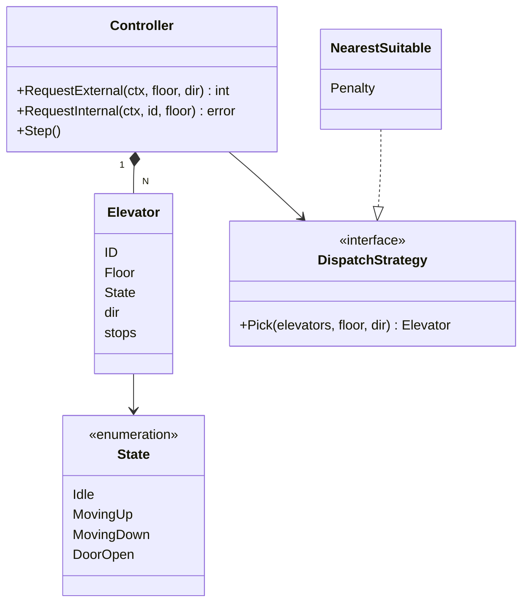
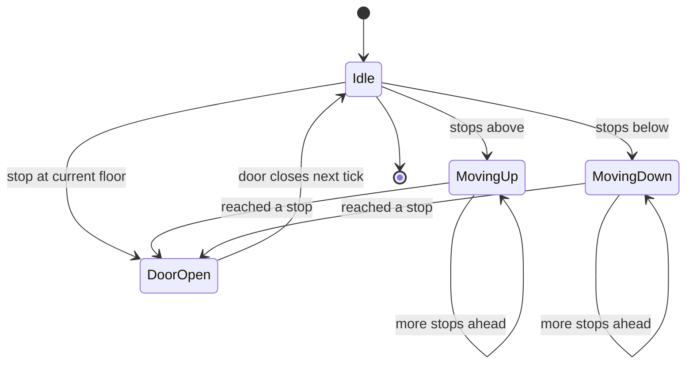

# Elevator System LLD in Go

## Complete notes

Design a controller for N elevators in one building. People press hall buttons (external: floor + up/down) and cabin buttons (internal: target floor). The controller assigns hall calls to an elevator and each elevator serves its stops in a sensible order.

It tests the State pattern (idle / moving up / moving down / door open), a dispatcher Strategy, LOOK-style stop ordering, and keeping a simulation deterministic with a `Step()` tick instead of real timers.

## Requirements

### Functional

- Building has floors `minFloor..maxFloor` and N elevators.
- External request: `(floor, direction)` from a hall button; controller picks an elevator.
- Internal request: `(elevatorID, floor)` from a cabin button.
- Elevator state: idle, moving up, moving down, door open.
- Each elevator serves stops in LOOK order: keep going in the current direction while stops remain ahead, then reverse.
- `Step()` advances every elevator by one tick (one floor, or open/close door).

### Non-functional / edge cases

- Requests and `Step()` can arrive concurrently (buttons vs controller loop): state must be thread-safe.
- Invalid floor or elevator ID returns a typed error.
- Request for the floor the elevator is already on opens the door, no movement.
- Duplicate presses of the same button must not create duplicate stops.
- Dispatch rule must be swappable (nearest, least loaded, zoned).

## Clarifying questions to ask

- How many elevators and floors? Any basement floors?
- Should the dispatcher reassign a hall call later if a better elevator frees up? (Start: assign once.)
- Do we model capacity / weight limits? (Usually follow-up.)
- Any special modes: maintenance, fire, VIP/express?
- Is it a simulation (tick-based) or a real-time controller talking to hardware?
- Does a hall call for "down" get served by an elevator passing up? (Real systems: no. Simple version: one stop set.)

## Entities and relationships



- Controller owns all elevators and the single lock.
- Elevator holds its own floor, state, last direction and a set of stops.
- Controller delegates "which elevator?" to `DispatchStrategy`.

## API design

In-memory component: API is the Go method set. If exposed to a building panel over the network, it maps to:

```text
POST /buildings/{id}/hall-calls                 body: {floor, direction}  -> 202 {elevatorId}
POST /buildings/{id}/elevators/{eid}/cabin-calls body: {floor}           -> 202
GET  /buildings/{id}/elevators                                           -> 200 [{id, floor, state}]
```

## DB schema

Skipped: elevator state is real-time and lives in the controller's memory; a DB round-trip per tick is wrong. At most you would append trip/request logs to an analytics store for later tuning.

## Core flow



## Patterns used

| Pattern | Where used |
|---|---|
| [[State Pattern in Go]] | `Elevator.State` drives what `step()` does: close door, open door, or move |
| [[Strategy Pattern in Go]] | `DispatchStrategy` picks an elevator for a hall call (`NearestSuitable`, least loaded, zoned) |
| [[Command Pattern in Go]] | hall and cabin calls can be modeled as request objects queued to the controller |
| [[Observer Pattern in Go]] | floor displays / apps subscribe to elevator position changes (follow-up) |
| [[Facade Pattern in Go]] | `Controller` is the single entry point for buttons and the tick loop |

## Go code

```go
package elevator

import (
    "context"
    "errors"
    "sync"
)

var (
    ErrInvalidFloor    = errors.New("floor out of range")
    ErrUnknownElevator = errors.New("unknown elevator")
    ErrNoElevator      = errors.New("no elevator available")
)

type Direction int

const (
    Down Direction = -1
    None Direction = 0
    Up   Direction = 1
)

type State string

const (
    Idle       State = "idle"
    MovingUp   State = "moving_up"
    MovingDown State = "moving_down"
    DoorOpen   State = "door_open"
)

type Elevator struct {
    ID    int
    Floor int
    State State
    dir   Direction // last travel direction, used by LOOK
    stops map[int]bool
}

func (e *Elevator) hasStopsTowards(d Direction) bool {
    for f := range e.stops {
        if (d == Up && f > e.Floor) || (d == Down && f < e.Floor) {
            return true
        }
    }
    return false
}

// nextDir is LOOK: keep going while stops remain ahead, else reverse, else stop.
func (e *Elevator) nextDir() Direction {
    if e.dir != None && e.hasStopsTowards(e.dir) {
        return e.dir
    }
    if e.hasStopsTowards(Up) {
        return Up
    }
    if e.hasStopsTowards(Down) {
        return Down
    }
    return None
}

// step advances this elevator by one tick.
func (e *Elevator) step() {
    if e.State == DoorOpen { // close door this tick, move next tick
        e.State = Idle
        return
    }
    if e.stops[e.Floor] {
        delete(e.stops, e.Floor)
        e.State = DoorOpen
        return
    }
    d := e.nextDir()
    if d == None {
        e.State, e.dir = Idle, None
        return
    }
    e.dir = d
    e.Floor += int(d)
    e.State = MovingUp
    if d == Down {
        e.State = MovingDown
    }
}

// DispatchStrategy picks which elevator serves an external (hall) call.
type DispatchStrategy interface {
    Pick(elevators []*Elevator, floor int, dir Direction) *Elevator
}

// NearestSuitable prefers idle elevators or ones already heading to the floor
// in the same direction; others get a penalty.
type NearestSuitable struct{ Penalty int }

func (s NearestSuitable) Pick(elevators []*Elevator, floor int, dir Direction) *Elevator {
    var best *Elevator
    bestCost := 0
    for _, e := range elevators {
        dist := abs(e.Floor - floor)
        cost := dist
        moving := len(e.stops) > 0
        onTheWay := (e.dir == Up && dir == Up && floor >= e.Floor) ||
            (e.dir == Down && dir == Down && floor <= e.Floor)
        if moving && !onTheWay {
            cost += s.Penalty
        }
        if best == nil || cost < bestCost {
            best, bestCost = e, cost
        }
    }
    return best
}

type Controller struct {
    mu        sync.Mutex
    elevators []*Elevator
    minFloor  int
    maxFloor  int
    dispatch  DispatchStrategy
}

func NewController(n, minFloor, maxFloor int, d DispatchStrategy) *Controller {
    c := &Controller{minFloor: minFloor, maxFloor: maxFloor, dispatch: d}
    for i := 0; i < n; i++ {
        c.elevators = append(c.elevators, &Elevator{ID: i, Floor: minFloor, State: Idle, stops: map[int]bool{}})
    }
    return c
}

// RequestExternal handles a hall button press and returns the assigned elevator.
func (c *Controller) RequestExternal(ctx context.Context, floor int, dir Direction) (int, error) {
    if err := ctx.Err(); err != nil {
        return 0, err
    }
    if floor < c.minFloor || floor > c.maxFloor {
        return 0, ErrInvalidFloor
    }
    c.mu.Lock()
    defer c.mu.Unlock()
    e := c.dispatch.Pick(c.elevators, floor, dir)
    if e == nil {
        return 0, ErrNoElevator
    }
    e.stops[floor] = true
    return e.ID, nil
}

// RequestInternal handles a cabin button press inside elevator id.
func (c *Controller) RequestInternal(ctx context.Context, id, floor int) error {
    if err := ctx.Err(); err != nil {
        return err
    }
    if floor < c.minFloor || floor > c.maxFloor {
        return ErrInvalidFloor
    }
    c.mu.Lock()
    defer c.mu.Unlock()
    if id < 0 || id >= len(c.elevators) {
        return ErrUnknownElevator
    }
    c.elevators[id].stops[floor] = true
    return nil
}

// Step advances the whole simulation by one tick.
func (c *Controller) Step() {
    c.mu.Lock()
    defer c.mu.Unlock()
    for _, e := range c.elevators {
        e.step()
    }
}

// Snapshot returns floor and state of elevator id (for display/tests).
func (c *Controller) Snapshot(id int) (int, State) {
    c.mu.Lock()
    defer c.mu.Unlock()
    e := c.elevators[id]
    return e.Floor, e.State
}

func abs(x int) int {
    if x < 0 {
        return -x
    }
    return x
}
```

## Core method walkthrough

`Elevator.step()` (called by `Controller.Step()` under the lock), one tick:

1. If the door is open, close it (state `Idle`) and stop for this tick. Moving happens next tick.
2. If the current floor is a stop, delete it and open the door (`DoorOpen`). This also handles "request for the floor I am on".
3. Otherwise ask `nextDir()` (LOOK):
   - keep the last direction if any stop is still ahead in that direction;
   - else go up if any stop is above, else down if any stop is below;
   - else `None`.
4. `None` means no work: become `Idle` and reset direction.
5. Else move one floor and set `MovingUp` / `MovingDown`. Arrival is handled by step 2 on the next tick.

`NearestSuitable.Pick`: cost is distance to the call floor. An elevator that has stops and is not already heading toward the floor in the same direction gets a penalty. Lowest cost wins; ties go to the lower ID because of the strict `<`.

LOOK vs SCAN: SCAN runs to the end floor before reversing; LOOK reverses at the last pending stop. LOOK wastes fewer floors, so it is the usual answer.

## Concurrency and edge cases

- **Race: a button press mutates `stops` while `Step()` iterates it.** Both take `Controller.mu`, so map access is serialized (a plain Go map would panic on concurrent write).
- **Race: two hall calls dispatched at once both see the same elevator as idle.** Dispatch reads state and adds the stop under the same lock, so the second call sees the first call's stop and its cost changes.
- **Duplicate presses.** `stops` is a set (`map[int]bool`), so pressing 5 twice is one stop.
- **Invalid input.** Floor range checked before locking (`ErrInvalidFloor`); bad ID returns `ErrUnknownElevator`.
- **No real timers.** `Step()` makes tests deterministic: "after 10 ticks the elevator is at floor 8". A real controller runs `Step()` from a `time.Ticker` goroutine.
- **One global lock** is fine for N ~ 10. For many elevators, lock per elevator and let the dispatcher read snapshots.
- Simplification: one stop set per elevator ignores hall-call direction. Real systems keep separate up and down queues.

## Interview follow-ups

| Follow-up | How design changes |
|---|---|
| Do not stop for a down call while going up | Split `stops` into `upStops` and `downStops`; LOOK serves the matching set first |
| Capacity / overweight | Add `load` to Elevator; dispatcher skips full elevators; door stays open if overweight |
| Maintenance / fire mode | New states; fire mode sends all elevators to ground and ignores calls |
| Better dispatch | New `DispatchStrategy`: least loaded, zoned (low/high floors), or estimated time to arrive |
| Reassign hall call | Keep hall calls in the controller, recompute best elevator each tick until served |
| Real hardware | Replace `Step()` caller with a ticker goroutine; hardware events become commands on a channel |
| Show position on every floor | Observer: publish `(elevatorID, floor, state)` after each step |

## Common mistakes

- Using `time.Sleep` inside move logic, making tests slow and flaky.
- FIFO stop order (zig-zagging between floors) instead of SCAN/LOOK.
- Putting dispatch rules inside the Elevator instead of a Strategy.
- No lock around the stop map while button presses and the tick loop run concurrently.
- Too many classes (Button, Door, Display, Floor) before the core loop works.
- Forgetting the "request for current floor" and "duplicate press" cases.

## Interview answer

```text
I have a Controller that owns N Elevators and exposes RequestExternal, RequestInternal and Step. Each Elevator has a state (idle, moving up, moving down, door open), a last direction and a set of stops, and on every tick it either closes the door, opens it at a stop, or moves one floor in LOOK order: keep going while stops remain ahead, then reverse. Hall calls go through a DispatchStrategy; my default picks the nearest elevator that is idle or already moving toward the floor in the same direction, and penalizes the rest. Everything is tick-based so it is deterministic to test, and one mutex guards the stop sets because button presses and the tick loop run concurrently.
```
