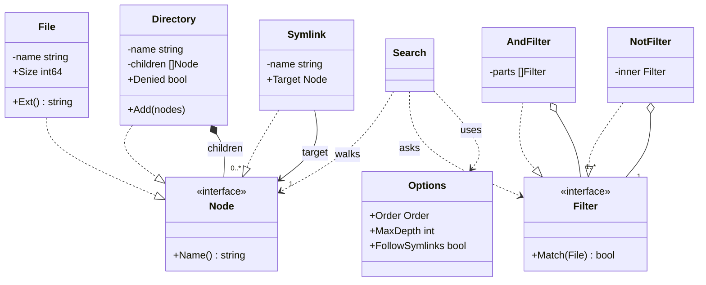

# File Search Unix Find LLD in Go

## Problem statement

```text
Design a file search system like Unix `find`. Given a root directory, return all files
that match filters on name (glob), extension and size. Filters can be combined with
AND / OR / NOT, e.g. `ext=.go AND size<1048576`. Support DFS or BFS traversal, a max
depth, and do not loop forever on symlink cycles.
```

What it really tests: modeling a tree uniformly (Composite) and modeling filter logic as composable objects (Specification / Interpreter) instead of a growing `if` chain. Also safe traversal: cycles, depth limits, permission errors, cancellation.

## How to use this note

- Open the drawing below. Redraw two trees on paper: the file tree (Composite) and the filter expression tree for `ext=.go AND NOT size>1MB`. Then compare.
- Try each step yourself before you read it. Write the filter interface and `And` combinator before scrolling.
- Time box it to 60 minutes: 10 min requirements + entities, 10 min APIs (storage is skipped here), 25-40 min core code, 10 min edge cases, 5 min explaining it out loud.

## Step 1: Clarify requirements

### Questions to ask

- Real filesystem or an in-memory model? *Assume: an in-memory tree, so tests are deterministic. For the real disk, use `io/fs.WalkDir(os.DirFS(root), ".", fn)`, which gives the same shape.*
- Which filters? *Assume: name glob, extension, size less than / greater than, combined with AND, OR, NOT.*
- Do we need a string query language or only a Go API? *Assume: a Go API first. A tiny parser for `ext=.go AND size<1048576` is a bonus (no parentheses).*
- Do we return directories or only files? *Assume: only files (like `find -type f`).*
- Follow symlinks? *Assume: off by default (`find -P`). With `FollowSymlinks` on (`find -L`), track visited directories to stop cycles.*
- Max depth? *Assume: `MaxDepth`, where 0 = unlimited and the root's children are depth 1.*
- Permission denied? *Assume: skip the directory, report it in `Skipped`, and keep going (find prints an error and continues).*

### Functional

- Build a tree of Directory, File and Symlink nodes.
- `Search(ctx, root, filter, options)` returns matching files with full paths.
- Filters: `NameGlob`, `ExtensionIs`, `SizeLessThan`, `SizeGreaterThan`, `And`, `Or`, `Not`.
- `Parse("ext=.go AND size<1048576")` turns a string into a Filter.
- Traversal order: DFS or BFS. `MaxDepth`. Optional symlink following with cycle protection.

### Non-functional

- Never loop forever (cycles) and never crash on bad input (invalid glob or expression).
- Cancellable on huge trees (`ctx`).
- Deterministic output order for tests (children in insertion order).
- Safe for concurrent searches on the same read-only tree.

### Out of scope

- Content search (grep), indexes (locate/updatedb), file watching.
- Parentheses in the query language (mention as an extension).
- Actions like `-exec` and `-delete`.

## Step 2: Actors and use cases

| Actor | Use case |
| --- | --- |
| User / CLI | Search from a root with a filter expression |
| User / CLI | Limit depth, choose DFS or BFS, follow symlinks |
| Code caller | Build filters in Go (`And(ExtensionIs(".go"), SizeLessThan(1<<20))`) |
| Filesystem | Gives nodes. It may deny access or contain cycles |

Hardest use case (the one to code): **walk the tree with DFS/BFS + max depth + symlink cycle protection, apply a composed filter to each file, and collect matches and skipped dirs.**

## Step 3: Entities

| Entity | Key fields | Why it exists |
| --- | --- | --- |
| `Node` (interface) | `Name()` | The Composite component. Search treats every entry the same |
| `File` | name, Size, `Ext()` | A leaf. The only thing filters look at |
| `Directory` | name, children []Node, Denied | A composite. Holds files, directories and symlinks |
| `Symlink` | name, Target Node | A pointer to another node. The only way to get a cycle |
| `Filter` (interface) | `Match(*File) bool` | A Specification. One small rule per type, combined into a tree |
| `Options` | Order (DFS/BFS), MaxDepth, FollowSymlinks | Traversal policy, kept apart from the filter logic |
| `Result` | Matches []Match{Path, File}, Skipped []string | Output: what matched, and what we could not read |

Modeling insight: **there are two trees.** The data tree (Directory -> children) is a Composite. The query tree (`And(Ext, Not(Size))`) is also a Composite, of filters, which is exactly the Interpreter pattern. The walker connects them: it walks the data tree and asks the query tree about each file. Keep them separate, so a new filter never touches traversal code and a new traversal never touches filters.

## Step 4: Relationships



- **Composition**: `Directory *-- Node`. Children belong to the directory. Delete the dir and they go too.
- **Association**: `Symlink --> Node`. It points at a node it does not own, and that node can be an ancestor (a cycle).
- **Aggregation**: `And/Or o-- Filter`. Combinators hold sub-filters that could be reused elsewhere.
- **Implements**: File, Directory and Symlink implement `Node`. Each leaf filter and each combinator implements `Filter`. In code they are all `FilterFunc` closures, which is the Go way to write small specifications.

## Step 5: APIs and public methods

REST is optional (this is mainly an in-process library or CLI). If it were a service over an indexed store:

```text
GET /v1/search?root=/repo&q=ext%3D.go%20AND%20size%3C1048576&order=bfs&maxDepth=3&follow=false
  200 {"matches":[{"path":"repo/main.go","size":2000}], "skipped":["repo/secret"]}
  400 {"error":"invalid filter expression: unknown term \"color=red\""}
```

```go
// tree building
func NewDir(name string, children ...Node) *Directory
func NewFile(name string, size int64) *File
func NewSymlink(name string, target Node) *Symlink

// filters (Specification)
type Filter interface{ Match(f *File) bool }
func NameGlob(pattern string) Filter
func ExtensionIs(ext string) Filter
func SizeLessThan(n int64) Filter
func SizeGreaterThan(n int64) Filter
func And(fs ...Filter) Filter
func Or(fs ...Filter) Filter
func Not(f Filter) Filter
func Parse(expr string) (Filter, error) // Interpreter

// search
func Search(ctx context.Context, root *Directory, f Filter, opt Options) (Result, error)
```

## Step 6: Storage and repositories

No SQL schema. The "storage" is the filesystem tree, and the search reads it, it does not persist anything. If the interviewer pushes toward `locate`-style indexed search, you would have a `files(path PK, name, ext, size, mtime)` table with indexes on `ext` and `size`, and translate the filter tree into a WHERE clause. That is a different design.

The storage port is the tree source. In-memory for tests, `io/fs` for the real disk:

```go
// What Search needs from "storage": a root and children per directory.
type Node interface{ Name() string }

// Real filesystem adapter idea (not needed for the interview):
//   fsys := os.DirFS("/repo")
//   fs.WalkDir(fsys, ".", func(p string, d fs.DirEntry, err error) error {
//       if err != nil { skipped = append(skipped, p); return fs.SkipDir }
//       info, _ := d.Info()
//       ... build File{name: d.Name(), Size: info.Size()} and apply filter
//   })
// Real cycle key: (device, inode) from info.Sys().(*syscall.Stat_t), not a pointer.
```

## Step 7: Patterns

| Pattern | Where | Why here |
| --- | --- | --- |
| [[Composite Pattern in Go]] | `Node` = File / Directory / Symlink | The walker handles a leaf and a container through one interface |
| Specification + [[Interpreter Pattern in Go]] | `Filter`, `And/Or/Not`, `Parse` | Each rule is a tiny object, combined into a tree. The parser builds the same tree from a string |
| [[Strategy Pattern in Go]] (light) | `Options.Order` = DFS (stack) or BFS (queue) | Same loop, the policy only changes which end of the frontier we pop |
| [[Iterator Pattern in Go]] (optional) | Could expose `Walk(fn)` / `iter.Seq` instead of a slice | Streams results on huge trees without holding them all |

Patterns NOT used and why:

- **No full Strategy interface with two traversal classes.** DFS and BFS differ by one line (pop from the end or the front). An enum keeps it KISS. Upgrade to an interface only when a third order (by size, parallel) appears.
- **No Visitor.** There is one operation (match files). Visitor pays off when you need many operations over the same node types (size totals, print tree, delete).

## Folder structure

```text
filesearch/
  node.go           -> Node interface, File, Directory, Symlink
  filter.go         -> Filter, FilterFunc, NameGlob, ExtensionIs, Size*, And/Or/Not
  parser.go         -> Parse: tokens -> filter tree (recursive descent)
  search.go         -> Options, Result, Search (DFS/BFS, depth, cycles, ctx)
  filesearch_test.go -> tests
cmd/find/main.go    -> flags -> Parse -> Search(os.DirFS adapter) -> print paths
```

- `node.go`: data model only.
- `filter.go` and `parser.go`: all query logic. A new filter like `ModifiedAfter` goes here.
- `search.go`: the walker. The only file that knows about depth, cycles and order.
- The core code below is one file with `// ---- file.go ----` markers, so it compiles in one paste.

## Step 8: Core code

Main logic only. Full runnable code is folded below.

```go
type Node interface{ Name() string } // Composite: *File, *Directory, *Symlink

type File struct {
    name string
    Size int64
}
type Directory struct {
    name     string
    children []Node
    Denied   bool // simulates permission denied
}
type Symlink struct {
    name   string
    Target Node // may create a cycle
}

type Filter interface{ Match(f *File) bool } // NameGlob, ExtensionIs, Size*, And/Or/Not
// Parse("ext=.go AND NOT size>1048576") builds the tree; precedence NOT > AND > OR.

func Search(ctx context.Context, root *Directory, filter Filter, opt Options) (Result, error) {
    // ... nil root -> ErrNilRoot; nil filter -> MatchAll()
    var res Result
    visited := map[*Directory]bool{} // real FS: key by (device, inode)
    frontier := []item{{path: root.Name(), node: root}}
    for len(frontier) > 0 {
        if err := ctx.Err(); err != nil { // huge tree: caller can cancel
            return res, err
        }
        var it item
        if opt.Order == BFS {
            it, frontier = frontier[0], frontier[1:]
        } else {
            it, frontier = frontier[len(frontier)-1], frontier[:len(frontier)-1]
        }
        node := it.node
        if link, ok := node.(*Symlink); ok {
            if !opt.FollowSymlinks || link.Target == nil {
                continue
            }
            node = link.Target
        }
        switch n := node.(type) {
        case *File:
            if filter.Match(n) {
                res.Matches = append(res.Matches, Match{Path: it.path, File: n})
            }
        case *Directory:
            if opt.MaxDepth > 0 && it.depth >= opt.MaxDepth {
                continue // do not mark visited: a shallower path may still expand it
            }
            if visited[n] { // symlink cycle or second link to same dir
                continue
            }
            visited[n] = true
            // ... n.Denied -> append it.path to res.Skipped, continue
            // ... push children with depth+1 (DFS: in reverse, so pops come out in natural order)
        }
    }
    return res, nil
}
```

### Walkthrough

1. `Search` checks for a nil root and defaults the filter to `MatchAll`. It seeds the frontier with `{path: "root", node: root, depth: 0}` and makes a `visited` set of directories.
2. Each loop checks `ctx.Err()` first, so a huge walk can be cancelled. Then it pops: **DFS** from the end (stack), **BFS** from the front (queue). That one line is the whole traversal strategy.
3. **Symlink**: if `FollowSymlinks` is off, skip it (find -P). If on, swap the node for its target and carry on with the link's path.
4. **File**: run `filter.Match(file)`. `And` short-circuits on the first false, `Or` on the first true. A match appends `{path, file}`.
5. **Directory**: first the depth check. If `depth >= MaxDepth`, do not expand it, and do **not** mark it visited, because a shorter path may reach it later. Then the **visited check**: if seen, skip. This is what breaks `loop -> root` and stops duplicates from a second link to the same dir. Then the `Denied` check, which records the path in `Skipped` and continues.
6. Push the children with `depth + 1`. For DFS, push them in reverse, so popping gives the natural order (deterministic output).
7. `Parse` is recursive descent with precedence `NOT > AND > OR`: `or := and {OR and}`, `and := unary {AND unary}`, `unary := NOT unary | term`. Terms are validated once at parse time (bad glob, bad size, unknown key give `ErrInvalidExpr`), so `Match` can never fail later.

> [!example]- Full runnable code (click to open)
> ```go
> package filesearch
>
> import (
>     "context"
>     "errors"
>     "fmt"
>     "path"
>     "strconv"
>     "strings"
> )
>
> // ---- node.go: Composite tree (File, Directory, Symlink) ----
>
> type Node interface {
>     Name() string
> }
>
> type File struct {
>     name string
>     Size int64 // bytes
> }
>
> func NewFile(name string, size int64) *File { return &File{name: name, Size: size} }
> func (f *File) Name() string                { return f.name }
> func (f *File) Ext() string                 { return path.Ext(f.name) }
>
> type Directory struct {
>     name     string
>     children []Node
>     Denied   bool // simulates permission denied
> }
>
> func NewDir(name string, children ...Node) *Directory {
>     return &Directory{name: name, children: children}
> }
> func (d *Directory) Name() string     { return d.name }
> func (d *Directory) Add(n ...Node)    { d.children = append(d.children, n...) }
> func (d *Directory) Children() []Node { return d.children }
>
> // Symlink points at another node; it may create a cycle.
> type Symlink struct {
>     name   string
>     Target Node
> }
>
> func NewSymlink(name string, target Node) *Symlink { return &Symlink{name: name, Target: target} }
> func (s *Symlink) Name() string                    { return s.name }
>
> // ---- filter.go: Specification / Interpreter ----
>
> type Filter interface {
>     Match(f *File) bool
> }
>
> type FilterFunc func(f *File) bool
>
> func (fn FilterFunc) Match(f *File) bool { return fn(f) }
>
> func NameGlob(pattern string) Filter {
>     return FilterFunc(func(f *File) bool {
>         ok, _ := path.Match(pattern, f.Name()) // pattern validated by the parser
>         return ok
>     })
> }
> func ExtensionIs(ext string) Filter {
>     return FilterFunc(func(f *File) bool { return strings.EqualFold(f.Ext(), ext) })
> }
> func SizeLessThan(n int64) Filter    { return FilterFunc(func(f *File) bool { return f.Size < n }) }
> func SizeGreaterThan(n int64) Filter { return FilterFunc(func(f *File) bool { return f.Size > n }) }
> func MatchAll() Filter               { return FilterFunc(func(*File) bool { return true }) }
>
> func And(fs ...Filter) Filter {
>     return FilterFunc(func(f *File) bool {
>         for _, x := range fs {
>             if !x.Match(f) {
>                 return false // short-circuit
>             }
>         }
>         return true
>     })
> }
> func Or(fs ...Filter) Filter {
>     return FilterFunc(func(f *File) bool {
>         for _, x := range fs {
>             if x.Match(f) {
>                 return true
>             }
>         }
>         return false
>     })
> }
> func Not(x Filter) Filter { return FilterFunc(func(f *File) bool { return !x.Match(f) }) }
>
> var ErrInvalidExpr = errors.New("invalid filter expression")
>
> // Parse turns "ext=.go AND NOT size>1048576 OR name=*.md" into a Filter tree.
> // Grammar (precedence NOT > AND > OR, no parentheses):
> //
> //  expr := and { "OR" and }
> //  and  := unary { "AND" unary }
> //  unary:= "NOT" unary | term
> //  term := name=GLOB | ext=.EXT | size<N | size>N
> func Parse(expr string) (Filter, error) {
>     p := &parser{toks: strings.Fields(expr)}
>     if len(p.toks) == 0 {
>         return nil, fmt.Errorf("%w: empty", ErrInvalidExpr)
>     }
>     f, err := p.or()
>     if err != nil {
>         return nil, err
>     }
>     if p.i != len(p.toks) {
>         return nil, fmt.Errorf("%w: unexpected %q", ErrInvalidExpr, p.toks[p.i])
>     }
>     return f, nil
> }
>
> type parser struct {
>     toks []string
>     i    int
> }
>
> func (p *parser) accept(kw string) bool {
>     if p.i < len(p.toks) && strings.EqualFold(p.toks[p.i], kw) {
>         p.i++
>         return true
>     }
>     return false
> }
>
> func (p *parser) or() (Filter, error) {
>     return p.list("OR", p.and, Or)
> }
>
> func (p *parser) and() (Filter, error) {
>     return p.list("AND", p.unary, And)
> }
>
> func (p *parser) list(kw string, next func() (Filter, error), join func(...Filter) Filter) (Filter, error) {
>     first, err := next()
>     if err != nil {
>         return nil, err
>     }
>     parts := []Filter{first}
>     for p.accept(kw) {
>         f, err := next()
>         if err != nil {
>             return nil, err
>         }
>         parts = append(parts, f)
>     }
>     if len(parts) == 1 {
>         return first, nil
>     }
>     return join(parts...), nil
> }
>
> func (p *parser) unary() (Filter, error) {
>     if p.accept("NOT") {
>         f, err := p.unary()
>         if err != nil {
>             return nil, err
>         }
>         return Not(f), nil
>     }
>     if p.i >= len(p.toks) {
>         return nil, fmt.Errorf("%w: missing term", ErrInvalidExpr)
>     }
>     tok := p.toks[p.i]
>     p.i++
>     return term(tok)
> }
>
> func term(tok string) (Filter, error) {
>     switch {
>     case strings.HasPrefix(tok, "name="):
>         glob := strings.TrimPrefix(tok, "name=")
>         if _, err := path.Match(glob, ""); err != nil {
>             return nil, fmt.Errorf("%w: bad glob %q", ErrInvalidExpr, glob)
>         }
>         return NameGlob(glob), nil
>     case strings.HasPrefix(tok, "ext="):
>         return ExtensionIs(strings.TrimPrefix(tok, "ext=")), nil
>     case strings.HasPrefix(tok, "size<"), strings.HasPrefix(tok, "size>"):
>         n, err := strconv.ParseInt(tok[5:], 10, 64)
>         if err != nil || n < 0 {
>             return nil, fmt.Errorf("%w: bad size in %q", ErrInvalidExpr, tok)
>         }
>         if tok[4] == '<' {
>             return SizeLessThan(n), nil
>         }
>         return SizeGreaterThan(n), nil
>     }
>     return nil, fmt.Errorf("%w: unknown term %q", ErrInvalidExpr, tok)
> }
>
> // ---- traversal.go: Strategy for visit order ----
>
> type Order int
>
> const (
>     DFS Order = iota // stack: goes deep first, low memory on wide trees
>     BFS              // queue: nearest matches first, good with MaxDepth
> )
>
> type Options struct {
>     Order          Order
>     MaxDepth       int  // 0 = unlimited; root's children are depth 1
>     FollowSymlinks bool // like find -L; false = find -P (skip links)
> }
>
> type Match struct {
>     Path string
>     File *File
> }
>
> type Result struct {
>     Matches []Match
>     Skipped []string // permission-denied directories, reported not fatal
> }
>
> var ErrNilRoot = errors.New("root directory is nil")
>
> type item struct {
>     path  string
>     node  Node
>     depth int
> }
>
> // ---- service.go ----
>
> // Search walks the tree from root and returns files matching filter.
> // The tree is read-only during a search, so concurrent searches are safe.
> func Search(ctx context.Context, root *Directory, filter Filter, opt Options) (Result, error) {
>     if root == nil {
>         return Result{}, ErrNilRoot
>     }
>     if filter == nil {
>         filter = MatchAll()
>     }
>     var res Result
>     visited := map[*Directory]bool{} // real FS: key by (device, inode)
>     frontier := []item{{path: root.Name(), node: root}}
>
>     for len(frontier) > 0 {
>         if err := ctx.Err(); err != nil { // huge tree: caller can cancel
>             return res, err
>         }
>         var it item
>         if opt.Order == BFS {
>             it, frontier = frontier[0], frontier[1:]
>         } else {
>             it, frontier = frontier[len(frontier)-1], frontier[:len(frontier)-1]
>         }
>
>         node := it.node
>         if link, ok := node.(*Symlink); ok {
>             if !opt.FollowSymlinks || link.Target == nil {
>                 continue
>             }
>             node = link.Target
>         }
>
>         switch n := node.(type) {
>         case *File:
>             if filter.Match(n) {
>                 res.Matches = append(res.Matches, Match{Path: it.path, File: n})
>             }
>         case *Directory:
>             if opt.MaxDepth > 0 && it.depth >= opt.MaxDepth {
>                 continue // do not mark visited: a shallower path may still expand it
>             }
>             if visited[n] { // symlink cycle or second link to same dir
>                 continue
>             }
>             visited[n] = true
>             if n.Denied {
>                 res.Skipped = append(res.Skipped, it.path)
>                 continue
>             }
>             kids := n.Children()
>             if opt.Order == DFS { // push reversed so we pop in natural order
>                 for i := len(kids) - 1; i >= 0; i-- {
>                     frontier = append(frontier, item{it.path + "/" + kids[i].Name(), kids[i], it.depth + 1})
>                 }
>             } else {
>                 for _, k := range kids {
>                     frontier = append(frontier, item{it.path + "/" + k.Name(), k, it.depth + 1})
>                 }
>             }
>         }
>     }
>     return res, nil
> }
> ```

## Test cases

| Test | Proves |
| --- | --- |
| `TestSearch/ext .go dfs` | Basic filter + DFS order |
| `TestSearch/all files dfs` vs `bfs` | Same files, different order: DFS goes into `src` first, BFS lists root files first |
| `TestSearch/max depth 1, 2` | The depth limit counts from root's children = 1 |
| `TestSearch/and, or, not + glob` | Combinators work and compose |
| `TestSearch/follow symlinks` | The `loop -> root` cycle ends, `util-link` gives no duplicates, `vendor-link` reaches new files |
| `TestSearch` (every row without MaxDepth) | A permission-denied dir lands in `Skipped`, and the search continues |
| `TestParse` (table) | String expressions, precedence (`a AND b OR c`), case-insensitive keywords |
| `TestParseInvalid` | Empty input, a dangling AND, a bad size, an unknown key, a bad glob, a missing operator, a lone NOT all give `ErrInvalidExpr` |
| `TestErrors` | A nil root gives `ErrNilRoot`, a cancelled ctx gives `context.Canceled` |
| `TestConcurrentSearchesOnSharedTree` | 50 goroutines (mixed DFS/BFS) on one tree: all find exactly 4, race-free |

> [!example]- Full test code (click to open)
> ```go
> package filesearch
>
> import (
>     "context"
>     "errors"
>     "reflect"
>     "sync"
>     "testing"
> )
>
> // root/
> //   src/ app.go(5000) big.go(2MB) util/ helper.go(100) notes.txt(50)
> //   main.go(2000) README.md(500)
> //   secret/ (permission denied)
> //   loop -> root            (cycle)
> //   util-link -> src/util   (second path to same dir)
> //   vendor-link -> /ext     (only reachable through the link)
> func buildTree() *Directory {
>     util := NewDir("util", NewFile("helper.go", 100), NewFile("notes.txt", 50))
>     src := NewDir("src", NewFile("app.go", 5000), NewFile("big.go", 2_000_000), util)
>     secret := NewDir("secret", NewFile("key.pem", 10))
>     secret.Denied = true
>     ext := NewDir("ext", NewFile("lib.go", 300))
>     root := NewDir("root", src, NewFile("main.go", 2000), NewFile("README.md", 500), secret)
>     root.Add(NewSymlink("loop", root), NewSymlink("util-link", util), NewSymlink("vendor-link", ext))
>     return root
> }
>
> func paths(r Result) []string {
>     out := []string{}
>     for _, m := range r.Matches {
>         out = append(out, m.Path)
>     }
>     return out
> }
>
> func TestSearch(t *testing.T) {
>     root := buildTree()
>     tests := []struct {
>         name   string
>         filter Filter
>         opt    Options
>         want   []string
>     }{
>         {"ext .go dfs", ExtensionIs(".go"), Options{}, []string{
>             "root/src/app.go", "root/src/big.go", "root/src/util/helper.go", "root/main.go"}},
>         {"all files dfs", nil, Options{Order: DFS}, []string{
>             "root/src/app.go", "root/src/big.go", "root/src/util/helper.go", "root/src/util/notes.txt",
>             "root/main.go", "root/README.md"}},
>         {"all files bfs", nil, Options{Order: BFS}, []string{
>             "root/main.go", "root/README.md", "root/src/app.go", "root/src/big.go",
>             "root/src/util/helper.go", "root/src/util/notes.txt"}},
>         {"max depth 1", ExtensionIs(".go"), Options{MaxDepth: 1}, []string{"root/main.go"}},
>         {"max depth 2", ExtensionIs(".go"), Options{MaxDepth: 2}, []string{
>             "root/src/app.go", "root/src/big.go", "root/main.go"}},
>         {"and + size", And(ExtensionIs(".go"), SizeLessThan(1<<20)), Options{}, []string{
>             "root/src/app.go", "root/src/util/helper.go", "root/main.go"}},
>         {"or", Or(ExtensionIs(".md"), ExtensionIs(".txt")), Options{}, []string{
>             "root/src/util/notes.txt", "root/README.md"}},
>         {"not + glob", And(NameGlob("*.go"), Not(NameGlob("big*"))), Options{}, []string{
>             "root/src/app.go", "root/src/util/helper.go", "root/main.go"}},
>         {"follow symlinks: no dup, no infinite loop, reaches ext", ExtensionIs(".go"),
>             Options{FollowSymlinks: true}, []string{
>                 "root/src/app.go", "root/src/big.go", "root/src/util/helper.go", "root/main.go",
>                 "root/vendor-link/lib.go"}},
>     }
>     for _, tc := range tests {
>         t.Run(tc.name, func(t *testing.T) {
>             res, err := Search(context.Background(), root, tc.filter, tc.opt)
>             if err != nil {
>                 t.Fatal(err)
>             }
>             if got := paths(res); !reflect.DeepEqual(got, tc.want) {
>                 t.Fatalf("got  %v\nwant %v", got, tc.want)
>             }
>             if tc.opt.MaxDepth == 0 && !reflect.DeepEqual(res.Skipped, []string{"root/secret"}) {
>                 t.Fatalf("skipped=%v", res.Skipped)
>             }
>         })
>     }
> }
>
> func TestParse(t *testing.T) {
>     root := buildTree()
>     tests := []struct {
>         expr string
>         want []string
>     }{
>         {"ext=.go AND size<1048576", []string{"root/src/app.go", "root/src/util/helper.go", "root/main.go"}},
>         {"ext=.md OR ext=.txt", []string{"root/src/util/notes.txt", "root/README.md"}},
>         {"NOT ext=.go", []string{"root/src/util/notes.txt", "root/README.md"}},
>         {"size>1000 AND ext=.go OR name=*.md", []string{"root/src/app.go", "root/src/big.go", "root/main.go", "root/README.md"}},
>         {"name=*.go and not name=big*", []string{"root/src/app.go", "root/src/util/helper.go", "root/main.go"}},
>     }
>     for _, tc := range tests {
>         t.Run(tc.expr, func(t *testing.T) {
>             f, err := Parse(tc.expr)
>             if err != nil {
>                 t.Fatal(err)
>             }
>             res, _ := Search(context.Background(), root, f, Options{})
>             if got := paths(res); !reflect.DeepEqual(got, tc.want) {
>                 t.Fatalf("got  %v\nwant %v", got, tc.want)
>             }
>         })
>     }
> }
>
> func TestParseInvalid(t *testing.T) {
>     for _, expr := range []string{"", "ext=.go AND", "size<abc", "size<-5", "color=red", "name=[", "ext=.go ext=.md", "NOT"} {
>         if _, err := Parse(expr); !errors.Is(err, ErrInvalidExpr) {
>             t.Errorf("Parse(%q) err=%v, want ErrInvalidExpr", expr, err)
>         }
>     }
> }
>
> func TestErrors(t *testing.T) {
>     if _, err := Search(context.Background(), nil, nil, Options{}); !errors.Is(err, ErrNilRoot) {
>         t.Fatalf("want ErrNilRoot, got %v", err)
>     }
>     ctx, cancel := context.WithCancel(context.Background())
>     cancel()
>     if _, err := Search(ctx, buildTree(), nil, Options{}); !errors.Is(err, context.Canceled) {
>         t.Fatalf("want context.Canceled, got %v", err)
>     }
> }
>
> func TestConcurrentSearchesOnSharedTree(t *testing.T) {
>     root := buildTree()
>     f, _ := Parse("ext=.go AND size<1048576")
>     const n = 50
>     var wg sync.WaitGroup
>     counts := make([]int, n)
>     for i := 0; i < n; i++ {
>         wg.Add(1)
>         go func(i int) {
>             defer wg.Done()
>             opt := Options{Order: Order(i % 2), FollowSymlinks: true}
>             res, err := Search(context.Background(), root, f, opt)
>             if err == nil {
>                 counts[i] = len(res.Matches)
>             }
>         }(i)
>     }
>     wg.Wait()
>     for i, c := range counts {
>         if c != 4 { // app.go, helper.go, main.go, vendor-link/lib.go
>             t.Fatalf("search %d found %d, want 4", i, c)
>         }
>     }
> }
> ```

## Step 9: Edge cases

| Edge case | What happens | How the design handles it |
| --- | --- | --- |
| Symlink cycle (`loop -> root`) | Naive DFS loops forever | `visited` set of directories (real FS: key by device + inode). Links are not followed by default |
| Two links to the same dir | Duplicate results | Same `visited` set: the second visit is skipped |
| Permission denied | Read fails mid-walk | Skip that subtree, record it in `Skipped`, keep going. It is not fatal |
| Huge tree (millions of files) | Slow, big memory | `ctx` cancellation. MaxDepth. A streaming callback instead of a slice (extension). BFS frontier memory = tree width, DFS = depth x fanout |
| Depth-pruned dir reached again by a shorter link | Could be wrongly skipped | Pruned dirs are not marked visited |
| Invalid filter (`size<abc`, `name=[`) | Panic or silent no-match | `Parse` validates every term and returns `ErrInvalidExpr` before any walk |
| Extension case (`.GO`) | Missed match | `strings.EqualFold` in `ExtensionIs` |
| Files with no extension or hidden (`.env`) | `path.Ext(".env") = ".env"` | Document it. `name=.*` with a glob finds hidden files |
| Concurrent searches (race) | Data race if the tree mutates | The tree is read-only during search. Each search has its own `visited` and frontier. Mutation would need an RWMutex on Directory |

## Step 10: Tradeoffs and extensions

| Follow-up | Design change |
| --- | --- |
| Run on the real disk | An adapter that builds nodes lazily from `os.ReadDir`, or use `fs.WalkDir` with the same Filter. Cycle key = (dev, inode) |
| Parentheses in queries | Add `(` `)` tokens. The unary rule gets a third option: `"(" or-expr ")"`. Tokenize by scanning chars instead of `strings.Fields` |
| More filters (mtime, owner, type=d) | A new `Filter` constructor and a parser term. No change to traversal |
| Return directories too | Change `Filter.Match` to take `Node`, or add a `TypeIs(dir)` filter |
| Stream results / stop at first N | `Search(ctx, root, f, opt, func(Match) bool)`. Return false to stop |
| Parallel walk on huge trees | A worker pool reads directories concurrently. The visited set becomes a `sync.Map`. Output order is no longer deterministic |
| Fast repeated searches | Build an index (like `locate`): a DB table of files, filter tree -> SQL WHERE |

### Tradeoffs I chose

- **An in-memory tree instead of a real FS** in the core, so tests are deterministic. The real FS is an adapter detail.
- **Closures (`FilterFunc`) instead of one struct per filter.** Less code, same interface. Use structs if you need to print or optimize the tree.
- **DFS by default.** Lower memory on wide trees, and it matches `find`. BFS when the user wants the nearest matches first.
- **Collect into a slice.** Simple for the interview. Stream for production-sized trees.
- **Skip denied dirs instead of failing.** One unreadable folder should not kill the search.

## Drawing

![[File Search LLD Drawing.excalidraw]]

The drawing shows:

- Section 1: Composite: `Node` interface, File / Directory / Symlink, Directory owning children, Symlink pointing at a target (the cycle).
- Section 2: filter expression tree for `ext=.go AND NOT size>1048576`: an And node with an Ext leaf and a Not node over a Size leaf, all implementing `Filter`.
- Section 3: core flow: pop (DFS stack / BFS queue) -> symlink? -> file: Match -> append, dir: depth / visited / denied checks (red branches) -> push children.

Redraw it from memory:

1. The `Node` interface and three implementations. Mark which one can create a cycle.
2. The expression tree for a 3-term query, and which nodes are leaves.
3. The loop: pop, then the per-type branch, with the 3 guard checks on directories in order (depth, visited, denied).
4. Where `visited` lives (per search) and why pruned dirs are not marked.

## Interview explanation

```text
I model the filesystem as a Composite: File, Directory and Symlink all implement Node,
so the walker treats them uniformly. Filters are Specifications: a single Match(file)
method, small leaves like ExtensionIs and SizeLessThan, and And/Or/Not combinators,
so `ext=.go AND size<1MB` is just a filter tree, and a tiny recursive-descent parser
builds the same tree from a string. The search is one loop over a frontier: popping
from the end gives DFS, from the front gives BFS. It enforces max depth, skips
permission-denied dirs into a Skipped list, and keeps a visited set of directories so
symlink cycles terminate. On a real disk I would use io/fs.WalkDir and key the
visited set by device and inode.
```

## Related

- [[LLD Practice Roadmap]]
- [[LLD Question Bank with Answers]]
- [[Composite Pattern in Go]]
- [[Interpreter Pattern in Go]]
- [[Strategy Pattern in Go]]
- [[Iterator Pattern in Go]]
- [[Concurrency in Go LLD]]
- [[Testing LLD Code in Go]]
- [[UML for LLD Interviews]]
- [[Error Handling and Interfaces in Go LLD]]
