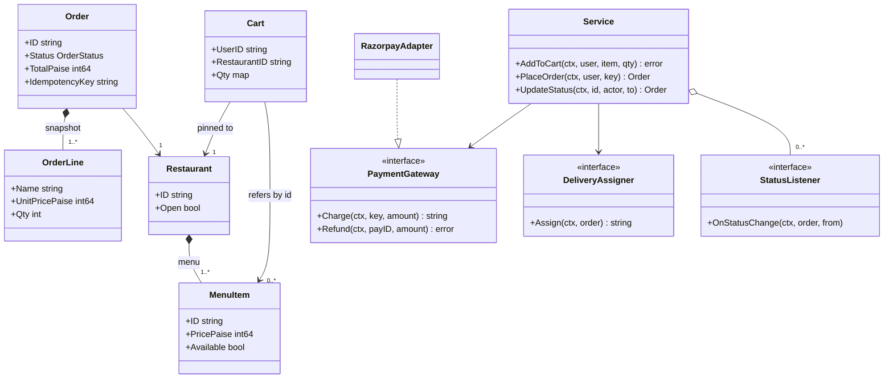
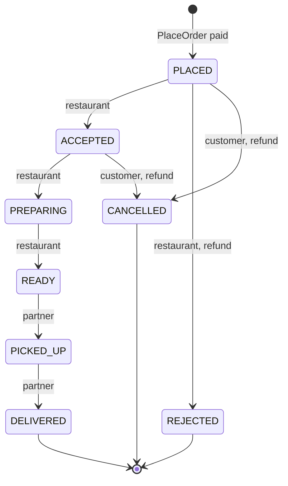
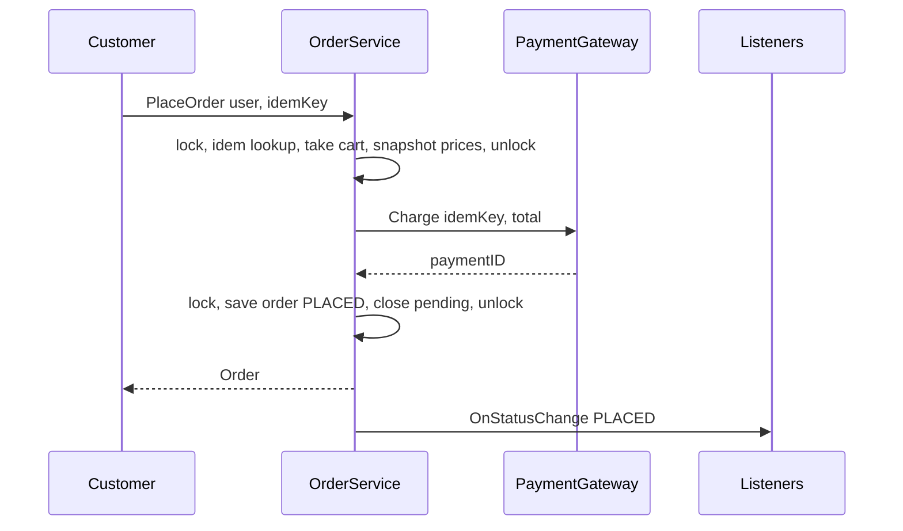

# Food Ordering System LLD in Go

## Problem statement

```text
Design a food ordering app (Swiggy / Zomato style). Restaurants list menus. A user adds
items to a cart and places an order with payment. The restaurant accepts or rejects it,
then prepares it, and a delivery partner picks it up and delivers it. Users are notified
on every status change. Handle cancellation, payment failure and duplicate order retries.
```

What it really tests: an explicit order **state machine** with role-based transitions, and a safe `PlaceOrder`: price snapshot, idempotency key, no double charge. It also tests whether you keep payment, delivery and notifications behind interfaces instead of inside the order logic.

## How to use this note

- Open the drawing below. Redraw the order state machine and the PlaceOrder flow on paper first. Then compare.
- Try each step yourself before you read it. Write the transition table before looking at the code.
- Time box it to 60 minutes: 10 min requirements + entities, 10 min APIs + storage, 25-40 min core code, 10 min edge cases, 5 min explaining it out loud.

## Step 1: Clarify requirements

### Questions to ask

- Can a cart hold items from more than one restaurant? *Assume: no. One restaurant per cart (Swiggy rule). Adding from another restaurant fails, and the client asks "clear cart?".*
- When is payment taken? *Assume: prepaid at PlaceOrder. Reject or cancel triggers a full refund.*
- Until when can the user cancel? *Assume: in PLACED or ACCEPTED, before the kitchen starts PREPARING.*
- What if the price changes after the order? *Assume: the order keeps a price snapshot taken at PlaceOrder.*
- Retries and double taps on "Place order"? *Assume: the client sends an idempotency key. The same key gives the same order and one charge.*
- Delivery assignment detail? *Assume: out of scope here. Call a `DeliveryAssigner` on ACCEPTED. The logic is in [[Delivery Partner Assignment LLD in Go]].*
- Coupons and taxes? *Assume: out of scope. See [[Cart Checkout with Coupons LLD in Go]].*

### Functional

- Restaurants with menus. Items can be marked unavailable. A restaurant can close.
- Add to cart (single-restaurant rule). Place an order with an idempotency key.
- The order stores a price snapshot and total in paise, then charges through a payment gateway.
- Status updates follow the state machine, checked by actor role (customer, restaurant, partner).
- Refund on reject or cancel. Assign a rider on accept. Notify listeners on every change.

### Non-functional

- No double order or double charge under retries or concurrent taps.
- No lock held during network calls (payment, assignment, notify).
- Payment and delivery providers are swappable without touching order code.
- Strong consistency on order status (one status at a time, transitions are atomic).

### Out of scope

- Search and discovery, ratings, coupons, taxes, surge pricing.
- Real rider matching (see the linked note), live tracking, ETAs.
- Scheduled orders, group orders, multi-restaurant carts.

## Step 2: Actors and use cases

| Actor | Use case |
| --- | --- |
| Customer | Browse a menu, add to cart, place an order, cancel (before preparing), track status |
| Restaurant | Manage menu and availability, open/close, accept/reject, mark preparing/ready |
| Delivery partner | Pick up, deliver |
| Payment gateway (external) | Charge, refund |
| Delivery assigner (internal service) | Choose a rider when the order is accepted |
| Notification service | Get status change events (push, SMS, restaurant tablet) |

Hardest use case (the one to code): **PlaceOrder: validate the cart, snapshot prices, charge once even under concurrent retries, save the order. Then UpdateStatus through a role-checked state machine.**

## Step 3: Entities

| Entity | Key fields | Why it exists |
| --- | --- | --- |
| `Restaurant` | ID, Name, Open | Owns the menu. `Open` is checked again at PlaceOrder |
| `MenuItem` | ID, RestaurantID, Name, PricePaise, Available | The live, mutable price and availability |
| `Cart` | UserID, RestaurantID, Qty map | A draft. Pinned to one restaurant. Disposable |
| `Order` | ID, UserID, RestaurantID, Lines, TotalPaise, Status, PaymentID, PartnerID, IdempotencyKey | The source of truth after checkout |
| `OrderLine` | ItemID, Name, UnitPricePaise, Qty | **A snapshot** of a menu item at order time |
| `OrderStatus` | PLACED ... DELIVERED, REJECTED, CANCELLED | The state machine states |
| `PaymentGateway` (interface) | Charge, Refund | The Adapter target for Razorpay / Stripe |
| `DeliveryAssigner` (interface) | Assign | The Strategy for choosing a rider |
| `StatusListener` (interface) | OnStatusChange | The Observer for notifications |

Modeling insight: **`MenuItem` vs `OrderLine`, like `Book` vs `BookCopy`.** MenuItem is live and changes. OrderLine is a frozen copy (name + price) inside the order. Never compute an order total from the live menu: a price change would rewrite history, and refunds would be wrong. Also, **Cart is not Order**. The cart is a mutable draft. The order is created once, atomically, at checkout.

## Step 4: Relationships



Order state machine (the core of this problem):



PlaceOrder sequence:



- **Composition**: `Restaurant *-- MenuItem` (the menu has no life without the restaurant). `Order *-- OrderLine` (lines are part of the order and are never shared).
- **Association**: `Cart -> Restaurant` and `Cart -> MenuItem` by ID only. The cart does not own them, and they can change under it, so PlaceOrder checks them again.
- **Aggregation**: `Service o-- StatusListener`. Listeners are registered from outside and live on their own.
- **Dependency on interfaces**: Service -> PaymentGateway / DeliveryAssigner (DIP). Concrete adapters implement them.

## Step 5: APIs and public methods

```text
GET  /v1/restaurants/{id}/menu
POST /v1/cart/items                 {"itemId":"biryani","qty":2}
       409 cart has items from another restaurant
DELETE /v1/cart
POST /v1/orders                     Idempotency-Key: 7f3c...   (body empty: uses server cart)
       201 {"orderId":"ord-1","status":"PLACED","totalPaise":54000}
       200 same body on a retry with the same key
       402 payment failed | 409 restaurant closed / item unavailable | 400 empty cart
GET  /v1/orders/{id}
POST /v1/orders/{id}/cancel                         (customer)
POST /v1/restaurant/orders/{id}/status {"to":"ACCEPTED"}  (restaurant: ACCEPTED, REJECTED, PREPARING, READY)
POST /v1/partner/orders/{id}/status    {"to":"PICKED_UP"} (partner: PICKED_UP, DELIVERED)
       409 invalid transition
```

```go
func (s *Service) AddToCart(ctx context.Context, userID, itemID string, qty int) error
func (s *Service) PlaceOrder(ctx context.Context, userID, idemKey string) (Order, error)
func (s *Service) UpdateStatus(ctx context.Context, orderID string, by Actor, to OrderStatus) (Order, error)
func (s *Service) GetOrder(ctx context.Context, id string) (Order, error)
func (s *Service) Subscribe(l StatusListener)

type PaymentGateway interface {
    Charge(ctx context.Context, idemKey string, amountPaise int64) (paymentID string, err error)
    Refund(ctx context.Context, paymentID string, amountPaise int64) error
}
type DeliveryAssigner interface {
    Assign(ctx context.Context, o Order) (partnerID string, err error)
}
type StatusListener interface {
    OnStatusChange(ctx context.Context, o Order, from OrderStatus)
}
```

## Step 6: Storage and repositories

```sql
CREATE TABLE restaurants (
    id    VARCHAR(36) PRIMARY KEY,
    name  VARCHAR(200) NOT NULL,
    open  BOOLEAN NOT NULL DEFAULT false
);

CREATE TABLE menu_items (
    id            VARCHAR(36) PRIMARY KEY,
    restaurant_id VARCHAR(36) NOT NULL REFERENCES restaurants(id),
    name          VARCHAR(200) NOT NULL,
    price_paise   BIGINT NOT NULL CHECK (price_paise >= 0),
    available     BOOLEAN NOT NULL DEFAULT true
);
CREATE INDEX idx_menu_restaurant ON menu_items(restaurant_id);

-- one cart per user; restaurant_id enforces the single-restaurant rule
CREATE TABLE carts (
    user_id       VARCHAR(36) PRIMARY KEY,
    restaurant_id VARCHAR(36) NOT NULL REFERENCES restaurants(id)
);
CREATE TABLE cart_items (
    user_id VARCHAR(36) REFERENCES carts(user_id) ON DELETE CASCADE,
    item_id VARCHAR(36) REFERENCES menu_items(id),
    qty     INT NOT NULL CHECK (qty > 0),
    PRIMARY KEY (user_id, item_id)
);

CREATE TABLE orders (
    id              VARCHAR(36) PRIMARY KEY,
    user_id         VARCHAR(36) NOT NULL,
    restaurant_id   VARCHAR(36) NOT NULL REFERENCES restaurants(id),
    status          VARCHAR(20) NOT NULL,
    total_paise     BIGINT NOT NULL CHECK (total_paise >= 0),
    payment_id      VARCHAR(64),
    partner_id      VARCHAR(36),
    idempotency_key VARCHAR(64) NOT NULL,
    version         INT NOT NULL DEFAULT 0,           -- optimistic lock for status updates
    created_at      TIMESTAMPTZ NOT NULL,
    updated_at      TIMESTAMPTZ NOT NULL,
    UNIQUE (user_id, idempotency_key)                 -- duplicate retries cannot create 2 orders
);
CREATE INDEX idx_orders_user ON orders(user_id, created_at DESC);
CREATE INDEX idx_orders_restaurant_active ON orders(restaurant_id, status);

-- price snapshot
CREATE TABLE order_lines (
    order_id         VARCHAR(36) REFERENCES orders(id),
    item_id          VARCHAR(36) NOT NULL,
    name             VARCHAR(200) NOT NULL,
    unit_price_paise BIGINT NOT NULL,
    qty              INT NOT NULL CHECK (qty > 0),
    PRIMARY KEY (order_id, item_id)
);

-- status transition, compare-and-set:
-- UPDATE orders SET status=$to, version=version+1, updated_at=now()
--  WHERE id=$id AND status=$from AND version=$v;   -- 0 rows => someone else moved it
```

```go
type OrderRepository interface {
    // Insert fails with ErrDuplicate on UNIQUE(user_id, idempotency_key).
    Insert(ctx context.Context, o Order) error
    GetByIdemKey(ctx context.Context, userID, key string) (Order, error)
    Get(ctx context.Context, id string) (Order, error)
    // CompareAndSetStatus returns ErrConflict if status is no longer `from`.
    CompareAndSetStatus(ctx context.Context, id string, from, to OrderStatus) error
}
type CartRepository interface {
    Get(ctx context.Context, userID string) (Cart, error)
    Save(ctx context.Context, c Cart) error
    Delete(ctx context.Context, userID string) error
}
type MenuRepository interface {
    Restaurant(ctx context.Context, id string) (Restaurant, error)
    Items(ctx context.Context, ids []string) (map[string]MenuItem, error)
}
```

The core code keeps these as maps inside `Service` behind one mutex, so it fits on one screen. The mutex plays the role of the UNIQUE key and the CAS update.

## Step 7: Patterns

| Pattern | Where | Why here |
| --- | --- | --- |
| [[State Pattern in Go]] (table-driven) | `transitions map[edge]Actor` | All legal moves and who may make them in one place. Illegal moves fail with `ErrInvalidTransition` |
| [[Adapter Pattern in Go]] | `PaymentGateway` + `RazorpayAdapter` / `StripeAdapter` | Each vendor SDK has its own shape. The adapter maps it to `Charge/Refund` |
| [[Strategy Pattern in Go]] | `DeliveryAssigner` | Nearest rider, least loaded, or a 3PL fallback. Swap without touching orders. See [[Delivery Partner Assignment LLD in Go]] |
| [[Observer Pattern in Go]] | `StatusListener`, `Subscribe`, `notify` | Push, SMS, restaurant tablet and analytics react to status changes. The order code does not know them |
| [[Repository Pattern in Go]] | `OrderRepository`, `CartRepository`, `MenuRepository` | Swap in-memory for Postgres. Service tests need no DB |
| [[Facade Pattern in Go]] | `Service` | One entry point for the handlers. It hides payment, assignment and notify |
| [[Factory Pattern in Go]] | `NewPaymentGateway(cfg.Provider)` in main | Picks the adapter from config |

Adapter example (not in the core code, the shape to say out loud):

```go
type razorpayClient interface { // vendor SDK shape
    CreatePayment(amountPaise int64, receipt string) (map[string]any, error)
    RefundPayment(id string, amountPaise int64) error
}

type RazorpayAdapter struct{ c razorpayClient }

func (a RazorpayAdapter) Charge(ctx context.Context, key string, amt int64) (string, error) {
    res, err := a.c.CreatePayment(amt, key) // receipt = idempotency key
    if err != nil {
        return "", err
    }
    id, _ := res["id"].(string)
    return id, nil
}

func (a RazorpayAdapter) Refund(ctx context.Context, payID string, amt int64) error {
    return a.c.RefundPayment(payID, amt)
}
```

Patterns NOT used and why:

- **No class per state** (`PlacedState`, `AcceptedState`, ...). The states have no behavior of their own beyond "which edges are legal and for whom", so a transition table is shorter and easier to review. Move to State objects only if states grow their own logic (timers, per-state pricing).
- **No async event bus** for notifications in the core. Synchronous listeners after unlock are enough to show the idea. In production, publish to Kafka through an outbox.

## Folder structure

```text
food/
  model.go        -> Restaurant, MenuItem, Cart, Order, OrderLine, OrderStatus, Actor, errors
  state.go        -> transitions table, canMove, refundable
  ports.go        -> PaymentGateway, DeliveryAssigner, StatusListener interfaces
  repository.go   -> Order/Cart/Menu repository interfaces + in-memory impl
  service.go      -> AddToCart, PlaceOrder, UpdateStatus, notify
  service_test.go -> tests with fake gateway, fixed assigner, recorder listener
adapters/
  razorpay.go     -> RazorpayAdapter implements PaymentGateway
cmd/demo/main.go  -> wiring: repos, adapter, assigner, listeners, HTTP handlers
```

- `model.go` and `state.go`: pure, with no I/O. The state table can be unit tested alone.
- `ports.go`: everything external, as interfaces.
- `service.go`: the use cases. It is the only file that takes locks.
- The core code below is one file with `// ---- file.go ----` markers, and repositories inlined as maps.

## Step 8: Core code

Main logic only. Full runnable code is folded below.

```go
type OrderStatus string // PLACED, ACCEPTED, REJECTED, PREPARING, READY, PICKED_UP, DELIVERED, CANCELLED
type Actor string       // CUSTOMER, RESTAURANT, PARTNER

type edge struct{ from, to OrderStatus }

// who may move the order along each edge
var transitions = map[edge]Actor{
    {Placed, Accepted}:    RestaurantRole,
    {Placed, Rejected}:    RestaurantRole,
    {Placed, Cancelled}:   Customer, // free cancel before restaurant accepts
    {Accepted, Preparing}: RestaurantRole,
    {Accepted, Cancelled}: Customer, // still allowed: food not started
    {Preparing, Ready}:    RestaurantRole,
    {Ready, PickedUp}:     Partner,
    {PickedUp, Delivered}: Partner,
}

func canMove(from, to OrderStatus, by Actor) bool {
    who, ok := transitions[edge{from, to}]
    return ok && who == by
}

type PaymentGateway interface { // Adapter: RazorpayAdapter, StripeAdapter
    Charge(ctx context.Context, idemKey string, amountPaise int64) (paymentID string, err error)
    Refund(ctx context.Context, paymentID string, amountPaise int64) error
}
// DeliveryAssigner (Strategy) picks a rider; StatusListener (Observer) gets every status change.

// Same (userID, idemKey) always returns the same order, even under concurrent retries.
func (s *Service) PlaceOrder(ctx context.Context, userID, idemKey string) (Order, error) {
    key := userID + "|" + idemKey
    s.mu.Lock()
    if p, ok := s.idem[key]; ok { // retry or concurrent duplicate
        s.mu.Unlock()
        <-p.done // ... (or ctx.Done())
        return p.order, p.err
    }
    p := &pending{done: make(chan struct{})}
    s.idem[key] = p
    cart := s.carts[userID]
    delete(s.carts, userID) // take the cart: a 2nd checkout with another key sees it empty
    draft, err := s.buildDraftLocked(userID, cart) // open? available? snapshot prices
    s.mu.Unlock()

    var order Order
    if err == nil {
        order, err = s.chargeAndSave(ctx, draft, key) // gateway call WITHOUT the lock
    }
    s.mu.Lock()
    if err != nil {
        delete(s.idem, key) // ... and give the cart back, so a retry can succeed
    }
    p.order, p.err = order, err
    close(p.done)
    s.mu.Unlock()
    // ... notify listeners on success
    return order, err
}
// UpdateStatus: lock, canMove(from, to, by), set status, unlock; then refund / assign / notify.
```

### Walkthrough

`PlaceOrder(ctx, userID, idemKey)`:

1. Build `key = userID|idemKey`, so keys are per user. Lock.
2. **Idempotency check**: if `idem[key]` exists, this is a retry or a concurrent double tap. Unlock and wait on `p.done` (or ctx). Then return the **same** order or error. Only one caller ever does the work, like `singleflight`.
3. Otherwise register a `pending{done}` for the key, then **take the cart**: remove it from `carts`. A second checkout with a *different* key now sees `ErrEmptyCart`, so one cart can never become two paid orders.
4. `buildDraftLocked`: the cart is not empty, the restaurant still exists and is **open**, and every item is still **available**. Copy name + current price into `OrderLine`s (the **snapshot**). Sum the total in int64 paise. Sort item IDs for a deterministic line order. Unlock.
5. `chargeAndSave` calls `pay.Charge(ctx, key, total)` **without the lock** (network call). The key is also sent to the gateway, so a crash-and-retry is deduped there too. Then it locks again, gives an ID, sets status `PLACED` and timestamps from the injected clock, and stores the order.
6. Lock again to finish: on error, delete `idem[key]` (so the client can retry with the same key) and **give the cart back**. Either way, store the result in `p` and `close(p.done)` to wake the waiters.
7. After the unlock, notify listeners (`"" -> PLACED`).

`UpdateStatus(ctx, id, by, to)`: under the lock, look up the order. `canMove(from, to, by)` checks that the edge exists in the table **and** that the actor owns it. Set the status and copy a snapshot. Unlock. Then run side effects outside the lock: refund on REJECTED/CANCELLED, rider assignment on ACCEPTED (a failure keeps the order ACCEPTED for a retry job), then notify observers.

> [!example]- Full runnable code (click to open)
> ```go
> package food
>
> import (
>     "context"
>     "errors"
>     "fmt"
>     "sort"
>     "sync"
>     "time"
> )
>
> // ---- model.go: entities, enums, errors ----
>
> type Restaurant struct {
>     ID   string
>     Name string
>     Open bool
> }
>
> type MenuItem struct {
>     ID           string
>     RestaurantID string
>     Name         string
>     PricePaise   int64
>     Available    bool
> }
>
> // Cart belongs to one user and holds items from ONE restaurant only.
> type Cart struct {
>     UserID       string
>     RestaurantID string
>     Qty          map[string]int // itemID -> qty
> }
>
> type OrderStatus string
>
> const (
>     Placed    OrderStatus = "PLACED"
>     Accepted  OrderStatus = "ACCEPTED"
>     Rejected  OrderStatus = "REJECTED"
>     Preparing OrderStatus = "PREPARING"
>     Ready     OrderStatus = "READY"
>     PickedUp  OrderStatus = "PICKED_UP"
>     Delivered OrderStatus = "DELIVERED"
>     Cancelled OrderStatus = "CANCELLED"
> )
>
> type Actor string
>
> const (
>     Customer       Actor = "CUSTOMER"
>     RestaurantRole Actor = "RESTAURANT"
>     Partner        Actor = "PARTNER"
> )
>
> // OrderLine is a price SNAPSHOT: later menu price changes do not touch it.
> type OrderLine struct {
>     ItemID         string
>     Name           string
>     UnitPricePaise int64
>     Qty            int
> }
>
> type Order struct {
>     ID             string
>     UserID         string
>     RestaurantID   string
>     Lines          []OrderLine
>     TotalPaise     int64
>     Status         OrderStatus
>     PaymentID      string
>     PartnerID      string
>     IdempotencyKey string
>     CreatedAt      time.Time
>     UpdatedAt      time.Time
> }
>
> var (
>     ErrNotFound            = errors.New("not found")
>     ErrInvalidQty          = errors.New("quantity must be positive")
>     ErrDifferentRestaurant = errors.New("cart has items from another restaurant")
>     ErrEmptyCart           = errors.New("cart is empty")
>     ErrRestaurantClosed    = errors.New("restaurant is closed")
>     ErrItemUnavailable     = errors.New("item unavailable")
>     ErrPaymentFailed       = errors.New("payment failed")
>     ErrInvalidTransition   = errors.New("invalid status transition")
> )
>
> // ---- state.go: order state machine as a transition table ----
>
> type edge struct{ from, to OrderStatus }
>
> // who may move the order along each edge
> var transitions = map[edge]Actor{
>     {Placed, Accepted}:    RestaurantRole,
>     {Placed, Rejected}:    RestaurantRole,
>     {Placed, Cancelled}:   Customer, // free cancel before restaurant accepts
>     {Accepted, Preparing}: RestaurantRole,
>     {Accepted, Cancelled}: Customer, // still allowed: food not started
>     {Preparing, Ready}:    RestaurantRole,
>     {Ready, PickedUp}:     Partner,
>     {PickedUp, Delivered}: Partner,
> }
>
> func canMove(from, to OrderStatus, by Actor) bool {
>     who, ok := transitions[edge{from, to}]
>     return ok && who == by
> }
>
> func refundable(to OrderStatus) bool { return to == Rejected || to == Cancelled }
>
> // ---- ports.go: Adapter / Strategy / Observer interfaces ----
>
> // PaymentGateway is the Adapter target. RazorpayAdapter, StripeAdapter implement it.
> type PaymentGateway interface {
>     Charge(ctx context.Context, idemKey string, amountPaise int64) (paymentID string, err error)
>     Refund(ctx context.Context, paymentID string, amountPaise int64) error
> }
>
> // DeliveryAssigner is the Strategy for picking a rider.
> // The Delivery Partner Assignment note has the real implementation.
> type DeliveryAssigner interface {
>     Assign(ctx context.Context, o Order) (partnerID string, err error)
> }
>
> // StatusListener is the Observer: push, SMS, restaurant tablet, analytics.
> type StatusListener interface {
>     OnStatusChange(ctx context.Context, o Order, from OrderStatus)
> }
>
> // ---- service.go ----
>
> type pending struct { // one in-flight or finished PlaceOrder per idempotency key
>     done  chan struct{}
>     order Order
>     err   error
> }
>
> type Service struct {
>     mu          sync.Mutex
>     restaurants map[string]Restaurant
>     items       map[string]MenuItem
>     carts       map[string]*Cart
>     orders      map[string]*Order
>     idem        map[string]*pending // userID|key -> result
>     seq         int
>
>     pay       PaymentGateway
>     assigner  DeliveryAssigner
>     listeners []StatusListener
>     now       func() time.Time
> }
>
> func NewService(pay PaymentGateway, assigner DeliveryAssigner, now func() time.Time) *Service {
>     return &Service{
>         restaurants: map[string]Restaurant{}, items: map[string]MenuItem{},
>         carts: map[string]*Cart{}, orders: map[string]*Order{}, idem: map[string]*pending{},
>         pay: pay, assigner: assigner, now: now,
>     }
> }
>
> func (s *Service) Subscribe(l StatusListener) {
>     s.mu.Lock()
>     defer s.mu.Unlock()
>     s.listeners = append(s.listeners, l)
> }
>
> func (s *Service) UpsertRestaurant(r Restaurant, menu ...MenuItem) {
>     s.mu.Lock()
>     defer s.mu.Unlock()
>     s.restaurants[r.ID] = r
>     for _, m := range menu {
>         m.RestaurantID = r.ID
>         s.items[m.ID] = m
>     }
> }
>
> func (s *Service) SetItemPrice(itemID string, pricePaise int64) {
>     s.mu.Lock()
>     defer s.mu.Unlock()
>     m := s.items[itemID]
>     m.PricePaise = pricePaise
>     s.items[itemID] = m
> }
>
> func (s *Service) AddToCart(ctx context.Context, userID, itemID string, qty int) error {
>     if qty <= 0 {
>         return ErrInvalidQty
>     }
>     s.mu.Lock()
>     defer s.mu.Unlock()
>     item, ok := s.items[itemID]
>     if !ok {
>         return fmt.Errorf("item %s: %w", itemID, ErrNotFound)
>     }
>     if !item.Available {
>         return fmt.Errorf("%s: %w", item.Name, ErrItemUnavailable)
>     }
>     c := s.carts[userID]
>     if c == nil || len(c.Qty) == 0 {
>         c = &Cart{UserID: userID, RestaurantID: item.RestaurantID, Qty: map[string]int{}}
>         s.carts[userID] = c
>     }
>     if c.RestaurantID != item.RestaurantID {
>         return ErrDifferentRestaurant // client shows "clear cart?" dialog
>     }
>     c.Qty[itemID] += qty
>     return nil
> }
>
> // PlaceOrder: take cart -> validate + snapshot prices -> charge (no lock) -> save order.
> // Same (userID, idemKey) always returns the same order, even under concurrent retries.
> func (s *Service) PlaceOrder(ctx context.Context, userID, idemKey string) (Order, error) {
>     key := userID + "|" + idemKey
>
>     s.mu.Lock()
>     if p, ok := s.idem[key]; ok { // retry or concurrent duplicate
>         s.mu.Unlock()
>         select {
>         case <-p.done:
>             return p.order, p.err
>         case <-ctx.Done():
>             return Order{}, ctx.Err()
>         }
>     }
>     p := &pending{done: make(chan struct{})}
>     s.idem[key] = p
>     cart := s.carts[userID]
>     delete(s.carts, userID) // take the cart: a 2nd checkout with another key sees it empty
>     draft, err := s.buildDraftLocked(userID, cart)
>     s.mu.Unlock()
>
>     var order Order
>     if err == nil {
>         draft.IdempotencyKey = idemKey
>         order, err = s.chargeAndSave(ctx, draft, key)
>     }
>
>     s.mu.Lock()
>     if err != nil {
>         delete(s.idem, key) // failed attempt: let the client retry with the same key
>         if _, ok := s.carts[userID]; !ok && cart != nil {
>             s.carts[userID] = cart // give the cart back
>         }
>     }
>     p.order, p.err = order, err
>     close(p.done)
>     s.mu.Unlock()
>
>     if err == nil {
>         s.notify(ctx, order, "")
>     }
>     return order, err
> }
>
> // buildDraftLocked validates the taken cart and snapshots prices. Caller holds s.mu.
> func (s *Service) buildDraftLocked(userID string, c *Cart) (Order, error) {
>     if c == nil || len(c.Qty) == 0 {
>         return Order{}, ErrEmptyCart
>     }
>     r, ok := s.restaurants[c.RestaurantID]
>     if !ok || !r.Open {
>         return Order{}, ErrRestaurantClosed // closed after items were added
>     }
>     ids := make([]string, 0, len(c.Qty))
>     for id := range c.Qty {
>         ids = append(ids, id)
>     }
>     sort.Strings(ids) // deterministic line order
>     o := Order{UserID: userID, RestaurantID: r.ID}
>     for _, id := range ids {
>         m := s.items[id]
>         if !m.Available {
>             return Order{}, fmt.Errorf("%s: %w", m.Name, ErrItemUnavailable)
>         }
>         o.Lines = append(o.Lines, OrderLine{ItemID: id, Name: m.Name, UnitPricePaise: m.PricePaise, Qty: c.Qty[id]})
>         o.TotalPaise += m.PricePaise * int64(c.Qty[id])
>     }
>     return o, nil
> }
>
> // chargeAndSave calls the gateway WITHOUT holding the lock (network call).
> func (s *Service) chargeAndSave(ctx context.Context, o Order, key string) (Order, error) {
>     payID, err := s.pay.Charge(ctx, key, o.TotalPaise) // gateway dedups on key too
>     if err != nil {
>         return Order{}, fmt.Errorf("%w: %v", ErrPaymentFailed, err)
>     }
>     s.mu.Lock()
>     defer s.mu.Unlock()
>     s.seq++
>     o.ID = fmt.Sprintf("ord-%d", s.seq)
>     o.PaymentID = payID
>     o.Status = Placed
>     o.CreatedAt, o.UpdatedAt = s.now(), s.now()
>     s.orders[o.ID] = &o
>     return o, nil
> }
>
> // UpdateStatus moves the order along one edge of the state machine.
> func (s *Service) UpdateStatus(ctx context.Context, orderID string, by Actor, to OrderStatus) (Order, error) {
>     s.mu.Lock()
>     o, ok := s.orders[orderID]
>     if !ok {
>         s.mu.Unlock()
>         return Order{}, fmt.Errorf("order %s: %w", orderID, ErrNotFound)
>     }
>     from := o.Status
>     if !canMove(from, to, by) {
>         s.mu.Unlock()
>         return Order{}, fmt.Errorf("%w: %s -> %s by %s", ErrInvalidTransition, from, to, by)
>     }
>     o.Status, o.UpdatedAt = to, s.now()
>     snap := *o
>     s.mu.Unlock()
>
>     // side effects outside the lock
>     if refundable(to) {
>         _ = s.pay.Refund(ctx, snap.PaymentID, snap.TotalPaise) // real system: outbox + retry
>     }
>     if to == Accepted && s.assigner != nil {
>         if pid, err := s.assigner.Assign(ctx, snap); err == nil {
>             s.mu.Lock()
>             o.PartnerID = pid
>             snap = *o
>             s.mu.Unlock()
>         } // on error: order stays ACCEPTED, a retry job reassigns
>     }
>     s.notify(ctx, snap, from)
>     return snap, nil
> }
>
> func (s *Service) GetOrder(ctx context.Context, id string) (Order, error) {
>     s.mu.Lock()
>     defer s.mu.Unlock()
>     o, ok := s.orders[id]
>     if !ok {
>         return Order{}, ErrNotFound
>     }
>     return *o, nil
> }
>
> func (s *Service) notify(ctx context.Context, o Order, from OrderStatus) {
>     s.mu.Lock()
>     ls := append([]StatusListener(nil), s.listeners...)
>     s.mu.Unlock()
>     for _, l := range ls {
>         l.OnStatusChange(ctx, o, from)
>     }
> }
> ```

## Test cases

| Test | Proves |
| --- | --- |
| `TestAddToCart` (table) | Bad qty, unknown item, unavailable item, and a second restaurant are all rejected with typed errors |
| `TestPlaceOrderSnapshotsPriceAndIsIdempotent` | Total = 2x25000 + 4000. A later menu price change does not change the order. A retry with the same key gives the same ID and one charge. The cart is cleared. Listener sees `->PLACED` |
| `TestPlaceOrderFailures` | Restaurant closed after add. Item became unavailable. Payment fails, then a retry with the same key succeeds (cart restored, key released) |
| `TestStateMachine` (table) | Happy path to DELIVERED. Reject and cancel both refund. No cancel after PREPARING. Customer cannot accept. No skipping states. DELIVERED is terminal |
| `TestAcceptAssignsRiderAndNotifies` | ACCEPTED calls the assigner strategy and notifies `PLACED->ACCEPTED` |
| `TestConcurrentDoubleTapSameKey` | 50 goroutines, same key: all get the same order ID, gateway charged exactly once |
| `TestConcurrentDifferentKeysOneCartOneWinner` | 50 goroutines, different keys, one cart: exactly 1 order, 49 `ErrEmptyCart`, 1 charge |

> [!example]- Full test code (click to open)
> ```go
> package food
>
> import (
>     "context"
>     "errors"
>     "fmt"
>     "sync"
>     "testing"
>     "time"
> )
>
> type fakeGateway struct {
>     mu      sync.Mutex
>     fail    bool
>     charges map[string]int64 // idemKey -> amount (dedup like a real gateway)
>     refunds []string
> }
>
> func (g *fakeGateway) Charge(_ context.Context, key string, amt int64) (string, error) {
>     g.mu.Lock()
>     defer g.mu.Unlock()
>     if g.fail {
>         return "", errors.New("card declined")
>     }
>     g.charges[key] = amt
>     return "pay-" + key, nil
> }
>
> func (g *fakeGateway) Refund(_ context.Context, payID string, _ int64) error {
>     g.mu.Lock()
>     defer g.mu.Unlock()
>     g.refunds = append(g.refunds, payID)
>     return nil
> }
>
> func (g *fakeGateway) chargeCount() int {
>     g.mu.Lock()
>     defer g.mu.Unlock()
>     return len(g.charges)
> }
>
> type fixedAssigner struct{ id string }
>
> func (a fixedAssigner) Assign(context.Context, Order) (string, error) { return a.id, nil }
>
> type recorder struct {
>     mu     sync.Mutex
>     events []string
> }
>
> func (r *recorder) OnStatusChange(_ context.Context, o Order, from OrderStatus) {
>     r.mu.Lock()
>     defer r.mu.Unlock()
>     r.events = append(r.events, fmt.Sprintf("%s->%s", from, o.Status))
> }
>
> var t0 = time.Date(2026, 10, 10, 12, 0, 0, 0, time.UTC)
>
> func setup() (*Service, *fakeGateway, *recorder) {
>     g := &fakeGateway{charges: map[string]int64{}}
>     s := NewService(g, fixedAssigner{"rider-7"}, func() time.Time { return t0 })
>     rec := &recorder{}
>     s.Subscribe(rec)
>     s.UpsertRestaurant(Restaurant{ID: "r1", Name: "Biryani House", Open: true},
>         MenuItem{ID: "biryani", Name: "Biryani", PricePaise: 25000, Available: true},
>         MenuItem{ID: "raita", Name: "Raita", PricePaise: 4000, Available: true},
>         MenuItem{ID: "kebab", Name: "Kebab", PricePaise: 18000, Available: false})
>     s.UpsertRestaurant(Restaurant{ID: "r2", Name: "Pizza Point", Open: true},
>         MenuItem{ID: "pizza", Name: "Pizza", PricePaise: 30000, Available: true})
>     return s, g, rec
> }
>
> func TestAddToCart(t *testing.T) {
>     ctx := context.Background()
>     tests := []struct {
>         name string
>         item string
>         qty  int
>         want error
>     }{
>         {"ok", "biryani", 1, nil},
>         {"zero qty", "biryani", 0, ErrInvalidQty},
>         {"unknown item", "dosa", 1, ErrNotFound},
>         {"unavailable item", "kebab", 1, ErrItemUnavailable},
>         {"other restaurant", "pizza", 1, ErrDifferentRestaurant},
>     }
>     s, _, _ := setup()
>     _ = s.AddToCart(ctx, "u1", "raita", 1) // cart now pinned to r1
>     for _, tc := range tests {
>         t.Run(tc.name, func(t *testing.T) {
>             if err := s.AddToCart(ctx, "u1", tc.item, tc.qty); !errors.Is(err, tc.want) {
>                 t.Fatalf("got %v want %v", err, tc.want)
>             }
>         })
>     }
> }
>
> func TestPlaceOrderSnapshotsPriceAndIsIdempotent(t *testing.T) {
>     ctx := context.Background()
>     s, g, rec := setup()
>     _ = s.AddToCart(ctx, "u1", "biryani", 2)
>     _ = s.AddToCart(ctx, "u1", "raita", 1)
>
>     o, err := s.PlaceOrder(ctx, "u1", "k1")
>     if err != nil {
>         t.Fatal(err)
>     }
>     if o.TotalPaise != 54000 || o.Status != Placed || len(o.Lines) != 2 {
>         t.Fatalf("bad order %+v", o)
>     }
>     s.SetItemPrice("biryani", 99900) // menu price change after order
>     got, _ := s.GetOrder(ctx, o.ID)
>     if got.TotalPaise != 54000 || got.Lines[0].UnitPricePaise != 25000 {
>         t.Fatalf("snapshot changed: %+v", got)
>     }
>     again, err := s.PlaceOrder(ctx, "u1", "k1") // client retry after timeout
>     if err != nil || again.ID != o.ID || g.chargeCount() != 1 {
>         t.Fatalf("retry: id=%s err=%v charges=%d", again.ID, err, g.chargeCount())
>     }
>     if _, err := s.PlaceOrder(ctx, "u1", "k2"); !errors.Is(err, ErrEmptyCart) {
>         t.Fatalf("cart should be cleared, got %v", err)
>     }
>     if len(rec.events) != 1 || rec.events[0] != "->PLACED" {
>         t.Fatalf("events %v", rec.events)
>     }
> }
>
> func TestPlaceOrderFailures(t *testing.T) {
>     ctx := context.Background()
>     t.Run("restaurant closed after add", func(t *testing.T) {
>         s, _, _ := setup()
>         _ = s.AddToCart(ctx, "u1", "biryani", 1)
>         s.UpsertRestaurant(Restaurant{ID: "r1", Open: false})
>         if _, err := s.PlaceOrder(ctx, "u1", "k"); !errors.Is(err, ErrRestaurantClosed) {
>             t.Fatal(err)
>         }
>     })
>     t.Run("item went unavailable", func(t *testing.T) {
>         s, _, _ := setup()
>         _ = s.AddToCart(ctx, "u1", "biryani", 1)
>         s.UpsertRestaurant(Restaurant{ID: "r1", Open: true}, MenuItem{ID: "biryani", Name: "Biryani", Available: false})
>         if _, err := s.PlaceOrder(ctx, "u1", "k"); !errors.Is(err, ErrItemUnavailable) {
>             t.Fatal(err)
>         }
>     })
>     t.Run("payment fails then retry with same key succeeds", func(t *testing.T) {
>         s, g, _ := setup()
>         _ = s.AddToCart(ctx, "u1", "biryani", 1)
>         g.fail = true
>         if _, err := s.PlaceOrder(ctx, "u1", "k"); !errors.Is(err, ErrPaymentFailed) {
>             t.Fatal(err)
>         }
>         g.fail = false
>         o, err := s.PlaceOrder(ctx, "u1", "k") // cart was given back, key was released
>         if err != nil || o.TotalPaise != 25000 {
>             t.Fatalf("retry: %+v %v", o, err)
>         }
>     })
> }
>
> func TestStateMachine(t *testing.T) {
>     type step struct {
>         by   Actor
>         to   OrderStatus
>         want error
>     }
>     tests := []struct {
>         name        string
>         steps       []step
>         wantRefunds int
>     }{
>         {"happy path", []step{
>             {RestaurantRole, Accepted, nil}, {RestaurantRole, Preparing, nil}, {RestaurantRole, Ready, nil},
>             {Partner, PickedUp, nil}, {Partner, Delivered, nil}}, 0},
>         {"restaurant rejects -> refund", []step{{RestaurantRole, Rejected, nil}}, 1},
>         {"customer cancels after accept -> refund", []step{
>             {RestaurantRole, Accepted, nil}, {Customer, Cancelled, nil}}, 1},
>         {"no cancel once preparing", []step{
>             {RestaurantRole, Accepted, nil}, {RestaurantRole, Preparing, nil}, {Customer, Cancelled, ErrInvalidTransition}}, 0},
>         {"customer cannot accept", []step{{Customer, Accepted, ErrInvalidTransition}}, 0},
>         {"cannot skip to delivered", []step{{Partner, Delivered, ErrInvalidTransition}}, 0},
>         {"delivered is terminal", []step{
>             {RestaurantRole, Accepted, nil}, {RestaurantRole, Preparing, nil}, {RestaurantRole, Ready, nil},
>             {Partner, PickedUp, nil}, {Partner, Delivered, nil}, {Customer, Cancelled, ErrInvalidTransition}}, 0},
>     }
>     for _, tc := range tests {
>         t.Run(tc.name, func(t *testing.T) {
>             ctx := context.Background()
>             s, g, _ := setup()
>             _ = s.AddToCart(ctx, "u1", "biryani", 1)
>             o, _ := s.PlaceOrder(ctx, "u1", "k")
>             for _, st := range tc.steps {
>                 if _, err := s.UpdateStatus(ctx, o.ID, st.by, st.to); !errors.Is(err, st.want) {
>                     t.Fatalf("%s by %s: got %v want %v", st.to, st.by, err, st.want)
>                 }
>             }
>             if len(g.refunds) != tc.wantRefunds {
>                 t.Fatalf("refunds=%d want %d", len(g.refunds), tc.wantRefunds)
>             }
>         })
>     }
> }
>
> func TestAcceptAssignsRiderAndNotifies(t *testing.T) {
>     ctx := context.Background()
>     s, _, rec := setup()
>     _ = s.AddToCart(ctx, "u1", "biryani", 1)
>     o, _ := s.PlaceOrder(ctx, "u1", "k")
>     o, err := s.UpdateStatus(ctx, o.ID, RestaurantRole, Accepted)
>     if err != nil || o.PartnerID != "rider-7" {
>         t.Fatalf("partner=%q err=%v", o.PartnerID, err)
>     }
>     if len(rec.events) != 2 || rec.events[1] != "PLACED->ACCEPTED" {
>         t.Fatalf("events %v", rec.events)
>     }
> }
>
> func TestConcurrentDoubleTapSameKey(t *testing.T) {
>     ctx := context.Background()
>     s, g, _ := setup()
>     _ = s.AddToCart(ctx, "u1", "biryani", 1)
>     const n = 50
>     ids := make([]string, n)
>     var wg sync.WaitGroup
>     for i := 0; i < n; i++ {
>         wg.Add(1)
>         go func(i int) {
>             defer wg.Done()
>             o, err := s.PlaceOrder(ctx, "u1", "same-key")
>             if err == nil {
>                 ids[i] = o.ID
>             }
>         }(i)
>     }
>     wg.Wait()
>     for _, id := range ids {
>         if id != ids[0] || id == "" {
>             t.Fatalf("got different orders: %v", ids)
>         }
>     }
>     if g.chargeCount() != 1 {
>         t.Fatalf("charged %d times, want 1", g.chargeCount())
>     }
> }
>
> func TestConcurrentDifferentKeysOneCartOneWinner(t *testing.T) {
>     ctx := context.Background()
>     s, g, _ := setup()
>     _ = s.AddToCart(ctx, "u1", "biryani", 1)
>     const n = 50
>     var wg sync.WaitGroup
>     var mu sync.Mutex
>     wins, empty := 0, 0
>     for i := 0; i < n; i++ {
>         wg.Add(1)
>         go func(i int) {
>             defer wg.Done()
>             _, err := s.PlaceOrder(ctx, "u1", fmt.Sprintf("key-%d", i))
>             mu.Lock()
>             defer mu.Unlock()
>             switch {
>             case err == nil:
>                 wins++
>             case errors.Is(err, ErrEmptyCart):
>                 empty++
>             }
>         }(i)
>     }
>     wg.Wait()
>     if wins != 1 || empty != n-1 || g.chargeCount() != 1 {
>         t.Fatalf("wins=%d empty=%d charges=%d", wins, empty, g.chargeCount())
>     }
> }
> ```

## Step 9: Edge cases

| Edge case | What happens | How the design handles it |
| --- | --- | --- |
| Double tap / concurrent PlaceOrder (race) | Two orders, two charges | Same key: one `pending` per key, and the others wait for its result. Different keys: the cart is taken atomically, so only one wins. DB: `UNIQUE(user_id, idempotency_key)` |
| Client retry after timeout (idempotency) | The client does not know if the order was made | The same key returns the stored order. The gateway also dedups on the key |
| Payment fails | No order should exist | Error `ErrPaymentFailed`. The key is released and the cart restored, so the user can retry |
| Restaurant closes after cart add | Stale cart | PlaceOrder checks `Open` again and returns `ErrRestaurantClosed` |
| Item becomes unavailable | Stale cart | PlaceOrder checks `Available` again and returns `ErrItemUnavailable`. The client drops the item |
| Menu price changes | The total could drift | `OrderLine` snapshot. The order never reads live prices again |
| Add item from another restaurant | Mixed cart | `ErrDifferentRestaurant`. The client offers "clear cart" |
| Cancel after food is being prepared | Restaurant loses money | No `PREPARING -> CANCELLED` edge for customers. Support handles it |
| Restaurant and customer act at once (accept vs cancel) | Lost update | Mutex here. In the DB: CAS `WHERE status=$from AND version=$v`. The loser gets a conflict |
| No delivery partner available | Order stuck | Assignment failure keeps the order ACCEPTED. A retry job or 3PL fallback (see linked note) |
| Refund call fails | Money stuck | Here it is best-effort. In production: an outbox row + a retry worker, and refund with an idempotency key |
| Slow listener (SMS) | Slows the API | Notify runs after the unlock. In production, publish to a queue |

## Step 10: Tradeoffs and extensions

| Follow-up | Design change |
| --- | --- |
| Auto-cancel if the restaurant does not accept in 5 min | A `PLACED -> CANCELLED` edge for a `System` actor. A scheduler uses the injected clock and `CreatedAt` |
| Cash on delivery | `PaymentMethod` on Order. A COD adapter where Charge is a no-op. Collect at DELIVERED |
| Coupons, taxes, delivery fee | A pricing Strategy / chain before the charge. See [[Cart Checkout with Coupons LLD in Go]] |
| Multi-restaurant cart | Split into sub-orders, one per restaurant, under a parent checkout. Each sub-order has its own state machine |
| Live tracking and ETA | The partner app streams location. Separate service, read by order ID |
| Scale to many cities | Shard orders by city or restaurant. Status events go to Kafka. Use the DB CAS instead of the process mutex |
| Order history and audit | An `order_events(order_id, from, to, actor, at)` table written in the same transaction as the status update |

### Tradeoffs I chose

- **One process mutex vs DB locks**: the mutex is the simplest correct choice for the interview. In production, use `UNIQUE(user_id, idem_key)` for PlaceOrder and a CAS `UPDATE ... WHERE status=$from` for transitions.
- **Charge at PlaceOrder (prepaid) vs after accept**: prepaid stops fake orders. The cost is refunds on reject. An alternative is authorize-then-capture.
- **Transition table vs State classes**: a table is easy to read and test. Classes only pay off once states have their own behavior.
- **Sync side effects after unlock vs outbox + events**: sync is simpler to show. The outbox survives crashes and is the production answer.
- **Waiters block on the same-key pending call**: callers get the real result instead of "in progress". They respect `ctx` so they can give up.

## Drawing

![[Food Ordering System LLD Drawing.excalidraw]]

The drawing shows:

- Section 1: entities (Restaurant owns MenuItem, Cart pinned to one restaurant, Order owns OrderLine snapshots), the OrderService facade, and the three ports: PaymentGateway (Adapter), DeliveryAssigner (Strategy), StatusListener (Observer).
- Section 2: PlaceOrder flow: idem check -> take cart -> validate + snapshot -> Charge -> save PLACED -> notify, with red branches for a closed restaurant, an unavailable item and a payment failure.
- Section 3: the order state machine with each edge labeled by actor.
- Section 4: storage: the orders table with `UNIQUE(user_id, idempotency_key)`, order_lines, carts.

Redraw it from memory:

1. The 8 states and 8 edges, with who owns each edge (restaurant, customer, partner).
2. The PlaceOrder steps in order, and which one happens without the lock (Charge).
3. MenuItem vs OrderLine: why the order keeps a snapshot.
4. The three interfaces and which pattern each one is.
5. The two DB guards: the UNIQUE idempotency key and the CAS status update.

## Interview explanation

```text
I split the design into a cart, which is a mutable draft pinned to one restaurant, and an
order, which is created once at checkout with a price snapshot in OrderLines. PlaceOrder
takes an idempotency key: under a lock I check for an existing or in-flight result for
that key, take the cart atomically, validate that the restaurant is open and the items
are available, then charge through a PaymentGateway adapter outside the lock and save
the order as PLACED, so retries and double taps never charge twice. Status changes go
through a transition table that also checks the actor, for example only the restaurant
can accept and the customer can cancel only before PREPARING, with refunds on reject or
cancel. Delivery assignment is a strategy, and notifications are observers, so new
providers or channels do not touch order logic. In a DB I would back this with
UNIQUE(user_id, idempotency_key) and a compare-and-set status update.
```

## Related

- [[LLD Practice Roadmap]]
- [[LLD Question Bank with Answers]]
- [[Delivery Partner Assignment LLD in Go]]
- [[Cart Checkout with Coupons LLD in Go]]
- [[State Pattern in Go]]
- [[Adapter Pattern in Go]]
- [[Strategy Pattern in Go]]
- [[Observer Pattern in Go]]
- [[Repository Pattern in Go]]
- [[Facade Pattern in Go]]
- [[Factory Pattern in Go]]
- [[Concurrency in Go LLD]]
- [[Testing LLD Code in Go]]
- [[UML for LLD Interviews]]
- [[Error Handling and Interfaces in Go LLD]]
