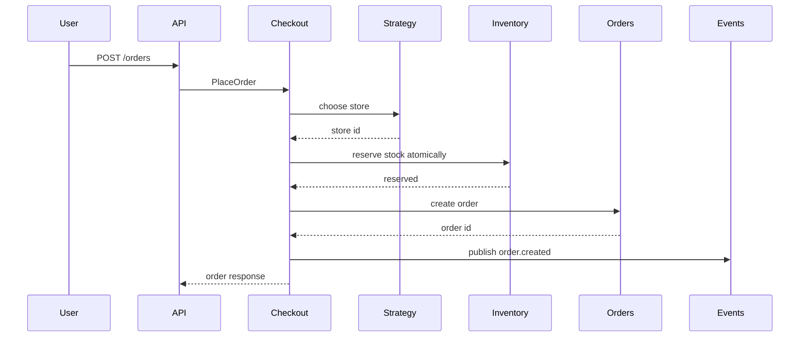

# Inventory Order Assignment LLD in Go

## Complete notes

## Problem statement

Design a simplified Zepto-like inventory and order assignment system.

A user places an order with multiple items. The system must choose a dark store, reserve inventory, create an order, and assign a delivery partner.

## Requirements

### Functional

- User can place an order.
- System checks inventory in nearby stores.
- System chooses one store for fulfillment.
- Inventory is reserved before payment/order confirmation.
- Order has a lifecycle.
- Delivery partner can be assigned.

### Non-functional / edge cases

- Avoid overselling stock.
- Handle two users ordering the last item.
- Support future store assignment strategies.
- Keep service code testable.
- Keep storage behind repositories.

## API design

```text
POST /orders
GET /orders/{id}
POST /orders/{id}/cancel
POST /orders/{id}/assign-delivery
```

## DB schema

```sql
stores(id, name, lat, lng, active)
products(id, sku, name)
inventory(store_id, product_id, available_qty, reserved_qty, updated_at)
orders(id, user_id, store_id, status, created_at)
order_items(order_id, product_id, qty, price)
delivery_partners(id, status, current_lat, current_lng)
```

## High-level flow



## Patterns used

| Pattern | Where used |
|---|---|
| Strategy | choose dark store |
| Repository | order/inventory storage |
| State | order lifecycle |
| Observer | publish order events |
| Facade | checkout service coordinates flow |
| Chain | checkout validation |

## Core Go model

## Go code

```go
type OrderStatus string

const (
    OrderCreated   OrderStatus = "created"
    OrderReserved  OrderStatus = "reserved"
    OrderCancelled OrderStatus = "cancelled"
)

type Order struct {
    ID      string
    UserID  string
    StoreID string
    Status  OrderStatus
    Items   []OrderItem
}

type OrderItem struct {
    ProductID string
    Quantity  int
    Price     int64
}
```

## Repository interfaces

```go
type InventoryRepository interface {
    FindCandidateStores(ctx context.Context, items []OrderItem) ([]Store, error)
    Reserve(ctx context.Context, storeID string, items []OrderItem) error
}

type OrderRepository interface {
    Save(ctx context.Context, order Order) error
    FindByID(ctx context.Context, id string) (Order, error)
}
```

## Strategy interface

```go
type StoreSelectionStrategy interface {
    SelectStore(ctx context.Context, stores []Store, items []OrderItem) (Store, error)
}
```

## Checkout facade

```go
type CheckoutService struct {
    inventory InventoryRepository
    orders    OrderRepository
    strategy  StoreSelectionStrategy
    events    EventPublisher
}

func (s *CheckoutService) PlaceOrder(ctx context.Context, userID string, items []OrderItem) (Order, error) {
    stores, err := s.inventory.FindCandidateStores(ctx, items)
    if err != nil {
        return Order{}, err
    }

    store, err := s.strategy.SelectStore(ctx, stores, items)
    if err != nil {
        return Order{}, err
    }

    if err := s.inventory.Reserve(ctx, store.ID, items); err != nil {
        return Order{}, err
    }

    order := Order{
        ID:      newID(),
        UserID:  userID,
        StoreID: store.ID,
        Status:  OrderReserved,
        Items:   items,
    }

    if err := s.orders.Save(ctx, order); err != nil {
        return Order{}, err
    }

    _ = s.events.Publish(ctx, Event{Name: "order.created", OrderID: order.ID})
    return order, nil
}
```

## Atomic stock reservation

In SQL, the important idea is conditional update:

```sql
UPDATE inventory
SET available_qty = available_qty - $1,
    reserved_qty = reserved_qty + $1
WHERE store_id = $2
  AND product_id = $3
  AND available_qty >= $1;
```

If affected rows is zero, stock is not available. This prevents overselling under concurrent requests.

## Real-life explanation

Suppose only one milk packet is left. Two users click order at the same time. If the system reads stock first and updates later without atomic condition, both may think stock is available. The conditional update makes the database decide atomically.

## Real-life example

Imagine a Zepto dark store has exactly one packet of Amul milk. User A and User B order it at the same time. A weak design reads `available_qty = 1` twice and creates two orders. A strong design uses an atomic reservation update so only one order reserves the packet and the other gets an out-of-stock response.

## When to use

Use this design for any system where limited stock/capacity must be reserved before confirmation:

- grocery inventory
- movie seats
- hotel rooms
- delivery partner assignment
- wallet balance hold
- coupon usage limit

## Interview follow-ups

### What if inventory is split across multiple dark stores?

Either reject if one store cannot fulfill the whole order, or split fulfillment into multiple shipments. For SDE-1, explain the tradeoff and start with single-store fulfillment.

### What if payment fails after inventory reservation?

Release reservation and mark order/payment failed. In production, use a timeout job to release stuck reservations.

### What if order API is retried?

Use an idempotency key. Store `(user_id, idempotency_key)` with a unique constraint and return the existing order on retry.

### What if delivery partner is unavailable?

Keep order in `reserved/ready_to_assign` state and retry assignment with backoff.

## What to draw in interview

Draw API -> Checkout -> Store Strategy -> Inventory Repo -> Order Repo -> Event Publisher.

## Common mistakes

- no atomic inventory reservation
- no order state machine
- mixing HTTP handler with business logic
- no idempotency for retries
- making store selection hardcoded instead of strategy
