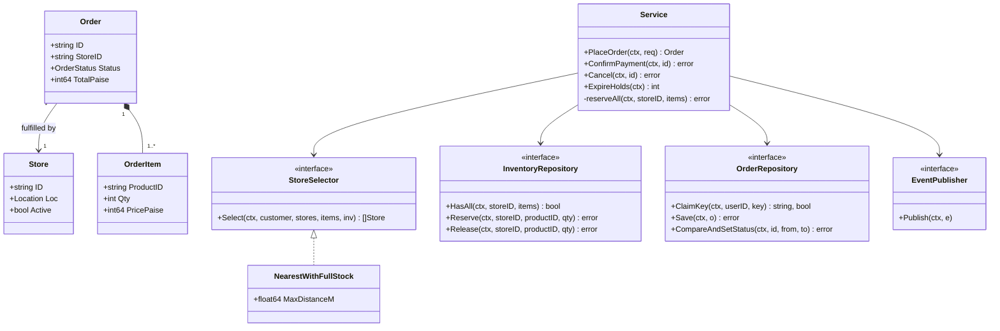
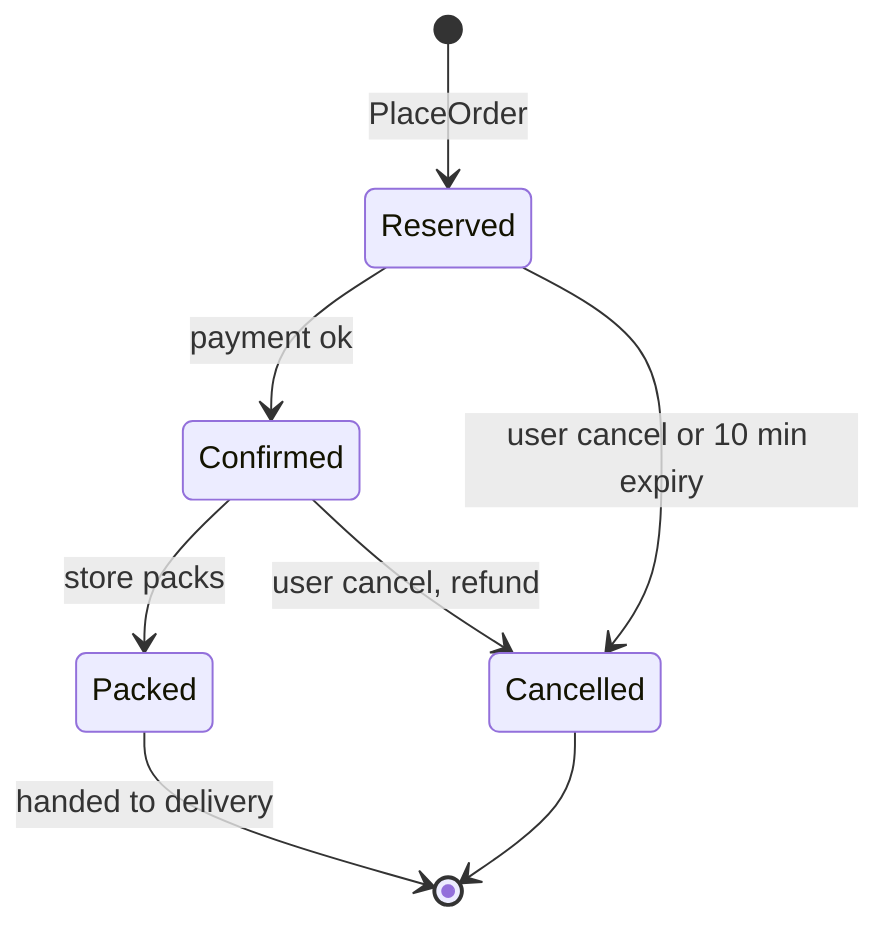
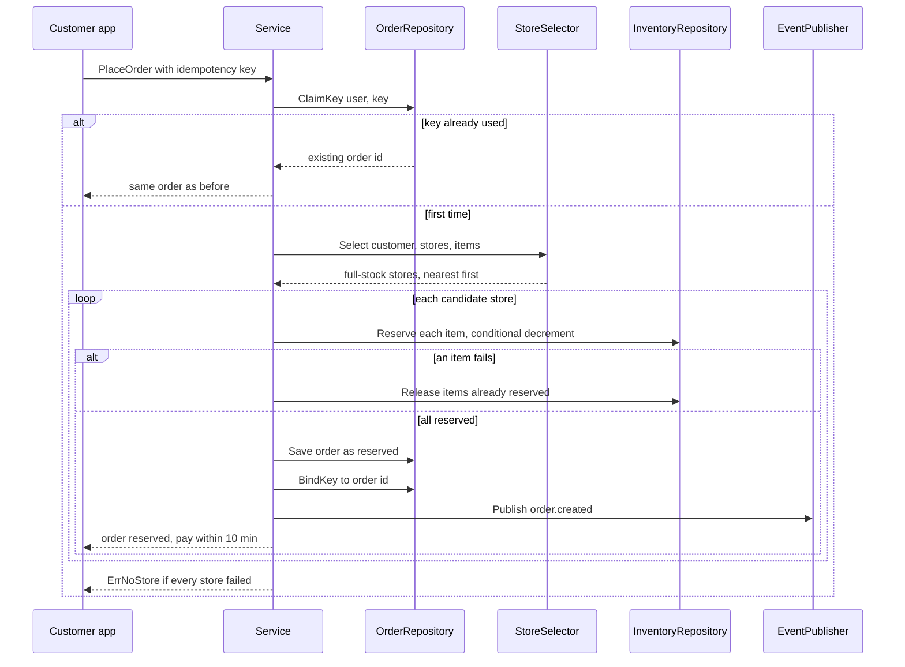

# Inventory Order Assignment LLD in Go

## Problem statement

```text
Design a Zepto-like order assignment system. A user orders several products.
Pick a dark store near the user that has every item in stock, reserve the stock
so two users cannot buy the last packet, create the order, and support payment,
cancellation and retries. Later the order is handed to delivery partner assignment.
Design the classes, APIs, DB schema and code PlaceOrder.
```

What it really tests: an **atomic multi-item reservation** (all items or none, no overselling under concurrency) and clean separation of store selection (Strategy), order lifecycle (State) and retries (idempotency key).

## How to use this note

- Open the drawing below ([[Inventory Order Assignment LLD Drawing.excalidraw]]), look at it for 2 minutes, close it, and redraw it yourself on paper or Excalidraw.
- Attempt each step before reading it. Cover the section, write your answer, then compare.
- Time box 60 minutes, as in the [[LLD Practice Roadmap]] daily method: 10 min requirements and entities, 10 min APIs and storage, 25-40 min core code (`PlaceOrder` + `reserveAll`), 10 min edge cases, 5 min explaining out loud.

## Step 1: Clarify requirements

### Questions to ask

- Must one store fulfil the whole order, or can we split it across stores? *Assume: one store only (Zepto dark-store model). Split is a follow-up.*
- How far can a store be from the user? *Assume: 3 km serviceable radius, straight-line distance.*
- When is stock taken: at add-to-cart, at checkout, or after payment? *Assume: reserved at checkout (PlaceOrder), held for 10 minutes until payment.*
- What if the nearest store is missing one item? *Assume: skip it and try the next nearest store with full stock.*
- Can the client retry the place-order call? *Assume: yes (flaky mobile network), so the client sends an idempotency key per checkout tap.*
- Is delivery partner assignment in scope? *Assume: no, we publish `order.created` and stop at `packed`. See [[Delivery Partner Assignment LLD in Go]].*
- Scale? *Assume: a few hundred orders per minute per city, about 5-20 stores per city.*

### Functional

- Place an order with multiple items (product, quantity, unit price).
- Find active stores within the radius that have **every** item, nearest first.
- Reserve stock for all items atomically: all reserved or none.
- If a store loses the race for an item, try the next candidate store.
- Order lifecycle: `reserved -> confirmed -> packed`, and `cancelled` from reserved or confirmed (releases stock).
- Unpaid reservations expire after 10 minutes and release stock.
- Retrying with the same idempotency key returns the same order.

### Non-functional

- Never oversell: concurrent orders for the last unit must give exactly one winner.
- No leaked reservations: partial reservations roll back; unpaid ones expire.
- Low latency (under 200 ms for PlaceOrder): store selection must not scan every store in the country.
- Store selection rule must be swappable (nearest, least loaded, cheapest delivery).
- Money in `int64` paise.

### Out of scope

- Payments internals (we only get a "payment confirmed" call), pricing and coupons ([[Cart Checkout with Coupons LLD in Go]]).
- Delivery partner assignment, live tracking.
- Splitting one order across stores, substitutions.
- Warehouse restocking and purchase orders.

## Step 2: Actors and use cases

| Actor | Use case |
|---|---|
| Customer app | Place order (with idempotency key), view order, cancel order |
| Payment service | Confirm payment for an order |
| Store staff app | Mark order packed; set store offline |
| Expiry job (system) | Cancel unpaid reservations after 10 min and release stock |
| Ops / catalog | Update stock levels per store |

Hardest use case, the one to code: **PlaceOrder**: select the nearest full-stock store and reserve all items atomically, idempotently.

## Step 3: Entities

| Entity | Key fields | Why it exists |
|---|---|---|
| `Store` | ID, Loc, Active | A dark store; the unit of fulfilment |
| `Product` | ID, SKU, PricePaise | Catalog item (not stock) |
| `InventoryItem` | StoreID, ProductID, AvailableQty, ReservedQty | Stock of one product **at one store**; the row we lock |
| `Order` | ID, UserID, StoreID, Items, TotalPaise, Status, CreatedAt | What the user bought and from which store |
| `OrderItem` | ProductID, Qty, PricePaise | One line; price copied at order time |
| `OrderStatus` | reserved, confirmed, packed, cancelled | Lifecycle with legal transitions |
| `IdempotencyKey` | UserID, Key, OrderID | Makes retries safe |

Modeling insight: **Product is not InventoryItem.** A product is global ("Amul milk 500 ml"); stock lives per (store, product). The same product can be in stock at store A and out of stock at store B, and that row is what concurrent orders fight over. Also, `OrderItem` copies the price, so later price changes do not change old orders.

## Step 4: Relationships





- **Composition**: `Order` owns its `OrderItem`s. Items have no life without the order.
- **Association**: `Order` points to one `Store` (by ID). Stores live on their own.
- **Dependency on interfaces**: `Service` uses `StoreSelector`, `InventoryRepository`, `OrderRepository`, `EventPublisher`. Tests swap in fakes; prod swaps in Postgres and Kafka.
- **Realization**: `NearestWithFullStock` implements `StoreSelector`.

## Step 5: APIs and public methods

```text
POST /orders                       Idempotency-Key: <uuid per checkout tap>
  { "items": [{"product_id": "milk", "qty": 2}], "lat": 12.97, "lng": 77.59 }
  -> 201 { order_id, store_id, status: "reserved", total_paise, pay_by }
  -> 409 out of stock everywhere | 409 same key in progress | 400 invalid
GET  /orders/{id}
POST /orders/{id}/cancel

# internal
POST /internal/orders/{id}/payment-confirmed     (from payment service)
POST /internal/orders/{id}/packed                (from store app)
PUT  /internal/stores/{id}/inventory/{productId} { "available_qty": 40 }
```

```go
type PlaceOrderRequest struct {
    UserID         string
    IdempotencyKey string
    Customer       Location
    Items          []OrderItem
}

func (s *Service) PlaceOrder(ctx context.Context, req PlaceOrderRequest) (Order, error)
func (s *Service) ConfirmPayment(ctx context.Context, orderID string) error
func (s *Service) MarkPacked(ctx context.Context, orderID string) error
func (s *Service) Cancel(ctx context.Context, orderID string) error
func (s *Service) ExpireHolds(ctx context.Context) (int, error) // run by a ticker
```

## Step 6: Storage and repositories

```sql
CREATE TABLE stores (
    id      TEXT PRIMARY KEY,
    name    TEXT NOT NULL,
    lat     DOUBLE PRECISION NOT NULL,
    lng     DOUBLE PRECISION NOT NULL,
    active  BOOLEAN NOT NULL DEFAULT true
);
-- nearby search: PostGIS GIST index on a geography column, or a geohash column + index

CREATE TABLE products (
    id          TEXT PRIMARY KEY,
    sku         TEXT NOT NULL UNIQUE,
    name        TEXT NOT NULL,
    price_paise BIGINT NOT NULL CHECK (price_paise >= 0)
);

CREATE TABLE inventory (
    store_id      TEXT NOT NULL REFERENCES stores(id),
    product_id    TEXT NOT NULL REFERENCES products(id),
    available_qty INT  NOT NULL CHECK (available_qty >= 0), -- DB refuses oversell
    reserved_qty  INT  NOT NULL DEFAULT 0 CHECK (reserved_qty >= 0),
    updated_at    TIMESTAMPTZ NOT NULL DEFAULT now(),
    PRIMARY KEY (store_id, product_id)
);

CREATE TABLE orders (
    id          TEXT PRIMARY KEY,
    user_id     TEXT NOT NULL,
    store_id    TEXT NOT NULL REFERENCES stores(id),
    status      TEXT NOT NULL,          -- reserved | confirmed | packed | cancelled
    total_paise BIGINT NOT NULL,
    created_at  TIMESTAMPTZ NOT NULL DEFAULT now()
);
CREATE INDEX orders_status_created ON orders (status, created_at); -- expiry sweeper

CREATE TABLE order_items (
    order_id    TEXT NOT NULL REFERENCES orders(id),
    product_id  TEXT NOT NULL REFERENCES products(id),
    qty         INT  NOT NULL CHECK (qty > 0),
    price_paise BIGINT NOT NULL,         -- copied at order time
    PRIMARY KEY (order_id, product_id)
);

CREATE TABLE idempotency_keys (
    user_id    TEXT NOT NULL,
    key        TEXT NOT NULL,
    order_id   TEXT NULL,                -- NULL while the first request is running
    created_at TIMESTAMPTZ NOT NULL DEFAULT now(),
    PRIMARY KEY (user_id, key)           -- second insert fails = retry
);
```

The reservation, one transaction per candidate store, items in `product_id` order (same lock order everywhere = no deadlock):

```sql
BEGIN;
UPDATE inventory
SET available_qty = available_qty - $qty, reserved_qty = reserved_qty + $qty, updated_at = now()
WHERE store_id = $store AND product_id = $product AND available_qty >= $qty;
-- repeat per item; if any UPDATE affects 0 rows -> ROLLBACK and try the next store
INSERT INTO orders (...) VALUES (...);
INSERT INTO order_items (...) VALUES (...);
UPDATE idempotency_keys SET order_id = $order WHERE user_id = $u AND key = $k;
COMMIT;
```

The status change is also a compare-and-set: `UPDATE orders SET status = $to WHERE id = $id AND status = $from`.

```go
type StoreRepository interface {
    ListActive(ctx context.Context) ([]Store, error) // prod: nearby active stores via geo index
}

type InventoryRepository interface {
    HasAll(ctx context.Context, storeID string, items []OrderItem) (bool, error)
    Reserve(ctx context.Context, storeID, productID string, qty int) error // conditional decrement
    Release(ctx context.Context, storeID, productID string, qty int) error
}

type OrderRepository interface {
    ClaimKey(ctx context.Context, userID, key string) (orderID string, claimed bool, err error)
    BindKey(ctx context.Context, userID, key, orderID string) error
    ReleaseKey(ctx context.Context, userID, key string) error
    Save(ctx context.Context, o Order) error
    Get(ctx context.Context, id string) (Order, error)
    CompareAndSetStatus(ctx context.Context, id string, from, to OrderStatus) error
    ListByStatus(ctx context.Context, st OrderStatus) ([]Order, error)
}
```

## Step 7: Patterns

| Pattern | Where | Why here |
|---|---|---|
| [[Strategy Pattern in Go]] | `StoreSelector` / `NearestWithFullStock` | Business will change the rule (nearest, least busy, cheapest delivery) without touching `PlaceOrder` |
| [[State Pattern in Go]] | `OrderStatus.CanMoveTo` + transitions table | Blocks illegal moves like pack-before-pay or cancel-after-packed |
| [[Repository Pattern in Go]] | `InventoryRepository`, `OrderRepository`, `StoreRepository` | Service logic is the same for in-memory tests and Postgres |
| [[Facade Pattern in Go]] | `Service.PlaceOrder` | One call hides validation, idempotency, selection, reservation, save, event |
| [[Observer Pattern in Go]] | `EventPublisher` (`order.created`, `order.cancelled`) | Delivery assignment and notifications react without the order code knowing them |

Patterns NOT used and why:

- No full State-object-per-status (`ReservedState`, `ConfirmedState` structs). There are only four states with no per-state behavior; a transitions map is simpler (KISS).
- No Chain of Responsibility for validation. One `normalize` function is enough until there are many independent rules (YAGNI).

## Folder structure

```text
inventory/
  model.go         -> Location, Store, OrderItem, Order, OrderStatus + transitions, errors
  repository.go    -> StoreRepository, InventoryRepository, OrderRepository + MemStores, MemInventory, MemOrders
  strategy.go      -> StoreSelector, NearestWithFullStock, HaversineM
  events.go        -> Event, EventPublisher, NopPublisher
  service.go       -> Service: PlaceOrder, reserveAll, ConfirmPayment, MarkPacked, Cancel, ExpireHolds
  service_test.go  -> table tests + concurrency tests
cmd/demo/main.go   -> wires Mem* repos, NearestWithFullStock{3000}, time.Now, 10 min hold
```

- `model.go`: plain data and the state transition table. No storage, no locking.
- `repository.go`: interfaces first, then in-memory versions guarded by a mutex (stand-in for Postgres).
- `strategy.go`: the swappable store-selection rule.
- `events.go`: the observer hook; prod implementation writes to an outbox or Kafka.
- `service.go`: the use cases. Only file that knows the order of steps.

## Step 8: Core code

Main logic only. Full runnable code is folded below.

```go
// State: reserved -> confirmed -> packed, and reserved/confirmed -> cancelled

type InventoryRepository interface {
    // UPDATE inventory SET available = available - qty WHERE ... AND available >= qty
    Reserve(ctx context.Context, storeID, productID string, qty int) error
    Release(ctx context.Context, storeID, productID string, qty int) error // + HasAll for the selector
}

type StoreSelector interface { // Strategy: NearestWithFullStock{MaxDistanceM: 3000}
    Select(ctx context.Context, customer Location, stores []Store, items []OrderItem, inv InventoryRepository) ([]Store, error)
}

func (s *Service) PlaceOrder(ctx context.Context, req PlaceOrderRequest) (Order, error) {
    items, err := normalize(req.Items) // merge duplicate lines, sort by product ID
    // ... return err; user and idempotency key required
    existingID, claimed, err := s.orders.ClaimKey(ctx, req.UserID, req.IdempotencyKey)
    // ... return err
    if !claimed {
        if existingID == "" {
            return Order{}, ErrInProgress // first request still running
        }
        return s.orders.Get(ctx, existingID) // retry: same answer, no second reservation
    }
    o, err := s.place(ctx, req, items)
    if err != nil {
        _ = s.orders.ReleaseKey(ctx, req.UserID, req.IdempotencyKey) // allow a fresh retry
        return Order{}, err
    }
    // ... BindKey(user, key, o.ID), publish order.created
    return o, nil
}

func (s *Service) place(ctx context.Context, req PlaceOrderRequest, items []OrderItem) (Order, error) {
    stores, err := s.stores.ListActive(ctx) // ... error checks omitted
    cands, err := s.selector.Select(ctx, req.Customer, stores, items, s.inv)
    for _, st := range cands {
        if err := s.reserveAll(ctx, st.ID, items); err != nil {
            if errors.Is(err, ErrOutOfStock) {
                continue // lost a race at this store after Select; try the next nearest
            }
            return Order{}, err
        }
        o := Order{ /* ID, UserID, StoreID: st.ID, Items, TotalPaise */ Status: Reserved, CreatedAt: s.now()}
        // ... Save(o); on error releaseAll and return
        return o, nil
    }
    return Order{}, ErrNoStore
}

// all-or-nothing: on the first failure, undo what was already reserved
func (s *Service) reserveAll(ctx context.Context, storeID string, items []OrderItem) error {
    for i, it := range items {
        if err := s.inv.Reserve(ctx, storeID, it.ProductID, it.Qty); err != nil {
            s.releaseAll(ctx, storeID, items[:i])
            return err
        }
    }
    return nil
}
```

### Walkthrough

`PlaceOrder(ctx, req)`:

1. `normalize` merges duplicate lines (`bread x1` twice becomes `bread x2`), rejects empty carts and zero quantities, and sorts by product ID. Sorting gives every request the same lock order, which avoids deadlocks in the SQL version.
2. `ClaimKey(user, key)`. First call claims the key. A retry finds the key: if it already has an order ID, return that order (no second reservation); if it is still empty, the first request is in flight, so return `ErrInProgress`.
3. `selector.Select` returns active stores within 3 km that currently have every item, nearest first. This is a read without locks, so it can be stale by the time we reserve.
4. For each candidate store, `reserveAll` does one atomic conditional decrement per item. If item 3 fails, items 1 and 2 are released (rollback), and we try the next store. This handles "Select said yes, but someone bought the last unit a millisecond later".
5. On success, build the order (`reserved`, total in paise, `CreatedAt` from the injected clock) and save it. If saving fails, release the stock.
6. Bind the idempotency key to the order ID and publish `order.created`. If anything failed, the key is released so the user can retry with the same key.

Lifecycle methods go through `transition`: check `CanMoveTo`, then `CompareAndSetStatus(from, to)`, so two racing callers (for example the user cancels while payment confirms) cannot both win. `Cancel` releases stock only when it won. `ExpireHolds` uses CAS from `reserved` only, so a payment that lands at the same moment wins and the paid order is never cancelled.

> [!example]- Full runnable code (click to open)
> ```go
> package inventory
>
> import (
>     "context"
>     "errors"
>     "fmt"
>     "math"
>     "sort"
>     "sync"
>     "sync/atomic"
>     "time"
> )
>
> // ---------- model.go: entities, enums, errors ----------
>
> var (
>     ErrInvalidOrder  = errors.New("inventory: invalid order")
>     ErrOutOfStock    = errors.New("inventory: out of stock")
>     ErrNoStore       = errors.New("inventory: no store can fulfil the whole order")
>     ErrOrderNotFound = errors.New("inventory: order not found")
>     ErrBadTransition = errors.New("inventory: invalid order state transition")
>     ErrInProgress    = errors.New("inventory: same idempotency key is still in progress")
> )
>
> type Location struct{ Lat, Lng float64 }
>
> type Store struct {
>     ID     string
>     Loc    Location
>     Active bool // store can go offline (closed, power cut)
> }
>
> type OrderItem struct {
>     ProductID  string
>     Qty        int
>     PricePaise int64 // unit price, int64 paise, never float
> }
>
> type OrderStatus string
>
> const (
>     Reserved  OrderStatus = "reserved"  // stock held, waiting for payment
>     Confirmed OrderStatus = "confirmed" // paid, store starts packing
>     Packed    OrderStatus = "packed"    // handed to delivery assignment
>     Cancelled OrderStatus = "cancelled" // stock released
> )
>
> // State: the only legal moves. Anything else is ErrBadTransition.
> var transitions = map[OrderStatus][]OrderStatus{
>     Reserved:  {Confirmed, Cancelled},
>     Confirmed: {Packed, Cancelled},
> }
>
> func (s OrderStatus) CanMoveTo(next OrderStatus) bool {
>     for _, n := range transitions[s] {
>         if n == next {
>             return true
>         }
>     }
>     return false
> }
>
> type Order struct {
>     ID         string
>     UserID     string
>     StoreID    string
>     Items      []OrderItem
>     TotalPaise int64
>     Status     OrderStatus
>     CreatedAt  time.Time
> }
>
> // ---------- repository.go: storage interfaces + in-memory impl ----------
>
> type StoreRepository interface {
>     ListActive(ctx context.Context) ([]Store, error)
> }
>
> type InventoryRepository interface {
>     HasAll(ctx context.Context, storeID string, items []OrderItem) (bool, error)
>     // Reserve is one atomic conditional decrement:
>     // UPDATE inventory SET available = available - $qty
>     // WHERE store_id = $s AND product_id = $p AND available >= $qty
>     Reserve(ctx context.Context, storeID, productID string, qty int) error
>     Release(ctx context.Context, storeID, productID string, qty int) error
> }
>
> type OrderRepository interface {
>     // ClaimKey inserts (user_id, key). claimed=false means the key exists:
>     // orderID != "" -> finished earlier, return that order; "" -> still running.
>     ClaimKey(ctx context.Context, userID, key string) (orderID string, claimed bool, err error)
>     BindKey(ctx context.Context, userID, key, orderID string) error
>     ReleaseKey(ctx context.Context, userID, key string) error
>     Save(ctx context.Context, o Order) error
>     Get(ctx context.Context, id string) (Order, error)
>     // CompareAndSetStatus: UPDATE orders SET status=$to WHERE id=$id AND status=$from
>     CompareAndSetStatus(ctx context.Context, id string, from, to OrderStatus) error
>     ListByStatus(ctx context.Context, st OrderStatus) ([]Order, error)
> }
>
> type MemStores struct{ Stores []Store }
>
> func (m *MemStores) ListActive(ctx context.Context) ([]Store, error) {
>     var out []Store
>     for _, s := range m.Stores {
>         if s.Active {
>             out = append(out, s)
>         }
>     }
>     return out, nil
> }
>
> type MemInventory struct {
>     mu    sync.Mutex
>     avail map[string]map[string]int // storeID -> productID -> available qty
> }
>
> func NewMemInventory() *MemInventory {
>     return &MemInventory{avail: make(map[string]map[string]int)}
> }
>
> func (m *MemInventory) Set(storeID, productID string, qty int) {
>     m.mu.Lock()
>     defer m.mu.Unlock()
>     if m.avail[storeID] == nil {
>         m.avail[storeID] = make(map[string]int)
>     }
>     m.avail[storeID][productID] = qty
> }
>
> func (m *MemInventory) Available(storeID, productID string) int {
>     m.mu.Lock()
>     defer m.mu.Unlock()
>     return m.avail[storeID][productID]
> }
>
> func (m *MemInventory) HasAll(ctx context.Context, storeID string, items []OrderItem) (bool, error) {
>     m.mu.Lock()
>     defer m.mu.Unlock()
>     for _, it := range items {
>         if m.avail[storeID][it.ProductID] < it.Qty {
>             return false, nil
>         }
>     }
>     return true, nil
> }
>
> func (m *MemInventory) Reserve(ctx context.Context, storeID, productID string, qty int) error {
>     m.mu.Lock()
>     defer m.mu.Unlock()
>     if m.avail[storeID][productID] < qty { // check and decrement under one lock
>         return ErrOutOfStock
>     }
>     m.avail[storeID][productID] -= qty
>     return nil
> }
>
> func (m *MemInventory) Release(ctx context.Context, storeID, productID string, qty int) error {
>     m.mu.Lock()
>     defer m.mu.Unlock()
>     if m.avail[storeID] == nil {
>         m.avail[storeID] = make(map[string]int)
>     }
>     m.avail[storeID][productID] += qty
>     return nil
> }
>
> type MemOrders struct {
>     mu     sync.Mutex
>     orders map[string]Order
>     keys   map[string]string // userID|key -> orderID ("" while in progress)
> }
>
> func NewMemOrders() *MemOrders {
>     return &MemOrders{orders: make(map[string]Order), keys: make(map[string]string)}
> }
>
> func (m *MemOrders) ClaimKey(ctx context.Context, userID, key string) (string, bool, error) {
>     m.mu.Lock()
>     defer m.mu.Unlock()
>     k := userID + "|" + key
>     if id, ok := m.keys[k]; ok {
>         return id, false, nil
>     }
>     m.keys[k] = ""
>     return "", true, nil
> }
>
> func (m *MemOrders) BindKey(ctx context.Context, userID, key, orderID string) error {
>     m.mu.Lock()
>     defer m.mu.Unlock()
>     m.keys[userID+"|"+key] = orderID
>     return nil
> }
>
> func (m *MemOrders) ReleaseKey(ctx context.Context, userID, key string) error {
>     m.mu.Lock()
>     defer m.mu.Unlock()
>     delete(m.keys, userID+"|"+key)
>     return nil
> }
>
> func (m *MemOrders) Save(ctx context.Context, o Order) error {
>     m.mu.Lock()
>     defer m.mu.Unlock()
>     m.orders[o.ID] = o
>     return nil
> }
>
> func (m *MemOrders) Get(ctx context.Context, id string) (Order, error) {
>     m.mu.Lock()
>     defer m.mu.Unlock()
>     o, ok := m.orders[id]
>     if !ok {
>         return Order{}, ErrOrderNotFound
>     }
>     return o, nil
> }
>
> func (m *MemOrders) CompareAndSetStatus(ctx context.Context, id string, from, to OrderStatus) error {
>     m.mu.Lock()
>     defer m.mu.Unlock()
>     o, ok := m.orders[id]
>     if !ok {
>         return ErrOrderNotFound
>     }
>     if o.Status != from {
>         return fmt.Errorf("%w: order %s is %s, not %s", ErrBadTransition, id, o.Status, from)
>     }
>     o.Status = to
>     m.orders[id] = o
>     return nil
> }
>
> func (m *MemOrders) ListByStatus(ctx context.Context, st OrderStatus) ([]Order, error) {
>     m.mu.Lock()
>     defer m.mu.Unlock()
>     var out []Order
>     for _, o := range m.orders {
>         if o.Status == st {
>             out = append(out, o)
>         }
>     }
>     return out, nil
> }
>
> // ---------- strategy.go: which store fulfils the order ----------
>
> type StoreSelector interface {
>     // Select returns candidate stores in the order they should be tried.
>     Select(ctx context.Context, customer Location, stores []Store, items []OrderItem, inv InventoryRepository) ([]Store, error)
> }
>
> // NearestWithFullStock: stores inside MaxDistanceM that have every item, nearest first.
> type NearestWithFullStock struct{ MaxDistanceM float64 }
>
> func (s NearestWithFullStock) Select(ctx context.Context, customer Location, stores []Store, items []OrderItem, inv InventoryRepository) ([]Store, error) {
>     type cand struct {
>         st Store
>         d  float64
>     }
>     var cs []cand
>     for _, st := range stores {
>         d := HaversineM(customer, st.Loc)
>         if d > s.MaxDistanceM {
>             continue
>         }
>         ok, err := inv.HasAll(ctx, st.ID, items)
>         if err != nil {
>             return nil, err
>         }
>         if ok {
>             cs = append(cs, cand{st, d})
>         }
>     }
>     sort.Slice(cs, func(i, j int) bool { return cs[i].d < cs[j].d })
>     out := make([]Store, len(cs))
>     for i, c := range cs {
>         out[i] = c.st
>     }
>     return out, nil
> }
>
> func HaversineM(a, b Location) float64 {
>     const earthR = 6371000.0
>     rad := func(d float64) float64 { return d * math.Pi / 180 }
>     dLat, dLng := rad(b.Lat-a.Lat), rad(b.Lng-a.Lng)
>     h := math.Sin(dLat/2)*math.Sin(dLat/2) +
>         math.Cos(rad(a.Lat))*math.Cos(rad(b.Lat))*math.Sin(dLng/2)*math.Sin(dLng/2)
>     return 2 * earthR * math.Asin(math.Sqrt(h))
> }
>
> // ---------- events.go: observer hook ----------
>
> type Event struct {
>     Name    string // order.created, order.cancelled
>     OrderID string
> }
>
> type EventPublisher interface {
>     Publish(ctx context.Context, e Event)
> }
>
> type NopPublisher struct{}
>
> func (NopPublisher) Publish(context.Context, Event) {}
>
> // ---------- service.go: the PlaceOrder facade ----------
>
> type PlaceOrderRequest struct {
>     UserID         string
>     IdempotencyKey string // client generates once per checkout tap, reuses it on retry
>     Customer       Location
>     Items          []OrderItem
> }
>
> type Service struct {
>     stores   StoreRepository
>     inv      InventoryRepository
>     orders   OrderRepository
>     selector StoreSelector
>     events   EventPublisher
>     now      func() time.Time
>     holdFor  time.Duration // unpaid reservations expire after this
>     seq      atomic.Int64
> }
>
> func NewService(st StoreRepository, inv InventoryRepository, ord OrderRepository,
>     sel StoreSelector, ev EventPublisher, now func() time.Time, holdFor time.Duration) *Service {
>     return &Service{stores: st, inv: inv, orders: ord, selector: sel, events: ev, now: now, holdFor: holdFor}
> }
>
> // PlaceOrder: validate -> idempotency claim -> pick store -> reserve all items -> save order.
> func (s *Service) PlaceOrder(ctx context.Context, req PlaceOrderRequest) (Order, error) {
>     items, err := normalize(req.Items)
>     if err != nil {
>         return Order{}, err
>     }
>     if req.UserID == "" || req.IdempotencyKey == "" {
>         return Order{}, fmt.Errorf("%w: user and idempotency key required", ErrInvalidOrder)
>     }
>     existingID, claimed, err := s.orders.ClaimKey(ctx, req.UserID, req.IdempotencyKey)
>     if err != nil {
>         return Order{}, err
>     }
>     if !claimed {
>         if existingID == "" {
>             return Order{}, ErrInProgress // first request still running; client retries later
>         }
>         return s.orders.Get(ctx, existingID) // retry: same answer, no second reservation
>     }
>     o, err := s.place(ctx, req, items)
>     if err != nil {
>         _ = s.orders.ReleaseKey(ctx, req.UserID, req.IdempotencyKey) // failed: allow a fresh retry
>         return Order{}, err
>     }
>     if err := s.orders.BindKey(ctx, req.UserID, req.IdempotencyKey, o.ID); err != nil {
>         return Order{}, err
>     }
>     s.events.Publish(ctx, Event{Name: "order.created", OrderID: o.ID})
>     return o, nil
> }
>
> func (s *Service) place(ctx context.Context, req PlaceOrderRequest, items []OrderItem) (Order, error) {
>     stores, err := s.stores.ListActive(ctx)
>     if err != nil {
>         return Order{}, err
>     }
>     cands, err := s.selector.Select(ctx, req.Customer, stores, items, s.inv)
>     if err != nil {
>         return Order{}, err
>     }
>     for _, st := range cands {
>         if err := ctx.Err(); err != nil {
>             return Order{}, err
>         }
>         if err := s.reserveAll(ctx, st.ID, items); err != nil {
>             if errors.Is(err, ErrOutOfStock) {
>                 continue // lost a race at this store after Select; try the next nearest
>             }
>             return Order{}, err
>         }
>         o := Order{
>             ID:         fmt.Sprintf("ord-%d", s.seq.Add(1)),
>             UserID:     req.UserID,
>             StoreID:    st.ID,
>             Items:      items,
>             TotalPaise: total(items),
>             Status:     Reserved,
>             CreatedAt:  s.now(),
>         }
>         if err := s.orders.Save(ctx, o); err != nil {
>             s.releaseAll(ctx, st.ID, items)
>             return Order{}, err
>         }
>         return o, nil
>     }
>     return Order{}, ErrNoStore
> }
>
> // reserveAll is all-or-nothing: on the first failure, undo what was already reserved.
> // In SQL this is one transaction; rows are locked in product_id order to avoid deadlocks.
> func (s *Service) reserveAll(ctx context.Context, storeID string, items []OrderItem) error {
>     for i, it := range items {
>         if err := s.inv.Reserve(ctx, storeID, it.ProductID, it.Qty); err != nil {
>             s.releaseAll(ctx, storeID, items[:i])
>             return err
>         }
>     }
>     return nil
> }
>
> func (s *Service) releaseAll(ctx context.Context, storeID string, items []OrderItem) {
>     for _, it := range items {
>         _ = s.inv.Release(ctx, storeID, it.ProductID, it.Qty) // prod: log + reconciliation job
>     }
> }
>
> // ConfirmPayment: reserved -> confirmed.
> func (s *Service) ConfirmPayment(ctx context.Context, orderID string) error {
>     _, err := s.transition(ctx, orderID, Confirmed)
>     return err
> }
>
> func (s *Service) MarkPacked(ctx context.Context, orderID string) error {
>     _, err := s.transition(ctx, orderID, Packed)
>     return err
> }
>
> // Cancel releases stock only if this call won the move to cancelled.
> func (s *Service) Cancel(ctx context.Context, orderID string) error {
>     o, err := s.transition(ctx, orderID, Cancelled)
>     if err != nil {
>         return err
>     }
>     s.releaseAll(ctx, o.StoreID, o.Items)
>     s.events.Publish(ctx, Event{Name: "order.cancelled", OrderID: o.ID})
>     return nil
> }
>
> // ExpireHolds cancels reserved orders that were not paid within holdFor.
> // Run it from a ticker or a delayed job. Returns how many it cancelled.
> func (s *Service) ExpireHolds(ctx context.Context) (int, error) {
>     reserved, err := s.orders.ListByStatus(ctx, Reserved)
>     if err != nil {
>         return 0, err
>     }
>     n := 0
>     for _, o := range reserved {
>         if s.now().Sub(o.CreatedAt) < s.holdFor {
>             continue
>         }
>         // CAS from reserved only: if payment confirmed a moment ago, this fails and payment wins
>         if err := s.orders.CompareAndSetStatus(ctx, o.ID, Reserved, Cancelled); err != nil {
>             continue
>         }
>         s.releaseAll(ctx, o.StoreID, o.Items)
>         s.events.Publish(ctx, Event{Name: "order.cancelled", OrderID: o.ID})
>         n++
>     }
>     return n, nil
> }
>
> func (s *Service) transition(ctx context.Context, orderID string, to OrderStatus) (Order, error) {
>     o, err := s.orders.Get(ctx, orderID)
>     if err != nil {
>         return Order{}, err
>     }
>     if !o.Status.CanMoveTo(to) {
>         return Order{}, fmt.Errorf("%w: %s -> %s", ErrBadTransition, o.Status, to)
>     }
>     // compare-and-set: if two callers race, only one moves the order
>     if err := s.orders.CompareAndSetStatus(ctx, orderID, o.Status, to); err != nil {
>         return Order{}, err
>     }
>     o.Status = to
>     return o, nil
> }
>
> // normalize merges duplicate lines and sorts by product ID (stable lock order).
> func normalize(items []OrderItem) ([]OrderItem, error) {
>     if len(items) == 0 {
>         return nil, fmt.Errorf("%w: empty cart", ErrInvalidOrder)
>     }
>     byID := make(map[string]OrderItem)
>     for _, it := range items {
>         if it.ProductID == "" || it.Qty <= 0 || it.PricePaise < 0 {
>             return nil, fmt.Errorf("%w: bad line %+v", ErrInvalidOrder, it)
>         }
>         cur := byID[it.ProductID]
>         cur.ProductID, cur.PricePaise = it.ProductID, it.PricePaise
>         cur.Qty += it.Qty
>         byID[it.ProductID] = cur
>     }
>     out := make([]OrderItem, 0, len(byID))
>     for _, it := range byID {
>         out = append(out, it)
>     }
>     sort.Slice(out, func(i, j int) bool { return out[i].ProductID < out[j].ProductID })
>     return out, nil
> }
>
> func total(items []OrderItem) int64 {
>     var t int64
>     for _, it := range items {
>         t += int64(it.Qty) * it.PricePaise
>     }
>     return t
> }
> ```

### Sequence diagram



## Test cases

| Test | Proves |
|---|---|
| `TestPlaceOrder` (table) | nearest full-stock store is chosen, partial stores and inactive stores are skipped, duplicates merged, invalid input rejected |
| `TestTotalAndStockDeducted` | total in paise is right and stock is decremented |
| `TestPartialReservationRollsBack` | when the 2nd item fails, the 1st item's stock comes back |
| `TestIdempotentRetry` | same key returns the same order and reserves once; a new key creates a new order |
| `TestFailedAttemptFreesKey` | a failed attempt does not burn the key |
| `TestStateTransitions` (table) | legal and illegal moves; cancel releases stock exactly once |
| `TestExpireUnpaidHolds` | fake clock: expires only after 10 min, only unpaid orders, late payment fails |
| `TestConcurrentLastItems` | 50 goroutines, 10 milk: exactly 10 orders win, bread rolled back for the 40 losers |
| `TestConcurrentSameKey` | 20 concurrent calls with one key create exactly one order |

> [!example]- Full test code (click to open)
> ```go
> package inventory
>
> import (
>     "context"
>     "errors"
>     "fmt"
>     "sync"
>     "testing"
>     "time"
> )
>
> var home = Location{12.9716, 77.5946}
>
> // ~111 km per degree of latitude
> func north(m float64) Location { return Location{home.Lat + m/111000, home.Lng} }
>
> type fixture struct {
>     svc    *Service
>     inv    *MemInventory
>     orders *MemOrders
>     now    time.Time
> }
>
> // near (500 m) has milk only, far (1.5 km) has milk + bread, out (5 km) has everything.
> func newFixture() *fixture {
>     f := &fixture{inv: NewMemInventory(), orders: NewMemOrders(), now: time.Date(2026, 1, 1, 10, 0, 0, 0, time.UTC)}
>     stores := &MemStores{Stores: []Store{
>         {ID: "near", Loc: north(500), Active: true},
>         {ID: "far", Loc: north(1500), Active: true},
>         {ID: "out", Loc: north(5000), Active: true},
>         {ID: "closed", Loc: north(100), Active: false},
>     }}
>     f.inv.Set("near", "milk", 5)
>     f.inv.Set("far", "milk", 10)
>     f.inv.Set("far", "bread", 100)
>     f.inv.Set("out", "milk", 50)
>     f.inv.Set("out", "bread", 50)
>     f.inv.Set("closed", "milk", 50)
>     f.inv.Set("closed", "bread", 50)
>     f.svc = NewService(stores, f.inv, f.orders, NearestWithFullStock{MaxDistanceM: 3000},
>         NopPublisher{}, func() time.Time { return f.now }, 10*time.Minute)
>     return f
> }
>
> func req(key string, items ...OrderItem) PlaceOrderRequest {
>     return PlaceOrderRequest{UserID: "u1", IdempotencyKey: key, Customer: home, Items: items}
> }
>
> var (
>     milk  = OrderItem{ProductID: "milk", Qty: 1, PricePaise: 3000}
>     bread = OrderItem{ProductID: "bread", Qty: 1, PricePaise: 4500}
> )
>
> func TestPlaceOrder(t *testing.T) {
>     cases := []struct {
>         name      string
>         items     []OrderItem
>         wantStore string
>         wantErr   error
>     }{
>         {"nearest store has everything", []OrderItem{milk}, "near", nil},
>         {"nearest is partial, skip to full-stock store", []OrderItem{milk, bread}, "far", nil},
>         {"duplicate lines are merged", []OrderItem{bread, bread}, "far", nil},
>         {"too many for any store in range", []OrderItem{{ProductID: "milk", Qty: 11, PricePaise: 1}}, "", ErrNoStore},
>         {"unknown product", []OrderItem{{ProductID: "eggs", Qty: 1}}, "", ErrNoStore},
>         {"empty cart", nil, "", ErrInvalidOrder},
>         {"zero quantity", []OrderItem{{ProductID: "milk", Qty: 0}}, "", ErrInvalidOrder},
>     }
>     for _, tc := range cases {
>         t.Run(tc.name, func(t *testing.T) {
>             f := newFixture()
>             o, err := f.svc.PlaceOrder(context.Background(), req("k1", tc.items...))
>             if !errors.Is(err, tc.wantErr) {
>                 t.Fatalf("err = %v, want %v", err, tc.wantErr)
>             }
>             if err == nil && (o.StoreID != tc.wantStore || o.Status != Reserved) {
>                 t.Fatalf("got %+v", o)
>             }
>         })
>     }
> }
>
> func TestTotalAndStockDeducted(t *testing.T) {
>     f := newFixture()
>     o, err := f.svc.PlaceOrder(context.Background(), req("k1", milk, bread, bread))
>     if err != nil {
>         t.Fatal(err)
>     }
>     if o.TotalPaise != 3000+2*4500 {
>         t.Fatalf("total = %d", o.TotalPaise)
>     }
>     if f.inv.Available("far", "milk") != 9 || f.inv.Available("far", "bread") != 98 {
>         t.Fatal("stock not deducted")
>     }
> }
>
> // flakyInventory fails Reserve for one product, to force a partial reservation.
> type flakyInventory struct {
>     *MemInventory
>     failOn string
> }
>
> func (f flakyInventory) Reserve(ctx context.Context, s, p string, q int) error {
>     if p == f.failOn {
>         return ErrOutOfStock
>     }
>     return f.MemInventory.Reserve(ctx, s, p, q)
> }
>
> func TestPartialReservationRollsBack(t *testing.T) {
>     f := newFixture()
>     inv := flakyInventory{f.inv, "milk"} // bread sorts first, so bread is reserved, then milk fails
>     svc := NewService(&MemStores{Stores: []Store{{ID: "far", Loc: north(1500), Active: true}}},
>         inv, f.orders, NearestWithFullStock{MaxDistanceM: 3000}, NopPublisher{}, time.Now, time.Minute)
>     _, err := svc.PlaceOrder(context.Background(), req("k1", milk, bread))
>     if !errors.Is(err, ErrNoStore) {
>         t.Fatal(err)
>     }
>     if f.inv.Available("far", "bread") != 100 || f.inv.Available("far", "milk") != 10 {
>         t.Fatal("rollback did not restore stock")
>     }
> }
>
> func TestIdempotentRetry(t *testing.T) {
>     f := newFixture()
>     ctx := context.Background()
>     o1, err := f.svc.PlaceOrder(ctx, req("tap-1", milk))
>     if err != nil {
>         t.Fatal(err)
>     }
>     o2, err := f.svc.PlaceOrder(ctx, req("tap-1", milk)) // network retry
>     if err != nil || o2.ID != o1.ID {
>         t.Fatalf("retry gave %v %v", o2.ID, err)
>     }
>     if f.inv.Available("near", "milk") != 4 {
>         t.Fatal("retry reserved stock twice")
>     }
>     o3, _ := f.svc.PlaceOrder(ctx, req("tap-2", milk)) // new checkout = new key
>     if o3.ID == o1.ID {
>         t.Fatal("new key must create a new order")
>     }
> }
>
> func TestFailedAttemptFreesKey(t *testing.T) {
>     f := newFixture()
>     ctx := context.Background()
>     big := OrderItem{ProductID: "bread", Qty: 200, PricePaise: 1}
>     if _, err := f.svc.PlaceOrder(ctx, req("k", big)); !errors.Is(err, ErrNoStore) {
>         t.Fatal(err)
>     }
>     f.inv.Set("far", "bread", 500) // restocked
>     if _, err := f.svc.PlaceOrder(ctx, req("k", big)); err != nil {
>         t.Fatal("same key must be usable after a failed attempt:", err)
>     }
> }
>
> func TestStateTransitions(t *testing.T) {
>     cases := []struct {
>         name    string
>         steps   []func(*Service, string) error
>         wantErr error
>         status  OrderStatus
>         milk    int // available milk at "near" afterwards (started at 5, order holds 1)
>     }{
>         {"pay", []func(*Service, string) error{pay}, nil, Confirmed, 4},
>         {"pay then pack", []func(*Service, string) error{pay, pack}, nil, Packed, 4},
>         {"cancel unpaid releases stock", []func(*Service, string) error{cancel}, nil, Cancelled, 5},
>         {"cancel paid releases stock", []func(*Service, string) error{pay, cancel}, nil, Cancelled, 5},
>         {"pay twice", []func(*Service, string) error{pay, pay}, ErrBadTransition, Confirmed, 4},
>         {"pack before pay", []func(*Service, string) error{pack}, ErrBadTransition, Reserved, 4},
>         {"cancel after packed", []func(*Service, string) error{pay, pack, cancel}, ErrBadTransition, Packed, 4},
>         {"cancel twice releases once", []func(*Service, string) error{cancel, cancel}, ErrBadTransition, Cancelled, 5},
>     }
>     for _, tc := range cases {
>         t.Run(tc.name, func(t *testing.T) {
>             f := newFixture()
>             o, _ := f.svc.PlaceOrder(context.Background(), req("k", milk))
>             var err error
>             for _, step := range tc.steps {
>                 err = step(f.svc, o.ID)
>             }
>             got, _ := f.orders.Get(context.Background(), o.ID)
>             if !errors.Is(err, tc.wantErr) || got.Status != tc.status || f.inv.Available("near", "milk") != tc.milk {
>                 t.Fatalf("err=%v status=%s milk=%d", err, got.Status, f.inv.Available("near", "milk"))
>             }
>         })
>     }
> }
>
> func pay(s *Service, id string) error    { return s.ConfirmPayment(context.Background(), id) }
> func pack(s *Service, id string) error   { return s.MarkPacked(context.Background(), id) }
> func cancel(s *Service, id string) error { return s.Cancel(context.Background(), id) }
>
> func TestExpireUnpaidHolds(t *testing.T) {
>     f := newFixture()
>     ctx := context.Background()
>     unpaid, _ := f.svc.PlaceOrder(ctx, req("k1", milk))
>     paid, _ := f.svc.PlaceOrder(ctx, req("k2", milk))
>     _ = f.svc.ConfirmPayment(ctx, paid.ID)
>
>     f.now = f.now.Add(9 * time.Minute)
>     if n, _ := f.svc.ExpireHolds(ctx); n != 0 {
>         t.Fatal("expired too early")
>     }
>     f.now = f.now.Add(2 * time.Minute) // 11 min after placing
>     if n, _ := f.svc.ExpireHolds(ctx); n != 1 {
>         t.Fatal("want exactly the unpaid order expired, got", n)
>     }
>     u, _ := f.orders.Get(ctx, unpaid.ID)
>     p, _ := f.orders.Get(ctx, paid.ID)
>     if u.Status != Cancelled || p.Status != Confirmed || f.inv.Available("near", "milk") != 4 {
>         t.Fatal(u.Status, p.Status, f.inv.Available("near", "milk"))
>     }
>     if err := f.svc.ConfirmPayment(ctx, unpaid.ID); !errors.Is(err, ErrBadTransition) {
>         t.Fatal("late payment on expired order must fail (refund it):", err)
>     }
> }
>
> // 50 users race for 10 milk at the only store. Each also buys bread (plenty).
> // Exactly 10 win; losers' bread is rolled back.
> func TestConcurrentLastItems(t *testing.T) {
>     inv := NewMemInventory()
>     inv.Set("s1", "milk", 10)
>     inv.Set("s1", "bread", 100)
>     svc := NewService(&MemStores{Stores: []Store{{ID: "s1", Loc: home, Active: true}}}, inv, NewMemOrders(),
>         NearestWithFullStock{MaxDistanceM: 3000}, NopPublisher{}, time.Now, time.Minute)
>
>     var wg sync.WaitGroup
>     var mu sync.Mutex
>     wins, noStore := 0, 0
>     for i := 0; i < 50; i++ {
>         wg.Add(1)
>         go func(i int) {
>             defer wg.Done()
>             _, err := svc.PlaceOrder(context.Background(), PlaceOrderRequest{
>                 UserID: fmt.Sprint("u", i), IdempotencyKey: "k", Customer: home, Items: []OrderItem{milk, bread}})
>             mu.Lock()
>             defer mu.Unlock()
>             switch {
>             case err == nil:
>                 wins++
>             case errors.Is(err, ErrNoStore):
>                 noStore++
>             default:
>                 t.Error(err)
>             }
>         }(i)
>     }
>     wg.Wait()
>     if wins != 10 || noStore != 40 {
>         t.Fatalf("wins=%d noStore=%d", wins, noStore)
>     }
>     if inv.Available("s1", "milk") != 0 || inv.Available("s1", "bread") != 90 {
>         t.Fatalf("milk=%d bread=%d", inv.Available("s1", "milk"), inv.Available("s1", "bread"))
>     }
> }
>
> // The same request sent 20 times at once (double tap + retries) creates one order.
> func TestConcurrentSameKey(t *testing.T) {
>     f := newFixture()
>     var wg sync.WaitGroup
>     var mu sync.Mutex
>     ids := map[string]bool{}
>     for i := 0; i < 20; i++ {
>         wg.Add(1)
>         go func() {
>             defer wg.Done()
>             o, err := f.svc.PlaceOrder(context.Background(), req("same", milk))
>             if err != nil && !errors.Is(err, ErrInProgress) {
>                 t.Error(err)
>             }
>             if err == nil {
>                 mu.Lock()
>                 ids[o.ID] = true
>                 mu.Unlock()
>             }
>         }()
>     }
>     wg.Wait()
>     if len(ids) != 1 || f.inv.Available("near", "milk") != 4 {
>         t.Fatalf("orders=%d milk=%d", len(ids), f.inv.Available("near", "milk"))
>     }
> }
> ```

## Step 9: Edge cases

| Edge case | What happens | How the design handles it |
|---|---|---|
| Two users order the last packet at the same time | Both see stock in `Select` | `Reserve` is a check-and-decrement under one lock (SQL: `WHERE available_qty >= qty`). Exactly one wins; the loser tries the next store or gets `ErrNoStore` |
| Nearest store has only some items | It would need a split order | `HasAll` filters it out; next nearest full-stock store is used |
| Reservation succeeds for milk, fails for bread | Half-reserved order | `reserveAll` releases what it took (SQL: transaction rollback) |
| Client retries after a timeout | Could create two orders and double-reserve | `(user_id, key)` claim; retry returns the first order |
| Double tap, two requests at the same moment | Both race on the key | Only one claims it; the other gets `ErrInProgress` (409), client polls `GET /orders` |
| User never pays | Stock locked forever | `ExpireHolds` after 10 min (injected clock), CAS from `reserved` |
| Payment confirms while expiry runs | Paid order cancelled by mistake | Both are CAS on status; whichever is first wins. If expiry won, payment service sees the error and refunds |
| Cancel called twice | Stock released twice | Second cancel fails `CanMoveTo`; release happens only for the winner |
| Store goes offline after Select | Order placed at a closed store | `ListActive` filters; in prod `reserve` also checks `stores.active` in the same transaction |
| Same product twice in the cart | Two reserve calls, odd totals | `normalize` merges lines |
| Release fails after a partial reserve (DB blip) | Stock leaks | Log + periodic reconciliation (`available + reserved` vs physical count) |

## Step 10: Tradeoffs and extensions

| Follow-up | Design change |
|---|---|
| No single store has everything | Split order: a `Shipment` per store, each reserved independently; or offer the user "remove item X". Start with reject |
| Hot product (flash sale, 10k users, 100 units) | Pre-load stock into Redis and `DECRBY` atomically (Lua script for multi-item); write to DB async |
| Choose store by load, not distance | New `StoreSelector` (e.g. `LeastBusyStore` using pending-orders count); no change to `Service` |
| Many stores per city | `ListActive` becomes a geo query (PostGIS `ST_DWithin`, geohash cells) returning only nearby stores |
| Assign a delivery partner | Subscriber on `order.packed` calls the dispatcher; see [[Delivery Partner Assignment LLD in Go]] |
| Payment fails | Payment service calls `Cancel`; stock is released |
| Events lost if app crashes after commit | Outbox table written in the same transaction; a relay publishes to Kafka |
| Multi-instance service | The in-memory mutex is gone; correctness comes from the conditional UPDATE and UNIQUE keys in Postgres |

### When to use this design

Any "limited stock must be held before confirmation" problem: grocery inventory, movie seats, hotel rooms, wallet balance holds, coupon usage limits, rider capacity.

### Common mistakes

- Read stock, then update it in a separate step (two users both see `1` and both buy).
- Reserving items one by one with no rollback, leaking stock on partial failure.
- No order state machine, so cancel-after-pack or pay-twice slips through.
- No idempotency key, so a mobile retry creates two orders.
- Hardcoding "nearest store" inside the service instead of a strategy.
- Business logic inside the HTTP handler.

### Tradeoffs I chose

- **Conditional UPDATE instead of `SELECT ... FOR UPDATE` then UPDATE**: one round trip per item and no read-then-write gap. `FOR UPDATE` is fine too but holds locks longer.
- **Reserve at checkout, not at add-to-cart**: carts are abandoned often; holding stock for carts would starve real buyers. Cost: a user can see "out of stock" at checkout.
- **Single-store fulfilment**: simpler reservation, one rider. Cost: some orders fail that a split could serve.
- **Optimistic retry across stores**: `Select` reads without locks and we handle the race at reserve time. Locking during selection would serialize every order in the area.
- **In-memory mutex in the code**: stands in for the DB. One mutex for all inventory is a bottleneck in a real process; per-store locks or the DB row lock remove it.

## Drawing

![[Inventory Order Assignment LLD Drawing.excalidraw]]

What the drawing shows:

- Entities and relationships: `Service` facade, `Store`, `Order` composed of `OrderItem`, and the `StoreSelector`, `InventoryRepository`, `OrderRepository`, `EventPublisher` interfaces.
- Core flow of `PlaceOrder`: idempotency claim, select stores, reserve all items, save order, publish, with red failure branches (retry with an existing key, partial stock rollback, no store).
- Order state machine: reserved, confirmed, packed, cancelled.
- Storage: `inventory`, `orders`, `order_items`, `idempotency_keys` with their key constraints.

Redraw it from memory:

- [ ] Service in the middle with the 4 interfaces around it; mark which ones are Strategy and Repository
- [ ] The PlaceOrder chain, with the rollback branch and the "try next store" loop
- [ ] Four order states and the 4 transitions, including expiry
- [ ] The `inventory` table PK `(store_id, product_id)` and the `CHECK (available_qty >= 0)`, plus the UNIQUE idempotency key

## Interview explanation

```text
I treat stock per store and product as the contended resource. PlaceOrder first claims the client's idempotency key, then a pluggable StoreSelector returns active stores within 3 km that have every item, nearest first. For each candidate I reserve all items with conditional decrements in one transaction, in product-id order; if any item fails I roll back and try the next store, so a store that sold its last unit a millisecond ago does not fail the order. The order is created in reserved state with a 10 minute payment hold; a sweeper with an injected clock cancels unpaid orders and releases stock, and every status change is a compare-and-set so payment and expiry cannot both win. Retries with the same key return the same order, and order.created is published for delivery assignment.
```

## Related

- [[LLD Practice Roadmap]]
- [[LLD Question Bank with Answers]]
- [[Strategy Pattern in Go]]
- [[State Pattern in Go]]
- [[Repository Pattern in Go]]
- [[Facade Pattern in Go]]
- [[Observer Pattern in Go]]
- [[Cart Checkout with Coupons LLD in Go]]
- [[Delivery Partner Assignment LLD in Go]]
- [[Concurrency in Go LLD]]
- [[Testing LLD Code in Go]]
- [[UML for LLD Interviews]]
- [[Error Handling and Interfaces in Go LLD]]
