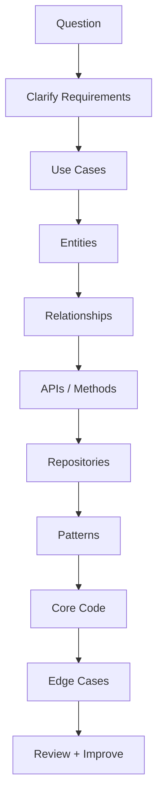

# LLD Practice Roadmap

## Complete notes

This is the practice path for LLD interviews using Go.

The goal is not only to read design patterns. The goal is to solve full problems from requirements to code.

## Start-to-end practice flow

For every LLD question, follow this exact flow:

```text
1. Clarify requirements
2. List actors and use cases
3. Identify entities
4. Define relationships
5. Decide APIs or public methods
6. Define storage/repository interfaces
7. Choose patterns only where useful
8. Write core service code
9. Handle edge cases
10. Explain tradeoffs and extensions
```

## Diagram



## What to produce in practice

For each problem, write:

- problem statement
- functional requirements
- non-functional requirements
- entities
- DB schema if backend problem
- public methods/APIs
- folder structure
- design patterns used
- core implementation
- test cases
- edge cases
- interview explanation

## Practice order

### Level 1: Basics

1. [[Parking Lot LLD in Go]]
2. [[Vending Machine LLD in Go]]
3. [[Library Management LLD in Go]]
4. [[Meeting Room Scheduler LLD in Go]]
5. [[LRU Cache LLD in Go]]

### Level 2: Backend product problems

6. [[Cart Checkout with Coupons LLD in Go]]
7. [[Inventory Order Assignment LLD in Go]]
8. [[Delivery Partner Assignment LLD in Go]]
9. [[Notification System LLD in Go]]
10. [[Rate Limiter LLD in Go]]

### Level 3: Strong interview problems

11. [[Movie Ticket Booking LLD in Go]]
12. [[Splitwise Expense Sharing LLD in Go]]
13. [[Logging System LLD in Go]]
14. [[File Search Unix Find LLD in Go]]
15. [[Food Ordering System LLD in Go]]

## How each solution note is laid out

Every linked note follows the 10 steps above, plus folder structure, test cases, and an Excalidraw drawing:

- Step 8 shows only the main logic. The full runnable code and the tests are in folded blocks (click to open).
- Open the drawing in `Excalidraw/LLD/` and redraw it from memory before reading the steps.
- The short answer for each problem is still in [[LLD Question Bank with Answers]].

## Daily practice method

For each question:

1. Spend 10 minutes on requirements and entities.
2. Spend 10 minutes on APIs/methods and storage.
3. Spend 25-40 minutes coding the core logic.
4. Spend 10 minutes on edge cases.
5. Spend 5 minutes explaining it out loud.

## What interviewer checks

- Can you clarify scope?
- Can you model entities correctly?
- Can you write working code?
- Can you separate service/repository/model?
- Can you handle edge cases?
- Can you use patterns only where useful?
- Can you discuss concurrency and idempotency?

## Quick revision answer

For LLD, I start from requirements and use cases, then design entities, relationships, APIs, repositories, and core services. I apply patterns like Strategy, State, Factory, Observer, and Repository only when they solve real extension or maintainability needs.
