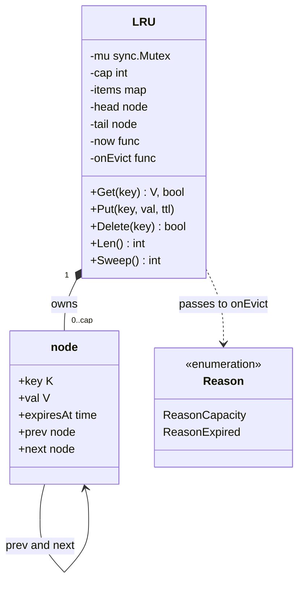
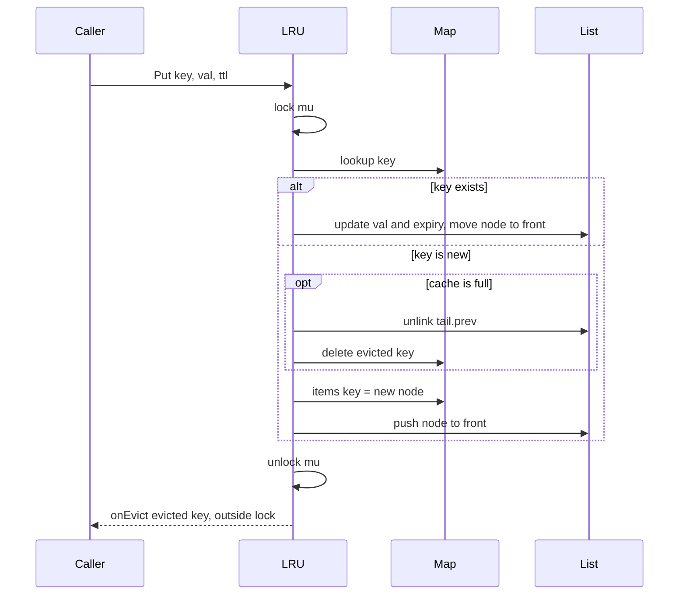

# LRU Cache LLD in Go

## Problem statement

```text
Design an in-memory LRU cache with TTL.
Get(key) returns the value if present and not expired.
Put(key, value, ttl) inserts or updates. When the cache is full, evict the least
recently used entry. Expired entries must never be returned.
Get and Put must be O(1). The cache is used by many goroutines.
```

- It tests data structure choice (hashmap + doubly linked list), pointer handling, generics, and making shared state safe with one mutex.
- The TTL part tests time handling: lazy expiry, an injectable clock for tests, and not breaking O(1).

## How to use this note

- Open the drawing ([[LRU Cache LLD Drawing.excalidraw]]), study it for one minute, then close it and redraw the map + list picture and both flows yourself.
- Attempt each step before reading it. Cover the step, write your answer, then compare.
- Time box it like the roadmap's daily method (60 min): 10 min requirements and entities (Steps 1-4), 10 min API (Steps 5-6, storage is skipped here), 25-40 min core code (Steps 7-8), 10 min edge cases (Step 9), 5 min explaining out loud.

## Step 1: Clarify requirements

### Questions to ask

- Is capacity counted in entries or in bytes? *Assume: entries.*
- Is `Get` on a missing key an error or `(zero, false)`? *Assume: `(zero, false)`, like a Go map.*
- TTL per entry or one global TTL? Does `Get` refresh the TTL? *Assume: per entry, set by `Put`; `Get` refreshes recency only, not TTL. `ttl <= 0` means never expires.*
- Must expired entries be freed at once, or only never returned? *Assume: never returned; removed lazily on `Get`, plus an optional `Sweep()` for memory.*
- Single goroutine or concurrent access? How read-heavy? *Assume: concurrent; one mutex is fine to start.*
- Do we need a callback when something is evicted? *Assume: yes, with a reason (capacity or expired), for metrics or write-back.*
- Per-process, or shared across instances? *Assume: per-process. Shared means Redis.*

### Functional

- `Get(key)` returns the value if present and not expired, and marks the key most recently used.
- `Put(key, val, ttl)` inserts or updates a key (and resets its TTL) and marks it most recently used.
- When full, `Put` of a new key evicts the least recently used key.
- `Delete(key)`, `Len()`, `Sweep()` (remove all expired).
- Optional eviction callback `onEvict(key, val, reason)`.
- Generic over key and value: `LRU[K comparable, V any]`.

### Non-functional

- O(1) `Get` and `Put` (`Sweep` is O(n) and optional).
- Safe for concurrent use.
- Deterministic tests: clock is injected (`now func() time.Time`).
- Eviction callback must not deadlock the cache.

### Out of scope

- Size in bytes, LFU, distributed cache (follow-ups).
- Loading on miss (read-through); mention `singleflight` as a follow-up.

## Step 2: Actors and use cases

| Actor | Use case |
|---|---|
| Caller (any goroutine) | Get a value by key |
| Caller | Put / update a value with a TTL |
| Caller | Delete a key |
| Background ticker (optional) | Sweep expired entries to free memory |
| Owner of the cache | Receive eviction callbacks (metrics, write-back) |

Hardest use case (the one to code): **Put** when the cache is full (evict the tail and insert at the head, all in O(1)), together with **Get** on an expired key.

## Step 3: Entities

| Entity | Key fields | Why it exists |
|---|---|---|
| `LRU[K, V]` | mu, cap, items map, head/tail sentinels, now, onEvict | The cache; owns the map and the list and the one lock |
| `node[K, V]` | key, val, expiresAt, prev, next | One entry; a list node so it can move in O(1) |
| `items map[K]*node` | key -> node pointer | O(1) lookup; points INTO the list |
| head / tail sentinels | empty nodes | Insert and remove never check for nil |
| `Reason` | Capacity, Expired | Tells the callback why the entry left |
| clock `now()` | `func() time.Time` | Tests move time without sleeping |

Modeling insight: **the map and the list hold the same nodes**. The map gives "where is it" in O(1); the list gives "who is oldest" in O(1). The node must store its own `key`, because when you evict `tail.prev` you have only the node and need the key to delete it from the map. TTL is just one more field on the node, `expiresAt`, so TTL adds no extra structure.

## Step 4: Relationships



- **Composition**: `LRU` owns its nodes; a node never exists outside one cache.
- **Self-association**: `node -> node` through `prev`/`next` forms the doubly linked list.
- Order: `head.next` is most recently used, `tail.prev` is least recently used.
- **Dependency**: the callback and clock are plain funcs (single-method interfaces in Go style).

## Step 5: APIs and public methods

No REST: this is a pure in-memory library component, so the API is the Go method set.

```go
func New[K comparable, V any](capacity int, now func() time.Time, onEvict func(K, V, Reason)) (*LRU[K, V], error)
func (c *LRU[K, V]) Get(key K) (V, bool)
func (c *LRU[K, V]) Put(key K, val V, ttl time.Duration) // ttl <= 0 -> no expiry
func (c *LRU[K, V]) Delete(key K) bool
func (c *LRU[K, V]) Len() int   // includes expired entries not yet removed
func (c *LRU[K, V]) Sweep() int // removes all expired, returns count
```

No `context.Context`: these are pure, non-blocking data structure calls.

## Step 6: Storage and repositories

Skipped: pure in-memory data structure, nothing is persisted. If the cache must be shared across instances or survive restarts, use Redis: `SET key val EX 60` for TTL and `maxmemory-policy allkeys-lru` for eviction, instead of a table. No repository interface either; if you add read-through loading later, the loader is a `func(ctx, K) (V, error)` passed in.

## Step 7: Patterns

| Pattern | Where | Why here |
|---|---|---|
| Sentinel nodes (data structure idiom) | `head` and `tail` | Remove all nil checks from list code |
| Callback / [[Observer Pattern in Go]] | `onEvict(key, val, reason)` | Caller learns about evictions (metrics, write-back) without the cache knowing why |
| Injected clock (dependency injection) | `now func() time.Time` | TTL tests run instantly and deterministically |
| [[Decorator Middleware Pattern in Go]] | follow-up: wrap the cache with metrics or loading | Add behaviour without changing the cache |
| [[Strategy Pattern in Go]] | follow-up: swap eviction policy (LRU, LFU, FIFO) | Only if the interviewer asks for multiple policies |
| Mutex guard, see [[Concurrency in Go LLD]] | one `sync.Mutex` over map + list | Map and list must change together |

Patterns NOT used and why:

- **Strategy for eviction** in the base version: there is only one policy; an interface would be YAGNI until a second policy is asked for.
- **Background janitor goroutine** by default: it adds lifecycle (start/stop, leaks in tests). Lazy expiry on `Get` meets "never return expired"; `Sweep()` lets the owner run it on a ticker if memory matters.

## Folder structure

```text
lru/
  lru.go          -> LRU[K, V], node, Reason, ErrInvalidCapacity, New, Get, Put, Delete, Len, Sweep
  list.go         -> pushFront, unlink, removeNode, moveToFront (caller holds mu)
  lru_test.go     -> table-driven steps with a fake clock + concurrency test
cmd/demo/main.go  -> wiring: New[string, []byte](1000, time.Now, logEvict), optional ticker calling Sweep
```

- `lru.go`: public API, locking, TTL checks, callbacks after unlock.
- `list.go`: the four pointer helpers; no locking inside.
- The Step 8 block below merges both files so it compiles standalone.

## Step 8: Core code

Main logic only. Full runnable code is folded below.

```go
type node[K comparable, V any] struct {
    key       K // stored so eviction can delete it from the map
    val       V
    expiresAt time.Time // zero = never expires
    prev      *node[K, V]
    next      *node[K, V]
}
type LRU[K comparable, V any] struct {
    mu      sync.Mutex
    cap     int
    items   map[K]*node[K, V]
    head    *node[K, V] // sentinel: head.next = most recently used
    tail    *node[K, V] // sentinel: tail.prev = least recently used
    now     func() time.Time
    onEvict func(key K, val V, why Reason)
}

func (c *LRU[K, V]) Get(key K) (V, bool) {
    var zero V
    c.mu.Lock()
    n, ok := c.items[key]
    if !ok {
        c.mu.Unlock()
        return zero, false
    }
    if n.expired(c.now()) {
        c.removeNode(n) // lazy expiry
        c.mu.Unlock()
        c.notify([]evicted[K, V]{{n.key, n.val, ReasonExpired}})
        return zero, false
    }
    c.moveToFront(n)
    v := n.val
    c.mu.Unlock()
    return v, true
}

func (c *LRU[K, V]) Put(key K, val V, ttl time.Duration) {
    // ... exp = now + ttl (zero if ttl <= 0), out = evicted entries
    c.mu.Lock()
    if n, ok := c.items[key]; ok {
        n.val, n.expiresAt = val, exp // update resets the TTL; never evicts
        c.moveToFront(n)
        c.mu.Unlock()
        return
    }
    if len(c.items) == c.cap {
        lru := c.tail.prev
        // ... why = ReasonExpired if lru already expired, else ReasonCapacity
        c.removeNode(lru)
        out = append(out, evicted[K, V]{lru.key, lru.val, why})
    }
    n := &node[K, V]{key: key, val: val, expiresAt: exp}
    c.items[key] = n
    c.pushFront(n)
    c.mu.Unlock()
    c.notify(out) // outside the lock so a callback cannot deadlock the cache
}

// ... pushFront, unlink, removeNode (unlink + delete map key), moveToFront: pointer helpers, caller holds c.mu
```

Note: you can use `container/list` instead of the hand-rolled list. It saves ~25 lines, but `list.Element.Value` is `any`, so you lose type safety and need a type assertion. Hand-rolling is what most interviewers want to see.

### Walkthrough

`Put(key, val, ttl)`:

1. Lock the mutex. Map and list must change together, so one lock covers both.
2. Compute `expiresAt = now() + ttl` (zero time if `ttl <= 0`, meaning never).
3. Key exists: update `val` and `expiresAt`, move the node to the front, unlock, return. **No eviction on update.**
4. Key is new and `len(items) == cap`: take `tail.prev` (the LRU node), unlink it and delete its key from the map (`removeNode`). Record the reason: `Expired` if it was already dead, else `Capacity`.
5. Create the new node, add it to the map, push it right after `head`.
6. Unlock, then call `onEvict` outside the lock. A callback that calls `Get`/`Put` cannot deadlock.

`Get(key)`:

1. Lock, map lookup. Missing -> `(zero, false)`.
2. Expired (`now >= expiresAt`)? Remove the node right here (lazy expiry), unlock, fire `onEvict(Expired)`, return a miss.
3. Otherwise `moveToFront` and return the value. It takes a full `Lock`, not `RLock`, because it changes the list order.

`Sweep()` walks from `tail` to `head` once, removes every expired node, and returns the count. It is O(n), so call it from a ticker, not on the hot path.



> [!example]- Full runnable code (click to open)
> ```go
> package lru
>
> import (
>     "errors"
>     "sync"
>     "time"
> )
>
> var ErrInvalidCapacity = errors.New("lru: capacity must be > 0")
>
> // Reason tells the eviction callback why an entry left the cache.
> type Reason int
>
> const (
>     ReasonCapacity Reason = iota // pushed out by a new key (least recently used)
>     ReasonExpired                // TTL passed
> )
>
> // node is one entry in the doubly linked list.
> type node[K comparable, V any] struct {
>     key       K
>     val       V
>     expiresAt time.Time // zero = never expires
>     prev      *node[K, V]
>     next      *node[K, V]
> }
>
> func (n *node[K, V]) expired(now time.Time) bool {
>     return !n.expiresAt.IsZero() && !now.Before(n.expiresAt)
> }
>
> type evicted[K comparable, V any] struct {
>     key    K
>     val    V
>     reason Reason
> }
>
> // LRU is a fixed-capacity cache with per-entry TTL and O(1) Get and Put.
> // head.next is the most recently used; tail.prev is the least recently used.
> type LRU[K comparable, V any] struct {
>     mu      sync.Mutex
>     cap     int
>     items   map[K]*node[K, V]
>     head    *node[K, V] // sentinel
>     tail    *node[K, V] // sentinel
>     now     func() time.Time
>     onEvict func(key K, val V, why Reason)
> }
>
> // New builds a cache. now == nil uses time.Now; tests pass a fake clock.
> func New[K comparable, V any](capacity int, now func() time.Time, onEvict func(K, V, Reason)) (*LRU[K, V], error) {
>     if capacity <= 0 {
>         return nil, ErrInvalidCapacity
>     }
>     if now == nil {
>         now = time.Now
>     }
>     head, tail := &node[K, V]{}, &node[K, V]{}
>     head.next, tail.prev = tail, head
>     return &LRU[K, V]{
>         cap:     capacity,
>         items:   make(map[K]*node[K, V], capacity),
>         head:    head,
>         tail:    tail,
>         now:     now,
>         onEvict: onEvict,
>     }, nil
> }
>
> // Get returns the value if present and not expired, and marks it most recently used.
> // An expired entry is a miss and is removed right here (lazy expiry).
> func (c *LRU[K, V]) Get(key K) (V, bool) {
>     var zero V
>     c.mu.Lock()
>     n, ok := c.items[key]
>     if !ok {
>         c.mu.Unlock()
>         return zero, false
>     }
>     if n.expired(c.now()) {
>         c.removeNode(n)
>         c.mu.Unlock()
>         c.notify([]evicted[K, V]{{n.key, n.val, ReasonExpired}})
>         return zero, false
>     }
>     c.moveToFront(n)
>     v := n.val
>     c.mu.Unlock()
>     return v, true
> }
>
> // Put inserts or updates a key. ttl <= 0 means no expiry.
> // If the cache is full, it evicts the least recently used entry.
> func (c *LRU[K, V]) Put(key K, val V, ttl time.Duration) {
>     var exp time.Time
>     var out []evicted[K, V]
>
>     c.mu.Lock()
>     if ttl > 0 {
>         exp = c.now().Add(ttl)
>     }
>     if n, ok := c.items[key]; ok {
>         n.val, n.expiresAt = val, exp // update resets the TTL; never evicts
>         c.moveToFront(n)
>         c.mu.Unlock()
>         return
>     }
>     if len(c.items) == c.cap {
>         lru := c.tail.prev
>         why := ReasonCapacity
>         if lru.expired(c.now()) {
>             why = ReasonExpired
>         }
>         c.removeNode(lru)
>         out = append(out, evicted[K, V]{lru.key, lru.val, why})
>     }
>     n := &node[K, V]{key: key, val: val, expiresAt: exp}
>     c.items[key] = n
>     c.pushFront(n)
>     c.mu.Unlock()
>
>     c.notify(out) // outside the lock so a callback cannot deadlock the cache
> }
>
> // Delete removes a key. Returns true if it existed (expired or not).
> func (c *LRU[K, V]) Delete(key K) bool {
>     c.mu.Lock()
>     defer c.mu.Unlock()
>     n, ok := c.items[key]
>     if !ok {
>         return false
>     }
>     c.removeNode(n)
>     return true
> }
>
> // Len counts stored entries, including expired ones not yet removed.
> func (c *LRU[K, V]) Len() int {
>     c.mu.Lock()
>     defer c.mu.Unlock()
>     return len(c.items)
> }
>
> // Sweep removes every expired entry and returns how many it removed. O(n).
> // Call it from a background ticker if memory from dead keys matters.
> func (c *LRU[K, V]) Sweep() int {
>     var out []evicted[K, V]
>     c.mu.Lock()
>     now := c.now()
>     for n := c.tail.prev; n != c.head; {
>         prev := n.prev // save before unlink clears it
>         if n.expired(now) {
>             c.removeNode(n)
>             out = append(out, evicted[K, V]{n.key, n.val, ReasonExpired})
>         }
>         n = prev
>     }
>     c.mu.Unlock()
>     c.notify(out)
>     return len(out)
> }
>
> func (c *LRU[K, V]) notify(out []evicted[K, V]) {
>     if c.onEvict == nil {
>         return
>     }
>     for _, e := range out {
>         c.onEvict(e.key, e.val, e.reason)
>     }
> }
>
> // --- list helpers; caller must hold c.mu ---
>
> func (c *LRU[K, V]) pushFront(n *node[K, V]) {
>     n.prev = c.head
>     n.next = c.head.next
>     c.head.next.prev = n
>     c.head.next = n
> }
>
> func (c *LRU[K, V]) unlink(n *node[K, V]) {
>     n.prev.next = n.next
>     n.next.prev = n.prev
>     n.prev, n.next = nil, nil
> }
>
> func (c *LRU[K, V]) removeNode(n *node[K, V]) {
>     c.unlink(n)
>     delete(c.items, n.key) // this is why the node stores its key
> }
>
> func (c *LRU[K, V]) moveToFront(n *node[K, V]) {
>     if c.head.next == n {
>         return
>     }
>     c.unlink(n)
>     c.pushFront(n)
> }
> ```

## Test cases

| Test | Proves |
|---|---|
| `TestLRUAndTTL` (table of steps) | LRU eviction order, update resets TTL and never evicts, entry alive just before expiry, miss exactly at expiry, lazy removal, no-TTL entries survive, delete; callback reasons `[Capacity, Expired]` |
| `TestSweepAndExpiredTailEviction` | Expired entries stay counted until touched; `Sweep` removes only expired; capacity eviction still picks the LRU tail |
| `TestInvalidCapacity` | Capacity 0 and -1 return `ErrInvalidCapacity` |
| `TestCallbackCanReenter` | Callback that calls `Get` does not deadlock (runs outside the lock) |
| `TestConcurrentExactCounts` | 16 goroutines x 250 distinct keys into cap 100: exactly 100 left and exactly 3900 evictions, race-free |

> [!example]- Full test code (click to open)
> ```go
> package lru
>
> import (
>     "fmt"
>     "sync"
>     "sync/atomic"
>     "testing"
>     "time"
> )
>
> // fakeClock lets tests move time forward without sleeping.
> type fakeClock struct{ t time.Time }
>
> func (f *fakeClock) Now() time.Time          { return f.t }
> func (f *fakeClock) Advance(d time.Duration) { f.t = f.t.Add(d) }
>
> type ev struct {
>     key int
>     why Reason
> }
>
> func TestLRUAndTTL(t *testing.T) {
>     clk := &fakeClock{t: time.Unix(0, 0)}
>     var evs []ev
>     c, err := New[int, string](2, clk.Now, func(k int, _ string, why Reason) { evs = append(evs, ev{k, why}) })
>     if err != nil {
>         t.Fatal(err)
>     }
>     type step struct {
>         op      string // put | get | adv | del
>         key     int
>         val     string
>         ttl     time.Duration
>         wantVal string
>         wantOK  bool
>     }
>     steps := []step{
>         {op: "put", key: 1, val: "a"},                         // no TTL
>         {op: "put", key: 2, val: "b", ttl: 10 * time.Second},  // expires at 10s
>         {op: "get", key: 1, wantVal: "a", wantOK: true},       // 1 is now MRU
>         {op: "put", key: 3, val: "c"},                         // full: evicts 2 (LRU)
>         {op: "get", key: 2, wantOK: false},                    // evicted
>         {op: "put", key: 3, val: "c2", ttl: 5 * time.Second},  // update resets TTL, no eviction
>         {op: "adv", ttl: 4 * time.Second},                     // t=4s
>         {op: "get", key: 3, wantVal: "c2", wantOK: true},      // still alive
>         {op: "adv", ttl: 1 * time.Second},                     // t=5s, exactly at expiry
>         {op: "get", key: 3, wantOK: false},                    // expired -> miss, lazily removed
>         {op: "get", key: 1, wantVal: "a", wantOK: true},       // no TTL survives
>         {op: "del", key: 1, wantOK: true},
>         {op: "del", key: 1, wantOK: false},
>     }
>     for i, s := range steps {
>         switch s.op {
>         case "put":
>             c.Put(s.key, s.val, s.ttl)
>         case "adv":
>             clk.Advance(s.ttl)
>         case "get":
>             v, ok := c.Get(s.key)
>             if ok != s.wantOK || v != s.wantVal {
>                 t.Fatalf("step %d get %d = %q,%v want %q,%v", i, s.key, v, ok, s.wantVal, s.wantOK)
>             }
>         case "del":
>             if ok := c.Delete(s.key); ok != s.wantOK {
>                 t.Fatalf("step %d delete %d = %v", i, s.key, ok)
>             }
>         }
>     }
>     want := []ev{{2, ReasonCapacity}, {3, ReasonExpired}}
>     if fmt.Sprint(evs) != fmt.Sprint(want) {
>         t.Fatalf("evictions %v want %v", evs, want)
>     }
>     if c.Len() != 0 {
>         t.Fatal(c.Len())
>     }
> }
>
> func TestSweepAndExpiredTailEviction(t *testing.T) {
>     clk := &fakeClock{t: time.Unix(0, 0)}
>     var reasons []Reason
>     c, _ := New[string, int](3, clk.Now, func(_ string, _ int, why Reason) { reasons = append(reasons, why) })
>     c.Put("short", 1, time.Second)
>     c.Put("long", 2, time.Hour)
>     c.Put("forever", 3, 0)
>     clk.Advance(2 * time.Second)
>     if c.Len() != 3 {
>         t.Fatal("expired entries stay until touched or swept")
>     }
>     if n := c.Sweep(); n != 1 || c.Len() != 2 {
>         t.Fatalf("sweep removed %d, len %d", n, c.Len())
>     }
>     if _, ok := c.Get("long"); !ok {
>         t.Fatal("long should be alive")
>     }
>     // Make "forever" the LRU... it has no TTL, so evicted for capacity.
>     c.Put("x", 9, time.Second)
>     c.Put("y", 9, 0) // full: tail is "forever"
>     if _, ok := c.Get("forever"); ok {
>         t.Fatal("forever should be evicted as LRU")
>     }
>     if fmt.Sprint(reasons) != fmt.Sprint([]Reason{ReasonExpired, ReasonCapacity}) {
>         t.Fatal(reasons)
>     }
> }
>
> func TestInvalidCapacity(t *testing.T) {
>     for _, n := range []int{0, -1} {
>         if _, err := New[int, int](n, nil, nil); err != ErrInvalidCapacity {
>             t.Fatalf("cap %d: %v", n, err)
>         }
>     }
> }
>
> func TestCallbackCanReenter(t *testing.T) {
>     var c *LRU[int, int]
>     c, _ = New[int, int](1, nil, func(k, _ int, _ Reason) { c.Get(k) }) // would deadlock if called under lock
>     c.Put(1, 1, 0)
>     c.Put(2, 2, 0)
> }
>
> func TestConcurrentExactCounts(t *testing.T) {
>     var evictions atomic.Int64
>     c, _ := New[int, int](100, nil, func(int, int, Reason) { evictions.Add(1) })
>     var wg sync.WaitGroup
>     for g := 0; g < 16; g++ {
>         wg.Add(1)
>         go func(g int) {
>             defer wg.Done()
>             for i := 0; i < 250; i++ {
>                 k := g*250 + i // 4000 distinct keys
>                 c.Put(k, k, time.Hour)
>                 c.Get(k)
>             }
>         }(g)
>     }
>     wg.Wait()
>     if c.Len() != 100 || evictions.Load() != 3900 {
>         t.Fatalf("len=%d evictions=%d", c.Len(), evictions.Load())
>     }
> }
> ```

## Step 9: Edge cases

| Edge case | What happens | How the design handles it |
|---|---|---|
| Two goroutines `Put` at the same time (race) | Both see `len == cap` and corrupt `prev/next` pointers | One `sync.Mutex` around map + list; `go test -race` proves it |
| `Get` with `RWMutex.RLock` | `Get` moves the node, so it writes | Use a full `Lock`; RWMutex does not help much |
| Expired key read | Must not be returned | `Get` checks `now >= expiresAt`, removes it, returns a miss |
| Exactly at expiry time | Ambiguous | Expired when `now >= expiresAt` (test checks the boundary) |
| Expired keys never read again | Memory held by dead entries | `Sweep()` on a ticker; or they fall off the tail as LRU |
| Update an existing key | Must not evict anything | Update in place + move to front; TTL is reset |
| Capacity `<= 0` | Cache that evicts everything | `ErrInvalidCapacity` from `New` |
| Capacity 1 | Every new key evicts the old one | Works: tail.prev is the only node |
| Eviction callback calls the cache | Deadlock if called under the lock | Collect evictions, call after unlock |
| Clock jumps backwards (wall clock) | Entries live longer | `time.Now()` carries a monotonic reading, so `Before` is safe; fake clock only in tests |
| Copying the struct | Copies the mutex | Always use `*LRU` |
| Retry / idempotency | `Put` of the same key twice | Naturally idempotent: second Put just updates |

### Common mistakes

- Using only a map (no order) or only a list (O(n) lookup).
- Using a slice for order: move-to-front becomes O(n).
- Forgetting to store the key in the node, so you cannot delete the evicted key from the map.
- Forgetting to update order on `Get`.
- Evicting on update of an existing key.
- Using `RLock` in `Get` while moving the node.
- Calling the eviction callback while holding the lock.
- No sentinels, leading to bugs on empty list or single node.
- Calling `time.Now()` directly, so TTL tests need `time.Sleep` and become flaky.

## Step 10: Tradeoffs and extensions

| Follow-up | Design change |
|---|---|
| Proactive expiry without O(n) sweep | Add a min-heap ordered by `expiresAt` (heap index stored in node); pop expired in O(log n). Or a timing wheel |
| Background janitor | `go func() { t := time.NewTicker(d); for { select { case <-ctx.Done(): return; case <-t.C: c.Sweep() } } }()` |
| LFU instead of LRU | Map `key -> node` plus map `freq -> list`, track `minFreq`. Evict from the `minFreq` list. Still O(1) |
| Multiple eviction policies | `EvictionPolicy` interface (Strategy): `OnAccess(n)`, `OnInsert(n)`, `Victim() *node` |
| High contention | Shard: N independent LRUs, pick shard by `hash(key) % N`, each with its own lock. LRU becomes approximate across shards |
| Capacity in bytes | Track `usedBytes`, evict in a loop until the new item fits |
| Avoid thundering herd on miss | `singleflight.Group` around the loader so one goroutine fills the key |
| Read-through / write-back | Decorator with a loader func; `onEvict` writes dirty entries back |
| Distributed cache | Redis with TTL + `allkeys-lru`, or consistent hashing over many cache nodes |

### Tradeoffs I chose

- **Lazy expiry vs active expiry**: lazy keeps `Get`/`Put` O(1) and needs no goroutine; the cost is memory held by dead keys until `Sweep` or eviction. Redis does both (lazy + sampled active).
- **Evict the LRU tail even if a middle entry is expired**: keeps eviction O(1). Finding "any expired entry first" would need a heap.
- **One mutex vs sharding**: one mutex is simple and correct; shard only when profiling shows contention.
- **Hand-rolled list vs `container/list`**: type-safe with generics and shows pointer skill; `container/list` is shorter but uses `any`.
- **Callback outside the lock**: no deadlocks, but the callback may run after another goroutine has already re-inserted the key.

## Drawing

![[LRU Cache LLD Drawing.excalidraw]]

What the drawing shows:

- Section 1: `LRU[K, V]` owns `node[K, V]`; the clock and `onEvict` funcs it depends on.
- Section 2: the map pointing into the doubly linked list, with head/tail sentinels, MRU at head.next, LRU (and an expired node) at tail.prev.
- Section 3: Get flow: lookup -> expired? -> move to front, with red miss and expired branches.
- Section 4: Put flow: exists? -> update; full? -> evict tail.prev -> push front, callback after unlock.

Redraw it from memory:

- [ ] Map arrows pointing into list nodes; head and tail sentinels; prev/next both ways
- [ ] Which end is MRU and which end is evicted
- [ ] node fields: key, val, expiresAt, prev, next (and why key is stored)
- [ ] Get with the expired branch, Put with update and evict branches
- [ ] Where the lock is taken and where the callback runs

## Interview explanation

```text
I combine a hashmap from key to node with a doubly linked list ordered by recency, using sentinel head and tail nodes, so Get and Put are both O(1). Get looks up the node, and if its expiresAt has passed it removes it and returns a miss, otherwise it moves the node to the front. Put updates in place and resets the TTL, or if the cache is full it unlinks tail.prev and deletes its key from the map before pushing the new node to the front. One mutex guards the map and list together because even Get changes the order, and the eviction callback runs outside the lock to avoid deadlocks. The clock is injected so TTL tests do not sleep, expired entries are removed lazily with an optional Sweep on a ticker, and to scale I would shard by key hash or use a heap for active expiry.
```

## Related

- [[LLD Practice Roadmap]]
- [[LLD Question Bank with Answers]]
- [[Observer Pattern in Go]]
- [[Decorator Middleware Pattern in Go]]
- [[Strategy Pattern in Go]]
- [[Concurrency in Go LLD]]
- [[Testing LLD Code in Go]]
- [[UML for LLD Interviews]]
- [[Error Handling and Interfaces in Go LLD]]
