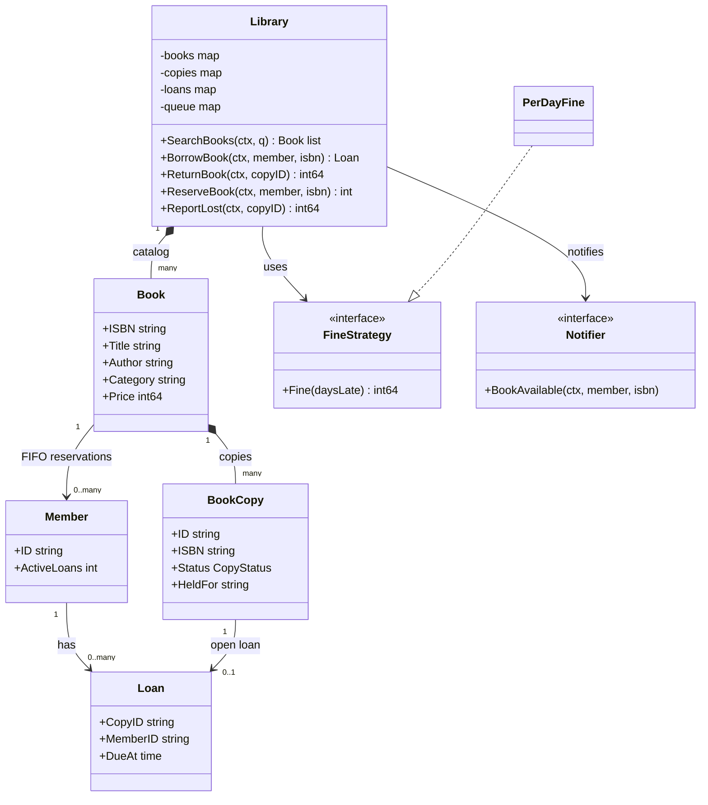
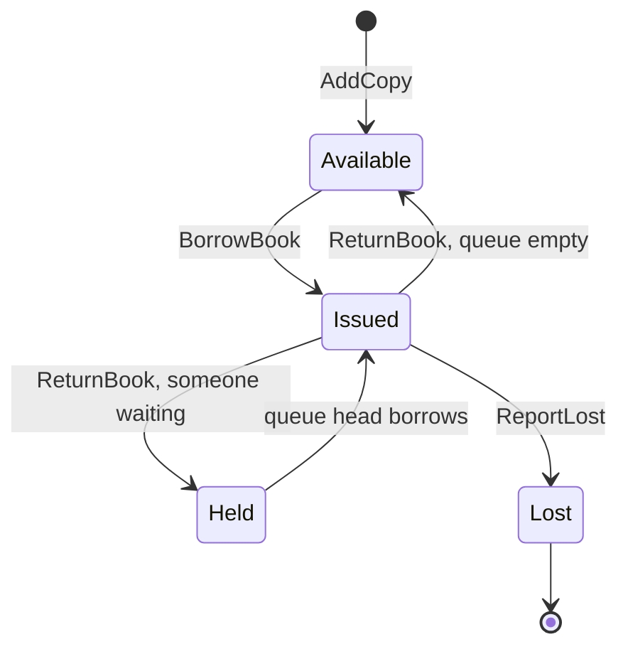
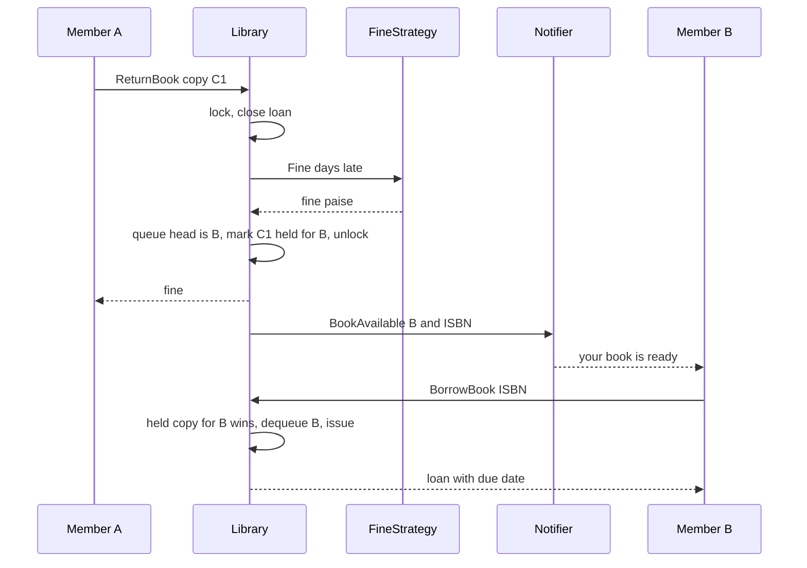

# Library Management LLD in Go

## Problem statement

```text
Design a library system where members can search books, borrow copies, return copies,
and track due dates and fines. Support reservations when all copies are out,
and handle a member losing a copy.
```

- Tests modeling: **Book (catalog title) vs BookCopy (physical item)**, with a copy lifecycle available / issued / held / lost.
- Tests rules under concurrency: borrow limit, the last copy going to exactly one member, a held copy reserved for the queue head, and a pluggable fine policy.

## How to use this note

- Open the drawing in [[#Drawing]] once, then close it and redraw it yourself before reading further.
- Attempt each step yourself first (2-3 minutes), then read the step and compare.
- Time box like the real round: 10 min requirements + entities (Steps 1-4), 10 min APIs + storage (Steps 5-6), 25-40 min core code (Steps 7-8), 10 min edge cases (Step 9), 5 min explaining it out loud.

## Step 1: Clarify requirements

### Questions to ask

- Can a title have many physical copies? *Assume: yes, borrowing is always of a copy.*
- Loan period and max books per member? *Assume: 14 days, max 2-3 active loans, same for all members.*
- Fine rule? *Assume: per full day late, capped, in paise; swappable.*
- What does search cover? *Assume: case-insensitive substring on title, author, category; no ranking.*
- What if all copies are out? *Assume: member reserves; FIFO queue per book; returned copy is held for the queue head who is notified.*
- What if a member loses a copy? *Assume: loan closes, member pays late fine + book price, copy is marked lost and never lent again.*
- Notifications sync or async? *Assume: a `Notifier` interface called outside the lock; async/outbox in production.*

### Functional

- Add books (ISBN, title, author, category, price) and physical copies (copy ID / barcode).
- SearchBooks by title, author or category.
- BorrowBook: issue one copy, due date = now + loan days.
- ReturnBook: close loan, compute late fine, hand copy to the next reserver or the shelf.
- ReserveBook: join the FIFO queue only when no copy is on the shelf.
- ReportLost: close loan, charge fine + price, copy becomes lost.

### Non-functional

- Two members borrowing the last copy at once: exactly one wins.
- Borrow limit holds under concurrent borrows by the same member.
- A copy held for a reserver cannot be taken by anyone else.
- Notifier never called while holding the lock.
- Money as `int64` paise, injected clock for due dates and fines.

### Out of scope

- Payments for fines, member registration/auth, multiple branches.
- Full-text search ranking (Elasticsearch) and recommendations.
- Renewals (listed as a follow-up).

## Step 2: Actors and use cases

| Actor | Use case |
|---|---|
| Member | Search books, borrow, return, reserve, report lost |
| Librarian | Add books and copies, mark a copy lost, collect fines |
| Notifier (system) | Tell the queue head their copy is held |
| Scheduler (follow-up) | Due-date reminders, expire uncollected holds |

Hardest use case: **BorrowBook** (limit check, held-copy priority, last copy race) together with **ReturnBook** handing the copy to the queue. Code those first.

## Step 3: Entities

| Entity | Key fields | Why it exists |
|---|---|---|
| `Book` | ISBN, Title, Author, Category, Price | Catalog entry; what you search and reserve |
| `BookCopy` | ID, ISBN, Status, HeldFor | Physical item; what you lend, hold or lose |
| `CopyStatus` | Available, Issued, Held, Lost | Copy lifecycle; Lost is terminal |
| Member | ID, active loan count | Borrow limit is per member |
| `Loan` | CopyID, ISBN, MemberID, IssuedAt, DueAt | One borrowing of one copy; source of due date and fine |
| Fine | `int64` paise returned by Return/ReportLost | Computed by `FineStrategy`, stored on the loan row |
| Reservation | queue of member IDs per ISBN | FIFO fairness when all copies are out |
| `FineStrategy` | `Fine(daysLate)` | Fine rule changes independently |
| `Notifier` | `BookAvailable(member, isbn)` | Observer for "your book is ready" |

Modeling insight: **separate Book from BookCopy.** You search and reserve a Book, but you borrow, return, hold and lose a BookCopy. A count field on Book cannot represent "copy C1 is held for Asha" or "copy C2 is lost".

## Step 4: Relationships





- **Composition** Book to BookCopy: a copy is meaningless without its title.
- **Association** Member to Loan and BookCopy to Loan: a loan links one member to one copy; a copy has at most one open loan.
- **Association with order** Book to Member for reservations: FIFO queue per ISBN.
- **Dependency on interfaces** Library to FineStrategy and Notifier: injected.

## Step 5: APIs and public methods

```text
GET    /books?q=kleppmann                     -> 200 [{isbn, title, author, category, available}]
POST   /books                                 -> 201 {isbn}
POST   /books/{isbn}/copies                   -> 201 {copyId}
POST   /loans               body: {memberId, isbn}   -> 201 {copyId, dueAt} | 409 no copy | 409 limit
POST   /loans/{copyId}/return                 -> 200 {finePaise}  | 409 not on loan
POST   /loans/{copyId}/lost                   -> 200 {chargePaise}
POST   /books/{isbn}/reservations body: {memberId} -> 201 {position} | 409 copies available
DELETE /books/{isbn}/reservations/{memberId}  -> 204
```

```go
type LibraryService interface {
    SearchBooks(ctx context.Context, query string) ([]Book, error)
    BorrowBook(ctx context.Context, memberID, isbn string) (Loan, error)
    ReturnBook(ctx context.Context, copyID string) (int64, error)  // fine in paise
    ReserveBook(ctx context.Context, memberID, isbn string) (int, error)
    ReportLost(ctx context.Context, copyID string) (int64, error) // fine + price
}
```

## Step 6: Storage and repositories

```sql
CREATE TABLE books (
    isbn        TEXT PRIMARY KEY,
    title       TEXT   NOT NULL,
    author      TEXT   NOT NULL,
    category    TEXT   NOT NULL,
    price_paise BIGINT NOT NULL
);
CREATE INDEX idx_books_title  ON books (lower(title));
CREATE INDEX idx_books_author ON books (lower(author));

CREATE TABLE members (
    id        TEXT PRIMARY KEY,
    name      TEXT NOT NULL,
    max_loans INT  NOT NULL DEFAULT 3
);

CREATE TABLE book_copies (
    id       TEXT PRIMARY KEY,
    isbn     TEXT NOT NULL REFERENCES books(isbn),
    status   TEXT NOT NULL DEFAULT 'available'
             CHECK (status IN ('available', 'issued', 'held', 'lost')),
    held_for TEXT REFERENCES members(id)
);
CREATE INDEX idx_copies_free ON book_copies (isbn) WHERE status = 'available';

CREATE TABLE loans (
    id          BIGSERIAL PRIMARY KEY,
    copy_id     TEXT NOT NULL REFERENCES book_copies(id),
    member_id   TEXT NOT NULL REFERENCES members(id),
    issued_at   TIMESTAMPTZ NOT NULL,
    due_at      TIMESTAMPTZ NOT NULL,
    returned_at TIMESTAMPTZ,
    lost        BOOLEAN NOT NULL DEFAULT false,
    fine_paise  BIGINT  NOT NULL DEFAULT 0
);
-- a copy can have only one open loan
CREATE UNIQUE INDEX uq_open_loan ON loans (copy_id) WHERE returned_at IS NULL;

CREATE TABLE reservations (
    id        BIGSERIAL PRIMARY KEY,                 -- FIFO order
    isbn      TEXT NOT NULL REFERENCES books(isbn),
    member_id TEXT NOT NULL REFERENCES members(id),
    status    TEXT NOT NULL DEFAULT 'waiting'        -- waiting | notified | fulfilled | cancelled
);
-- one active reservation per member per book
CREATE UNIQUE INDEX uq_active_reservation ON reservations (isbn, member_id)
    WHERE status IN ('waiting', 'notified');

-- borrow the last copy safely: claim one available row, skip rows others lock
UPDATE book_copies SET status = 'issued'
WHERE id = (SELECT id FROM book_copies
            WHERE isbn = $1 AND status = 'available'
            LIMIT 1 FOR UPDATE SKIP LOCKED)
RETURNING id;

-- close exactly once (duplicate return updates 0 rows)
UPDATE loans SET returned_at = $2, fine_paise = $3
WHERE copy_id = $1 AND returned_at IS NULL;
```

```go
type BookRepo interface {
    Search(ctx context.Context, query string) ([]Book, error)
    Get(ctx context.Context, isbn string) (Book, error)
}

type CopyRepo interface {
    ClaimAvailable(ctx context.Context, isbn string) (BookCopy, error) // SKIP LOCKED claim
    SetStatus(ctx context.Context, copyID string, s CopyStatus, heldFor string) error
}

type LoanRepo interface {
    Create(ctx context.Context, l Loan) error // uq_open_loan protects the copy
    GetOpen(ctx context.Context, copyID string) (Loan, error)
    Close(ctx context.Context, copyID string, fine int64, lost bool) error
    CountOpen(ctx context.Context, memberID string) (int, error)
}

type ReservationRepo interface {
    Enqueue(ctx context.Context, isbn, memberID string) (int, error)
    Head(ctx context.Context, isbn string) (string, bool, error)
    Remove(ctx context.Context, isbn, memberID string) error
}
```

## Step 7: Patterns

| Pattern | Where | Why here |
|---|---|---|
| [[Strategy Pattern in Go]] | `FineStrategy` (`PerDayFine` with cap; slab or tier-based later) | Fine rules change by policy, not by code in Return |
| [[Observer Pattern in Go]] | `Notifier.BookAvailable` on return when someone waits | Decouple lending from email/SMS |
| [[State Pattern in Go]] | `CopyStatus` available / issued / held / lost | Explicit lifecycle; Lost is terminal (enum is enough, see below) |
| [[Repository Pattern in Go]] | `BookRepo`, `CopyRepo`, `LoanRepo`, `ReservationRepo` | Swap maps for Postgres without touching rules |
| [[Facade Pattern in Go]] | `Library` | One entry point; hides queue, fine and copy selection |

Patterns NOT used and why:

- State as an enum, not State-pattern objects: copy states have no different behavior per action beyond a few checks, so full State types would be ceremony (KISS).
- No Chain of Responsibility for borrow validation: two rules (limit, availability); add a chain when unpaid-fine and membership-tier checks arrive (YAGNI).

## Folder structure

```text
library/
  model.go        -> Book, BookCopy, CopyStatus, Loan, Err* errors
  fine.go         -> FineStrategy + PerDayFine
  notifier.go     -> Notifier interface
  repository.go   -> BookRepo, CopyRepo, LoanRepo, ReservationRepo (DB version)
  service.go      -> Library: AddBook, AddCopy, SearchBooks, BorrowBook, ReturnBook, ReportLost, ReserveBook, helpers
  service_test.go -> table-driven search/borrow/return/lost tests, reservation queue, concurrent last copy
cmd/demo/main.go  -> builds Library with PerDayFine, an email Notifier and time.Now
```

- `model.go`: data and errors only.
- `fine.go`: the fine Strategy and its default.
- `notifier.go`: the Observer seam.
- `repository.go`: storage interfaces; the interview code keeps maps in `Library`.
- `service.go`: the `sync.RWMutex` and every use case.
- `cmd/demo/main.go`: wiring only.

## Step 8: Core code

Main logic only. Full runnable code is folded below.

```go
// CopyStatus: Available, Issued, Held (for queue head), Lost.
// BookCopy{ID, ISBN, Status, HeldFor}
type FineStrategy interface{ Fine(daysLate int) int64 }
type Notifier interface{ BookAvailable(ctx context.Context, memberID, isbn string) }

type Library struct {
    mu       sync.RWMutex
    copies   map[string][]*BookCopy // isbn -> copies
    loans    map[string]*Loan       // copyID -> open loan
    active   map[string]int         // memberID -> open loans
    queue    map[string][]string    // isbn -> FIFO member IDs
    // ... books, copyByID, maxLoans, loanDays, fine, notifier, now
}

// BorrowBook: check and issue under one lock, so the last copy is never issued twice.
func (l *Library) BorrowBook(ctx context.Context, memberID, isbn string) (Loan, error) {
    l.mu.Lock() // ... after ctx.Err() check
    defer l.mu.Unlock()
    copies, ok := l.copies[isbn] // ... !ok -> ErrBookNotFound
    // ... active[memberID] >= maxLoans -> ErrLimitReached
    var pick *BookCopy // a copy Held for this member wins, else first Available
    for _, c := range copies {
        if c.Status == Held && c.HeldFor == memberID {
            pick = c
            break
        }
        if c.Status == Available && pick == nil {
            pick = c
        }
    }
    if pick == nil {
        return Loan{}, ErrNoCopyAvailable // client may ReserveBook
    }
    l.dequeue(isbn, memberID)
    pick.Status, pick.HeldFor = Issued, ""
    // ... build loan with DueAt = now + loanDays
    l.loans[pick.ID] = loan
    l.active[memberID]++
    return *loan, nil
}

// ReturnBook closes the loan, returns the fine, hands the copy to the queue head.
func (l *Library) ReturnBook(ctx context.Context, copyID string) (int64, error) {
    l.mu.Lock()
    c, loan, err := l.openLoan(copyID) // ErrCopyNotFound / ErrNotIssued
    // ... on err: unlock and return
    fine := l.closeLoan(loan) // FineStrategy on full days late
    next := ""
    if q := l.queue[c.ISBN]; len(q) > 0 {
        next = q[0]
        c.Status, c.HeldFor = Held, next
    } else {
        c.Status = Available
    }
    l.mu.Unlock()
    if next != "" && l.notifier != nil {
        l.notifier.BookAvailable(ctx, next, c.ISBN) // never call out under the lock
    }
    return fine, nil
}
```



### Walkthrough

`BorrowBook(ctx, memberID, isbn)`:

1. Return early on a cancelled context, then lock. Everything after is one atomic check-then-act.
2. Book must exist (`ErrBookNotFound`); member must be under `maxLoans` (`ErrLimitReached`).
3. Scan copies: a copy `Held` for this member wins; otherwise the first `Available`. Copies held for someone else, issued or lost are skipped.
4. Nothing found: `ErrNoCopyAvailable` (client can then call `ReserveBook`).
5. Remove the member from the queue if present, mark the copy `Issued`, create the loan with `DueAt = now + loanDays`, bump the active count.

`ReturnBook(ctx, copyID)`:

1. Lock, `openLoan` finds the copy (`ErrCopyNotFound`) and its open loan (`ErrNotIssued` covers duplicate return and lost copies).
2. `closeLoan` computes full days late and the fine through `FineStrategy`, deletes the loan, decrements the member count.
3. Queue non-empty: mark copy `Held` for the head. Else `Available`.
4. Unlock, then call the `Notifier`. Slow I/O never blocks other borrowers.

`ReportLost(ctx, copyID)`: same `openLoan` + `closeLoan`, then charge `fine + Book.Price` and set the copy `Lost`. Lost copies are never picked by Borrow, so the queue keeps waiting for other copies.

`SearchBooks(ctx, query)`: read lock, case-insensitive substring match on title, author or category, sorted by title; empty query is `ErrEmptyQuery`.

> [!example]- Full runnable code (click to open)
> ```go
> package library
>
> import (
>     "context"
>     "errors"
>     "sort"
>     "strings"
>     "sync"
>     "time"
> )
>
> var (
>     ErrBookNotFound    = errors.New("book not found")
>     ErrCopyNotFound    = errors.New("copy not found")
>     ErrNotIssued       = errors.New("copy is not on loan")
>     ErrNoCopyAvailable = errors.New("no copy available")
>     ErrLimitReached    = errors.New("borrow limit reached")
>     ErrCopiesAvailable = errors.New("copies available, borrow instead")
>     ErrAlreadyReserved = errors.New("already reserved")
>     ErrEmptyQuery      = errors.New("empty search query")
> )
>
> type CopyStatus int
>
> const (
>     Available CopyStatus = iota
>     Issued
>     Held // kept aside for the member at the head of the queue
>     Lost // terminal: never goes back on the shelf
> )
>
> // Book is the catalog entry (one per ISBN).
> type Book struct {
>     ISBN     string
>     Title    string
>     Author   string
>     Category string
>     Price    int64 // paise, charged when a copy is lost
> }
>
> // BookCopy is the physical item that is actually lent.
> type BookCopy struct {
>     ID      string
>     ISBN    string
>     Status  CopyStatus
>     HeldFor string
> }
>
> type Loan struct {
>     CopyID   string
>     ISBN     string
>     MemberID string
>     IssuedAt time.Time
>     DueAt    time.Time
> }
>
> // FineStrategy turns full days late into a fine in paise.
> type FineStrategy interface {
>     Fine(daysLate int) int64
> }
>
> type PerDayFine struct {
>     PerDay int64
>     Cap    int64 // 0 = no cap
> }
>
> func (f PerDayFine) Fine(daysLate int) int64 {
>     if daysLate <= 0 {
>         return 0
>     }
>     fine := int64(daysLate) * f.PerDay
>     if f.Cap > 0 && fine > f.Cap {
>         return f.Cap
>     }
>     return fine
> }
>
> // Notifier is told when a held copy is ready (Observer).
> type Notifier interface {
>     BookAvailable(ctx context.Context, memberID, isbn string)
> }
>
> type Library struct {
>     mu       sync.RWMutex
>     books    map[string]*Book       // isbn -> book
>     copies   map[string][]*BookCopy // isbn -> copies
>     copyByID map[string]*BookCopy
>     loans    map[string]*Loan    // copyID -> open loan
>     active   map[string]int      // memberID -> open loans
>     queue    map[string][]string // isbn -> FIFO member IDs
>     maxLoans int
>     loanDays int
>     fine     FineStrategy
>     notifier Notifier
>     now      func() time.Time
> }
>
> func NewLibrary(maxLoans, loanDays int, fine FineStrategy, n Notifier, now func() time.Time) *Library {
>     return &Library{
>         books: map[string]*Book{}, copies: map[string][]*BookCopy{},
>         copyByID: map[string]*BookCopy{}, loans: map[string]*Loan{},
>         active: map[string]int{}, queue: map[string][]string{},
>         maxLoans: maxLoans, loanDays: loanDays, fine: fine, notifier: n, now: now,
>     }
> }
>
> func (l *Library) AddBook(b Book) {
>     l.mu.Lock()
>     defer l.mu.Unlock()
>     l.books[b.ISBN] = &b
> }
>
> func (l *Library) AddCopy(isbn, copyID string) error {
>     l.mu.Lock()
>     defer l.mu.Unlock()
>     if _, ok := l.books[isbn]; !ok {
>         return ErrBookNotFound
>     }
>     c := &BookCopy{ID: copyID, ISBN: isbn}
>     l.copies[isbn] = append(l.copies[isbn], c)
>     l.copyByID[copyID] = c
>     return nil
> }
>
> // SearchBooks matches title, author or category, case-insensitive, sorted by title.
> func (l *Library) SearchBooks(ctx context.Context, query string) ([]Book, error) {
>     q := strings.ToLower(strings.TrimSpace(query))
>     if q == "" {
>         return nil, ErrEmptyQuery
>     }
>     l.mu.RLock()
>     defer l.mu.RUnlock()
>     var out []Book
>     for _, b := range l.books {
>         if strings.Contains(strings.ToLower(b.Title), q) ||
>             strings.Contains(strings.ToLower(b.Author), q) ||
>             strings.Contains(strings.ToLower(b.Category), q) {
>             out = append(out, *b)
>         }
>     }
>     sort.Slice(out, func(i, j int) bool { return out[i].Title < out[j].Title })
>     return out, nil
> }
>
> // BorrowBook issues one copy. Check and issue happen under one lock, so the
> // last copy can never be issued twice.
> func (l *Library) BorrowBook(ctx context.Context, memberID, isbn string) (Loan, error) {
>     if err := ctx.Err(); err != nil {
>         return Loan{}, err
>     }
>     l.mu.Lock()
>     defer l.mu.Unlock()
>
>     copies, ok := l.copies[isbn]
>     if !ok {
>         return Loan{}, ErrBookNotFound
>     }
>     if l.active[memberID] >= l.maxLoans {
>         return Loan{}, ErrLimitReached
>     }
>     var pick *BookCopy
>     for _, c := range copies {
>         if c.Status == Held && c.HeldFor == memberID {
>             pick = c // the copy held for this member wins
>             break
>         }
>         if c.Status == Available && pick == nil {
>             pick = c
>         }
>     }
>     if pick == nil {
>         return Loan{}, ErrNoCopyAvailable
>     }
>     l.dequeue(isbn, memberID)
>     pick.Status, pick.HeldFor = Issued, ""
>     now := l.now()
>     loan := &Loan{CopyID: pick.ID, ISBN: isbn, MemberID: memberID,
>         IssuedAt: now, DueAt: now.AddDate(0, 0, l.loanDays)}
>     l.loans[pick.ID] = loan
>     l.active[memberID]++
>     return *loan, nil
> }
>
> // ReturnBook closes the loan, returns the fine, and hands the copy to the
> // next member in the queue.
> func (l *Library) ReturnBook(ctx context.Context, copyID string) (int64, error) {
>     l.mu.Lock()
>     c, loan, err := l.openLoan(copyID)
>     if err != nil {
>         l.mu.Unlock()
>         return 0, err
>     }
>     fine := l.closeLoan(loan)
>     next := ""
>     if q := l.queue[c.ISBN]; len(q) > 0 {
>         next = q[0]
>         c.Status, c.HeldFor = Held, next
>     } else {
>         c.Status = Available
>     }
>     l.mu.Unlock()
>
>     if next != "" && l.notifier != nil {
>         l.notifier.BookAvailable(ctx, next, c.ISBN) // never call out under the lock
>     }
>     return fine, nil
> }
>
> // ReportLost closes the loan and charges late fine + book price.
> // The copy moves to Lost and never returns to the shelf.
> func (l *Library) ReportLost(ctx context.Context, copyID string) (int64, error) {
>     l.mu.Lock()
>     defer l.mu.Unlock()
>     c, loan, err := l.openLoan(copyID)
>     if err != nil {
>         return 0, err
>     }
>     charge := l.closeLoan(loan) + l.books[c.ISBN].Price
>     c.Status = Lost
>     return charge, nil
> }
>
> // ReserveBook joins the FIFO queue. Only allowed when nothing is on the shelf.
> func (l *Library) ReserveBook(ctx context.Context, memberID, isbn string) (int, error) {
>     l.mu.Lock()
>     defer l.mu.Unlock()
>     copies, ok := l.copies[isbn]
>     if !ok {
>         return 0, ErrBookNotFound
>     }
>     for _, c := range copies {
>         if c.Status == Available {
>             return 0, ErrCopiesAvailable
>         }
>     }
>     for _, m := range l.queue[isbn] {
>         if m == memberID {
>             return 0, ErrAlreadyReserved
>         }
>     }
>     l.queue[isbn] = append(l.queue[isbn], memberID)
>     return len(l.queue[isbn]), nil
> }
>
> // --- helpers, called with l.mu held ---
>
> func (l *Library) openLoan(copyID string) (*BookCopy, *Loan, error) {
>     c, ok := l.copyByID[copyID]
>     if !ok {
>         return nil, nil, ErrCopyNotFound
>     }
>     loan, ok := l.loans[copyID]
>     if !ok {
>         return nil, nil, ErrNotIssued // duplicate return or lost copy
>     }
>     return c, loan, nil
> }
>
> func (l *Library) closeLoan(loan *Loan) int64 {
>     daysLate := int(l.now().Sub(loan.DueAt) / (24 * time.Hour))
>     delete(l.loans, loan.CopyID)
>     l.active[loan.MemberID]--
>     return l.fine.Fine(daysLate)
> }
>
> func (l *Library) dequeue(isbn, memberID string) {
>     q := l.queue[isbn]
>     for i, m := range q {
>         if m == memberID {
>             l.queue[isbn] = append(q[:i:i], q[i+1:]...)
>             return
>         }
>     }
> }
> ```

## Test cases

| Test | Proves |
|---|---|
| `TestSearchBooks` | Match by title, author, category, case-insensitive, sorted, no match, empty query error |
| `TestBorrowBook` | Due date, unknown book, last copy taken, second copy free, borrow limit |
| `TestReturnAndLost` | On-time zero fine, late fine, cap, unknown copy, never issued, lost = price (+ late fine), duplicate return rejected, lost copy never lent again |
| `TestReservationQueue` | Reserve only when no copy, no double reserve, return notifies head, held copy not stolen, next return notifies next |
| `TestConcurrentLastCopy` | 50 goroutines, 1 copy: exactly 1 winner, 49 `ErrNoCopyAvailable` |

> [!example]- Full test code (click to open)
> ```go
> package library
>
> import (
>     "context"
>     "errors"
>     "fmt"
>     "sync"
>     "testing"
>     "time"
> )
>
> type recorder struct {
>     mu  sync.Mutex
>     got []string
> }
>
> func (r *recorder) BookAvailable(_ context.Context, memberID, _ string) {
>     r.mu.Lock()
>     defer r.mu.Unlock()
>     r.got = append(r.got, memberID)
> }
>
> // newLib: max 2 loans, 14 day loans, Rs 5/day fine capped at Rs 20.
> func newLib(clock *time.Time, n Notifier) *Library {
>     l := NewLibrary(2, 14, PerDayFine{PerDay: 500, Cap: 2000}, n, func() time.Time { return *clock })
>     l.AddBook(Book{ISBN: "go", Title: "The Go Programming Language", Author: "Donovan", Category: "Programming", Price: 60000})
>     l.AddBook(Book{ISBN: "ddia", Title: "Designing Data-Intensive Applications", Author: "Kleppmann", Category: "Systems", Price: 90000})
>     l.AddCopy("go", "go-1")
>     l.AddCopy("ddia", "ddia-1")
>     l.AddCopy("ddia", "ddia-2")
>     return l
> }
>
> func TestSearchBooks(t *testing.T) {
>     now := time.Unix(0, 0)
>     l := newLib(&now, nil)
>     tests := []struct {
>         query   string
>         want    []string // ISBNs in title order
>         wantErr error
>     }{
>         {"go programming", []string{"go"}, nil},
>         {"KLEPPMANN", []string{"ddia"}, nil},
>         {"systems", []string{"ddia"}, nil},
>         {"a", []string{"ddia", "go"}, nil},
>         {"rust", nil, nil},
>         {"  ", nil, ErrEmptyQuery},
>     }
>     for _, tc := range tests {
>         t.Run(tc.query, func(t *testing.T) {
>             got, err := l.SearchBooks(context.Background(), tc.query)
>             if !errors.Is(err, tc.wantErr) {
>                 t.Fatalf("err %v", err)
>             }
>             if len(got) != len(tc.want) {
>                 t.Fatalf("got %v want %v", got, tc.want)
>             }
>             for i := range got {
>                 if got[i].ISBN != tc.want[i] {
>                     t.Fatalf("got %v want %v", got, tc.want)
>                 }
>             }
>         })
>     }
> }
>
> func TestBorrowBook(t *testing.T) {
>     tests := []struct {
>         name    string
>         before  [][2]string // {member, isbn} borrowed first
>         member  string
>         isbn    string
>         wantErr error
>     }{
>         {"first copy", nil, "a", "go", nil},
>         {"unknown book", nil, "a", "rust", ErrBookNotFound},
>         {"last copy taken", [][2]string{{"a", "go"}}, "b", "go", ErrNoCopyAvailable},
>         {"second copy free", [][2]string{{"a", "ddia"}}, "b", "ddia", nil},
>         {"limit reached", [][2]string{{"a", "go"}, {"a", "ddia"}}, "a", "ddia", ErrLimitReached},
>     }
>     for _, tc := range tests {
>         t.Run(tc.name, func(t *testing.T) {
>             now := time.Unix(0, 0)
>             l := newLib(&now, nil)
>             ctx := context.Background()
>             for _, b := range tc.before {
>                 if _, err := l.BorrowBook(ctx, b[0], b[1]); err != nil {
>                     t.Fatal(err)
>                 }
>             }
>             loan, err := l.BorrowBook(ctx, tc.member, tc.isbn)
>             if !errors.Is(err, tc.wantErr) {
>                 t.Fatalf("err %v want %v", err, tc.wantErr)
>             }
>             if err == nil && !loan.DueAt.Equal(now.AddDate(0, 0, 14)) {
>                 t.Fatalf("due %v", loan.DueAt)
>             }
>         })
>     }
> }
>
> func TestReturnAndLost(t *testing.T) {
>     tests := []struct {
>         name       string
>         lost       bool
>         copyID     string
>         daysLater  int
>         wantCharge int64
>         wantErr    error
>     }{
>         {"on time", false, "go-1", 10, 0, nil},
>         {"3 days late", false, "go-1", 17, 1500, nil},
>         {"fine capped", false, "go-1", 100, 2000, nil},
>         {"unknown copy", false, "nope", 1, 0, ErrCopyNotFound},
>         {"copy never issued", false, "ddia-1", 1, 0, ErrNotIssued},
>         {"lost on time pays price", true, "go-1", 5, 60000, nil},
>         {"lost and late", true, "go-1", 17, 60000 + 1500, nil},
>     }
>     for _, tc := range tests {
>         t.Run(tc.name, func(t *testing.T) {
>             now := time.Unix(0, 0)
>             l := newLib(&now, nil)
>             ctx := context.Background()
>             if _, err := l.BorrowBook(ctx, "a", "go"); err != nil {
>                 t.Fatal(err)
>             }
>             now = now.AddDate(0, 0, tc.daysLater)
>             var charge int64
>             var err error
>             if tc.lost {
>                 charge, err = l.ReportLost(ctx, tc.copyID)
>             } else {
>                 charge, err = l.ReturnBook(ctx, tc.copyID)
>             }
>             if !errors.Is(err, tc.wantErr) || charge != tc.wantCharge {
>                 t.Fatalf("charge %d err %v", charge, err)
>             }
>             if err != nil {
>                 return
>             }
>             // duplicate return is rejected, member slot is freed
>             if _, err := l.ReturnBook(ctx, tc.copyID); !errors.Is(err, ErrNotIssued) {
>                 t.Fatalf("duplicate return: %v", err)
>             }
>             wantStatus := Available
>             if tc.lost {
>                 wantStatus = Lost
>             }
>             if got := l.copyByID[tc.copyID].Status; got != wantStatus {
>                 t.Fatalf("status %v want %v", got, wantStatus)
>             }
>             _, err = l.BorrowBook(ctx, "b", "go")
>             if tc.lost && !errors.Is(err, ErrNoCopyAvailable) {
>                 t.Fatalf("lost copy was lent: %v", err)
>             }
>         })
>     }
> }
>
> func TestReservationQueue(t *testing.T) {
>     now := time.Unix(0, 0)
>     n := &recorder{}
>     l := newLib(&now, n)
>     ctx := context.Background()
>     l.BorrowBook(ctx, "a", "go")
>     if _, err := l.ReserveBook(ctx, "b", "ddia"); !errors.Is(err, ErrCopiesAvailable) {
>         t.Fatal(err)
>     }
>     if p, err := l.ReserveBook(ctx, "b", "go"); err != nil || p != 1 {
>         t.Fatal(p, err)
>     }
>     if _, err := l.ReserveBook(ctx, "b", "go"); !errors.Is(err, ErrAlreadyReserved) {
>         t.Fatal(err)
>     }
>     l.ReserveBook(ctx, "c", "go")
>     l.ReturnBook(ctx, "go-1")
>     if len(n.got) != 1 || n.got[0] != "b" {
>         t.Fatal(n.got)
>     }
>     if _, err := l.BorrowBook(ctx, "c", "go"); !errors.Is(err, ErrNoCopyAvailable) {
>         t.Fatal("held copy taken by queue jumper", err)
>     }
>     if _, err := l.BorrowBook(ctx, "b", "go"); err != nil {
>         t.Fatal(err)
>     }
>     l.ReturnBook(ctx, "go-1")
>     if len(n.got) != 2 || n.got[1] != "c" {
>         t.Fatal(n.got)
>     }
> }
>
> func TestConcurrentLastCopy(t *testing.T) {
>     now := time.Unix(0, 0)
>     l := newLib(&now, nil) // "go" has exactly one copy
>     var (
>         wg      sync.WaitGroup
>         mu      sync.Mutex
>         winners int
>         noCopy  int
>     )
>     for i := 0; i < 50; i++ {
>         wg.Add(1)
>         go func(i int) {
>             defer wg.Done()
>             _, err := l.BorrowBook(context.Background(), fmt.Sprint("m", i), "go")
>             mu.Lock()
>             defer mu.Unlock()
>             switch {
>             case err == nil:
>                 winners++
>             case errors.Is(err, ErrNoCopyAvailable):
>                 noCopy++
>             default:
>                 t.Error(err)
>             }
>         }(i)
>     }
>     wg.Wait()
>     if winners != 1 || noCopy != 49 {
>         t.Fatalf("winners %d noCopy %d", winners, noCopy)
>     }
> }
> ```

## Step 9: Edge cases

| Edge case | What happens | How the design handles it |
|---|---|---|
| Race: two members borrow the last copy | Both see it available | Find + mark issued under one mutex; DB `FOR UPDATE SKIP LOCKED` claim + `uq_open_loan` |
| Race: same member, parallel borrows near the limit | Both see 2 < 3 | Limit check + increment under the same lock; DB `UPDATE members ... WHERE active_loans < max_loans` |
| No copy available | Borrow fails | `ErrNoCopyAvailable`, member can reserve |
| Member limit exceeded | Too many loans | `ErrLimitReached` |
| Overdue return | Late fine | `FineStrategy.Fine(daysLate)`, capped |
| Duplicate return / client retry | Second call | Loan already closed: `ErrNotIssued`; DB update `WHERE returned_at IS NULL` hits 0 rows |
| Lost copy | Copy will never come back | `ReportLost`: fine + book price, status `Lost`, never picked by Borrow |
| Lost copy found later | Book back on shelf | Librarian action moves `Lost` -> `Available` and refunds price (follow-up) |
| Held copy taken by someone else | Queue jumper | Borrow skips copies held for another member |
| Held copy never collected | Copy stuck | `held_until` + sweeper passes it to the next or back to shelf |
| Reserve while copies are on the shelf | Pointless queue | `ErrCopiesAvailable` |
| Notifier slow or failing | Return blocked or rolled back | Called after unlock; production uses an outbox and retries, never rolls back the return |
| Empty search query | Returns whole catalog | `ErrEmptyQuery` |

### Common mistakes

- No Book vs BookCopy split; lending "a book" with a count field makes holds, barcodes and lost copies impossible.
- Checking availability and issuing in separate steps without a lock or condition.
- Letting anyone take a copy returned for a waiting member.
- Hardcoding the fine formula inside Return; using float for fines.
- Calling notification code while holding the mutex.
- Forgetting the Lost state, so a lost copy silently counts as available or as an open loan forever.

## Step 10: Tradeoffs and extensions

| Follow-up | Design change |
|---|---|
| Different limits and fines per membership tier | Tier on Member; Factory picks `FineStrategy` and limit by tier |
| Renew a loan | Allowed only if no one waits for the ISBN and renew count < N; extend `due_at` |
| Block borrowing with unpaid fines | `unpaid_fine` on Member; Chain of validators in Borrow |
| Notify by SMS and email | Multiple Notifier subscribers, fan out via a queue |
| Multiple branches | `branch_id` on copy; borrow/reserve scoped by branch; transfers |
| Due-date reminders | Scheduled job: loans with `due_at` in next 24h |
| Big catalog search | Search index (Postgres trigram / Elasticsearch) behind `BookRepo.Search` |

### Tradeoffs I chose

- One `sync.RWMutex`: search takes a read lock and runs in parallel; borrow/return take the write lock. Simple and correct for one library.
- Linear scan of copies per ISBN: a handful of copies per title, so O(copies) is fine; a free list per ISBN only if titles have hundreds of copies.
- Notifier called synchronously after unlock: easy to reason about; production moves it to an outbox for retries.
- Substring search in memory: fine for thousands of books; a real index for millions.
- Lost charge = fine + book price: one simple rule; a replacement-cost strategy if libraries need it.

## Drawing

![[Library Management LLD Drawing.excalidraw]]

The drawing shows:

- Section 1: Library facade, Book composing BookCopy, Member and Loan, the FineStrategy and Notifier interfaces.
- Section 2: the BorrowBook flow (limit -> held copy -> available copy -> issue) with red failures, and the return -> hold -> notify path.
- Section 3: the BookCopy state machine (available, issued, held, lost).
- Section 4: `books`, `book_copies`, `loans`, `reservations` tables with their unique constraints.

Redraw it from memory:

- [ ] Book vs BookCopy with composition and the four copy states
- [ ] Borrow flow order and the two red failures (limit, no copy)
- [ ] Return path: queue head -> Held -> notify after unlock
- [ ] ReportLost: fine + price, copy Lost (terminal)
- [ ] `uq_open_loan` partial unique index

## Interview explanation

```text
The key modeling decision is separating Book, the catalog entry by ISBN that you search and reserve, from BookCopy, the physical item that is borrowed, held or lost. BorrowBook checks the member's limit and picks a copy held for that member or else any available copy, all inside one lock, or in SQL with a SKIP LOCKED claim and a unique index on open loans, so the last copy can never be issued twice. ReturnBook closes the loan and calculates the fine through a FineStrategy; if someone is waiting in the FIFO reservation queue, the copy is marked held for them and a Notifier is called after releasing the lock. A lost copy closes the loan, charges the late fine plus the book price, and moves to a terminal Lost state so it is never lent again. Search is a read-locked substring match on title, author and category, which I would move to a real search index at scale.
```

## Related

- [[LLD Practice Roadmap]]
- [[LLD Question Bank with Answers]]
- [[Strategy Pattern in Go]]
- [[Observer Pattern in Go]]
- [[State Pattern in Go]]
- [[Repository Pattern in Go]]
- [[Facade Pattern in Go]]
- [[Chain of Responsibility Pattern in Go]]
- [[Factory Pattern in Go]]
- [[Concurrency in Go LLD]]
- [[Testing LLD Code in Go]]
- [[UML for LLD Interviews]]
- [[Error Handling and Interfaces in Go LLD]]
- [[Go LLD Folder Structure for Practice]]
