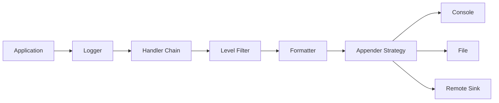

# Logging System LLD in Go

## Complete notes

A logging system captures application events and routes them to destinations like console, file, or external systems.

This is a classic LLD problem because it combines multiple patterns:

- Singleton for global logger access, used carefully
- Chain of Responsibility for log processing/filtering
- Strategy for appenders/destinations
- Factory for appender creation

## Requirements

- Support log levels: DEBUG, INFO, WARN, ERROR, FATAL.
- Log message has timestamp, level, message, and fields.
- Support multiple outputs: console/file/remote.
- Filter logs by level.
- Easy to add new output destination.
- Thread-safe in production.

## Diagram



## Core model

```go
type Level int

const (
    Debug Level = iota
    Info
    Warn
    Error
    Fatal
)

type Entry struct {
    Level   Level
    Message string
    Fields  map[string]string
}
```

## Strategy: appender

```go
type Appender interface {
    Append(ctx context.Context, entry Entry) error
}

type ConsoleAppender struct{}

func (ConsoleAppender) Append(ctx context.Context, entry Entry) error {
    fmt.Println(entry.Message)
    return nil
}
```

## Chain of Responsibility: handlers

```go
type Handler interface {
    Handle(ctx context.Context, entry Entry) error
}

type LevelFilter struct {
    min  Level
    next Handler
}

func (h LevelFilter) Handle(ctx context.Context, entry Entry) error {
    if entry.Level < h.min {
        return nil
    }
    if h.next == nil {
        return nil
    }
    return h.next.Handle(ctx, entry)
}

type AppenderHandler struct {
    appender Appender
}

func (h AppenderHandler) Handle(ctx context.Context, entry Entry) error {
    return h.appender.Append(ctx, entry)
}
```

## Logger facade

```go
type Logger struct {
    handler Handler
}

func NewLogger(handler Handler) *Logger {
    return &Logger{handler: handler}
}

func (l *Logger) Info(ctx context.Context, msg string, fields map[string]string) error {
    return l.handler.Handle(ctx, Entry{Level: Info, Message: msg, Fields: fields})
}
```

## Singleton note

A logger is often singleton-like, but avoid making it impossible to test.

Better:

```text
Create logger once in main.go, pass it to services.
```

Acceptable for small apps:

```text
Use package-level logger guarded by sync.Once.
```

## Real-life example

In InvoiceOps, when payment webhook fails, the app logs:

```text
level=ERROR message="webhook processing failed" provider=razorpay event_id=evt_123 request_id=req_999
```

The logger can filter by level, format the message, and send it to console/file/observability sink.

## Interview answer

I would model logging with a `Logger` facade. Log handlers form a chain for filtering/formatting. Appenders are strategies for console/file/remote output. I may initialize the logger once, but I would pass it as a dependency for testability.

## Common mistakes

- global mutable logger with no test control
- no log levels
- no structured fields
- no thread safety
- blocking request path on slow remote logging
- no fallback if remote sink fails

## Sources

- CodeWithAryan Logging System: https://codewitharyan.com/tech-blogs/design-logging-system
