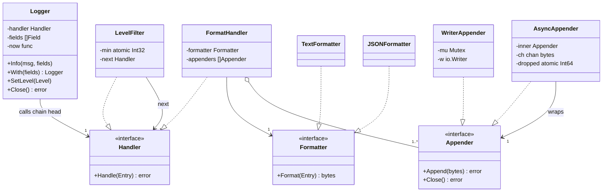
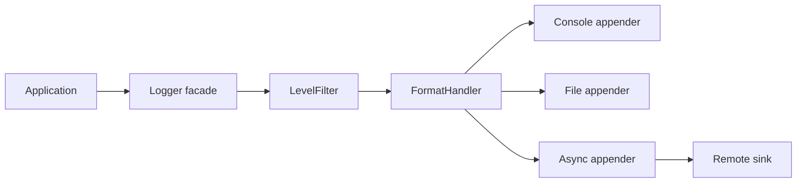

# Logging System LLD in Go

## Problem statement

```text
Design a logging library. It should support log levels (DEBUG, INFO, WARN, ERROR, FATAL),
structured fields, multiple output formats (text, JSON) and multiple destinations
(console, file, remote). Filtering by level must be possible at runtime.
It must be safe to call from many goroutines and must not slow the request path.
```

What it really tests: can you split one call (`log.Info(...)`) into small swappable steps (filter, format, write) with clean interfaces. And can you handle concurrency and backpressure: torn lines, a slow sink, and flushing on shutdown.

Real-life example: a payment webhook fails, and the app logs
`level=ERROR msg="webhook processing failed" provider=razorpay event_id=evt_123 request_id=req_999`.
The logger filters it by level, formats it, and sends it to console, file and an observability sink.

## How to use this note

- Open the drawing below. Redraw it on paper first: the pipeline (Logger, LevelFilter, FormatHandler, appenders) and the async appender. Then compare.
- Try each step yourself before you read it. Cover the answer, write yours, then check.
- Time box it to 60 minutes: 10 min requirements + entities, 10 min APIs (storage is skipped here), 25-40 min core code, 10 min edge cases, 5 min explaining it out loud.

## Step 1: Clarify requirements

### Questions to ask

- Is this a library inside one process, or a central log collection service? *Assume: an in-process library, like `log/slog` or zap. Shipping logs to ELK/Loki is the job of a sidecar agent.*
- Which levels, and can the level change without a restart? *Assume: DEBUG < INFO < WARN < ERROR < FATAL. Yes, `SetLevel` works at runtime.*
- Plain text, JSON, or both? *Assume: both, chosen per logger. JSON for production, text for local dev.*
- Which destinations? *Assume: console and file now. Remote (HTTP/Kafka) later through the same interface.*
- Can we drop logs when a sink is slow? *Assume: yes, for the async path. Never block the request. Count what we drop.*
- Do we need context fields such as request_id? *Assume: yes, via `With(fields...)` child loggers.*
- What does FATAL do? *Assume: log, flush, then exit(1). Only `main` should call it.*

### Functional

- Log a message with a level, a timestamp and key/value fields.
- Drop entries below the minimum level. The level can change at runtime.
- Format as text or JSON (pluggable).
- Write to one or more appenders: console, file, or any `io.Writer`.
- Async appender with a bounded buffer: it drops when full, counts drops, and flushes on Close.
- `With(fields...)` returns a child logger that adds fields to every entry.

### Non-functional

- Thread safe: many goroutines log at once, and no line is torn or interleaved.
- Low latency on the hot path: a filtered-out log costs almost nothing.
- A slow or failing sink must not block or break the app.
- Testable: no hidden globals, an injectable clock, `bytes.Buffer` as a sink.

### Out of scope

- Log shipping, indexing and search (ELK, Loki, Datadog).
- Log rotation (use lumberjack or logrotate; add it as a decorator later).
- Sampling and rate limiting of logs (listed under extensions).

## Step 2: Actors and use cases

| Actor | Use case |
| --- | --- |
| Application code | Log at a level with fields (`Info`, `Error`, ...) |
| Application code | Make a request-scoped logger with `With(request_id)` |
| Operator / config | Set the minimum level at startup, or change it at runtime |
| main / bootstrap | Build the logger with a formatter and appenders. `Close` it on shutdown to flush |
| Slow sink (file, network) | Receive writes off the hot path, from the async worker |

Hardest use case (the one to code): **log from many goroutines through the filter -> format -> appender chain, with an async appender that never blocks, drops when full, and flushes on Close.**

## Step 3: Entities

| Entity | Key fields | Why it exists |
| --- | --- | --- |
| `Level` | int32 enum | Gives an ordering, so a filter is just `entry.Level < min` |
| `Field` | Key, Value | Structured key/value. Better than `fmt.Sprintf` for search in ELK |
| `Entry` | Time, Level, Message, Fields | One immutable log event that moves through the chain |
| `Formatter` (interface) | `Format(Entry) []byte` | Turns an Entry into bytes. Text and JSON are strategies |
| `Appender` (interface) | `Append([]byte)`, `Close()` | A destination. Console, file and buffer all wrap `io.Writer` |
| `AsyncAppender` | inner Appender, chan, dropped counter | A decorator that moves slow writes to a background goroutine |
| `Handler` (interface) | `Handle(Entry)` | One link in the chain (level filter, format + fan-out) |
| `Logger` | handler, base fields, clock | The facade the app calls. Hides the chain |

Modeling insight: **format once, write many.** The Formatter and the Appender are separate strategies. The same JSON bytes can then go to a file and to the network. And a new destination (Kafka) never touches formatting. Most weak answers put `fmt.Println` inside each appender.

## Step 4: Relationships



The pipeline from the old note:



- **Association**: `Logger -> Handler`. The logger only knows the head of the chain.
- **Aggregation**: `FormatHandler o-- Appender`. Appenders are built in `main` and passed in. `Logger.Close` closes them, but they can exist without the handler.
- **Implements**: `LevelFilter` and `FormatHandler` implement `Handler`. Text and JSON implement `Formatter`. Writer and Async implement `Appender`.
- **Decorator / wraps**: `AsyncAppender` holds another `Appender` and has the same interface, so the caller cannot tell sync from async.

## Step 5: APIs and public methods

No REST API: this is an in-process library. The API is the Go surface the app imports. (A central log service would expose `POST /v1/logs` with batches, but that is a different problem.)

```go
// construction (in main)
func New(cfg Config) *Logger
type Config struct {
    MinLevel  Level
    Formatter Formatter   // TextFormatter{} or JSONFormatter{}
    Appenders []Appender  // console, file, async(remote)
    Clock     func() time.Time
}

// logging (hot path)
func (l *Logger) Debug(msg string, f ...Field) error
func (l *Logger) Info(msg string, f ...Field) error
func (l *Logger) Warn(msg string, f ...Field) error
func (l *Logger) Error(msg string, f ...Field) error
func (l *Logger) Fatal(msg string, f ...Field) // logs, flushes, exits
func (l *Logger) With(fields ...Field) *Logger
func (l *Logger) SetLevel(lv Level)
func (l *Logger) Close() error

// extension points
type Formatter interface{ Format(e Entry) ([]byte, error) }
type Appender interface {
    Append(p []byte) error
    Close() error
}
type Handler interface{ Handle(e Entry) error }
```

No `context.Context` on log methods, to keep the call site short. If you need request_id from ctx, add `InfoCtx(ctx, ...)` that pulls fields out of ctx. `slog` does the same.

## Step 6: Storage and repositories

No DB and no repository. A logger *is* the write path to storage (stdout, a file, or a pipe to an agent). A DB table for logs would be slow on every request, and a log store is a separate system (Elasticsearch, Loki, ClickHouse). In this design, the `Appender` interface plays the role a repository plays elsewhere. It hides where bytes go, so tests swap in a `bytes.Buffer`.

```go
// "storage port" of the logger
type Appender interface {
    Append(p []byte) error
    Close() error
}

func NewConsoleAppender() *WriterAppender                 // os.Stdout
func NewFileAppender(path string) (*WriterAppender, error) // O_APPEND file
func NewWriterAppender(w io.Writer) *WriterAppender        // tests: &bytes.Buffer{}
func NewAsyncAppender(inner Appender, buffer int) *AsyncAppender
```

## Step 7: Patterns

| Pattern | Where | Why here |
| --- | --- | --- |
| [[Chain of Responsibility Pattern in Go]] | `LevelFilter -> FormatHandler` | Each step decides whether to pass the entry on. You can add sampling or redaction later without touching the others |
| [[Strategy Pattern in Go]] | `Formatter` (text/JSON), `Appender` (console/file/remote) | Two independent axes of change, picked at config time |
| [[Decorator Middleware Pattern in Go]] | `AsyncAppender` wraps any `Appender` | Adds buffering + a background worker without changing the wrapped sink |
| [[Facade Pattern in Go]] | `Logger` | The app calls `Info(...)` and never sees the chain |
| [[Factory Pattern in Go]] | `New(cfg)`, `NewFileAppender`, `NewConsoleAppender` | One place builds the chain from config, with defaults |
| [[Singleton Pattern in Go]] (carefully) | Not in the library. If needed, a package-level logger guarded by `sync.Once` in the app | A global logger is convenient but hard to test |

Patterns NOT used and why:

- **No global singleton inside the library.** Build the logger once in `main.go` and pass it to services (dependency injection). Tests can then give each service a buffer-backed logger. A `sync.Once` package logger is acceptable only in small apps.
- **No Observer.** Appenders are a fixed fan-out list set at construction. Subscribe/unsubscribe at runtime is YAGNI.

## Folder structure

```text
logging/
  model.go        -> Level, ParseLevel, Field, Entry, errors
  formatter.go    -> Formatter interface, TextFormatter, JSONFormatter
  appender.go     -> Appender interface, WriterAppender (console/file), AsyncAppender
  handler.go      -> Handler interface, LevelFilter, FormatHandler
  logger.go       -> Logger facade, Config, New, With, SetLevel, Fatal, Close
  logging_test.go -> tests
cmd/demo/main.go  -> builds Logger from config, defers Close
```

- `model.go`: data only, no I/O.
- `formatter.go` / `appender.go`: the two strategy families. Add `KafkaAppender` here.
- `handler.go`: the chain links. Add `Sampler` or `Redactor` here.
- `logger.go`: the only file app code touches.
- The core code below is one file with `// ---- file.go ----` markers, so it compiles in one paste.

## Step 8: Core code

Main logic only. Full runnable code is folded below.

```go
type Level int32 // Debug < Info < Warn < Error < Fatal

// Entry{Time, Level, Message, Fields []Field}

type Formatter interface{ Format(e Entry) ([]byte, error) } // Text, JSON
type Handler interface{ Handle(e Entry) error }                // chain links
type Appender interface {                                      // Writer, File, Async
    Append(p []byte) error
    Close() error
}

// LevelFilter drops entries below min. min is atomic so SetLevel is safe at runtime.
func (f *LevelFilter) Handle(e Entry) error {
    if int32(e.Level) < f.min.Load() {
        return nil
    }
    return f.next.Handle(e)
}

// FormatHandler formats once and fans out to every appender.
func (h *FormatHandler) Handle(e Entry) error {
    p, err := h.formatter.Format(e)
    // ...
    var errs []error
    for _, a := range h.appenders { // one failing sink must not stop the others
        if err := a.Append(p); err != nil {
            errs = append(errs, err)
        }
    }
    return errors.Join(errs...)
}

// AsyncAppender: bounded channel; when full it drops and counts, never blocks.
func (a *AsyncAppender) Append(p []byte) error {
    a.mu.RLock()
    defer a.mu.RUnlock()
    if a.closed {
        return ErrClosed
    }
    select {
    case a.ch <- p:
        return nil
    default:
        a.dropped.Add(1)
        return nil // dropping is a policy, not an error for the caller
    }
}

// Close stops intake, flushes the buffer, then closes the inner appender.
func (a *AsyncAppender) Close() error {
    a.mu.Lock()
    // ... if a.closed: unlock, return nil
    a.closed = true
    close(a.ch)
    a.mu.Unlock()
    <-a.done // worker has drained every buffered entry
    return a.inner.Close()
}
```

### Walkthrough

1. `l.Info(msg, fields...)` -> `Log` stamps the time with the injected clock and joins base fields (from `With`) and call fields into a **new** slice, so the child and parent loggers never share a backing array.
2. The `LevelFilter` reads `min` with an atomic load. If the entry is below it, it returns right away. This is the cheapest path, and `SetLevel` can change `min` at runtime without a lock.
3. The `FormatHandler` formats **once** into `[]byte`, then loops over the appenders. Errors are collected with `errors.Join`, so a failing file sink does not stop console output.
4. `WriterAppender.Append` holds a mutex around one `w.Write(p)`. One line is one write, so lines from 50 goroutines never interleave.
5. `AsyncAppender.Append` takes a read lock and checks `closed`, then does a non-blocking `select`. If the buffer has room, the entry is queued. If not, `dropped++` and it returns at once, so the request path never waits on a slow sink.
6. The worker goroutine `range`s over the channel and calls the inner appender.
7. `Close` takes the write lock, so no `Append` is mid-send. It sets `closed`, closes the channel, and waits for `done`. At that point the worker has drained every buffered entry. Then it closes the inner sink. A second `Close` is a no-op. An `Append` after Close returns `ErrClosed` (no panic from sending on a closed channel).
8. `Fatal` logs, calls `Close` to flush, then calls `exit(1)`. The `exit` func can be swapped, so tests can check it.

> [!example]- Full runnable code (click to open)
> ```go
> package logging
>
> import (
>     "encoding/json"
>     "errors"
>     "fmt"
>     "io"
>     "os"
>     "strings"
>     "sync"
>     "sync/atomic"
>     "time"
> )
>
> // ---- model.go: levels, entry, errors ----
>
> type Level int32
>
> const (
>     Debug Level = iota
>     Info
>     Warn
>     Error
>     Fatal
> )
>
> func (l Level) String() string {
>     switch l {
>     case Debug:
>         return "DEBUG"
>     case Info:
>         return "INFO"
>     case Warn:
>         return "WARN"
>     case Error:
>         return "ERROR"
>     case Fatal:
>         return "FATAL"
>     }
>     return fmt.Sprintf("LEVEL(%d)", int(l))
> }
>
> func ParseLevel(s string) (Level, error) {
>     for l := Debug; l <= Fatal; l++ {
>         if strings.EqualFold(s, l.String()) {
>             return l, nil
>         }
>     }
>     return 0, fmt.Errorf("%w: %q", ErrUnknownLevel, s)
> }
>
> type Field struct {
>     Key   string
>     Value any
> }
>
> func F(key string, value any) Field { return Field{Key: key, Value: value} }
>
> // Entry is one log event. Fields keep insertion order.
> type Entry struct {
>     Time    time.Time
>     Level   Level
>     Message string
>     Fields  []Field
> }
>
> var (
>     ErrUnknownLevel = errors.New("unknown log level")
>     ErrClosed       = errors.New("appender closed")
> )
>
> // ---- formatter.go: Strategy for the output format ----
>
> type Formatter interface {
>     Format(e Entry) ([]byte, error)
> }
>
> // TextFormatter: 2026-10-10T10:00:00Z INFO payment failed order_id=o1 amount=500
> type TextFormatter struct{}
>
> func (TextFormatter) Format(e Entry) ([]byte, error) {
>     var b strings.Builder
>     b.WriteString(e.Time.UTC().Format(time.RFC3339))
>     b.WriteByte(' ')
>     b.WriteString(e.Level.String())
>     b.WriteByte(' ')
>     b.WriteString(e.Message)
>     for _, f := range e.Fields {
>         fmt.Fprintf(&b, " %s=%v", f.Key, f.Value)
>     }
>     b.WriteByte('\n')
>     return []byte(b.String()), nil
> }
>
> // JSONFormatter: one JSON object per line. Keys are sorted by encoding/json.
> type JSONFormatter struct{}
>
> func (JSONFormatter) Format(e Entry) ([]byte, error) {
>     m := make(map[string]any, len(e.Fields)+3)
>     for _, f := range e.Fields {
>         m[f.Key] = f.Value
>     }
>     // reserved keys win; a user field named "level" is kept as "fields.level"
>     for k, v := range map[string]any{
>         "time": e.Time.UTC().Format(time.RFC3339), "level": e.Level.String(), "msg": e.Message,
>     } {
>         if old, ok := m[k]; ok {
>             m["fields."+k] = old
>         }
>         m[k] = v
>     }
>     b, err := json.Marshal(m)
>     if err != nil {
>         return nil, err
>     }
>     return append(b, '\n'), nil
> }
>
> // ---- appender.go: Strategy for the destination ----
>
> type Appender interface {
>     Append(p []byte) error
>     Close() error
> }
>
> // WriterAppender writes to any io.Writer (os.Stdout, *os.File, *bytes.Buffer).
> // The mutex makes each line one atomic write, so lines never interleave.
> type WriterAppender struct {
>     mu sync.Mutex
>     w  io.Writer
> }
>
> func NewWriterAppender(w io.Writer) *WriterAppender { return &WriterAppender{w: w} }
>
> func NewConsoleAppender() *WriterAppender { return NewWriterAppender(os.Stdout) }
>
> func (a *WriterAppender) Append(p []byte) error {
>     a.mu.Lock()
>     defer a.mu.Unlock()
>     _, err := a.w.Write(p)
>     return err
> }
>
> func (a *WriterAppender) Close() error {
>     a.mu.Lock()
>     defer a.mu.Unlock()
>     if c, ok := a.w.(io.Closer); ok && a.w != os.Stdout && a.w != os.Stderr {
>         return c.Close()
>     }
>     return nil
> }
>
> func NewFileAppender(path string) (*WriterAppender, error) {
>     f, err := os.OpenFile(path, os.O_CREATE|os.O_APPEND|os.O_WRONLY, 0o644)
>     if err != nil {
>         return nil, err
>     }
>     return NewWriterAppender(f), nil
> }
>
> // AsyncAppender (a Decorator over any Appender) moves slow writes off the
> // request path. Bounded channel; when full it drops and counts, never blocks.
> type AsyncAppender struct {
>     inner   Appender
>     ch      chan []byte
>     mu      sync.RWMutex // guards closed + send-vs-close race
>     closed  bool
>     dropped atomic.Int64
>     done    chan struct{}
> }
>
> func NewAsyncAppender(inner Appender, buffer int) *AsyncAppender {
>     a := &AsyncAppender{inner: inner, ch: make(chan []byte, buffer), done: make(chan struct{})}
>     go a.run()
>     return a
> }
>
> func (a *AsyncAppender) run() {
>     defer close(a.done)
>     for p := range a.ch { // drains everything still buffered after close(ch)
>         _ = a.inner.Append(p) // real system: count write errors / fallback sink
>     }
> }
>
> func (a *AsyncAppender) Append(p []byte) error {
>     a.mu.RLock()
>     defer a.mu.RUnlock()
>     if a.closed {
>         return ErrClosed
>     }
>     select {
>     case a.ch <- p:
>         return nil
>     default:
>         a.dropped.Add(1)
>         return nil // dropping is a policy, not an error for the caller
>     }
> }
>
> func (a *AsyncAppender) Dropped() int64 { return a.dropped.Load() }
>
> // Close stops intake, flushes the buffer, then closes the inner appender.
> func (a *AsyncAppender) Close() error {
>     a.mu.Lock()
>     if a.closed {
>         a.mu.Unlock()
>         return nil
>     }
>     a.closed = true
>     close(a.ch)
>     a.mu.Unlock()
>     <-a.done
>     return a.inner.Close()
> }
>
> // ---- handler.go: Chain of Responsibility ----
>
> type Handler interface {
>     Handle(e Entry) error
> }
>
> // LevelFilter drops entries below min. min is atomic so SetLevel is safe at runtime.
> type LevelFilter struct {
>     min  atomic.Int32
>     next Handler
> }
>
> func NewLevelFilter(min Level, next Handler) *LevelFilter {
>     f := &LevelFilter{next: next}
>     f.min.Store(int32(min))
>     return f
> }
>
> func (f *LevelFilter) SetLevel(l Level) { f.min.Store(int32(l)) }
>
> func (f *LevelFilter) Handle(e Entry) error {
>     if int32(e.Level) < f.min.Load() {
>         return nil
>     }
>     return f.next.Handle(e)
> }
>
> // FormatHandler formats once and fans out to every appender.
> type FormatHandler struct {
>     formatter Formatter
>     appenders []Appender
> }
>
> func NewFormatHandler(f Formatter, apps ...Appender) *FormatHandler {
>     return &FormatHandler{formatter: f, appenders: apps}
> }
>
> func (h *FormatHandler) Handle(e Entry) error {
>     p, err := h.formatter.Format(e)
>     if err != nil {
>         return err
>     }
>     var errs []error
>     for _, a := range h.appenders { // one failing sink must not stop the others
>         if err := a.Append(p); err != nil {
>             errs = append(errs, err)
>         }
>     }
>     return errors.Join(errs...)
> }
>
> // ---- logger.go: Facade ----
>
> type Config struct {
>     MinLevel  Level
>     Formatter Formatter
>     Appenders []Appender
>     Clock     func() time.Time // injectable for tests
> }
>
> type Logger struct {
>     filter    *LevelFilter
>     handler   Handler
>     appenders []Appender
>     fields    []Field
>     now       func() time.Time
>     exit      func(code int)
> }
>
> func New(cfg Config) *Logger {
>     if cfg.Formatter == nil {
>         cfg.Formatter = TextFormatter{}
>     }
>     if len(cfg.Appenders) == 0 {
>         cfg.Appenders = []Appender{NewConsoleAppender()}
>     }
>     if cfg.Clock == nil {
>         cfg.Clock = time.Now
>     }
>     filter := NewLevelFilter(cfg.MinLevel, NewFormatHandler(cfg.Formatter, cfg.Appenders...))
>     return &Logger{filter: filter, handler: filter, appenders: cfg.Appenders, now: cfg.Clock, exit: os.Exit}
> }
>
> // With returns a child logger that adds fields to every entry. Parent is unchanged.
> func (l *Logger) With(fields ...Field) *Logger {
>     child := *l
>     child.fields = append(append([]Field(nil), l.fields...), fields...)
>     return &child
> }
>
> func (l *Logger) SetLevel(lv Level) { l.filter.SetLevel(lv) }
>
> func (l *Logger) Log(lv Level, msg string, fields ...Field) error {
>     all := fields
>     if len(l.fields) > 0 {
>         all = append(append([]Field(nil), l.fields...), fields...)
>     }
>     return l.handler.Handle(Entry{Time: l.now(), Level: lv, Message: msg, Fields: all})
> }
>
> func (l *Logger) Debug(msg string, f ...Field) error { return l.Log(Debug, msg, f...) }
> func (l *Logger) Info(msg string, f ...Field) error  { return l.Log(Info, msg, f...) }
> func (l *Logger) Warn(msg string, f ...Field) error  { return l.Log(Warn, msg, f...) }
> func (l *Logger) Error(msg string, f ...Field) error { return l.Log(Error, msg, f...) }
>
> // Fatal logs, flushes every appender, then exits. Only main should call it.
> func (l *Logger) Fatal(msg string, f ...Field) {
>     _ = l.Log(Fatal, msg, f...)
>     _ = l.Close()
>     l.exit(1)
> }
>
> // Close flushes async appenders and closes files. Call once from main on shutdown.
> func (l *Logger) Close() error {
>     var errs []error
>     for _, a := range l.appenders {
>         if err := a.Close(); err != nil {
>             errs = append(errs, err)
>         }
>     }
>     return errors.Join(errs...)
> }
> ```

## Test cases

| Test | Proves |
| --- | --- |
| `TestLevelFilter` (table) | Entries below min are dropped, entries at or above are written |
| `TestTextFormat` | Exact text line: RFC3339 time, level, message, fields in order |
| `TestJSONFormatAndReservedKeys` | Valid JSON. A user field named `level` does not overwrite the real level |
| `TestWithAddsFieldsWithoutMutatingParent` | A child logger adds request_id. The parent stays clean |
| `TestSetLevelAtRuntime` | The level changes without a restart |
| `TestParseLevel` | Config parsing works. A bad value returns `ErrUnknownLevel` |
| `TestOneFailingAppenderDoesNotBlockOthers` | A failing sink returns an error, but the other sink still gets the line |
| `TestAsyncDropsWhenFullAndFlushesOnClose` | Buffer 2 with a blocked worker: exactly 3 dropped and 3 flushed. Append after Close returns `ErrClosed` |
| `TestConcurrentLoggingNoLostOrTornLines` | 50 goroutines x 100 logs through async: exactly 5000 well-formed lines and 0 drops (run with `-race`) |
| `TestFatalFlushesThenExits` | FATAL is written before exit(1) |

> [!example]- Full test code (click to open)
> ```go
> package logging
>
> import (
>     "bytes"
>     "encoding/json"
>     "errors"
>     "strings"
>     "sync"
>     "testing"
>     "time"
> )
>
> var fixed = time.Date(2026, 10, 10, 10, 0, 0, 0, time.UTC)
>
> func newTestLogger(min Level, f Formatter) (*Logger, *bytes.Buffer) {
>     var buf bytes.Buffer
>     l := New(Config{MinLevel: min, Formatter: f, Appenders: []Appender{NewWriterAppender(&buf)},
>         Clock: func() time.Time { return fixed }})
>     return l, &buf
> }
>
> func TestLevelFilter(t *testing.T) {
>     tests := []struct {
>         name  string
>         min   Level
>         level Level
>         want  bool
>     }{
>         {"debug dropped at info", Info, Debug, false},
>         {"info passes at info", Info, Info, true},
>         {"error passes at warn", Warn, Error, true},
>         {"warn dropped at error", Error, Warn, false},
>         {"everything passes at debug", Debug, Debug, true},
>     }
>     for _, tc := range tests {
>         t.Run(tc.name, func(t *testing.T) {
>             l, buf := newTestLogger(tc.min, TextFormatter{})
>             if err := l.Log(tc.level, "hello"); err != nil {
>                 t.Fatal(err)
>             }
>             if got := buf.Len() > 0; got != tc.want {
>                 t.Fatalf("written=%v, want %v", got, tc.want)
>             }
>         })
>     }
> }
>
> func TestTextFormat(t *testing.T) {
>     l, buf := newTestLogger(Debug, TextFormatter{})
>     _ = l.Error("payment failed", F("order_id", "o1"), F("amount", 500))
>     want := "2026-10-10T10:00:00Z ERROR payment failed order_id=o1 amount=500\n"
>     if buf.String() != want {
>         t.Fatalf("got %q want %q", buf.String(), want)
>     }
> }
>
> func TestJSONFormatAndReservedKeys(t *testing.T) {
>     l, buf := newTestLogger(Debug, JSONFormatter{})
>     _ = l.Info("user login", F("user_id", "u1"), F("level", "admin"))
>     var m map[string]any
>     if err := json.Unmarshal(buf.Bytes(), &m); err != nil {
>         t.Fatalf("not valid JSON: %v", err)
>     }
>     if m["level"] != "INFO" || m["msg"] != "user login" || m["user_id"] != "u1" || m["fields.level"] != "admin" {
>         t.Fatalf("bad json: %v", m)
>     }
> }
>
> func TestWithAddsFieldsWithoutMutatingParent(t *testing.T) {
>     l, buf := newTestLogger(Debug, TextFormatter{})
>     reqLog := l.With(F("request_id", "r1"))
>     _ = reqLog.Info("child")
>     _ = l.Info("parent")
>     lines := strings.Split(strings.TrimSpace(buf.String()), "\n")
>     if !strings.HasSuffix(lines[0], "child request_id=r1") || strings.Contains(lines[1], "request_id") {
>         t.Fatalf("got %q", lines)
>     }
> }
>
> func TestSetLevelAtRuntime(t *testing.T) {
>     l, buf := newTestLogger(Error, TextFormatter{})
>     _ = l.Info("hidden")
>     l.SetLevel(Debug)
>     _ = l.Info("shown")
>     if strings.Contains(buf.String(), "hidden") || !strings.Contains(buf.String(), "shown") {
>         t.Fatalf("got %q", buf.String())
>     }
> }
>
> func TestParseLevel(t *testing.T) {
>     if lv, err := ParseLevel("warn"); err != nil || lv != Warn {
>         t.Fatalf("got %v %v", lv, err)
>     }
>     if _, err := ParseLevel("loud"); !errors.Is(err, ErrUnknownLevel) {
>         t.Fatalf("want ErrUnknownLevel, got %v", err)
>     }
> }
>
> type failingAppender struct{}
>
> func (failingAppender) Append([]byte) error { return errors.New("disk full") }
> func (failingAppender) Close() error        { return nil }
>
> func TestOneFailingAppenderDoesNotBlockOthers(t *testing.T) {
>     var buf bytes.Buffer
>     l := New(Config{Appenders: []Appender{failingAppender{}, NewWriterAppender(&buf)}, Clock: func() time.Time { return fixed }})
>     err := l.Info("x")
>     if err == nil || buf.Len() == 0 {
>         t.Fatalf("want error returned AND second appender written; err=%v buf=%q", err, buf.String())
>     }
> }
>
> // blockingAppender holds the async worker inside Append until release is closed.
> type blockingAppender struct {
>     entered chan struct{}
>     release chan struct{}
>     once    sync.Once
>     mu      sync.Mutex
>     lines   int
> }
>
> func (b *blockingAppender) Append([]byte) error {
>     b.once.Do(func() { close(b.entered) })
>     <-b.release
>     b.mu.Lock()
>     b.lines++
>     b.mu.Unlock()
>     return nil
> }
> func (b *blockingAppender) Close() error { return nil }
>
> func TestAsyncDropsWhenFullAndFlushesOnClose(t *testing.T) {
>     slow := &blockingAppender{entered: make(chan struct{}), release: make(chan struct{})}
>     a := NewAsyncAppender(slow, 2)
>     _ = a.Append([]byte("1")) // taken by worker, worker now blocked
>     <-slow.entered
>     _ = a.Append([]byte("2")) // buffer slot 1
>     _ = a.Append([]byte("3")) // buffer slot 2
>     for i := 0; i < 3; i++ {
>         _ = a.Append([]byte("dropped")) // buffer full -> dropped, caller never blocks
>     }
>     if a.Dropped() != 3 {
>         t.Fatalf("dropped=%d want 3", a.Dropped())
>     }
>     close(slow.release)
>     if err := a.Close(); err != nil {
>         t.Fatal(err)
>     }
>     if slow.lines != 3 {
>         t.Fatalf("flushed %d lines, want 3", slow.lines)
>     }
>     if err := a.Append([]byte("late")); !errors.Is(err, ErrClosed) {
>         t.Fatalf("want ErrClosed, got %v", err)
>     }
> }
>
> func TestConcurrentLoggingNoLostOrTornLines(t *testing.T) {
>     var buf bytes.Buffer
>     async := NewAsyncAppender(NewWriterAppender(&buf), 10000)
>     l := New(Config{Appenders: []Appender{async}, Clock: func() time.Time { return fixed }})
>     const goroutines, perG = 50, 100
>     var wg sync.WaitGroup
>     for g := 0; g < goroutines; g++ {
>         wg.Add(1)
>         go func(g int) {
>             defer wg.Done()
>             for i := 0; i < perG; i++ {
>                 _ = l.Info("event", F("g", g), F("i", i))
>             }
>         }(g)
>     }
>     wg.Wait()
>     if err := l.Close(); err != nil {
>         t.Fatal(err)
>     }
>     lines := strings.Split(strings.TrimSpace(buf.String()), "\n")
>     if len(lines) != goroutines*perG || async.Dropped() != 0 {
>         t.Fatalf("lines=%d dropped=%d, want %d and 0", len(lines), async.Dropped(), goroutines*perG)
>     }
>     for _, ln := range lines {
>         if !strings.HasPrefix(ln, "2026-10-10T10:00:00Z INFO event g=") {
>             t.Fatalf("torn line %q", ln)
>         }
>     }
> }
>
> func TestFatalFlushesThenExits(t *testing.T) {
>     l, buf := newTestLogger(Debug, TextFormatter{})
>     code := -1
>     l.exit = func(c int) { code = c }
>     l.Fatal("boom")
>     if code != 1 || !strings.Contains(buf.String(), "FATAL boom") {
>         t.Fatalf("code=%d out=%q", code, buf.String())
>     }
> }
> ```

## Step 9: Edge cases

| Edge case | What happens | How the design handles it |
| --- | --- | --- |
| Concurrent writes (race) | 50 goroutines write to one file at once | `WriterAppender` mutex: one line = one `Write`. Level uses an atomic. The test runs with `-race` |
| Remote sink slow or down | Request goroutines would block on network I/O | `AsyncAppender`: bounded channel + non-blocking send. The app never waits |
| Backpressure (buffer full) | More logs than the sink can take | Drop and increment `Dropped()`. Export it as a metric. Alternative policy: block, or drop DEBUG first |
| Shutdown loses buffered logs | Process exits with entries still in the channel | `Close` drains the channel before returning. `Fatal` calls `Close` before exit |
| Append after Close | Send on a closed channel would panic | `closed` flag under RWMutex. Returns `ErrClosed` |
| One appender fails (disk full) | Others should still get the line | `FormatHandler` loops over all and `errors.Join`s the errors |
| Field key collides with `level`/`msg`/`time` | JSON would lose the real level | Reserved keys win. The user value moves to `fields.level` |
| Filtered-out DEBUG in a hot loop | Wasted formatting | The filter runs before format. For big values, guard with an `Enabled(level)` check |
| Non-JSON-able field value (chan, func) | `json.Marshal` fails | The formatter returns an error, and `Info` returns it. You could fall back to `fmt.Sprint` |
| Global logger in tests | Tests share state and step on each other | No global. Each test builds its own logger with a `bytes.Buffer` |

### Common mistakes

- A global mutable logger with no test control.
- No log levels, or level checks done after formatting.
- No structured fields (only `Sprintf` strings).
- No thread safety (interleaved lines).
- Blocking the request path on slow remote logging.
- No fallback if the remote sink fails, and no flush on shutdown.

## Step 10: Tradeoffs and extensions

| Follow-up | Design change |
| --- | --- |
| Add a Kafka or HTTP sink | New `Appender`, wrapped in `AsyncAppender`. Batch inside the worker (flush every N lines or T ms) |
| Log rotation by size or day | `RotatingFileAppender` decorator: on size > N, rename and reopen. Or use lumberjack |
| Different level per sink (DEBUG to file, ERROR to pager) | Build a tree: a `FanOut` handler with one `LevelFilter -> FormatHandler` per branch |
| Redact PII (phone, card) | A new `Redactor` handler in the chain before format |
| Sampling (keep 1 in 100 DEBUG) | A `Sampler` handler with an atomic counter |
| Request id from context | `InfoCtx(ctx, ...)` reads values from ctx and adds them as fields |
| Zero-allocation hot path | Reuse buffers with `sync.Pool`. Typed fields (`String`, `Int`) instead of `any` (the zap approach) |

### Tradeoffs I chose

- **Drop over block** when the async buffer is full. Losing some logs is better than adding latency to user requests. Make drops visible through `Dropped()`.
- **A mutex per appender**, not one global lock, so a slow file does not block console writes.
- **An atomic for the level** instead of a mutex. It is read on every call and written rarely.
- **Sync by default, async opt-in.** Sync is simpler and loses nothing on crash. Wrap only the slow sinks.
- **`any` field values** for simplicity. This costs allocations. zap uses typed fields when performance matters.

## Drawing

![[Logging System LLD Drawing.excalidraw]]

The drawing shows:

- Section 1: Logger facade, Handler chain (LevelFilter, FormatHandler), Formatter and Appender interfaces with their implementations, and AsyncAppender wrapping an inner appender.
- Section 2: the core flow: app -> Logger -> LevelFilter (red branch: below min, dropped) -> FormatHandler -> appenders, plus the async path (green: queued, red: buffer full, dropped++).
- Section 3: AsyncAppender lifecycle: Running -> Closing (drain) -> Closed.

Redraw it from memory:

1. The chain order: Logger -> LevelFilter -> FormatHandler -> []Appender.
2. Two strategy interfaces (Formatter, Appender), each with 2 implementations.
3. AsyncAppender: a bounded channel, a worker goroutine, a dropped counter, and Close that drains.
4. Where the locks are: the mutex in WriterAppender, an RWMutex for closed, an atomic for level and dropped.

## Interview explanation

```text
I expose a Logger facade with Info/Error and With for structured fields. Each call
builds an Entry and sends it down a chain: a LevelFilter with an atomic min level,
then a FormatHandler that formats once with a Formatter strategy (text or JSON) and
fans the bytes out to Appender strategies (console, file, remote). Every appender
wraps an io.Writer behind a mutex, so lines never interleave, and tests use a
bytes.Buffer. Slow sinks are wrapped in an AsyncAppender with a bounded channel:
when it is full we drop and count instead of blocking the request, and Close drains
the buffer on shutdown. I avoid a global singleton: the logger is built in main and
injected, which keeps it testable.
```

## Related

- [[LLD Practice Roadmap]]
- [[LLD Question Bank with Answers]]
- [[Chain of Responsibility Pattern in Go]]
- [[Strategy Pattern in Go]]
- [[Decorator Middleware Pattern in Go]]
- [[Facade Pattern in Go]]
- [[Factory Pattern in Go]]
- [[Singleton Pattern in Go]]
- [[Concurrency in Go LLD]]
- [[Testing LLD Code in Go]]
- [[UML for LLD Interviews]]
- [[Error Handling and Interfaces in Go LLD]]
- Source: CodeWithAryan Logging System: https://codewitharyan.com/tech-blogs/design-logging-system
