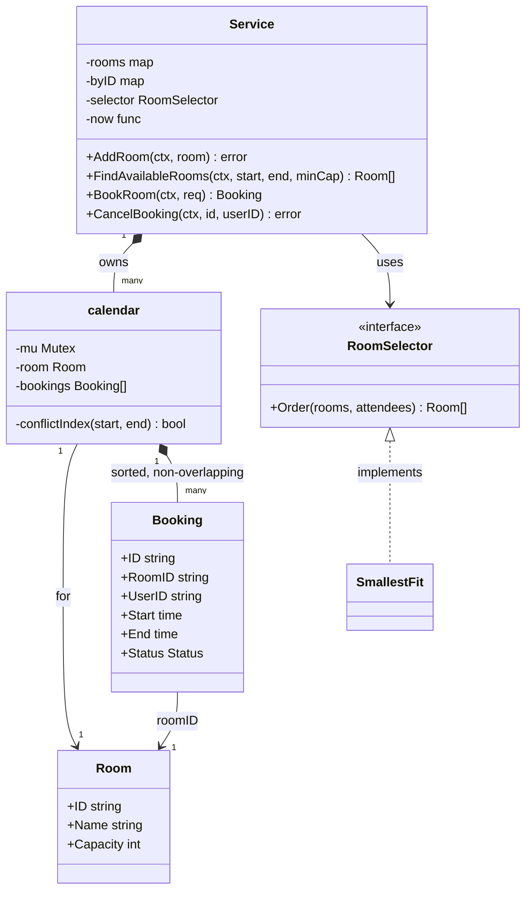
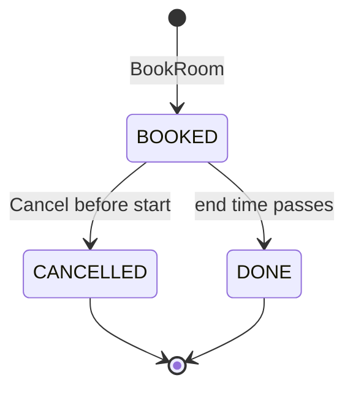

# Meeting Room Scheduler LLD in Go

## Problem statement

```text
Design a meeting room booking system for an office.
Admins add rooms with a capacity. Users search for rooms that are free for a time
interval and fit N people, book a room, and cancel their booking.
Two people must never hold the same room at overlapping times, even if they click
"Book" at the same moment. Code the booking method.
```

- It really tests one rule (interval overlap) and one race (two people booking the same room at the same time).
- Everything else (search, cancel, recurring, timezones) is follow-up depth on top of those two.

## How to use this note

- Open the drawing ([[Meeting Room Scheduler LLD Drawing.excalidraw]]), look at it for one minute, then close it and redraw it yourself on paper or Excalidraw.
- Attempt each step yourself before reading it. Cover the step, write your answer, then compare.
- Time box it like the roadmap's daily method (60 min): 10 min requirements and entities (Steps 1-4), 10 min APIs and storage (Steps 5-6), 25-40 min core code (Steps 7-8), 10 min edge cases (Step 9), 5 min explaining out loud.

## Step 1: Clarify requirements

### Questions to ask

- Are intervals half-open, so a 10:00-11:00 meeting and an 11:00-12:00 meeting can both exist? *Assume: yes, `[start, end)`.*
- Book a specific room, or "give me any room for 6 people"? *Assume: both; auto-pick uses the smallest room that fits.*
- Can anyone cancel, and until when? *Assume: only the organizer, only before the meeting starts.*
- Single office server or many app instances? *Assume: code in memory with a per-room lock; explain the DB version for many instances.*
- Recurring meetings and timezones? *Assume: follow-ups. Store everything in UTC now so they are easy later.*
- Min/max meeting length, booking horizon? *Assume: start must be before end and not in the past; no other limits.*
- Do we need attendees' calendars or invites? *Assume: out of scope; only room capacity counts.*

### Functional

- Add a room (ID, name, capacity).
- `FindAvailableRooms(start, end, minCapacity)` returns rooms free for the whole interval.
- `BookRoom` for a given room, or auto-pick the best free room.
- `CancelBooking` by the organizer before start; the slot becomes free again.
- Get a booking by ID.

### Non-functional

- No double booking, ever, under concurrent requests (correctness over speed).
- Bookings for different rooms do not block each other (per-room lock).
- Overlap check is fast: O(log n) per room with a sorted list.
- Deterministic tests: clock is injected.

### Out of scope

- Invites, attendee calendars, notifications (mention Observer as an extension).
- Room equipment filters (projector, VC) beyond capacity.
- Payments, approvals, waitlists.

## Step 2: Actors and use cases

| Actor | Use case |
|---|---|
| Admin | Add / remove a room, set capacity |
| Employee | Search free rooms for a time and size |
| Employee | Book a specific room |
| Employee | Book "any room for N people" (auto-pick) |
| Employee | Cancel own booking before it starts |
| System | Mark meetings done after end time (derived, no job needed) |

Hardest use case (the one to code): **BookRoom**, because check-for-overlap and insert must be atomic per room, or two people get the same slot.

## Step 3: Entities

| Entity | Key fields | Why it exists |
|---|---|---|
| `Room` | ID, Name, Capacity | The resource being booked |
| `Booking` | ID, RoomID, UserID, Start, End (UTC), Attendees, Status | One reservation of a room for `[Start, End)` |
| `RoomCalendar` (code: `calendar`) | room, mutex, bookings sorted by Start | Owns one room's bookings and the per-room lock; the place where the "no overlap" invariant lives |
| `User` | ID, Email, TimeZone | Organizer; TZ only for display |
| `BookingRequest` | RoomID (optional), UserID, Start, End, Attendees | Input value object; empty RoomID means auto-pick |
| `RoomSelector` | `Order(rooms, n)` | Strategy for which free room to try first |
| `SchedulerService` (code: `Service`) | rooms, byID index, selector, clock | Facade with the use cases |

Modeling insight: **do not store "slots"** (like 30-min cells). Store intervals and check overlap with `start < otherEnd && otherStart < end`. Slots break on odd times and bloat storage. And give each room its own calendar object, because that is the unit of locking: the invariant "no two BOOKED intervals overlap" is per room.

## Step 4: Relationships





- **Composition**: `Service` owns calendars; a calendar owns its bookings (a booking cannot live without its room's calendar).
- **Association**: `calendar -> Room` and `Booking -> User` (by ID). Rooms and users exist on their own.
- **Dependency on an interface**: `Service -> RoomSelector`, so the picking rule can change without touching booking code.
- `DONE` is derived from `now >= End`; no background job flips it.

## Step 5: APIs and public methods

```text
POST   /rooms                      {name, capacity}                       -> 201 room
GET    /rooms/available?start=&end=&capacity=                             -> [room]
POST   /bookings                   Idempotency-Key header
                                   {room_id?, start, end, attendees}      -> 201 booking | 409 conflict
GET    /bookings/{id}                                                     -> booking
DELETE /bookings/{id}                                                     -> 204 | 403 not owner | 409 already started
```

Times on the wire are RFC 3339 with offset (`2026-10-12T10:00:00+05:30`); the server converts to UTC.

```go
func (s *Service) AddRoom(ctx context.Context, r Room) error
func (s *Service) FindAvailableRooms(ctx context.Context, start, end time.Time, minCapacity int) ([]Room, error)
func (s *Service) BookRoom(ctx context.Context, req BookingRequest) (Booking, error) // req.RoomID == "" -> auto-pick
func (s *Service) CancelBooking(ctx context.Context, bookingID, userID string) error
func (s *Service) GetBooking(ctx context.Context, id string) (Booking, error)

func Overlaps(s1, e1, s2, e2 time.Time) bool // s1 < e2 && s2 < e1
```

## Step 6: Storage and repositories

```sql
CREATE EXTENSION IF NOT EXISTS btree_gist;  -- lets GiST index the "=" on room_id

CREATE TABLE rooms (
    id       TEXT PRIMARY KEY,
    name     TEXT NOT NULL,
    capacity INT  NOT NULL CHECK (capacity > 0)
);

CREATE TABLE bookings (
    id              TEXT PRIMARY KEY,
    room_id         TEXT NOT NULL REFERENCES rooms(id),
    user_id         TEXT NOT NULL,
    during          TSTZRANGE NOT NULL,             -- '[start, end)' half-open, stored in UTC
    attendees       INT  NOT NULL DEFAULT 1,
    status          TEXT NOT NULL DEFAULT 'BOOKED', -- BOOKED | CANCELLED
    idempotency_key TEXT,
    CHECK (lower(during) < upper(during)),
    UNIQUE (user_id, idempotency_key),
    -- THE invariant: no two BOOKED rows for one room may overlap. The DB enforces it.
    EXCLUDE USING gist (room_id WITH =, during WITH &&) WHERE (status = 'BOOKED')
);

CREATE INDEX bookings_user ON bookings (user_id, lower(during));

-- Book: a concurrent overlapping insert fails with SQLSTATE 23P01 (exclusion_violation) -> 409.
INSERT INTO bookings (id, room_id, user_id, during, attendees, idempotency_key)
VALUES ($1, $2, $3, tstzrange($4, $5, '[)'), $6, $7);

-- Find available rooms for [s, e) with capacity >= n
SELECT r.* FROM rooms r
WHERE r.capacity >= $3
  AND NOT EXISTS (
      SELECT 1 FROM bookings b
      WHERE b.room_id = r.id AND b.status = 'BOOKED'
        AND b.during && tstzrange($1, $2, '[)'));

-- Alternative without EXCLUDE (MySQL etc.): lock the room row, then check, then insert, in one tx.
-- BEGIN; SELECT id FROM rooms WHERE id = $1 FOR UPDATE;
-- SELECT 1 FROM bookings WHERE room_id=$1 AND status='BOOKED' AND start_at < $3 AND $2 < end_at;
-- INSERT ... ; COMMIT;
```

```go
type RoomRepository interface {
    Add(ctx context.Context, r Room) error
    ListByMinCapacity(ctx context.Context, minCap int) ([]Room, error)
}

type BookingRepository interface {
    // Insert must fail with ErrConflict if an overlapping BOOKED row exists for the room
    // (EXCLUDE constraint, or SELECT ... FOR UPDATE on the room row inside the tx).
    Insert(ctx context.Context, b Booking) error
    Get(ctx context.Context, id string) (Booking, error)
    Cancel(ctx context.Context, id string) error
    FreeRooms(ctx context.Context, start, end time.Time, minCap int) ([]Room, error)
}
```

## Step 7: Patterns

| Pattern | Where | Why here |
|---|---|---|
| [[Strategy Pattern in Go]] | `RoomSelector` / `SmallestFit` | Picking rule changes often (smallest fit, same floor, least used); booking code stays the same |
| [[Repository Pattern in Go]] | `RoomRepository`, `BookingRepository` | Swap the in-memory calendar for Postgres with the EXCLUDE constraint |
| [[Facade Pattern in Go]] | `Service` | One entry point hides calendars, locks, selector, clock |
| [[Observer Pattern in Go]] | extension: `BookingCreated` / `BookingCancelled` events | Send invites, update calendars, notify a waitlist without touching booking code |

Patterns NOT used and why:

- **State pattern** for Booking: only two stored states and one transition; an `if status == ...` check is clearer (KISS).
- **Singleton** service: pass `*Service` through constructors; globals make tests share state.

## Folder structure

```text
scheduler/
  model.go        -> Room, Booking, BookingRequest, Status, errors, Overlaps()
  calendar.go     -> per-room calendar: mutex + sorted bookings + conflictIndex()
  selector.go     -> RoomSelector interface + SmallestFit
  repository.go   -> RoomRepository, BookingRepository interfaces (+ Postgres impl later)
  service.go      -> Service: AddRoom, FindAvailableRooms, BookRoom, CancelBooking
  service_test.go -> table-driven tests + concurrency test
cmd/demo/main.go  -> wiring: NewService(SmallestFit{}, time.Now), add rooms, book
```

- `model.go`: plain data and the overlap rule, no locks.
- `calendar.go`: the only place that touches the sorted slice; caller holds the lock.
- `selector.go`: strategies; add new ones here.
- `service.go`: validation, UTC conversion, locking order, auto-pick retry loop.
- The Step 8 block below is these files merged into one, so it compiles standalone.

## Step 8: Core code

Main logic only. Full runnable code is folded below.

```go
// Overlaps is the core rule: [s1,e1) and [s2,e2) clash iff s1 < e2 && s2 < e1.
func Overlaps(s1, e1, s2, e2 time.Time) bool {
    return s1.Before(e2) && s2.Before(e1)
}

type RoomSelector interface{ Order(candidates []Room, attendees int) []Room }

// calendar is one room's bookings, sorted by Start, guarded by its own lock.
type calendar struct {
    mu       sync.Mutex
    room     Room
    bookings []*Booking // only StatusBooked, sorted by Start, non-overlapping
}

// Sorted + non-overlapping: only the two neighbours of the insert point matter.
func (c *calendar) conflictIndex(start, end time.Time) (int, bool) {
    i := sort.Search(len(c.bookings), func(k int) bool {
        return !c.bookings[k].Start.Before(start) // first booking with Start >= start
    })
    if i > 0 && Overlaps(c.bookings[i-1].Start, c.bookings[i-1].End, start, end) {
        return i, true
    }
    if i < len(c.bookings) && Overlaps(c.bookings[i].Start, c.bookings[i].End, start, end) {
        return i, true
    }
    return i, false
}

func (s *Service) bookIn(roomID string, req BookingRequest) (Booking, error) {
    // ... look up calendar c under s.mu.RLock, ErrRoomNotFound, ErrTooSmall

    // Check-and-insert must be atomic per room: this is the double-booking guard.
    c.mu.Lock()
    i, clash := c.conflictIndex(req.Start, req.End)
    if clash {
        c.mu.Unlock()
        return Booking{}, ErrConflict
    }
    b := &Booking{ID: fmt.Sprintf("bk-%d", s.seq.Add(1)), RoomID: roomID /* ... */, Status: StatusBooked}
    c.bookings = append(c.bookings, nil)
    copy(c.bookings[i+1:], c.bookings[i:])
    c.bookings[i] = b
    out := *b
    c.mu.Unlock()
    // ... index b in s.byID under s.mu
    return out, nil
}

func (s *Service) BookRoom(ctx context.Context, req BookingRequest) (Booking, error) {
    // ... to UTC, validate, named room -> bookIn; else free := FindAvailableRooms(...)
    for _, r := range s.selector.Order(free, req.Attendees) {
        b, err := s.bookIn(r.ID, req)
        if errors.Is(err, ErrConflict) {
            continue // someone took it between Find and Book; try the next room
        }
        return b, err
    }
    return Booking{}, ErrNoRoomAvailable
}
```

### Walkthrough

`BookRoom(ctx, req)`:

1. Convert `Start` and `End` to UTC. All comparisons and storage use UTC, so a request sent in IST and one sent in UTC for the same instant clash correctly.
2. Validate: `start < end` (zero-length is invalid) and `start` is not in the past (injected clock).
3. If a room is named, go to `bookIn`. If not, call `FindAvailableRooms` and let the `RoomSelector` order the candidates (smallest that fits first).
4. `bookIn`: look up the room's calendar under the service read lock, then check capacity.
5. **Lock the room's mutex.** From here to unlock, nobody else can check or insert for this room. Other rooms are unaffected.
6. `conflictIndex`: binary search for the first booking with `Start >= start`. Because the list is sorted and non-overlapping, only the booking just before and just after that index can overlap. Check both with `s1 < e2 && s2 < e1`.
7. Clash -> `ErrConflict`. Free -> insert at that index (list stays sorted), build the `Booking`, unlock, then index it by ID.
8. Auto-pick: the candidate list was a snapshot. If someone booked a candidate in between, `bookIn` returns `ErrConflict` and we simply try the next room. Out of rooms -> `ErrNoRoomAvailable`.

`CancelBooking`: find the booking, lock its room, check owner, return early if already cancelled (idempotent), refuse if `now >= Start`, set `CANCELLED` and remove it from the sorted slice so the slot is free.

> [!example]- Full runnable code (click to open)
> ```go
> package scheduler
>
> import (
>     "context"
>     "errors"
>     "fmt"
>     "sort"
>     "sync"
>     "sync/atomic"
>     "time"
> )
>
> var (
>     ErrInvalidRange    = errors.New("scheduler: start must be before end")
>     ErrInPast          = errors.New("scheduler: cannot book in the past")
>     ErrRoomNotFound    = errors.New("scheduler: room not found")
>     ErrRoomExists      = errors.New("scheduler: room already exists")
>     ErrTooSmall        = errors.New("scheduler: room capacity too small")
>     ErrConflict        = errors.New("scheduler: room already booked for this time")
>     ErrNoRoomAvailable = errors.New("scheduler: no room available")
>     ErrBookingNotFound = errors.New("scheduler: booking not found")
>     ErrNotOwner        = errors.New("scheduler: only the organizer can cancel")
>     ErrAlreadyStarted  = errors.New("scheduler: meeting already started")
> )
>
> type Status string
>
> const (
>     StatusBooked    Status = "BOOKED"
>     StatusCancelled Status = "CANCELLED"
> )
>
> type Room struct {
>     ID       string
>     Name     string
>     Capacity int
> }
>
> // Booking holds the half-open interval [Start, End) in UTC.
> type Booking struct {
>     ID        string
>     RoomID    string
>     UserID    string
>     Start     time.Time
>     End       time.Time
>     Attendees int
>     Status    Status
> }
>
> // Overlaps is the core rule: [s1,e1) and [s2,e2) clash iff s1 < e2 && s2 < e1.
> // Back-to-back meetings (10:00-11:00 and 11:00-12:00) do not clash.
> func Overlaps(s1, e1, s2, e2 time.Time) bool {
>     return s1.Before(e2) && s2.Before(e1)
> }
>
> type BookingRequest struct {
>     RoomID    string // empty = let the RoomSelector pick
>     UserID    string
>     Start     time.Time
>     End       time.Time
>     Attendees int
> }
>
> // RoomSelector is the Strategy that orders candidate rooms for auto-booking.
> type RoomSelector interface {
>     Order(candidates []Room, attendees int) []Room
> }
>
> // SmallestFit tries the smallest room that fits first, so big rooms stay free.
> type SmallestFit struct{}
>
> func (SmallestFit) Order(rooms []Room, _ int) []Room {
>     out := append([]Room(nil), rooms...)
>     sort.Slice(out, func(i, j int) bool {
>         if out[i].Capacity != out[j].Capacity {
>             return out[i].Capacity < out[j].Capacity
>         }
>         return out[i].ID < out[j].ID
>     })
>     return out
> }
>
> // calendar is one room's bookings, sorted by Start, guarded by its own lock.
> // Per-room locks mean bookings for different rooms never wait on each other.
> type calendar struct {
>     mu       sync.Mutex
>     room     Room
>     bookings []*Booking // only StatusBooked, sorted by Start, non-overlapping
> }
>
> // conflictIndex returns the insert position for [start,end) and whether it clashes.
> // Because bookings are sorted and non-overlapping, only the two neighbours matter.
> // Caller holds c.mu.
> func (c *calendar) conflictIndex(start, end time.Time) (int, bool) {
>     i := sort.Search(len(c.bookings), func(k int) bool {
>         return !c.bookings[k].Start.Before(start) // first booking with Start >= start
>     })
>     if i > 0 && Overlaps(c.bookings[i-1].Start, c.bookings[i-1].End, start, end) {
>         return i, true
>     }
>     if i < len(c.bookings) && Overlaps(c.bookings[i].Start, c.bookings[i].End, start, end) {
>         return i, true
>     }
>     return i, false
> }
>
> type Service struct {
>     mu       sync.RWMutex // guards rooms and byID maps (not calendar contents)
>     rooms    map[string]*calendar
>     byID     map[string]*Booking
>     selector RoomSelector
>     now      func() time.Time
>     seq      atomic.Int64
> }
>
> func NewService(selector RoomSelector, now func() time.Time) *Service {
>     if selector == nil {
>         selector = SmallestFit{}
>     }
>     if now == nil {
>         now = time.Now
>     }
>     return &Service{rooms: map[string]*calendar{}, byID: map[string]*Booking{}, selector: selector, now: now}
> }
>
> func (s *Service) AddRoom(ctx context.Context, r Room) error {
>     s.mu.Lock()
>     defer s.mu.Unlock()
>     if _, ok := s.rooms[r.ID]; ok {
>         return ErrRoomExists
>     }
>     s.rooms[r.ID] = &calendar{room: r}
>     return nil
> }
>
> func (s *Service) validate(start, end time.Time) error {
>     if !start.Before(end) {
>         return ErrInvalidRange
>     }
>     if start.Before(s.now()) {
>         return ErrInPast
>     }
>     return nil
> }
>
> // FindAvailableRooms returns rooms with capacity >= minCapacity that are free for [start,end).
> func (s *Service) FindAvailableRooms(ctx context.Context, start, end time.Time, minCapacity int) ([]Room, error) {
>     start, end = start.UTC(), end.UTC()
>     if !start.Before(end) {
>         return nil, ErrInvalidRange
>     }
>     s.mu.RLock()
>     cals := make([]*calendar, 0, len(s.rooms))
>     for _, c := range s.rooms {
>         if c.room.Capacity >= minCapacity {
>             cals = append(cals, c)
>         }
>     }
>     s.mu.RUnlock()
>
>     var free []Room
>     for _, c := range cals {
>         c.mu.Lock()
>         _, clash := c.conflictIndex(start, end)
>         c.mu.Unlock()
>         if !clash {
>             free = append(free, c.room)
>         }
>     }
>     sort.Slice(free, func(i, j int) bool { return free[i].ID < free[j].ID })
>     return free, nil // a snapshot: BookRoom re-checks under the lock
> }
>
> // BookRoom books a specific room, or the best free room if req.RoomID is empty.
> func (s *Service) BookRoom(ctx context.Context, req BookingRequest) (Booking, error) {
>     req.Start, req.End = req.Start.UTC(), req.End.UTC() // store UTC only
>     if err := s.validate(req.Start, req.End); err != nil {
>         return Booking{}, err
>     }
>     if req.RoomID != "" {
>         return s.bookIn(req.RoomID, req)
>     }
>     // Auto-pick: candidates are a snapshot, so try each until one succeeds.
>     free, err := s.FindAvailableRooms(ctx, req.Start, req.End, req.Attendees)
>     if err != nil {
>         return Booking{}, err
>     }
>     for _, r := range s.selector.Order(free, req.Attendees) {
>         if err := ctx.Err(); err != nil {
>             return Booking{}, err
>         }
>         b, err := s.bookIn(r.ID, req)
>         if errors.Is(err, ErrConflict) {
>             continue // someone took it between Find and Book; try the next room
>         }
>         return b, err
>     }
>     return Booking{}, ErrNoRoomAvailable
> }
>
> func (s *Service) bookIn(roomID string, req BookingRequest) (Booking, error) {
>     s.mu.RLock()
>     c, ok := s.rooms[roomID]
>     s.mu.RUnlock()
>     if !ok {
>         return Booking{}, ErrRoomNotFound
>     }
>     if req.Attendees > c.room.Capacity {
>         return Booking{}, ErrTooSmall
>     }
>
>     // Check-and-insert must be atomic per room: this is the double-booking guard.
>     c.mu.Lock()
>     i, clash := c.conflictIndex(req.Start, req.End)
>     if clash {
>         c.mu.Unlock()
>         return Booking{}, ErrConflict
>     }
>     b := &Booking{
>         ID:     fmt.Sprintf("bk-%d", s.seq.Add(1)),
>         RoomID: roomID, UserID: req.UserID,
>         Start: req.Start, End: req.End, Attendees: req.Attendees,
>         Status: StatusBooked,
>     }
>     c.bookings = append(c.bookings, nil)
>     copy(c.bookings[i+1:], c.bookings[i:])
>     c.bookings[i] = b
>     out := *b
>     c.mu.Unlock()
>
>     s.mu.Lock()
>     s.byID[b.ID] = b
>     s.mu.Unlock()
>     return out, nil
> }
>
> // CancelBooking frees the slot. Only the organizer, only before the meeting starts.
> // Cancelling twice is a no-op (idempotent).
> func (s *Service) CancelBooking(ctx context.Context, bookingID, userID string) error {
>     s.mu.RLock()
>     b, ok := s.byID[bookingID]
>     var c *calendar
>     if ok {
>         c = s.rooms[b.RoomID]
>     }
>     s.mu.RUnlock()
>     if !ok {
>         return ErrBookingNotFound
>     }
>
>     c.mu.Lock() // booking fields are guarded by its room's lock
>     defer c.mu.Unlock()
>     if b.UserID != userID {
>         return ErrNotOwner
>     }
>     if b.Status == StatusCancelled {
>         return nil
>     }
>     if !s.now().Before(b.Start) {
>         return ErrAlreadyStarted
>     }
>     b.Status = StatusCancelled
>     for k, x := range c.bookings {
>         if x == b {
>             c.bookings = append(c.bookings[:k], c.bookings[k+1:]...)
>             break
>         }
>     }
>     return nil
> }
>
> func (s *Service) GetBooking(ctx context.Context, id string) (Booking, error) {
>     s.mu.RLock()
>     b, ok := s.byID[id]
>     var c *calendar
>     if ok {
>         c = s.rooms[b.RoomID]
>     }
>     s.mu.RUnlock()
>     if !ok {
>         return Booking{}, ErrBookingNotFound
>     }
>     c.mu.Lock()
>     defer c.mu.Unlock()
>     return *b, nil
> }
> ```

## Test cases

| Test | Proves |
|---|---|
| `TestOverlaps` (8 cases) | Overlap rule incl. contained, enclosing, and back-to-back = no clash |
| `TestBookRoom` | Conflict, conflict when input is in IST, back-to-back ok, invalid range, zero length, past, unknown room, capacity |
| `TestFindAndAutoBook` | Capacity filter; auto-pick takes smallest fit, then next, then `ErrNoRoomAvailable` |
| `TestCancel` | Only owner, unknown ID, idempotent cancel, slot reusable after cancel, cannot cancel after start |
| `TestConcurrentSameSlotOneWinner` | 50 goroutines, overlapping requests for one room: exactly 1 wins, 49 get `ErrConflict` |

> [!example]- Full test code (click to open)
> ```go
> package scheduler
>
> import (
>     "context"
>     "errors"
>     "sync"
>     "sync/atomic"
>     "testing"
>     "time"
> )
>
> var base = time.Date(2026, 10, 12, 0, 0, 0, 0, time.UTC)
>
> func at(h, m int) time.Time { return base.Add(time.Duration(h)*time.Hour + time.Duration(m)*time.Minute) }
>
> func newSvc(t *testing.T, now *time.Time) *Service {
>     t.Helper()
>     s := NewService(SmallestFit{}, func() time.Time { return *now })
>     ctx := context.Background()
>     for _, r := range []Room{{ID: "big", Capacity: 20}, {ID: "small", Capacity: 4}, {ID: "mid", Capacity: 8}} {
>         if err := s.AddRoom(ctx, r); err != nil {
>             t.Fatal(err)
>         }
>     }
>     return s
> }
>
> func TestOverlaps(t *testing.T) {
>     // existing meeting: 10:00-11:00
>     tests := []struct {
>         name       string
>         start, end time.Time
>         want       bool
>     }{
>         {"same slot", at(10, 0), at(11, 0), true},
>         {"starts inside", at(10, 30), at(11, 30), true},
>         {"ends inside", at(9, 30), at(10, 30), true},
>         {"contained", at(10, 15), at(10, 45), true},
>         {"encloses", at(9, 0), at(12, 0), true},
>         {"back to back after", at(11, 0), at(12, 0), false},
>         {"back to back before", at(9, 0), at(10, 0), false},
>         {"far away", at(14, 0), at(15, 0), false},
>     }
>     for _, tc := range tests {
>         t.Run(tc.name, func(t *testing.T) {
>             if got := Overlaps(at(10, 0), at(11, 0), tc.start, tc.end); got != tc.want {
>                 t.Fatalf("got %v want %v", got, tc.want)
>             }
>         })
>     }
> }
>
> func TestBookRoom(t *testing.T) {
>     now := at(8, 0)
>     s := newSvc(t, &now)
>     ctx := context.Background()
>     if _, err := s.BookRoom(ctx, BookingRequest{RoomID: "mid", UserID: "u1", Start: at(10, 0), End: at(11, 0), Attendees: 5}); err != nil {
>         t.Fatal(err)
>     }
>     ist := time.FixedZone("IST", 5*3600+1800)
>     tests := []struct {
>         name string
>         req  BookingRequest
>         want error
>     }{
>         {"overlap", BookingRequest{RoomID: "mid", UserID: "u2", Start: at(10, 30), End: at(11, 30)}, ErrConflict},
>         {"overlap given in IST", BookingRequest{RoomID: "mid", UserID: "u2", Start: at(10, 30).In(ist), End: at(10, 45).In(ist)}, ErrConflict},
>         {"back to back ok", BookingRequest{RoomID: "mid", UserID: "u2", Start: at(11, 0), End: at(12, 0)}, nil},
>         {"before ok", BookingRequest{RoomID: "mid", UserID: "u2", Start: at(9, 0), End: at(10, 0)}, nil},
>         {"end before start", BookingRequest{RoomID: "mid", UserID: "u2", Start: at(13, 0), End: at(12, 0)}, ErrInvalidRange},
>         {"zero length", BookingRequest{RoomID: "mid", UserID: "u2", Start: at(13, 0), End: at(13, 0)}, ErrInvalidRange},
>         {"in the past", BookingRequest{RoomID: "mid", UserID: "u2", Start: at(7, 0), End: at(7, 30)}, ErrInPast},
>         {"unknown room", BookingRequest{RoomID: "nope", UserID: "u2", Start: at(13, 0), End: at(14, 0)}, ErrRoomNotFound},
>         {"too many people", BookingRequest{RoomID: "small", UserID: "u2", Start: at(13, 0), End: at(14, 0), Attendees: 6}, ErrTooSmall},
>     }
>     for _, tc := range tests {
>         t.Run(tc.name, func(t *testing.T) {
>             _, err := s.BookRoom(ctx, tc.req)
>             if !errors.Is(err, tc.want) {
>                 t.Fatalf("got %v want %v", err, tc.want)
>             }
>         })
>     }
> }
>
> func TestFindAndAutoBook(t *testing.T) {
>     now := at(8, 0)
>     s := newSvc(t, &now)
>     ctx := context.Background()
>     free, _ := s.FindAvailableRooms(ctx, at(10, 0), at(11, 0), 5)
>     if len(free) != 2 || free[0].ID != "big" || free[1].ID != "mid" {
>         t.Fatalf("free = %v", free)
>     }
>     // auto-pick: smallest room that fits 5 is "mid", then "big", then none
>     for _, want := range []string{"mid", "big"} {
>         b, err := s.BookRoom(ctx, BookingRequest{UserID: "u", Start: at(10, 0), End: at(11, 0), Attendees: 5})
>         if err != nil || b.RoomID != want {
>             t.Fatalf("got %v %v want %s", b.RoomID, err, want)
>         }
>     }
>     if _, err := s.BookRoom(ctx, BookingRequest{UserID: "u", Start: at(10, 0), End: at(11, 0), Attendees: 5}); !errors.Is(err, ErrNoRoomAvailable) {
>         t.Fatal(err)
>     }
> }
>
> func TestCancel(t *testing.T) {
>     now := at(8, 0)
>     s := newSvc(t, &now)
>     ctx := context.Background()
>     b, _ := s.BookRoom(ctx, BookingRequest{RoomID: "mid", UserID: "u1", Start: at(10, 0), End: at(11, 0)})
>     if err := s.CancelBooking(ctx, b.ID, "u2"); !errors.Is(err, ErrNotOwner) {
>         t.Fatal(err)
>     }
>     if err := s.CancelBooking(ctx, "missing", "u1"); !errors.Is(err, ErrBookingNotFound) {
>         t.Fatal(err)
>     }
>     if err := s.CancelBooking(ctx, b.ID, "u1"); err != nil {
>         t.Fatal(err)
>     }
>     if err := s.CancelBooking(ctx, b.ID, "u1"); err != nil { // idempotent
>         t.Fatal(err)
>     }
>     if got, _ := s.GetBooking(ctx, b.ID); got.Status != StatusCancelled {
>         t.Fatal(got.Status)
>     }
>     // slot is free again
>     b2, err := s.BookRoom(ctx, BookingRequest{RoomID: "mid", UserID: "u2", Start: at(10, 0), End: at(11, 0)})
>     if err != nil {
>         t.Fatal(err)
>     }
>     now = at(10, 5) // meeting started
>     if err := s.CancelBooking(ctx, b2.ID, "u2"); !errors.Is(err, ErrAlreadyStarted) {
>         t.Fatal(err)
>     }
> }
>
> func TestConcurrentSameSlotOneWinner(t *testing.T) {
>     now := at(8, 0)
>     s := newSvc(t, &now)
>     var wins, conflicts atomic.Int32
>     var wg sync.WaitGroup
>     for i := 0; i < 50; i++ {
>         wg.Add(1)
>         go func(i int) {
>             defer wg.Done()
>             // half ask for 10:00-11:00, half for an overlapping 10:30-11:30
>             start := at(10, 0)
>             if i%2 == 1 {
>                 start = at(10, 30)
>             }
>             _, err := s.BookRoom(context.Background(), BookingRequest{RoomID: "mid", UserID: "u", Start: start, End: start.Add(time.Hour)})
>             switch {
>             case err == nil:
>                 wins.Add(1)
>             case errors.Is(err, ErrConflict):
>                 conflicts.Add(1)
>             default:
>                 t.Error(err)
>             }
>         }(i)
>     }
>     wg.Wait()
>     if wins.Load() != 1 || conflicts.Load() != 49 {
>         t.Fatalf("wins=%d conflicts=%d", wins.Load(), conflicts.Load())
>     }
> }
> ```

## Step 9: Edge cases

| Edge case | What happens | How the design handles it |
|---|---|---|
| Two users book the same room/time at once (race) | Both could see "free" then both insert | Check + insert under the per-room mutex; in DB the `EXCLUDE` constraint rejects the second insert (23P01 -> 409) |
| Client retries POST after a timeout | Could create two bookings | `Idempotency-Key` header, `UNIQUE (user_id, idempotency_key)`; on conflict return the existing booking |
| Back-to-back meetings 10-11 and 11-12 | Must be allowed | Half-open `[start, end)`: `10 < 11 && 11 < 11` is false |
| `start >= end` or zero length | Meaningless | `ErrInvalidRange`; DB `CHECK (lower < upper)` |
| Booking in the past | Not allowed | `ErrInPast` with injected clock |
| Request in a different timezone | Same instant, different wall clock | Convert to UTC at the edge; compare instants only |
| DST change in a recurring series | "Every Monday 10:00 IST" drifts if stored as UTC offsets | Store recurrence rule + IANA TZ; expand occurrences in local time, then convert each to UTC |
| Cancel after the meeting started | History would change | `ErrAlreadyStarted` |
| Cancel twice | Second call should not fail | Idempotent: already `CANCELLED` returns nil |
| Room picked by search is taken before Book | Stale search result | Book re-checks under the lock; auto-pick tries the next room |
| Attendees > capacity | Room too small | `ErrTooSmall`; search filters by capacity |
| Room deleted with future bookings | Dangling bookings | Soft-delete room; cancel or move future bookings and notify |

## Step 10: Tradeoffs and extensions

| Follow-up | Design change |
|---|---|
| Recurring meetings | Store a `series` row (RRULE + IANA TZ + until). Expand occurrences for a horizon (say 6 months) and insert all in ONE transaction: all-or-nothing, or return the list of clashing dates |
| Edit a meeting time | In one transaction: cancel old interval + insert new one; the EXCLUDE constraint checks the new range |
| Many app servers | Mutex is per process, so move the invariant to the DB: EXCLUDE constraint or `SELECT ... FOR UPDATE` on the room row |
| Hot rooms, huge calendars | Keep sorted slice or an interval tree per room; in DB the GiST index makes `&&` fast |
| Waitlist when full | On `BookingCancelled` event, offer the slot to the first waiter (Observer) |
| Buffer between meetings (cleaning) | Expand the stored range by 10 min on each side before the overlap check |
| Room features (projector, VC) | Add `features` to Room; filter in Find; selector can score by matches |
| Calendar view per room/day | `SELECT ... WHERE room_id=$1 AND during && day_range ORDER BY lower(during)` |

### Tradeoffs I chose

- **Per-room mutex vs one global mutex**: per-room lets different rooms book in parallel; a global lock is simpler but serializes the whole office.
- **In-memory mutex vs DB constraint**: the mutex only works on one instance. In production the EXCLUDE constraint is the real guard; the code's lock shows the same idea.
- **Sorted slice vs interval tree**: sorted slice gives O(log n) check and O(n) insert, which is fine for a few hundred meetings per room; an interval tree is O(log n) both but much more code.
- **Intervals vs time slots**: intervals handle any start time and store one row per meeting.
- **Search is a snapshot, Book is the truth**: we never promise that a searched room stays free.

## Drawing

![[Meeting Room Scheduler LLD Drawing.excalidraw]]

What the drawing shows:

- Section 1: Service owns one RoomCalendar per room (per-room lock), calendar owns sorted Bookings, RoomSelector strategy with SmallestFit.
- Section 2: BookRoom flow: validate and convert to UTC -> lock room -> binary search + 2 neighbour check -> insert or `ErrConflict` (auto-pick tries the next room).
- Section 3: Booking states BOOKED -> CANCELLED / DONE.
- Section 4: `rooms` and `bookings` tables with the `EXCLUDE USING gist` constraint.

Redraw it from memory:

- [ ] Overlap rule `s < e' && s' < e` with half-open intervals
- [ ] Service -> RoomCalendar (mutex + sorted bookings) -> Booking, and the RoomSelector interface
- [ ] BookRoom chain with the red ErrConflict branch
- [ ] bookings table with `TSTZRANGE` and the EXCLUDE constraint
- [ ] Where recurring and timezone handling go (series row, store UTC)

## Interview explanation

```text
The core rule is interval overlap: two bookings for the same room clash if start < otherEnd and otherStart < end, with half-open intervals so back-to-back meetings are fine. Each room has its own calendar with a mutex and a list of bookings sorted by start, so booking takes the room lock, binary searches the start, checks only the two neighbours, and inserts, which makes check-and-insert atomic per room while other rooms book in parallel. Find-available is just a snapshot; the book call re-checks, and auto-pick uses a Strategy to try the smallest fitting room first and moves to the next on conflict. Across many servers I would move the invariant into Postgres with an EXCLUDE USING gist constraint on room_id and a tstzrange, or SELECT FOR UPDATE on the room row, plus an idempotency key for retries. I store all times in UTC, and recurring meetings become a series row whose occurrences are expanded in the user's timezone and inserted in one transaction.
```

## Related

- [[LLD Practice Roadmap]]
- [[LLD Question Bank with Answers]]
- [[Strategy Pattern in Go]]
- [[Repository Pattern in Go]]
- [[Facade Pattern in Go]]
- [[Observer Pattern in Go]]
- [[Concurrency in Go LLD]]
- [[Testing LLD Code in Go]]
- [[UML for LLD Interviews]]
- [[Error Handling and Interfaces in Go LLD]]
- [[Movie Ticket Booking LLD in Go]]
