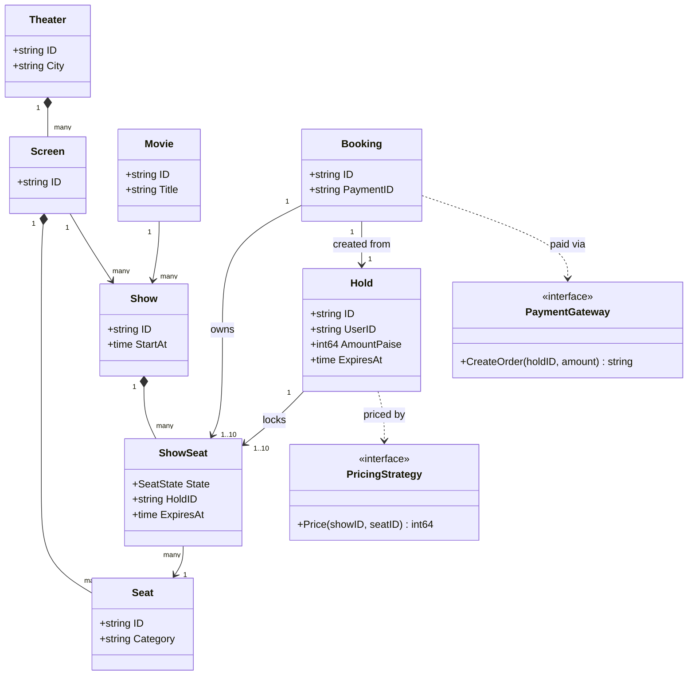
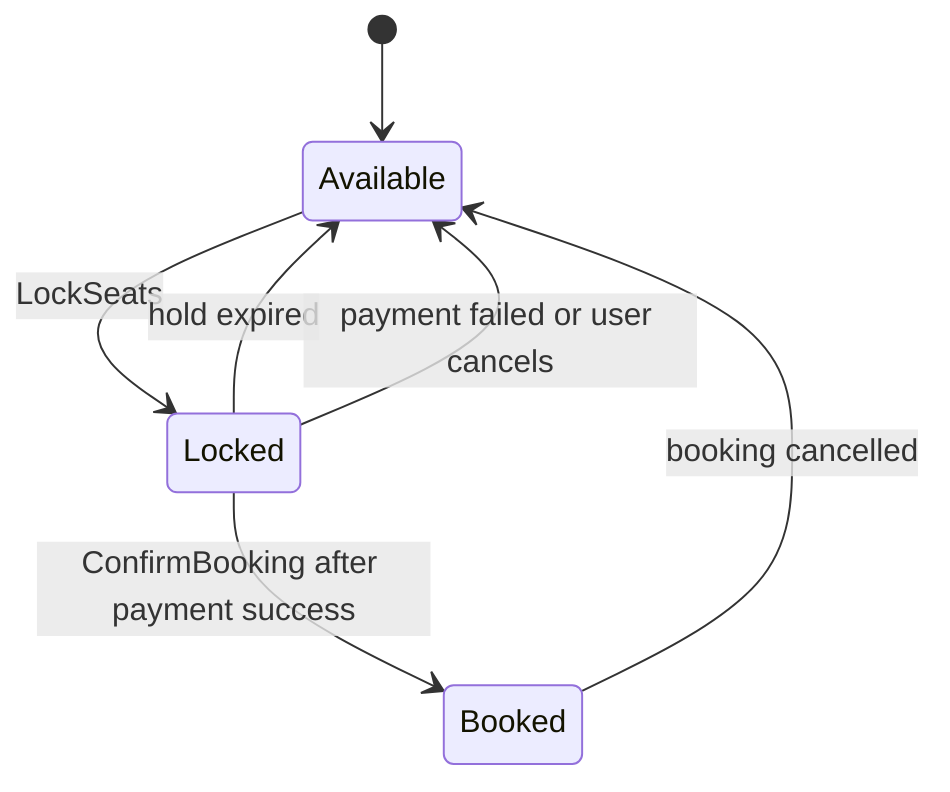
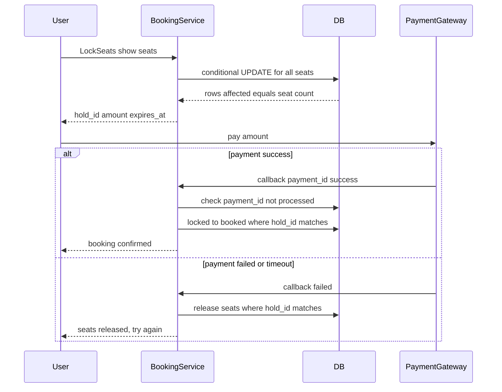

# Movie Ticket Booking LLD in Go

## Problem statement

```text
Design movie ticket booking like BookMyShow. Users browse movies and shows, view
the seat map, lock one or more seats for a few minutes, pay, and get a confirmed
booking. Expired locks must be released. Two users must never book the same seat.
```

- It tests one thing above all: **no double booking** under heavy concurrency. That means atomic, all-or-nothing multi-seat locking with a TTL.
- It also tests the seat state machine (available, locked, booked), idempotent payment callbacks, and modeling `ShowSeat` separately from `Seat`.

## How to use this note

- Open the drawing in [[#Drawing]] and redraw it yourself first. The seat state machine and the lock -> pay -> confirm flow are the two pictures to own.
- Attempt each step yourself (2-5 minutes of writing) before reading the step here.
- Time box it like the real round (from [[LLD Practice Roadmap]]): 10 min requirements + entities, 10 min APIs + storage, 25-40 min core code, 10 min edge cases, 5 min explaining out loud.

## Step 1: Clarify requirements

### Questions to ask

- How long is a seat hold, and can it be extended? *Assume: 10 minutes, no extension (extension is a follow-up).*
- Max seats per booking? *Assume: up to 10 seats, all from the same show.*
- Is pricing per seat category or time (Silver, Gold, Recliner, weekend)? *Assume: yes, behind a pricing strategy; price is fixed at lock time.*
- What if payment succeeds after the hold expired? *Assume: do not steal seats back; refund the payment.*
- Do we need cancellation and refunds? *Assume: cancel a hold yes; cancel a confirmed booking is a follow-up.*
- Single database or distributed lock store? *Assume: code in-memory with one mutex; explain the DB conditional UPDATE and Redis for scale.*

### Functional

- Browse movies, theaters, and shows by city and date.
- See the seat map of a show with each seat's state.
- Lock one or more seats for a show (hold for N minutes), all or nothing.
- Pay for the hold; on payment success the booking is confirmed.
- Release seats when the hold expires, the user cancels, or payment fails.

### Non-functional

- No double booking, even with thousands of users hitting the same show.
- Expired holds free seats automatically (lazily on read, plus a sweeper).
- Payment gateway callbacks can arrive twice or late: confirm must be idempotent.
- Seat map reads are heavy; locks on hot shows are contended.
- Money in `int64` paise.

### Out of scope

- Search ranking, recommendations, reviews.
- Payment gateway internals (we only get a callback).
- Refund processing details, food add-ons, offers and coupons.

## Step 2: Actors and use cases

| Actor | Use case |
|---|---|
| User | Browse shows, view seat map, lock seats, pay, cancel hold |
| Payment gateway | Sends success or failure callback for a hold |
| Sweeper job | Releases expired holds every few seconds |
| Theater admin | Creates theaters, screens, seats, shows, prices |
| Notification service | Sends ticket on `booking.confirmed` event |

Hardest use case: `LockSeats` for many seats at once under concurrency (all-or-nothing, no double lock), and its partner `ConfirmBooking` (idempotent, must verify the hold still owns the seats). Those two are the ones to code.

## Step 3: Entities

| Entity | Key fields | Why it exists |
|---|---|---|
| `Movie` | `ID`, `Title`, `DurationMin` | What is being shown |
| `Theater` | `ID`, `City` | Groups screens by location |
| `Screen` | `ID`, `TheaterID` | Has a fixed seat layout |
| `Seat` | `ID`, `Row`, `Category` | Physical seat; never changes per show |
| `Show` | `ID`, `MovieID`, `ScreenID`, `StartAt` | Movie + screen + time |
| `ShowSeat` | `ShowID`, `SeatID`, `State`, `HoldID`, `ExpiresAt`, `PricePaise` | **That seat for this show.** All state lives here |
| `Hold` (SeatLock) | `ID`, `UserID`, `SeatIDs`, `AmountPaise`, `ExpiresAt` | A user's temporary claim on seats, with a TTL |
| `Booking` | `ID`, `UserID`, `ShowID`, `SeatIDs`, `PaymentID`, `Status` | The confirmed result after payment |
| `Payment` | `ID`, `BookingID`, `AmountPaise`, `Status` | Gateway record; `PaymentID` is the idempotency key |

Modeling insight: **Seat vs ShowSeat**, like Book vs BookCopy. A physical seat A1 exists once, but it is "available" for the 6 PM show and "booked" for the 9 PM show. If you put `State` on `Seat`, the model breaks on the second show.

## Step 4: Relationships



- **Composition:** Theater owns Screens, Screen owns Seats, Show owns its ShowSeats. Delete the show and its show-seats go with it.
- **Association:** Show refers to a Movie and a Screen; ShowSeat refers to a physical Seat. They live independently.
- **Association with lifecycle:** a Hold points at the ShowSeats it locks; a Booking is created from a Hold and then owns those seats.
- **Dependency:** pricing and payment are interfaces, so Strategy and Adapter can swap them.

Seat state machine (the core of the problem):



## Step 5: APIs and public methods

```text
GET    /shows?movie_id=&city=&date=      -> list shows
GET    /shows/{show_id}/seats            -> seat map with state and price
POST   /shows/{show_id}/holds            -> body {seat_ids: [...]}; 201 {hold_id, amount_paise, expires_at}
                                            409 if any seat is taken
DELETE /holds/{hold_id}                  -> user cancels hold
POST   /holds/{hold_id}/payments         -> start payment; returns gateway order
POST   /payments/callback                -> gateway webhook {payment_id, hold_id, status}
GET    /bookings/{booking_id}
POST   /bookings/{booking_id}/cancel     -> follow-up: refund flow
```

```go
func (s *Service) LockSeats(ctx context.Context, showID, userID string, seatIDs []string) (Hold, error)
func (s *Service) ConfirmBooking(ctx context.Context, holdID, paymentID string) (Booking, error)
func (s *Service) ReleaseHold(ctx context.Context, holdID, userID string) error
func (s *Service) ReleaseExpiredLocks(ctx context.Context) int

type PricingStrategy interface {
    Price(showID, seatID string) int64
}
```

## Step 6: Storage and repositories

```sql
CREATE TABLE shows (
    id        TEXT PRIMARY KEY,
    movie_id  TEXT NOT NULL,
    screen_id TEXT NOT NULL,
    start_at  TIMESTAMPTZ NOT NULL,
    UNIQUE (screen_id, start_at)                       -- one show per screen per time
);

CREATE TABLE show_seats (
    show_id     TEXT NOT NULL REFERENCES shows(id),
    seat_id     TEXT NOT NULL,
    state       TEXT NOT NULL DEFAULT 'available'
                CHECK (state IN ('available', 'locked', 'booked')),
    hold_id     TEXT,
    hold_expiry TIMESTAMPTZ,
    price_paise BIGINT NOT NULL CHECK (price_paise >= 0),
    PRIMARY KEY (show_id, seat_id)
);
CREATE INDEX idx_show_seats_hold ON show_seats (hold_id);        -- confirm/release by hold
CREATE INDEX idx_show_seats_expiry ON show_seats (hold_expiry) WHERE state = 'locked'; -- sweeper

CREATE TABLE bookings (
    id           TEXT PRIMARY KEY,
    user_id      TEXT NOT NULL,
    show_id      TEXT NOT NULL REFERENCES shows(id),
    status       TEXT NOT NULL CHECK (status IN ('confirmed', 'cancelled')),
    amount_paise BIGINT NOT NULL,
    payment_id   TEXT NOT NULL UNIQUE,                 -- idempotent callback
    created_at   TIMESTAMPTZ NOT NULL
);

CREATE TABLE booking_seats (
    booking_id TEXT NOT NULL REFERENCES bookings(id),
    show_id    TEXT NOT NULL,
    seat_id    TEXT NOT NULL,
    active     BOOLEAN NOT NULL DEFAULT TRUE
);
-- last line of defence: one active booking per seat per show
CREATE UNIQUE INDEX uq_active_seat ON booking_seats (show_id, seat_id) WHERE active;

-- LockSeats: conditional UPDATE, all-or-nothing inside one transaction.
-- If affected rows != number of requested seats -> ROLLBACK.
UPDATE show_seats
SET state = 'locked', hold_id = $1, hold_expiry = now() + interval '10 minutes'
WHERE show_id = $2
  AND seat_id = ANY($3)
  AND (state = 'available' OR (state = 'locked' AND hold_expiry < now()));
```

```go
type ShowSeatRepository interface {
    // LockAll locks every seat or none; returns ErrSeatUnavailable on any conflict.
    LockAll(ctx context.Context, showID, holdID string, seatIDs []string, expiry time.Time) error
    MarkBooked(ctx context.Context, holdID string) (int, error) // rows changed
    ReleaseHold(ctx context.Context, holdID string) error
    ReleaseExpired(ctx context.Context, now time.Time) (int, error)
    SeatMap(ctx context.Context, showID string) ([]ShowSeat, error)
}

type BookingRepository interface {
    Create(ctx context.Context, b Booking) error // ErrDuplicate on payment_id
    GetByPaymentID(ctx context.Context, paymentID string) (Booking, error)
}
```

## Step 7: Patterns

| Pattern | Where | Why here |
|---|---|---|
| [[State Pattern in Go]] | `ShowSeat` states available, locked, booked; booking status | Only legal transitions are allowed; illegal ones are rejected in one place |
| [[Strategy Pattern in Go]] | `PricingStrategy` (`FlatPricing`, category or weekend pricing) | Pricing rules change often and independently of locking |
| [[Command Pattern in Go]] | `ReleaseExpiredLocks` sweeper job | A scheduled, retryable job that is safe to run twice |
| [[Repository Pattern in Go]] | `ShowSeatRepository`, `BookingRepository` | Swap in-memory maps for Postgres without touching the service |
| [[Adapter Pattern in Go]] | Razorpay or Paytm SDK behind one `PaymentGateway` interface | Domain never imports a vendor SDK |
| [[Observer Pattern in Go]] | `booking.confirmed` event to SMS, email, ticket QR | Booking does not wait on notifications |
| [[Facade Pattern in Go]] | `Service` hides lock + pay + confirm from HTTP handlers | Handlers call one method per use case |

Patterns NOT used and why:

- No full State-pattern object per seat (a struct per state with methods): three states and five transitions fit in one `switch`/condition; an object per state is overkill.
- No Singleton service: it is built in `main` and injected, so tests get a fresh one.

## Folder structure

```text
booking/
  model.go        -> Seat, Show, ShowSeat, Hold, Booking, SeatState, errors
  pricing.go      -> PricingStrategy, FlatPricing
  repository.go   -> ShowSeatRepository, BookingRepository + in-memory impl
  service.go      -> LockSeats, ConfirmBooking, ReleaseHold, ReleaseExpiredLocks
  sweeper.go      -> ticker that calls ReleaseExpiredLocks
  service_test.go -> tests
cmd/demo/main.go  -> wiring: repos, pricing, service, HTTP handlers, sweeper
```

- `model.go`: plain data plus the state enum and sentinel errors.
- `pricing.go`: the Strategy and its implementations.
- `service.go`: all the locking logic; in the code below the in-memory "repository" is the maps inside `Service`, so it compiles as one file.
- `sweeper.go`: a `time.Ticker` loop with `ctx` cancellation.

## Step 8: Core code

Main logic only. Full runnable code is folded below.

```go
type SeatState int

const (
    Available SeatState = iota
    Locked
    Booked
)

// showSeat is "this physical seat for this show". State lives here, not on Seat.
type showSeat struct {
    state     SeatState
    holdID    string
    expiresAt time.Time
}

type PricingStrategy interface{ Price(showID, seatID string) int64 }

// free: available, or locked by an expired hold (lazy expiry).
func free(st *showSeat, now time.Time) bool {
    return st.state == Available || (st.state == Locked && now.After(st.expiresAt))
}

// LockSeats holds all requested seats or none of them.
func (s *Service) LockSeats(ctx context.Context, showID, userID string, seatIDs []string) (Hold, error) {
    // ... ctx.Err() and empty-seats checks
    s.mu.Lock()
    defer s.mu.Unlock()
    show, ok := s.seats[showID]
    if !ok {
        return Hold{}, ErrShowNotFound
    }
    now := s.now()
    seen := map[string]bool{}
    // Phase 1: check every seat. No mutation yet, so failure leaves nothing half-locked.
    for _, id := range seatIDs {
        st, ok := show[id]
        if !ok {
            return Hold{}, fmt.Errorf("%w: %s", ErrSeatNotFound, id)
        }
        if seen[id] || !free(st, now) {
            return Hold{}, fmt.Errorf("%w: %s", ErrSeatUnavailable, id)
        }
        seen[id] = true
    }
    // Phase 2: all free, lock them together and price them now.
    s.seq++
    h := &Hold{ID: fmt.Sprintf("hold-%d", s.seq), ShowID: showID, UserID: userID /* ... */, ExpiresAt: now.Add(s.ttl)}
    for _, id := range seatIDs {
        st := show[id] // may overwrite an expired hold; that hold fails on confirm
        st.state, st.holdID, st.expiresAt = Locked, h.ID, h.ExpiresAt
        h.AmountPaise += s.pricing.Price(showID, id)
    }
    s.holds[h.ID] = h
    return *h, nil
}

// ConfirmBooking (payment callback), under s.mu:
//   seen paymentID -> return stored booking (idempotent webhook)
//   any seat not Locked by THIS hold, or expired -> releaseLocked(h), ErrHoldExpired (refund)
//   else flip all seats to Booked, delete hold, store booking by paymentID
```

### Walkthrough

`LockSeats(ctx, showID, userID, seatIDs)`:

1. Reject empty input and a cancelled context before taking the lock.
2. Take the service mutex. In-memory this is the critical section; in a DB it is one transaction.
3. **Phase 1, check only:** for every seat, confirm it exists, is not repeated in the request, and is free. "Free" means `Available`, or `Locked` with an expired hold (lazy expiry, so we do not depend on the sweeper running on time).
4. If any seat fails, return `ErrSeatUnavailable`. Nothing was changed, so the lock is all-or-nothing.
5. **Phase 2, mutate:** create a hold with `expiresAt = now + ttl`, mark every seat `Locked` with this `holdID`, and price each seat with the strategy (the price shown is the price charged).

`ConfirmBooking(ctx, holdID, paymentID)`:

1. If this `paymentID` was seen before, return the stored booking (webhooks are retried).
2. Find the hold; unknown hold (already released) -> `ErrHoldNotFound`, caller refunds.
3. Verify every seat is still `Locked` by **this** hold and not expired. A seat could have expired and been re-locked by someone else, so checking `holdID` matters.
4. If any check fails, release only what this hold still owns and return `ErrHoldExpired`; the caller refunds.
5. Otherwise flip all seats to `Booked`, delete the hold, save the booking keyed by `paymentID`.

`ReleaseHold` checks the caller owns the hold, then frees seats still owned by it. `ReleaseExpiredLocks` does the same for every expired hold.



> [!example]- Full runnable code (click to open)
> ```go
> package booking
>
> import (
>     "context"
>     "errors"
>     "fmt"
>     "sync"
>     "time"
> )
>
> var (
>     ErrNoSeats         = errors.New("no seats requested")
>     ErrShowNotFound    = errors.New("show not found")
>     ErrSeatNotFound    = errors.New("seat not found")
>     ErrSeatUnavailable = errors.New("seat unavailable")
>     ErrHoldNotFound    = errors.New("hold not found")
>     ErrHoldExpired     = errors.New("hold expired")
>     ErrNotHoldOwner    = errors.New("hold belongs to another user")
> )
>
> type SeatState int
>
> const (
>     Available SeatState = iota
>     Locked
>     Booked
> )
>
> func (s SeatState) String() string { return [...]string{"available", "locked", "booked"}[s] }
>
> // showSeat is "this physical seat for this show". State lives here, not on Seat.
> type showSeat struct {
>     state     SeatState
>     holdID    string
>     expiresAt time.Time
> }
>
> type Hold struct {
>     ID          string
>     ShowID      string
>     UserID      string
>     SeatIDs     []string
>     AmountPaise int64
>     ExpiresAt   time.Time
> }
>
> type Booking struct {
>     ID          string
>     ShowID      string
>     UserID      string
>     SeatIDs     []string
>     AmountPaise int64
>     PaymentID   string
> }
>
> // PricingStrategy prices one seat of one show (category, weekend, surge...).
> type PricingStrategy interface {
>     Price(showID, seatID string) int64
> }
>
> type FlatPricing struct{ Paise int64 }
>
> func (f FlatPricing) Price(string, string) int64 { return f.Paise }
>
> type Service struct {
>     mu        sync.Mutex
>     seats     map[string]map[string]*showSeat // showID -> seatID -> state
>     holds     map[string]*Hold
>     byPayment map[string]*Booking // idempotency: paymentID -> booking
>     pricing   PricingStrategy
>     ttl       time.Duration
>     now       func() time.Time // injected clock
>     seq       int
> }
>
> func NewService(ttl time.Duration, now func() time.Time) *Service {
>     return &Service{
>         seats:     map[string]map[string]*showSeat{},
>         holds:     map[string]*Hold{},
>         byPayment: map[string]*Booking{},
>         pricing:   FlatPricing{Paise: 20000}, // Rs 200 default
>         ttl:       ttl,
>         now:       now,
>     }
> }
>
> func (s *Service) SetPricing(p PricingStrategy) {
>     s.mu.Lock()
>     defer s.mu.Unlock()
>     s.pricing = p
> }
>
> func (s *Service) AddShow(showID string, seatIDs []string) {
>     s.mu.Lock()
>     defer s.mu.Unlock()
>     m := make(map[string]*showSeat, len(seatIDs))
>     for _, id := range seatIDs {
>         m[id] = &showSeat{state: Available}
>     }
>     s.seats[showID] = m
> }
>
> // free reports whether a seat can be locked: available, or locked by an expired hold.
> func free(st *showSeat, now time.Time) bool {
>     return st.state == Available || (st.state == Locked && now.After(st.expiresAt))
> }
>
> // LockSeats holds all requested seats or none of them.
> func (s *Service) LockSeats(ctx context.Context, showID, userID string, seatIDs []string) (Hold, error) {
>     if err := ctx.Err(); err != nil {
>         return Hold{}, err
>     }
>     if len(seatIDs) == 0 {
>         return Hold{}, ErrNoSeats
>     }
>     s.mu.Lock()
>     defer s.mu.Unlock()
>
>     show, ok := s.seats[showID]
>     if !ok {
>         return Hold{}, ErrShowNotFound
>     }
>     now := s.now()
>     seen := map[string]bool{}
>     // Phase 1: check every seat. No mutation yet, so failure leaves nothing half-locked.
>     for _, id := range seatIDs {
>         st, ok := show[id]
>         if !ok {
>             return Hold{}, fmt.Errorf("%w: %s", ErrSeatNotFound, id)
>         }
>         if seen[id] || !free(st, now) {
>             return Hold{}, fmt.Errorf("%w: %s", ErrSeatUnavailable, id)
>         }
>         seen[id] = true
>     }
>     // Phase 2: all free, lock them together and price them now (price shown = price charged).
>     s.seq++
>     h := &Hold{
>         ID:        fmt.Sprintf("hold-%d", s.seq),
>         ShowID:    showID,
>         UserID:    userID,
>         SeatIDs:   append([]string(nil), seatIDs...),
>         ExpiresAt: now.Add(s.ttl),
>     }
>     for _, id := range seatIDs {
>         st := show[id] // may overwrite an expired hold; that hold fails on confirm
>         st.state, st.holdID, st.expiresAt = Locked, h.ID, h.ExpiresAt
>         h.AmountPaise += s.pricing.Price(showID, id)
>     }
>     s.holds[h.ID] = h
>     return *h, nil
> }
>
> // ConfirmBooking is called from the payment success callback.
> // The same paymentID twice returns the same booking (gateways retry webhooks).
> func (s *Service) ConfirmBooking(ctx context.Context, holdID, paymentID string) (Booking, error) {
>     if err := ctx.Err(); err != nil {
>         return Booking{}, err
>     }
>     s.mu.Lock()
>     defer s.mu.Unlock()
>
>     if b, ok := s.byPayment[paymentID]; ok {
>         return *b, nil
>     }
>     h, ok := s.holds[holdID]
>     if !ok {
>         return Booking{}, ErrHoldNotFound
>     }
>     now := s.now()
>     show := s.seats[h.ShowID]
>     for _, id := range h.SeatIDs {
>         st := show[id]
>         if st.state != Locked || st.holdID != holdID || now.After(st.expiresAt) {
>             s.releaseLocked(h)
>             return Booking{}, ErrHoldExpired // caller triggers refund
>         }
>     }
>     for _, id := range h.SeatIDs {
>         show[id].state, show[id].holdID = Booked, ""
>     }
>     delete(s.holds, holdID)
>     b := &Booking{
>         ID: "bk-" + holdID, ShowID: h.ShowID, UserID: h.UserID,
>         SeatIDs: h.SeatIDs, AmountPaise: h.AmountPaise, PaymentID: paymentID,
>     }
>     s.byPayment[paymentID] = b
>     return *b, nil
> }
>
> // ReleaseHold is used on payment failure or user cancel. Only the owner may release.
> func (s *Service) ReleaseHold(ctx context.Context, holdID, userID string) error {
>     s.mu.Lock()
>     defer s.mu.Unlock()
>     h, ok := s.holds[holdID]
>     if !ok {
>         return ErrHoldNotFound
>     }
>     if h.UserID != userID {
>         return ErrNotHoldOwner
>     }
>     s.releaseLocked(h)
>     return nil
> }
>
> // releaseLocked frees only seats still owned by this hold. Caller holds s.mu.
> func (s *Service) releaseLocked(h *Hold) {
>     show := s.seats[h.ShowID]
>     for _, id := range h.SeatIDs {
>         if st := show[id]; st.state == Locked && st.holdID == h.ID {
>             st.state, st.holdID = Available, ""
>         }
>     }
>     delete(s.holds, h.ID)
> }
>
> // ReleaseExpiredLocks is run by a background sweeper (Command/job). Returns holds released.
> func (s *Service) ReleaseExpiredLocks(ctx context.Context) int {
>     s.mu.Lock()
>     defer s.mu.Unlock()
>     now, n := s.now(), 0
>     for _, h := range s.holds {
>         if now.After(h.ExpiresAt) {
>             s.releaseLocked(h)
>             n++
>         }
>     }
>     return n
> }
>
> func (s *Service) SeatState(showID, seatID string) SeatState {
>     s.mu.Lock()
>     defer s.mu.Unlock()
>     return s.seats[showID][seatID].state
> }
> ```

## Test cases

| Test | Proves |
|---|---|
| `TestLockSeatsValidation` (table) | Empty seats, unknown show, unknown seat, duplicate seat in request, partly taken seats; a failed lock leaves nothing half-locked |
| `TestLockPayConfirm` | Hold amount is priced; confirm books seats; same `paymentID` twice returns the same booking |
| `TestPaymentFailureReleases` | Only the owner can release; release frees seats; a late confirm on a released hold fails |
| `TestExpiry` | Expired hold is free for another user; old hold's confirm fails with `ErrHoldExpired` and does not free the new owner's seat; sweeper releases expired holds |
| `TestConcurrentLock` | 100 goroutines lock the same 2 seats: exactly 1 winner |

> [!example]- Full test code (click to open)
> ```go
> package booking
>
> import (
>     "context"
>     "errors"
>     "sync"
>     "sync/atomic"
>     "testing"
>     "time"
> )
>
> func newTestService() (*Service, *time.Time) {
>     now := time.Unix(0, 0)
>     s := NewService(10*time.Minute, func() time.Time { return now })
>     s.AddShow("s1", []string{"A1", "A2", "A3"})
>     return s, &now
> }
>
> func TestLockSeatsValidation(t *testing.T) {
>     tests := []struct {
>         name    string
>         show    string
>         seats   []string
>         wantErr error
>     }{
>         {"no seats", "s1", nil, ErrNoSeats},
>         {"unknown show", "s9", []string{"A1"}, ErrShowNotFound},
>         {"unknown seat", "s1", []string{"Z9"}, ErrSeatNotFound},
>         {"same seat twice in request", "s1", []string{"A3", "A3"}, ErrSeatUnavailable},
>         {"one seat already locked -> none locked", "s1", []string{"A3", "A1"}, ErrSeatUnavailable},
>         {"free seat", "s1", []string{"A3"}, nil},
>     }
>     for _, tc := range tests {
>         t.Run(tc.name, func(t *testing.T) {
>             s, _ := newTestService()
>             if _, err := s.LockSeats(context.Background(), "s1", "u1", []string{"A1"}); err != nil {
>                 t.Fatal(err)
>             }
>             _, err := s.LockSeats(context.Background(), tc.show, "u2", tc.seats)
>             if !errors.Is(err, tc.wantErr) {
>                 t.Fatalf("got %v want %v", err, tc.wantErr)
>             }
>             if err != nil && s.SeatState("s1", "A3") != Available {
>                 t.Fatal("failed lock must not leave A3 half-locked")
>             }
>         })
>     }
> }
>
> func TestLockPayConfirm(t *testing.T) {
>     s, _ := newTestService()
>     ctx := context.Background()
>     h, err := s.LockSeats(ctx, "s1", "u1", []string{"A1", "A2"})
>     if err != nil || h.AmountPaise != 40000 {
>         t.Fatal(h, err)
>     }
>     b, err := s.ConfirmBooking(ctx, h.ID, "p1")
>     if err != nil {
>         t.Fatal(err)
>     }
>     b2, err := s.ConfirmBooking(ctx, h.ID, "p1") // webhook retried
>     if err != nil || b2.ID != b.ID {
>         t.Fatal("not idempotent", err)
>     }
>     if s.SeatState("s1", "A1") != Booked || s.SeatState("s1", "A2") != Booked {
>         t.Fatal("not booked")
>     }
> }
>
> func TestPaymentFailureReleases(t *testing.T) {
>     s, _ := newTestService()
>     ctx := context.Background()
>     h, _ := s.LockSeats(ctx, "s1", "u1", []string{"A1"})
>     if err := s.ReleaseHold(ctx, h.ID, "u2"); !errors.Is(err, ErrNotHoldOwner) {
>         t.Fatal(err)
>     }
>     if err := s.ReleaseHold(ctx, h.ID, "u1"); err != nil {
>         t.Fatal(err)
>     }
>     if s.SeatState("s1", "A1") != Available {
>         t.Fatal("seat not released")
>     }
>     if _, err := s.ConfirmBooking(ctx, h.ID, "p-late"); !errors.Is(err, ErrHoldNotFound) {
>         t.Fatal(err)
>     }
> }
>
> func TestExpiry(t *testing.T) {
>     s, now := newTestService()
>     ctx := context.Background()
>     h3, _ := s.LockSeats(ctx, "s1", "u3", []string{"A3"})
>     *now = now.Add(11 * time.Minute)
>     if _, err := s.LockSeats(ctx, "s1", "u4", []string{"A3"}); err != nil {
>         t.Fatal("expired hold should be free", err)
>     }
>     if _, err := s.ConfirmBooking(ctx, h3.ID, "p3"); !errors.Is(err, ErrHoldExpired) {
>         t.Fatal(err)
>     }
>     if s.SeatState("s1", "A3") != Locked {
>         t.Fatal("must not release other user's lock")
>     }
>     *now = now.Add(11 * time.Minute)
>     if n := s.ReleaseExpiredLocks(ctx); n != 1 {
>         t.Fatal(n)
>     }
>     if s.SeatState("s1", "A3") != Available {
>         t.Fatal("sweeper did not free A3")
>     }
> }
>
> // 100 users race for the same 2 seats: exactly one hold wins.
> func TestConcurrentLock(t *testing.T) {
>     s := NewService(time.Minute, time.Now)
>     s.AddShow("s1", []string{"A1", "A2"})
>     var ok int32
>     var wg sync.WaitGroup
>     for i := 0; i < 100; i++ {
>         wg.Add(1)
>         go func() {
>             defer wg.Done()
>             if _, err := s.LockSeats(context.Background(), "s1", "u", []string{"A1", "A2"}); err == nil {
>                 atomic.AddInt32(&ok, 1)
>             }
>         }()
>     }
>     wg.Wait()
>     if ok != 1 {
>         t.Fatalf("want 1 winner got %d", ok)
>     }
> }
> ```

Run with `go test -race -count=1 ./...`.

## Step 9: Edge cases

| Edge case | What happens | How the design handles it |
|---|---|---|
| Race: two users lock the same seat | Both read "available" and both lock | In code: one mutex around check + mutate. In DB: conditional `UPDATE ... WHERE state='available' OR expired`, compare affected rows to requested count, rollback if short |
| Partial seat availability | A1, A2 free but A3 taken | Phase 1 checks all before mutating (or transaction rollback): no seat is left half-locked |
| Same seat twice in one request | Would count as 2 seats | `seen` set rejects it |
| Lock expiry | User walks away | TTL on every hold; lazy expiry on lock, plus `ReleaseExpiredLocks` sweeper |
| Payment failure | Seats stay locked | Failure callback calls `ReleaseHold`; if no callback, TTL frees them |
| Duplicate confirmation (webhook retry) | Two bookings for one payment | `byPayment` map in code; `bookings.payment_id UNIQUE` in DB, on conflict read and return existing |
| Payment success after expiry | Seats may now belong to someone else | Do not steal them: `ErrHoldExpired`, refund the payment |
| Release by seat ID only | Frees a seat another user now holds | Always match `hold_id` when releasing or confirming |
| Sweeper vs confirm race | Both touch the same hold | Both run under the same lock / both use `WHERE hold_id = $1 AND state='locked'`; only one wins |
| Deadlocks in DB | Two transactions lock rows in different orders | Sort seat IDs before `SELECT ... FOR UPDATE` |
| Bug in hold logic | Could create two bookings per seat | Partial unique index `uq_active_seat` on `booking_seats` is the final guarantee |
| Hot show (blockbuster release) | One mutex or row set is contended | Per-show lock; Redis `SET seat:{show}:{seat} hold NX PX 600000`; virtual waiting room |

## Step 10: Tradeoffs and extensions

| Follow-up | Design change |
|---|---|
| Millions of users on a release | Shard lock per show; Redis `SET NX PX` per seat for holds; DB unique index for final booking; waiting room queue |
| User wants to extend the hold | `UPDATE show_seats SET hold_expiry = ... WHERE hold_id = $1 AND hold_expiry > now()`; cap extensions |
| Different prices per category or weekend | New `PricingStrategy`; store price on `show_seats` at lock time |
| Cancel a confirmed booking with refund | Booking state confirmed -> cancelled; `booking_seats.active = false`; seats back to available; refund via `PaymentGateway` adapter |
| Seat map is read-heavy | Cache seat map per show with a short TTL; invalidate on lock and confirm events |
| Notify user after booking | Publish `booking.confirmed`; Observer subscribers send SMS, email, ticket QR |
| Seat selection rules (no single gap left) | Validation chain before lock: [[Chain of Responsibility Pattern in Go]] |

### Tradeoffs I chose

- One in-memory mutex for the whole service: simple and obviously correct for the interview; per-show locks or the DB are the scale answer.
- Pessimistic hold (lock before pay) over optimistic (pay then try to book): users hate paying and then losing seats.
- Lazy expiry plus sweeper: correctness never depends on the sweeper timing; the sweeper only keeps the seat map clean.
- Idempotency on `paymentID`, not `holdID`: the gateway retries with the same payment ID.
- Price computed at lock time and stored on the hold: what the user saw is what they pay.

## Drawing

![[Movie Ticket Booking LLD Drawing.excalidraw]]

The drawing shows:

- Entities: Theater -> Screen -> Seat, Movie -> Show -> ShowSeat, Hold and Booking, with `PricingStrategy` and `PaymentGateway` interfaces.
- Core flow: user -> `LockSeats` -> pay -> `ConfirmBooking` -> booked, with the red failure branches (seat taken -> 409, payment failed -> release, payment after expiry -> refund).
- Seat state machine: available -> locked -> booked, plus expiry, payment failure, and cancellation back to available.
- Storage: `show_seats`, `bookings`, `booking_seats` with their key constraints.

Redraw it from memory:

- [ ] Seat vs ShowSeat, and where the state lives.
- [ ] The 3 seat states with all 5 labeled transitions.
- [ ] Lock -> pay -> confirm, with the payment-failure and late-payment branches.
- [ ] The conditional UPDATE and the two unique constraints (`payment_id`, active seat).

## Interview explanation

```text
The core entity is ShowSeat, one row per seat per show, with a state machine of available, locked and booked; state lives there, not on the physical Seat.
LockSeats checks every requested seat and locks all of them in one critical section, or one DB transaction with a conditional UPDATE, so a multi-seat hold is all-or-nothing and two users can never hold the same seat.
Each hold has a TTL; expired holds are treated as free on read and also cleaned by a sweeper job.
On the payment callback, ConfirmBooking is idempotent on payment_id, verifies the seats are still held by that exact hold, and flips them to booked; otherwise it releases and refunds.
A partial unique index on active booking seats is the final guarantee against double booking.
```

## Related

- [[LLD Practice Roadmap]]
- [[LLD Question Bank with Answers]]
- [[State Pattern in Go]]
- [[Strategy Pattern in Go]]
- [[Command Pattern in Go]]
- [[Repository Pattern in Go]]
- [[Adapter Pattern in Go]]
- [[Observer Pattern in Go]]
- [[Facade Pattern in Go]]
- [[Concurrency in Go LLD]]
- [[Testing LLD Code in Go]]
- [[UML for LLD Interviews]]
- [[Error Handling and Interfaces in Go LLD]]
