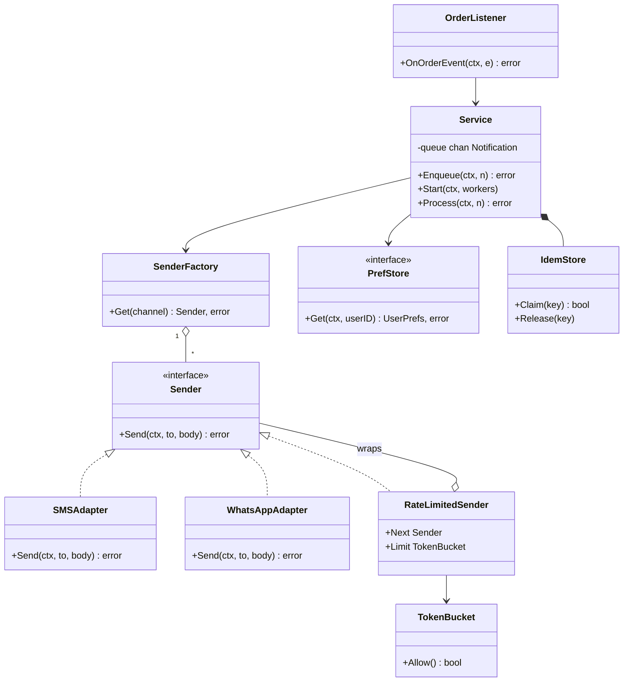
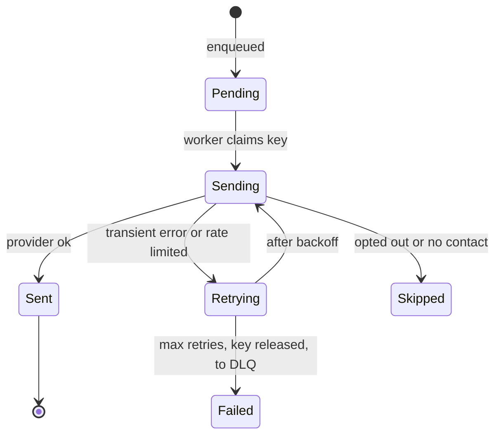
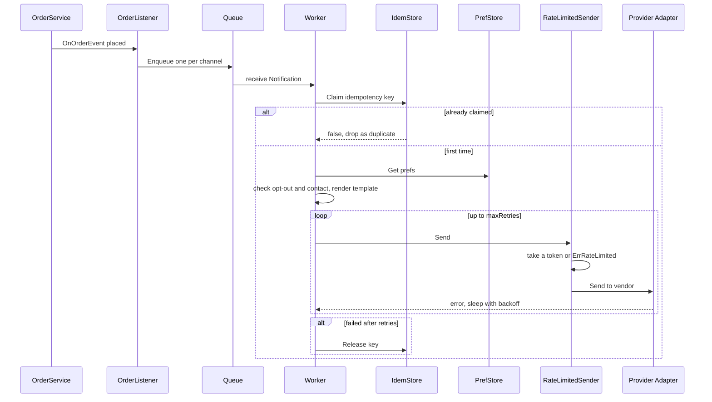

# Notification System LLD in Go

## Problem statement

```text
Design a notification system that sends email, SMS, push and WhatsApp messages when
business events happen (order placed, order delivered). Respect user preferences,
render templates, retry failed sends, never send the same message twice, and respect
each provider's rate limit. Adding a new channel or provider should be easy.
Design the classes, APIs, DB schema, and code the send path.
```

What it really tests: Factory + Adapter for many providers behind one interface, async worker pools with channels, retry with backoff, idempotency under concurrent duplicates, and rate limiting as a decorator.

## How to use this note

- Open the drawing below ([[Notification System LLD Drawing.excalidraw]]), study it for 2 minutes, close it, and redraw it yourself.
- Attempt each step before reading it. Cover the section, write your answer, then compare.
- Time box 60 minutes, as in the [[LLD Practice Roadmap]] daily method: 10 min requirements and entities, 10 min APIs and storage, 25-40 min core code (`Process` + worker pool + one adapter), 10 min edge cases, 5 min explaining out loud.

## Step 1: Clarify requirements

### Questions to ask

- Which channels, and which are transactional vs marketing? *Assume: email, SMS, push, WhatsApp; transactional order updates first, marketing later.*
- At-least-once or exactly-once delivery expectation? *Assume: at-least-once from the queue, made effectively once with an idempotency key.*
- Do we need scheduled sends or quiet hours? *Assume: not in v1, follow-up.*
- Priority: should OTP skip the queue ahead of promos? *Assume: one queue in v1; priority queues are a follow-up.*
- Do we need delivery status tracking (sent, delivered, failed)? *Assume: we store sent/failed; delivered comes later from provider webhooks.*
- Rate limits per provider or per user? *Assume: per provider (e.g. SMS vendor allows 100 sends/s on our account); per-user limits are a follow-up.*
- WhatsApp consent? *Assume: WhatsApp needs explicit opt-in; no stored WhatsApp number means not opted in.*

### Functional

- Send via channels: email, SMS, push, WhatsApp.
- Each channel uses a third-party provider (SES, Twilio, FCM, WhatsApp Business API), wrapped by an adapter.
- Respect user preferences: opt-out per channel, contact per channel.
- Render messages from templates with data (`Order {{.OrderID}} placed`).
- Triggered by order events (order placed, shipped, delivered).
- Retry failed sends with exponential backoff.
- Per-provider rate limit: never exceed the provider's sends per second.

### Non-functional

- Async: the order flow must not wait for SMS providers.
- No duplicate sends when the same event is delivered twice.
- Bounded queue: return an error instead of blocking when full.
- Provider outage must not lose messages (outbox + DLQ in follow-ups).
- Graceful shutdown: workers stop on context cancel.
- Easy to add a new channel or switch provider: new adapter + one factory entry.

### Out of scope

- Template authoring UI, localization.
- Marketing campaign targeting and segmentation.
- In-app inbox.
- Provider-side delivery receipts (mentioned as follow-up).

## Step 2: Actors and use cases

| Actor | Use case |
|---|---|
| Order service (via events) | Publish order placed / delivered; listener turns it into notifications |
| Internal caller | `POST /notifications` for a one-off send (OTP, alerts) |
| User | Update channel preferences, opt out, opt in to WhatsApp |
| Worker (system) | Claim key, check prefs, render, rate limit, send, retry |
| Provider | Accept the message, later send status webhooks |
| Ops | Replay failed messages from the DLQ |

Hardest use case, the one to code: **Process one notification in a worker**: idempotency claim, preferences, template, rate-limited send with backoff, release on failure.

## Step 3: Entities

| Entity | Key fields | Why it exists |
|---|---|---|
| `Notification` | IdempotencyKey, UserID, Channel, TemplateID, Data | One message to one user on one channel |
| `Channel` | email, sms, push, whatsapp | Picks the sender and the contact |
| `Template` | ID, Channel, Body | Text with placeholders, kept out of code |
| `UserPrefs` | Contacts per channel, OptedOut per channel | Consent and addresses |
| `Sender` (interface) | `Send(ctx, to, body)` | One shape every provider is adapted to |
| `Provider adapter` | SMSAdapter, WhatsAppAdapter | Wraps one vendor SDK |
| `TokenBucket` | capacity, perSec, tokens, last | Per-provider rate limit |
| `DeliveryAttempt` | NotificationID, attempt, error, at | History of retries (DB only) |

Modeling insight: **Channel is not Provider.** The channel (SMS) is what the user sees; the provider (Twilio, Gupshup) is who sends it. The service only knows channels and the `Sender` interface; which provider sits behind a channel is wiring. That is why switching SMS vendor, adding failover, or wrapping a rate limiter never touches `Service`.

## Step 4: Relationships



- **Realization**: `SMSAdapter`, `WhatsAppAdapter`, `RateLimitedSender` all implement `Sender`.
- **Aggregation**: `SenderFactory` holds one `Sender` per channel; senders are built outside and passed in. `RateLimitedSender` wraps another `Sender` (decorator).
- **Composition**: `Service` creates and owns its `IdemStore` and queue.
- **Dependency**: `OrderListener` only calls `Service.Enqueue`; the order service never imports provider code.



## Step 5: APIs and public methods

```text
POST /notifications
  { "idempotency_key": "order:123:placed:sms", "user_id": "u1",
    "channel": "sms", "template_id": "placed", "data": {"OrderID": "123"} }
  -> 202 Accepted | 409 Duplicate | 503 Queue full

GET  /notifications/{id}                 -> status, attempts, last_error
GET  /users/{id}/preferences
PUT  /users/{id}/preferences             { "sms": false, "email": true, "whatsapp_opt_in": true }

POST /webhooks/providers/{provider}      delivery receipts (verify signature)
```

```go
func NewService(f *SenderFactory, p PrefStore, t map[string]*template.Template, queueSize int) *Service
func (s *Service) Enqueue(ctx context.Context, n Notification) error // non-blocking, ErrQueueFull
func (s *Service) Start(ctx context.Context, workers int)
func (s *Service) Process(ctx context.Context, n Notification) error
func (l OrderListener) OnOrderEvent(ctx context.Context, e OrderEvent) error

// per-provider rate limit as a decorator
func NewTokenBucket(capacity, perSec float64, now func() time.Time) *TokenBucket
type RateLimitedSender struct{ Next Sender; Limit *TokenBucket }
```

## Step 6: Storage and repositories

```sql
CREATE TABLE user_preferences (
    user_id    TEXT NOT NULL,
    channel    TEXT NOT NULL,             -- email | sms | push | whatsapp
    contact    TEXT NOT NULL,             -- address, phone, device token
    opted_out  BOOLEAN NOT NULL DEFAULT false,
    opted_in_at TIMESTAMPTZ NULL,         -- required for whatsapp
    PRIMARY KEY (user_id, channel)
);

CREATE TABLE templates (
    id       TEXT NOT NULL,               -- "placed"
    channel  TEXT NOT NULL,
    body     TEXT NOT NULL,
    PRIMARY KEY (id, channel)
);

CREATE TABLE notifications (
    id               BIGSERIAL PRIMARY KEY,
    idempotency_key  TEXT NOT NULL UNIQUE, -- blocks duplicate sends
    user_id          TEXT NOT NULL,
    channel          TEXT NOT NULL,
    template_id      TEXT NOT NULL,
    payload          JSONB NOT NULL,
    status           TEXT NOT NULL DEFAULT 'pending', -- pending|sent|failed|skipped
    attempts         INT  NOT NULL DEFAULT 0,
    provider_msg_id  TEXT NULL,
    last_error       TEXT,
    created_at       TIMESTAMPTZ NOT NULL DEFAULT now()
);
CREATE INDEX notifications_status ON notifications (status, created_at); -- retry / DLQ sweeps

CREATE TABLE delivery_attempts (
    notification_id BIGINT NOT NULL REFERENCES notifications(id),
    attempt         INT NOT NULL,
    provider        TEXT NOT NULL,
    error           TEXT,
    at              TIMESTAMPTZ NOT NULL DEFAULT now(),
    PRIMARY KEY (notification_id, attempt)
);

CREATE TABLE provider_limits (
    provider        TEXT PRIMARY KEY,     -- twilio, gupshup, whatsapp_cloud
    sends_per_sec   INT NOT NULL,
    burst           INT NOT NULL
);
```

Claiming the key in prod: `INSERT INTO notifications (idempotency_key, ...) ON CONFLICT DO NOTHING` (0 rows = duplicate), or Redis `SET key 1 NX EX 86400`. The shared rate limit across many worker pods lives in Redis (token bucket in a Lua script), keyed by provider.

```go
type PrefStore interface {
    Get(ctx context.Context, userID string) (UserPrefs, error)
}

type NotificationRepository interface {
    Claim(ctx context.Context, n Notification) (claimed bool, err error) // INSERT ... ON CONFLICT DO NOTHING
    MarkSent(ctx context.Context, key, providerMsgID string) error
    MarkFailed(ctx context.Context, key string, err error) error
}

type TemplateRepository interface {
    Get(ctx context.Context, id string, ch Channel) (string, error)
}
```

## Step 7: Patterns

| Pattern | Where | Why here |
|---|---|---|
| [[Factory Pattern in Go]] | `SenderFactory.Get(channel)` | No `switch channel` in the service; new channel = new map entry |
| [[Adapter Pattern in Go]] | `SMSAdapter`, `WhatsAppAdapter` | Each vendor SDK has its own shape; adapt to one `Sender` |
| [[Decorator Middleware Pattern in Go]] | `RateLimitedSender` wraps any `Sender` | Rate limit per provider without touching adapters or service; same idea for logging, metrics, circuit breaker |
| [[Observer Pattern in Go]] | `OrderListener.OnOrderEvent` | Order service publishes; notifications react, no coupling |
| [[Strategy Pattern in Go]] | each `Sender` is a delivery strategy; backoff policy can be one too | Swap behavior per channel |
| [[Repository Pattern in Go]] | `PrefStore` | Hides where preferences live |
| [[Facade Pattern in Go]] | `Service.Process` | Hides prefs, templates, idempotency and retry |
| Worker pool, see [[Concurrency in Go LLD]] | buffered channel + N goroutines in `Start` | Async sends, bounded concurrency |

Patterns NOT used and why:

- No Builder for `Notification`: five plain fields, a struct literal is clear.
- No Chain of Responsibility for provider failover in v1: one provider per channel. Add it when a second SMS vendor is signed (see follow-ups).

## Folder structure

```text
notification/
  model.go          -> Channel, Notification, errors
  sender.go         -> Sender interface, SMSAdapter, WhatsAppAdapter (+ vendor client interfaces)
  ratelimit.go      -> TokenBucket, RateLimitedSender (decorator)
  factory.go        -> SenderFactory
  store.go          -> UserPrefs, PrefStore, IdemStore
  service.go        -> Service: Enqueue, Start, Wait, Process, deliver
  listener.go       -> OrderEvent, OrderListener
  service_test.go   -> tests
cmd/demo/main.go    -> wiring: real SDK clients -> adapters -> RateLimitedSender per provider -> factory -> Service.Start
```

- `sender.go` is the only file that knows vendor shapes.
- `ratelimit.go` has the only shared mutable state across workers besides the idempotency store, guarded by its own mutex.
- `service.go` knows the order of steps; it never names a provider.

## Step 8: Core code

Main logic only. Full runnable code is folded below.

```go
type Sender interface {
    Send(ctx context.Context, to, body string) error
}

// Adapter: WhatsApp Business API shape -> Sender
func (a WhatsAppAdapter) Send(ctx context.Context, to, body string) error {
    _, err := a.Client.PostMessage(ctx, WhatsAppMessage{To: to, Type: "text", Text: body})
    return err
}

// Decorator: per-provider token bucket in front of any Sender
func (r RateLimitedSender) Send(ctx context.Context, to, body string) error {
    if !r.Limit.Allow() { // refill elapsed*perSec tokens (injected clock), take one
        return ErrRateLimited // transient: the retry loop backs off
    }
    return r.Next.Send(ctx, to, body)
}

// Process: idempotency -> prefs -> template -> send with retry.
func (s *Service) Process(ctx context.Context, n Notification) error {
    if !s.idem.Claim(n.IdempotencyKey) {
        return ErrDuplicate
    }
    err := s.deliver(ctx, n)
    if err != nil {
        s.idem.Release(n.IdempotencyKey) // allow a later retry / replay
    }
    return err
}

func (s *Service) deliver(ctx context.Context, n Notification) error {
    prefs, err := s.prefs.Get(ctx, n.UserID)
    // ... OptedOut[n.Channel] -> ErrOptedOut
    to, ok := prefs.Contacts[n.Channel] // !ok -> ErrNoContact
    // ... render template into buf
    sender, err := s.factory.Get(n.Channel)
    // ... return err
    delay := s.baseDelay
    for attempt := 0; ; attempt++ {
        if err = sender.Send(ctx, to, buf.String()); err == nil {
            return nil
        }
        if attempt == s.maxRetries {
            return fmt.Errorf("send failed after %d retries: %w", attempt, err)
        }
        select {
        case <-ctx.Done():
            return ctx.Err()
        case <-time.After(delay):
            delay *= 2 // exponential backoff
        }
    }
}
```

### Walkthrough

`Process(ctx, n)` (run by each worker):

1. `Claim(idempotencyKey)`. If the key is already claimed, return `ErrDuplicate`. The claim is atomic under a mutex, so two workers with the same key cannot both pass. In prod this is an `INSERT` into `notifications` with a `UNIQUE` key, or Redis `SET key NX`.
2. Load user preferences. If the channel is opted out, return `ErrOptedOut`. If there is no contact (for WhatsApp: the user never opted in), return `ErrNoContact`.
3. Render the template with `text/template` and `n.Data`.
4. Get the `Sender` from the factory. For SMS and WhatsApp this is a `RateLimitedSender` wrapping the adapter.
5. Retry loop: call `Send`. The decorator takes a token from the provider's bucket; if none is left it returns `ErrRateLimited` without calling the vendor. On any error, wait `delay` then double it (100 ms, 200 ms, 400 ms). The wait uses `select` on `ctx.Done()` so shutdown is not blocked. A rate-limited send naturally succeeds on a later attempt, once tokens refill.
6. If all retries fail, `Release` the key so a later replay (from the outbox or DLQ) can send it again.

`TokenBucket.Allow`: refill `elapsed seconds x perSec` tokens (capped at capacity) using the injected clock, then take one if available. One bucket per provider account is shared by all workers, so the limit holds no matter how many goroutines send.

`WhatsAppAdapter.Send` converts `(to, body)` into the WhatsApp API's `WhatsAppMessage{To, Type: "text", Text}`. Adding the channel was: one constant, one adapter, one factory entry. `Service` did not change.

`Enqueue` uses `select` with `default`, so it returns `ErrQueueFull` instead of blocking the order flow.

> [!example]- Full runnable code (click to open)
> ```go
> package notification
>
> import (
>     "bytes"
>     "context"
>     "errors"
>     "fmt"
>     "sync"
>     "text/template"
>     "time"
> )
>
> // ---------- model.go: channels, notification, errors ----------
>
> var (
>     ErrUnknownChannel = errors.New("notification: unknown channel")
>     ErrOptedOut       = errors.New("notification: user opted out")
>     ErrQueueFull      = errors.New("notification: queue full")
>     ErrDuplicate      = errors.New("notification: duplicate idempotency key")
>     ErrNoContact      = errors.New("notification: user has no contact for channel")
>     ErrRateLimited    = errors.New("notification: provider rate limit hit")
> )
>
> type Channel string
>
> const (
>     Email    Channel = "email"
>     SMS      Channel = "sms"
>     Push     Channel = "push"
>     WhatsApp Channel = "whatsapp" // needs explicit opt-in: no contact stored = not opted in
> )
>
> type Notification struct {
>     IdempotencyKey string // e.g. "order:123:placed:sms"
>     UserID         string
>     Channel        Channel
>     TemplateID     string
>     Data           map[string]any
> }
>
> // ---------- sender.go: Sender interface + provider adapters ----------
>
> // Sender is the common interface every provider is adapted to.
> type Sender interface {
>     Send(ctx context.Context, to, body string) error
> }
>
> // Adapter: third-party SMS SDK has its own shape; adapt it to Sender.
> type SMSProviderClient interface {
>     SendSMS(phone, text string) (msgID string, err error)
> }
>
> type SMSAdapter struct{ Client SMSProviderClient }
>
> func (a SMSAdapter) Send(ctx context.Context, to, body string) error {
>     _, err := a.Client.SendSMS(to, body)
>     return err
> }
>
> // Adapter: WhatsApp Business API has a different request shape.
> type WhatsAppMessage struct {
>     To   string // phone in E.164
>     Type string // "text" (or "template" for messages outside the 24 h window)
>     Text string
> }
>
> type WhatsAppClient interface {
>     PostMessage(ctx context.Context, m WhatsAppMessage) (messageID string, err error)
> }
>
> type WhatsAppAdapter struct{ Client WhatsAppClient }
>
> func (a WhatsAppAdapter) Send(ctx context.Context, to, body string) error {
>     _, err := a.Client.PostMessage(ctx, WhatsAppMessage{To: to, Type: "text", Text: body})
>     return err
> }
>
> // ---------- ratelimit.go: token bucket decorator ----------
>
> // Decorator: per-provider rate limit (token bucket) in front of any Sender.
> // ErrRateLimited is transient, so the retry loop backs off and tries again.
> type TokenBucket struct {
>     mu       sync.Mutex
>     capacity float64
>     perSec   float64 // refill rate = provider's allowed sends per second
>     tokens   float64
>     last     time.Time
>     now      func() time.Time
> }
>
> func NewTokenBucket(capacity, perSec float64, now func() time.Time) *TokenBucket {
>     return &TokenBucket{capacity: capacity, perSec: perSec, tokens: capacity, last: now(), now: now}
> }
>
> func (b *TokenBucket) Allow() bool {
>     b.mu.Lock()
>     defer b.mu.Unlock()
>     t := b.now()
>     b.tokens = min(b.capacity, b.tokens+t.Sub(b.last).Seconds()*b.perSec)
>     b.last = t
>     if b.tokens < 1 {
>         return false
>     }
>     b.tokens--
>     return true
> }
>
> type RateLimitedSender struct {
>     Next  Sender
>     Limit *TokenBucket // one bucket per provider account, shared by all workers
> }
>
> func (r RateLimitedSender) Send(ctx context.Context, to, body string) error {
>     if !r.Limit.Allow() {
>         return ErrRateLimited
>     }
>     return r.Next.Send(ctx, to, body)
> }
>
> // ---------- factory.go ----------
>
> // Factory: pick a Sender by channel.
> type SenderFactory struct{ senders map[Channel]Sender }
>
> func NewSenderFactory(m map[Channel]Sender) *SenderFactory { return &SenderFactory{senders: m} }
>
> func (f *SenderFactory) Get(ch Channel) (Sender, error) {
>     s, ok := f.senders[ch]
>     if !ok {
>         return nil, ErrUnknownChannel
>     }
>     return s, nil
> }
>
> // ---------- store.go: preferences + idempotency ----------
>
> type UserPrefs struct {
>     Contacts map[Channel]string // email address, phone, device token
>     OptedOut map[Channel]bool
> }
>
> type PrefStore interface {
>     Get(ctx context.Context, userID string) (UserPrefs, error)
> }
>
> // IdemStore claims a key before sending. In prod: UNIQUE constraint or Redis SETNX.
> type IdemStore struct {
>     mu   sync.Mutex
>     seen map[string]bool
> }
>
> func NewIdemStore() *IdemStore { return &IdemStore{seen: make(map[string]bool)} }
>
> func (s *IdemStore) Claim(key string) bool {
>     s.mu.Lock()
>     defer s.mu.Unlock()
>     if s.seen[key] {
>         return false
>     }
>     s.seen[key] = true
>     return true
> }
>
> func (s *IdemStore) Release(key string) {
>     s.mu.Lock()
>     defer s.mu.Unlock()
>     delete(s.seen, key)
> }
>
> // ---------- service.go: queue, worker pool, Process ----------
>
> type Service struct {
>     factory    *SenderFactory
>     prefs      PrefStore
>     templates  map[string]*template.Template
>     idem       *IdemStore
>     queue      chan Notification
>     maxRetries int
>     baseDelay  time.Duration
>     wg         sync.WaitGroup
> }
>
> func NewService(f *SenderFactory, p PrefStore, t map[string]*template.Template, queueSize int) *Service {
>     return &Service{factory: f, prefs: p, templates: t, idem: NewIdemStore(),
>         queue: make(chan Notification, queueSize), maxRetries: 3, baseDelay: 100 * time.Millisecond}
> }
>
> // Enqueue is non-blocking: callers (order service) must not stall on slow providers.
> func (s *Service) Enqueue(ctx context.Context, n Notification) error {
>     select {
>     case s.queue <- n:
>         return nil
>     default:
>         return ErrQueueFull
>     }
> }
>
> // Start launches the worker pool. Workers exit when ctx is cancelled.
> func (s *Service) Start(ctx context.Context, workers int) {
>     for i := 0; i < workers; i++ {
>         s.wg.Add(1)
>         go func() {
>             defer s.wg.Done()
>             for {
>                 select {
>                 case <-ctx.Done():
>                     return
>                 case n := <-s.queue:
>                     _ = s.Process(ctx, n) // in prod: log + metrics + DLQ
>                 }
>             }
>         }()
>     }
> }
>
> func (s *Service) Wait() { s.wg.Wait() }
>
> // Process: idempotency -> prefs -> template -> send with retry.
> func (s *Service) Process(ctx context.Context, n Notification) error {
>     if !s.idem.Claim(n.IdempotencyKey) {
>         return ErrDuplicate
>     }
>     err := s.deliver(ctx, n)
>     if err != nil {
>         s.idem.Release(n.IdempotencyKey) // allow a later retry / replay
>     }
>     return err
> }
>
> func (s *Service) deliver(ctx context.Context, n Notification) error {
>     prefs, err := s.prefs.Get(ctx, n.UserID)
>     if err != nil {
>         return err
>     }
>     if prefs.OptedOut[n.Channel] {
>         return ErrOptedOut
>     }
>     to, ok := prefs.Contacts[n.Channel]
>     if !ok {
>         return fmt.Errorf("%w: %s for user %s", ErrNoContact, n.Channel, n.UserID)
>     }
>     tpl, ok := s.templates[n.TemplateID]
>     if !ok {
>         return fmt.Errorf("template %q not found", n.TemplateID)
>     }
>     var buf bytes.Buffer
>     if err := tpl.Execute(&buf, n.Data); err != nil {
>         return err
>     }
>     sender, err := s.factory.Get(n.Channel)
>     if err != nil {
>         return err
>     }
>     delay := s.baseDelay
>     for attempt := 0; ; attempt++ {
>         if err = sender.Send(ctx, to, buf.String()); err == nil {
>             return nil
>         }
>         if attempt == s.maxRetries {
>             return fmt.Errorf("send failed after %d retries: %w", attempt, err)
>         }
>         select {
>         case <-ctx.Done():
>             return ctx.Err()
>         case <-time.After(delay):
>             delay *= 2 // exponential backoff
>         }
>     }
> }
>
> // ---------- listener.go: observer on order events ----------
>
> // Observer: order service publishes events; this listener turns them into notifications.
> type OrderEvent struct {
>     OrderID, UserID, Type string
> }
>
> type OrderListener struct{ Svc *Service }
>
> func (l OrderListener) OnOrderEvent(ctx context.Context, e OrderEvent) error {
>     for _, ch := range []Channel{Email, SMS, Push, WhatsApp} {
>         n := Notification{
>             IdempotencyKey: e.OrderID + ":" + e.Type + ":" + string(ch),
>             UserID:         e.UserID, Channel: ch, TemplateID: e.Type,
>             Data:           map[string]any{"OrderID": e.OrderID},
>         }
>         if err := l.Svc.Enqueue(ctx, n); err != nil {
>             return err
>         }
>     }
>     return nil
> }
> ```

### Sequence diagram



## Test cases

| Test | Proves |
|---|---|
| `TestProcessRetryAndIdem` | 2 failures then success with backoff; same key again is `ErrDuplicate`; opted-out channel is skipped |
| `TestWorkersConcurrentDuplicates` | same event delivered 10 times to 8 workers: exactly one email and one SMS |
| `TestChannels` (table) | WhatsApp goes through the adapter with the right message; no opt-in contact, opted out, unknown channel all fail correctly |
| `TestTokenBucket` | burst of 2 passes, 3rd is limited, refill after 1 s, tokens cap at capacity (fake clock) |
| `TestRateLimitSharedAcrossWorkers` | 50 goroutines on a bucket of 5: exactly 5 reach the provider, 45 are limited |
| `TestProcessRetriesAfterRateLimit` | a rate-limited send is retried and goes out exactly once after refill |

> [!example]- Full test code (click to open)
> ```go
> package notification
>
> import (
>     "context"
>     "errors"
>     "fmt"
>     "sync"
>     "sync/atomic"
>     "testing"
>     "text/template"
>     "time"
> )
>
> type memPrefs map[string]UserPrefs
>
> func (m memPrefs) Get(ctx context.Context, id string) (UserPrefs, error) { return m[id], nil }
>
> type countSender struct{ n, fails int64 }
>
> func (c *countSender) Send(ctx context.Context, to, body string) error {
>     if atomic.AddInt64(&c.fails, -1) >= 0 {
>         return errors.New("boom")
>     }
>     atomic.AddInt64(&c.n, 1)
>     return nil
> }
>
> type fakeSMS struct {
>     mu  sync.Mutex
>     got []string
> }
>
> func (f *fakeSMS) SendSMS(p, t string) (string, error) {
>     f.mu.Lock()
>     f.got = append(f.got, t)
>     f.mu.Unlock()
>     return "id", nil
> }
>
> func setup(email *countSender, sms *fakeSMS) *Service {
>     f := NewSenderFactory(map[Channel]Sender{Email: email, SMS: SMSAdapter{sms}, Push: &countSender{}})
>     p := memPrefs{"u1": {Contacts: map[Channel]string{Email: "a@b", SMS: "999", Push: "tok"}, OptedOut: map[Channel]bool{Push: true}}}
>     tpl := map[string]*template.Template{"placed": template.Must(template.New("p").Parse("Order {{.OrderID}} placed"))}
>     s := NewService(f, p, tpl, 100)
>     s.baseDelay = time.Millisecond
>     return s
> }
>
> func TestProcessRetryAndIdem(t *testing.T) {
>     email := &countSender{fails: 2}
>     s := setup(email, &fakeSMS{})
>     n := Notification{IdempotencyKey: "k1", UserID: "u1", Channel: Email, TemplateID: "placed", Data: map[string]any{"OrderID": "o1"}}
>     if err := s.Process(context.Background(), n); err != nil {
>         t.Fatal(err)
>     }
>     if err := s.Process(context.Background(), n); err != ErrDuplicate {
>         t.Fatal(err)
>     }
>     n.IdempotencyKey, n.Channel = "k2", Push
>     if err := s.Process(context.Background(), n); err != ErrOptedOut {
>         t.Fatal(err)
>     }
> }
>
> func TestWorkersConcurrentDuplicates(t *testing.T) {
>     email, sms := &countSender{}, &fakeSMS{}
>     s := setup(email, sms)
>     ctx, cancel := context.WithCancel(context.Background())
>     s.Start(ctx, 8)
>     l := OrderListener{Svc: s}
>     for i := 0; i < 10; i++ { // same event delivered 10 times
>         if err := l.OnOrderEvent(ctx, OrderEvent{OrderID: "o1", UserID: "u1", Type: "placed"}); err != nil {
>             t.Fatal(err)
>         }
>     }
>     deadline := time.Now().Add(2 * time.Second)
>     for time.Now().Before(deadline) && len(s.queue) > 0 {
>         time.Sleep(5 * time.Millisecond)
>     }
>     time.Sleep(50 * time.Millisecond)
>     cancel()
>     s.Wait()
>     sms.mu.Lock()
>     defer sms.mu.Unlock()
>     if atomic.LoadInt64(&email.n) != 1 || len(sms.got) != 1 || sms.got[0] != "Order o1 placed" {
>         t.Fatal(email.n, sms.got)
>     }
> }
>
> type fakeWA struct {
>     mu  sync.Mutex
>     got []WhatsAppMessage
> }
>
> func (f *fakeWA) PostMessage(ctx context.Context, m WhatsAppMessage) (string, error) {
>     f.mu.Lock()
>     defer f.mu.Unlock()
>     f.got = append(f.got, m)
>     return "wamid.1", nil
> }
>
> func TestChannels(t *testing.T) {
>     cases := []struct {
>         name    string
>         prefs   UserPrefs
>         channel Channel
>         wantErr error
>         wantWA  int
>     }{
>         {"whatsapp via adapter", UserPrefs{Contacts: map[Channel]string{WhatsApp: "+9199"}}, WhatsApp, nil, 1},
>         {"whatsapp without opt-in contact", UserPrefs{}, WhatsApp, ErrNoContact, 0},
>         {"whatsapp opted out", UserPrefs{Contacts: map[Channel]string{WhatsApp: "+9199"}, OptedOut: map[Channel]bool{WhatsApp: true}}, WhatsApp, ErrOptedOut, 0},
>         {"channel with no sender", UserPrefs{Contacts: map[Channel]string{"fax": "1"}}, "fax", ErrUnknownChannel, 0},
>     }
>     for i, tc := range cases {
>         t.Run(tc.name, func(t *testing.T) {
>             wa := &fakeWA{}
>             f := NewSenderFactory(map[Channel]Sender{WhatsApp: WhatsAppAdapter{wa}})
>             tpl := map[string]*template.Template{"placed": template.Must(template.New("p").Parse("Order {{.OrderID}} placed"))}
>             s := NewService(f, memPrefs{"u1": tc.prefs}, tpl, 10)
>             err := s.Process(context.Background(), Notification{IdempotencyKey: fmt.Sprint(i), UserID: "u1",
>                 Channel: tc.channel, TemplateID: "placed", Data: map[string]any{"OrderID": "o9"}})
>             if !errors.Is(err, tc.wantErr) || len(wa.got) != tc.wantWA {
>                 t.Fatalf("err=%v sent=%d", err, len(wa.got))
>             }
>             if tc.wantWA == 1 && (wa.got[0].To != "+9199" || wa.got[0].Text != "Order o9 placed") {
>                 t.Fatalf("bad message %+v", wa.got[0])
>             }
>         })
>     }
> }
>
> func TestTokenBucket(t *testing.T) {
>     now := time.Date(2026, 1, 1, 0, 0, 0, 0, time.UTC)
>     b := NewTokenBucket(2, 1, func() time.Time { return now }) // burst 2, 1 per second
>     s := RateLimitedSender{Next: &countSender{}, Limit: b}
>     ctx := context.Background()
>     if s.Send(ctx, "x", "1") != nil || s.Send(ctx, "x", "2") != nil {
>         t.Fatal("burst of 2 must pass")
>     }
>     if err := s.Send(ctx, "x", "3"); !errors.Is(err, ErrRateLimited) {
>         t.Fatal("3rd send in the same second must be limited, got", err)
>     }
>     now = now.Add(time.Second)
>     if s.Send(ctx, "x", "4") != nil {
>         t.Fatal("one token refilled after 1 s")
>     }
>     now = now.Add(time.Hour)
>     if !b.Allow() || !b.Allow() || b.Allow() {
>         t.Fatal("tokens must cap at capacity")
>     }
> }
>
> // 8 workers share one provider bucket of 5: exactly 5 sends get through.
> func TestRateLimitSharedAcrossWorkers(t *testing.T) {
>     now := time.Now()
>     inner := &countSender{}
>     s := RateLimitedSender{Next: inner, Limit: NewTokenBucket(5, 0, func() time.Time { return now })}
>     var wg sync.WaitGroup
>     var limited atomic.Int64
>     for i := 0; i < 50; i++ {
>         wg.Add(1)
>         go func() {
>             defer wg.Done()
>             if errors.Is(s.Send(context.Background(), "x", "y"), ErrRateLimited) {
>                 limited.Add(1)
>             }
>         }()
>     }
>     wg.Wait()
>     if atomic.LoadInt64(&inner.n) != 5 || limited.Load() != 45 {
>         t.Fatal(inner.n, limited.Load())
>     }
> }
>
> // A rate-limited send is retried with backoff and goes out once tokens refill.
> func TestProcessRetriesAfterRateLimit(t *testing.T) {
>     var mu sync.Mutex
>     now := time.Now()
>     clock := func() time.Time { mu.Lock(); defer mu.Unlock(); return now }
>     inner := &countSender{}
>     b := NewTokenBucket(1, 1, clock)
>     b.Allow() // bucket empty
>     f := NewSenderFactory(map[Channel]Sender{SMS: RateLimitedSender{Next: inner, Limit: b}})
>     tpl := map[string]*template.Template{"placed": template.Must(template.New("p").Parse("hi"))}
>     s := NewService(f, memPrefs{"u1": {Contacts: map[Channel]string{SMS: "999"}}}, tpl, 10)
>     s.baseDelay, s.maxRetries = time.Millisecond, 10
>     go func() { time.Sleep(time.Millisecond); mu.Lock(); now = now.Add(time.Second); mu.Unlock() }()
>     if err := s.Process(context.Background(), Notification{IdempotencyKey: "k", UserID: "u1", Channel: SMS, TemplateID: "placed"}); err != nil {
>         t.Fatal(err)
>     }
>     if atomic.LoadInt64(&inner.n) != 1 {
>         t.Fatal("want exactly one send")
>     }
> }
> ```

## Step 9: Edge cases

| Edge case | What happens | How the design handles it |
|---|---|---|
| Same event delivered twice (Kafka redelivery, caller retry) | Two workers would send two SMS | Claim the idempotency key atomically before sending; DB `UNIQUE (idempotency_key)` |
| Crash after the provider accepted but before we mark `sent` | Message may go out twice | At-least-once; pass the idempotency key to providers that support it |
| Queue full | Order flow would block | `Enqueue` fails fast with `ErrQueueFull`; in prod the outbox table is the real buffer |
| Process crash | In-memory channel lost | Outbox pattern and a durable queue |
| Provider rate limit hit | Vendor returns 429, may block our account | `RateLimitedSender` stops us before the vendor; `ErrRateLimited` is retried with backoff |
| Many pods share one provider account | Each pod's local bucket allows the full rate, total is N times too high | Shared bucket in Redis keyed by provider, or split the rate across pods |
| Retry storms | Provider outage plus retries overload it | Exponential backoff, add jitter, cap max delay, circuit breaker |
| Permanent errors (invalid phone, opted out) | Retrying wastes quota | Only retry transient errors; opted out / no contact return before sending |
| WhatsApp without opt-in | Policy violation, number can be banned | No WhatsApp contact unless opted in -> `ErrNoContact` |
| Invalid template data | Broken message | `template.Execute` error returned, not sent |
| Shutdown | Workers mid-send | Cancel `ctx`, backoff `select` exits, `Wait()` joins them |
| `IdemStore` grows forever | Memory leak | TTL in prod (Redis `SET NX EX 86400`) |

## Step 10: Tradeoffs and extensions

| Follow-up | Design change |
|---|---|
| Do not lose events if the app crashes | Outbox pattern: in the same DB transaction as the order, insert a row into `outbox`. A relay polls the outbox (or CDC) and publishes to Kafka. Notification service consumes with at-least-once delivery + idempotency key |
| Durable queue instead of channel | Kafka / SQS topic per channel. Workers become consumers. Commit offset after send |
| Messages that keep failing | After max retries, move to a DLQ table or topic with the error. Ops can replay |
| Priority (OTP before promo) | Separate queues per priority; workers read high priority first with `select` |
| Provider failover | Chain of senders: try primary, on failure try secondary. See [[Chain of Responsibility Pattern in Go]] |
| Per-user rate limit / quiet hours | Check a per-user limiter and quiet-hour rule before sending; reschedule instead of dropping. See [[Rate Limiter LLD in Go]] |
| Rate limit across many pods | Token bucket in Redis (Lua script), key `rl:provider:<name>` |
| Delivery status | Provider webhooks update `notifications.status` to delivered or bounced |
| WhatsApp outside the 24 h window | Must send a pre-approved template message; adapter sets `Type: "template"` |
| New channel (Slack, in-app) | Add a new adapter and register it in the factory. No change to `Service` |

### Tradeoffs I chose

- **Async queue vs sync send**: the order request returns fast and providers can be slow, at the cost of eventual delivery and needing a durable queue in prod.
- **Rate limit as a decorator returning an error vs blocking until a token frees**: returning `ErrRateLimited` keeps workers free and reuses the existing backoff; blocking is simpler but ties up workers.
- **In-process token bucket**: exact for one process; for many pods it moves to Redis.
- **Release the key on failure**: allows replay from the DLQ, but a crash between send and mark can still double-send (at-least-once).
- **Exponential backoff without jitter in the code**: easy to read; prod adds jitter.

### Common mistakes

- Sending synchronously inside the order request.
- No idempotency key, so retries send duplicate SMS.
- Retrying permanent errors like invalid numbers.
- Retrying in a tight loop with no backoff.
- `time.Sleep` in the retry loop, which ignores context cancel.
- Blocking forever on a full channel.
- `switch channel` in the service instead of a factory and interface.
- Ignoring user opt-out (legal issue for marketing messages); sending WhatsApp without opt-in.
- No provider rate limit, so a burst gets the account throttled or blocked.
- Publishing the event outside the DB transaction, so the order commits but the event is lost (outbox fixes this).

## Drawing

![[Notification System LLD Drawing.excalidraw]]

What the drawing shows:

- Entities and relationships: `Service`, `SenderFactory`, the `Sender` interface with `SMSAdapter`, `WhatsAppAdapter` and the `RateLimitedSender` decorator, `TokenBucket`, `PrefStore`, `IdemStore`, `OrderListener`.
- Core flow: order event -> listener -> queue -> worker -> claim key -> prefs + template -> rate-limited send -> sent, with red branches for duplicate, opted out, and retry/DLQ.
- Notification status: pending, sending, retrying, sent, failed, skipped.
- Storage: `notifications` with `UNIQUE idempotency_key`, `user_preferences`, `templates`, `delivery_attempts`.

Redraw it from memory:

- [ ] The `Sender` interface with three implementers, and which one wraps another
- [ ] The worker pipeline in order: claim, prefs, render, factory, rate limit, send, backoff
- [ ] Where the duplicate is stopped and where the key is released
- [ ] The `notifications` table with `UNIQUE (idempotency_key)`

## Interview explanation

```text
Order events reach an Observer listener that builds one Notification per channel with an idempotency key like order:123:placed:sms and puts it on a bounded queue, so the order flow never waits on providers. A worker pool reads the queue; each worker claims the idempotency key atomically, loads user preferences, renders the template, gets the right Sender from a factory, and sends with exponential backoff that respects context cancellation. Each provider SDK, including WhatsApp, is wrapped by an adapter to one Sender interface, so a new channel or vendor is a new adapter only. Each provider's Sender is wrapped in a rate-limit decorator backed by a token bucket shared by all workers, and a rate-limited send is just retried with backoff. In production the key is a UNIQUE column, the queue is Kafka with a DLQ, the bucket is in Redis, and the outbox pattern makes sure events are never lost.
```

## Related

- [[LLD Practice Roadmap]]
- [[LLD Question Bank with Answers]]
- [[Factory Pattern in Go]]
- [[Adapter Pattern in Go]]
- [[Decorator Middleware Pattern in Go]]
- [[Observer Pattern in Go]]
- [[Strategy Pattern in Go]]
- [[Repository Pattern in Go]]
- [[Facade Pattern in Go]]
- [[Chain of Responsibility Pattern in Go]]
- [[Rate Limiter LLD in Go]]
- [[Concurrency in Go LLD]]
- [[Testing LLD Code in Go]]
- [[UML for LLD Interviews]]
- [[Error Handling and Interfaces in Go LLD]]
