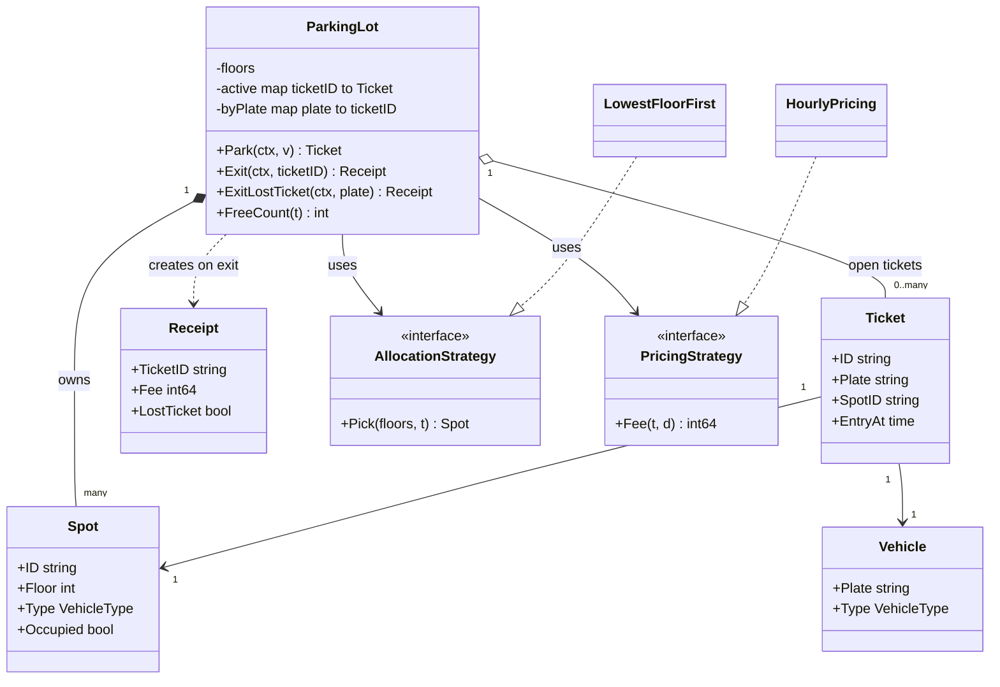
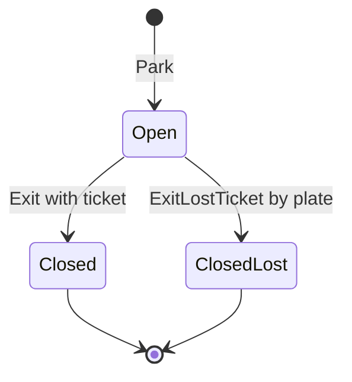
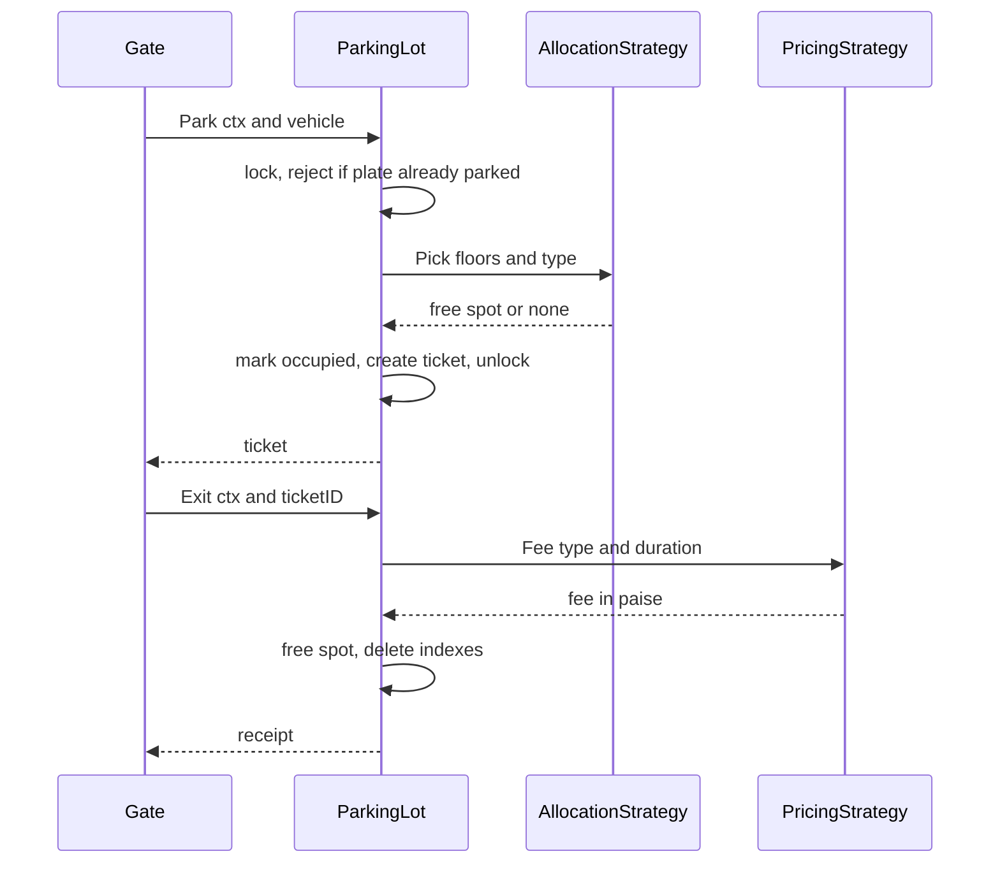

# Parking Lot LLD in Go

## Problem statement

```text
Design a parking lot that supports multiple floors, multiple spot types (bike, car, truck),
vehicle entry, vehicle exit, ticket generation, and fee calculation.
Handle lost tickets and many entry gates working at the same time.
```

- Tests clean entity modeling (Spot, Ticket, Vehicle) and two independent Strategies: spot allocation and pricing.
- Tests the classic race: two cars at two gates must never get the same spot (atomic pick + claim).

## How to use this note

- Open the drawing in [[#Drawing]] once, then close it and redraw it yourself on paper or Excalidraw before reading further.
- Attempt each step yourself first (write your answer in 2-3 minutes), then read the step and compare.
- Time box like the real round: 10 min requirements + entities (Steps 1-4), 10 min APIs + storage (Steps 5-6), 25-40 min core code (Steps 7-8), 10 min edge cases (Step 9), 5 min explaining it out loud.

## Step 1: Clarify requirements

### Questions to ask

- Which vehicle types and spot types? *Assume: bike, car, truck; each spot has one type.*
- Can a bike park in a car spot when bike spots are full? *Assume: no, exact match first; fallback is a follow-up.*
- How is the fee calculated? *Assume: per started hour, minimum one hour, rate per vehicle type, in paise.*
- How many entry and exit gates? *Assume: many, so concurrent entries must be safe.*
- What if the driver loses the ticket? *Assume: attendant verifies the RC, finds the open ticket by plate, charges fee + flat lost-ticket penalty.*
- Payment integration or only fee calculation? *Assume: only fee calculation; payment is a follow-up.*
- One lot in memory, or many lots with a DB? *Assume: code one lot in memory, show the DB schema for scale.*

### Functional

- Lot has floors; each floor has spots of type bike, car or truck.
- Entry: find a free spot of the right type, mark it taken, issue a ticket.
- Exit with ticket: compute fee, free the spot, return a receipt.
- Exit without ticket (lost): find open ticket by plate, fee + penalty, free the spot.
- Show free spot count per type (entry display board).

### Non-functional

- Concurrent entries from many gates never double-assign a spot.
- Same plate cannot be parked twice at the same time.
- Allocation and pricing rules are swappable without touching the lot.
- Money as `int64` paise, clock injected so fee tests are deterministic.

### Out of scope

- Advance reservations, monthly passes, EV charging.
- Payment gateway, number-plate camera hardware.
- Multi-lot routing ("which lot has space").

## Step 2: Actors and use cases

| Actor | Use case |
|---|---|
| Driver at entry gate | Park vehicle, get ticket |
| Driver at exit gate | Exit with ticket, pay fee |
| Attendant | Exit a vehicle whose ticket is lost (fee + penalty) |
| Display board | Read free count per vehicle type |
| Admin | Configure floors, spots, rates (setup, not coded) |

Hardest use case: **Park** under concurrency (pick a free spot and claim it atomically). Code that first, then Exit and lost-ticket Exit.

## Step 3: Entities

| Entity | Key fields | Why it exists |
|---|---|---|
| `Vehicle` | Plate, Type | Input to entry; type drives spot choice and rate |
| `Spot` | ID, Floor, Type, Occupied | The scarce resource; the thing two gates race for |
| Floor | index into `floors [][]*Spot` | Grouping for "lowest floor first"; a struct only if floors get behavior |
| `Ticket` | ID, Plate, SpotID, EntryAt | One visit: links one vehicle to one spot |
| `Receipt` | TicketID, Fee, EntryAt, ExitAt, LostTicket | What exit returns (the bank's `FeeReceipt`) |
| `ParkingLot` | floors, active tickets, byPlate index, strategies, clock | Facade that gates call; owns the lock |
| `AllocationStrategy` | `Pick(floors, type)` | Spot choice rule changes independently |
| `PricingStrategy` | `Fee(type, duration)` | Fee rule changes independently |

Modeling insight: the **Ticket is the visit**, not the vehicle. Index open tickets by ID (normal exit) and by plate (duplicate-entry check and lost-ticket exit). Keep Floor as a slice index, not a class, until it needs behavior.

## Step 4: Relationships





- **Composition** ParkingLot to Spot: spots are created with the lot and do not exist without it.
- **Aggregation** ParkingLot to Ticket: the lot tracks open tickets; closed tickets live on in storage or as receipts.
- **Association** Ticket to Spot and Ticket to Vehicle: a ticket references them by ID, does not own them.
- **Dependency on interfaces** ParkingLot to AllocationStrategy / PricingStrategy: injected, so rules swap without edits.

## Step 5: APIs and public methods

```text
POST /lots/{lotId}/entries              body: {plate, vehicleType}  -> 201 {ticketId, spotId, floor, entryAt}
                                        header: Idempotency-Key (gate retry)
POST /lots/{lotId}/exits                body: {ticketId}            -> 200 {fee, entryAt, exitAt}
POST /lots/{lotId}/exits/lost-ticket    body: {plate}               -> 200 {fee, lostTicket: true}
GET  /lots/{lotId}/availability                                     -> 200 {bike: 4, car: 12, truck: 1}
GET  /tickets/{ticketId}                                            -> 200 ticket

Errors: 409 already parked, 409 lot full for type, 404 ticket not found / not parked
```

```go
type ParkingService interface {
    Park(ctx context.Context, v Vehicle) (Ticket, error)
    Exit(ctx context.Context, ticketID string) (Receipt, error)
    ExitLostTicket(ctx context.Context, plate string) (Receipt, error)
    FreeCount(t VehicleType) int
}
```

## Step 6: Storage and repositories

```sql
CREATE TABLE spots (
    id         TEXT PRIMARY KEY,
    lot_id     TEXT    NOT NULL,
    floor      INT     NOT NULL,
    type       TEXT    NOT NULL,                 -- bike | car | truck
    occupied   BOOLEAN NOT NULL DEFAULT false
);
CREATE INDEX idx_spots_free ON spots (lot_id, type, floor) WHERE occupied = false;

CREATE TABLE tickets (
    id              TEXT PRIMARY KEY,
    lot_id          TEXT        NOT NULL,
    plate           TEXT        NOT NULL,
    spot_id         TEXT        NOT NULL REFERENCES spots(id),
    entry_at        TIMESTAMPTZ NOT NULL,
    exit_at         TIMESTAMPTZ,
    fee_paise       BIGINT,
    lost_ticket     BOOLEAN     NOT NULL DEFAULT false,
    idempotency_key TEXT        UNIQUE              -- gate retry returns the same ticket
);
-- invariants: one open ticket per spot and per plate
CREATE UNIQUE INDEX one_open_ticket_per_spot  ON tickets (spot_id) WHERE exit_at IS NULL;
CREATE UNIQUE INDEX one_open_ticket_per_plate ON tickets (plate)   WHERE exit_at IS NULL;

-- claim a spot atomically: lowest floor first, skip rows other gates are locking
SELECT id FROM spots
WHERE lot_id = $1 AND type = $2 AND occupied = false
ORDER BY floor, id
LIMIT 1
FOR UPDATE SKIP LOCKED;
UPDATE spots SET occupied = true WHERE id = $3;

-- close exactly once (double exit updates 0 rows)
UPDATE tickets SET exit_at = $2, fee_paise = $3, lost_ticket = $4
WHERE id = $1 AND exit_at IS NULL;
```

```go
type SpotRepo interface {
    // ClaimFree runs SELECT ... FOR UPDATE SKIP LOCKED + UPDATE in one tx.
    ClaimFree(ctx context.Context, lotID string, t VehicleType) (Spot, error)
    Release(ctx context.Context, spotID string) error
    CountFree(ctx context.Context, lotID string, t VehicleType) (int, error)
}

type TicketRepo interface {
    Create(ctx context.Context, t Ticket, idempotencyKey string) error // unique open per plate
    GetOpen(ctx context.Context, ticketID string) (Ticket, error)
    GetOpenByPlate(ctx context.Context, plate string) (Ticket, error) // lost-ticket flow
    Close(ctx context.Context, r Receipt) error                       // WHERE exit_at IS NULL
}
```

## Step 7: Patterns

| Pattern | Where | Why here |
|---|---|---|
| [[Strategy Pattern in Go]] | `AllocationStrategy` (lowest floor first, nearest to gate) | Spot choice rule changes per lot, without touching Park |
| [[Strategy Pattern in Go]] | `PricingStrategy` (hourly, flat, weekend) | Pricing changes more often than anything else |
| [[Facade Pattern in Go]] | `ParkingLot` | Gates call one object; it hides lock, indexes, strategies |
| [[Repository Pattern in Go]] | `SpotRepo`, `TicketRepo` | Swap in-memory maps for Postgres without changing service logic |
| [[Factory Pattern in Go]] | build floors/spots from config, pick pricing by lot type | Setup logic out of the service |
| [[Singleton Pattern in Go]] | one `ParkingLot` per process, built in `main` and injected | Shared state needs one owner, but no global variable |
| [[Observer Pattern in Go]] | display boards on spot taken/freed (follow-up) | Boards should not poll the lot |

Patterns NOT used and why:

- No State pattern for Spot or Ticket: two or three states with no per-state behavior; a bool / exit time is enough (YAGNI).
- No Floor or Gate classes: they carry no behavior in this scope; a slice index and a parameter are enough (KISS).

## Folder structure

```text
parking/
  model.go        -> VehicleType, Vehicle, Spot, Ticket, Receipt, Err* errors
  strategy.go     -> AllocationStrategy + LowestFloorFirst, PricingStrategy + HourlyPricing
  repository.go   -> SpotRepo, TicketRepo interfaces (DB version); in the interview the maps live in ParkingLot
  service.go      -> ParkingLot: NewParkingLot, Park, Exit, ExitLostTicket, FreeCount, close helper
  service_test.go -> table-driven pricing/park/exit tests + concurrent park test
cmd/demo/main.go  -> builds floors, picks strategies, injects time.Now, runs a park/exit
```

- `model.go`: plain data and errors, no logic.
- `strategy.go`: the two interfaces and their default implementations.
- `repository.go`: storage interfaces; only needed once you move to a DB.
- `service.go`: the lock and all use cases; the only file with `sync.Mutex`.
- `service_test.go`: uses an injected clock pointer to move time.
- `cmd/demo/main.go`: wiring only.

## Step 8: Core code

Main logic only. Full runnable code is folded below.

```go
type Spot struct {
    ID       string
    Type     VehicleType
    Occupied bool
}

type AllocationStrategy interface {
    Pick(floors [][]*Spot, t VehicleType) (*Spot, bool)
}
type PricingStrategy interface {
    Fee(t VehicleType, d time.Duration) int64
}

type ParkingLot struct {
    mu       sync.Mutex
    floors   [][]*Spot
    spotByID map[string]*Spot
    active   map[string]*Ticket // ticketID -> open ticket
    byPlate  map[string]string  // plate -> open ticketID
    alloc    AllocationStrategy
    pricing  PricingStrategy
    // ... lostPenalty, now, seq
}

// Park allocates a spot and issues a ticket. Pick and mark-occupied happen
// under one lock, so two gates can never get the same spot.
func (l *ParkingLot) Park(ctx context.Context, v Vehicle) (Ticket, error) {
    // ... ctx.Err() check
    l.mu.Lock()
    defer l.mu.Unlock()

    if _, ok := l.byPlate[v.Plate]; ok {
        return Ticket{}, ErrAlreadyParked
    }
    spot, ok := l.alloc.Pick(l.floors, v.Type)
    if !ok {
        return Ticket{}, ErrNoSpot
    }
    spot.Occupied = true // claim before unlocking: pick + claim is atomic

    l.seq++
    t := &Ticket{ID: fmt.Sprintf("T%d", l.seq), Plate: v.Plate, SpotID: spot.ID, EntryAt: l.now()}
    l.active[t.ID] = t
    l.byPlate[v.Plate] = t.ID
    return *t, nil
}

// close must be called with l.mu held (used by Exit and ExitLostTicket).
func (l *ParkingLot) close(t *Ticket, lost bool) Receipt {
    spot := l.spotByID[t.SpotID]
    exitAt := l.now()
    fee := l.pricing.Fee(spot.Type, exitAt.Sub(t.EntryAt))
    if lost {
        fee += l.lostPenalty
    }
    spot.Occupied = false
    delete(l.active, t.ID)
    delete(l.byPlate, t.Plate)
    return Receipt{ /* ... ticket fields, exitAt, */ Fee: fee, LostTicket: lost}
}
```



### Walkthrough

`Park(ctx, v)`:

1. Return early if the context is already cancelled.
2. Take `l.mu`. Everything after this is one critical section.
3. Reject if `byPlate` already has this plate (`ErrAlreadyParked`): same car scanned twice.
4. Ask `AllocationStrategy.Pick` for a free spot of the same type. It only reads.
5. None free: return `ErrNoSpot`.
6. Set `spot.Occupied = true` **before** unlocking. This is the key line: pick and claim are atomic.
7. Create a ticket with a sequential ID and the injected clock, index it by ID and by plate, return a copy.

`Exit(ctx, ticketID)`:

1. Lock, look up the open ticket. Missing means unknown or already exited: `ErrTicketNotFound`.
2. `close` computes `Fee(spotType, exit-entry)`, frees the spot, deletes both indexes, returns the receipt.

`ExitLostTicket(ctx, plate)`:

1. Lock, look up the open ticket by plate (`ErrNotParked` if none). The attendant checks the RC before calling this.
2. `close` with `lost = true`: normal fee + flat `lostPenalty`. The old ticket ID is now dead, so a found ticket cannot be used for a second exit.

> [!example]- Full runnable code (click to open)
> ```go
> package parking
>
> import (
>     "context"
>     "errors"
>     "fmt"
>     "sync"
>     "time"
> )
>
> var (
>     ErrNoSpot         = errors.New("no free spot for vehicle type")
>     ErrAlreadyParked  = errors.New("vehicle already parked")
>     ErrTicketNotFound = errors.New("ticket not found or already closed")
>     ErrNotParked      = errors.New("no open ticket for this plate")
> )
>
> type VehicleType int
>
> const (
>     Bike VehicleType = iota
>     Car
>     Truck
> )
>
> type Vehicle struct {
>     Plate string
>     Type  VehicleType
> }
>
> type Spot struct {
>     ID       string
>     Floor    int
>     Type     VehicleType
>     Occupied bool
> }
>
> // Ticket is issued on entry and stays open until exit.
> type Ticket struct {
>     ID      string
>     Plate   string
>     SpotID  string
>     EntryAt time.Time
> }
>
> // Receipt is what the exit gate prints. Fee is in paise.
> type Receipt struct {
>     TicketID   string
>     Plate      string
>     SpotID     string
>     EntryAt    time.Time
>     ExitAt     time.Time
>     Fee        int64
>     LostTicket bool
> }
>
> // AllocationStrategy picks a free spot of the given type. It is called while
> // the lot lock is held, so it must be fast and must not mutate anything.
> type AllocationStrategy interface {
>     Pick(floors [][]*Spot, t VehicleType) (*Spot, bool)
> }
>
> // LowestFloorFirst fills floor 0 before floor 1, and so on.
> type LowestFloorFirst struct{}
>
> func (LowestFloorFirst) Pick(floors [][]*Spot, t VehicleType) (*Spot, bool) {
>     for _, spots := range floors {
>         for _, s := range spots {
>             if !s.Occupied && s.Type == t {
>                 return s, true
>             }
>         }
>     }
>     return nil, false
> }
>
> // PricingStrategy computes the fee in paise for a stay of duration d.
> type PricingStrategy interface {
>     Fee(t VehicleType, d time.Duration) int64
> }
>
> // HourlyPricing charges per started hour (minimum one hour), rate per type.
> type HourlyPricing struct {
>     RatePerHour map[VehicleType]int64 // paise
> }
>
> func (p HourlyPricing) Fee(t VehicleType, d time.Duration) int64 {
>     hours := int64(d / time.Hour)
>     if d%time.Hour != 0 || hours == 0 {
>         hours++
>     }
>     return hours * p.RatePerHour[t]
> }
>
> type ParkingLot struct {
>     mu          sync.Mutex
>     floors      [][]*Spot
>     spotByID    map[string]*Spot
>     active      map[string]*Ticket // ticketID -> open ticket
>     byPlate     map[string]string  // plate -> open ticketID
>     alloc       AllocationStrategy
>     pricing     PricingStrategy
>     lostPenalty int64 // paise, added on top of the normal fee
>     now         func() time.Time
>     seq         int
> }
>
> func NewParkingLot(floors [][]*Spot, a AllocationStrategy, p PricingStrategy,
>     lostPenalty int64, now func() time.Time) *ParkingLot {
>     lot := &ParkingLot{
>         floors: floors, alloc: a, pricing: p, lostPenalty: lostPenalty, now: now,
>         spotByID: map[string]*Spot{},
>         active:   map[string]*Ticket{},
>         byPlate:  map[string]string{},
>     }
>     for _, f := range floors {
>         for _, s := range f {
>             lot.spotByID[s.ID] = s
>         }
>     }
>     return lot
> }
>
> // Park allocates a spot and issues a ticket. Pick and mark-occupied happen
> // under one lock, so two gates can never get the same spot.
> func (l *ParkingLot) Park(ctx context.Context, v Vehicle) (Ticket, error) {
>     if err := ctx.Err(); err != nil {
>         return Ticket{}, err
>     }
>     l.mu.Lock()
>     defer l.mu.Unlock()
>
>     if _, ok := l.byPlate[v.Plate]; ok {
>         return Ticket{}, ErrAlreadyParked
>     }
>     spot, ok := l.alloc.Pick(l.floors, v.Type)
>     if !ok {
>         return Ticket{}, ErrNoSpot
>     }
>     spot.Occupied = true // claim before unlocking: pick + claim is atomic
>
>     l.seq++
>     t := &Ticket{
>         ID:      fmt.Sprintf("T%d", l.seq),
>         Plate:   v.Plate,
>         SpotID:  spot.ID,
>         EntryAt: l.now(),
>     }
>     l.active[t.ID] = t
>     l.byPlate[v.Plate] = t.ID
>     return *t, nil
> }
>
> // Exit closes the ticket, frees the spot and returns the receipt.
> func (l *ParkingLot) Exit(ctx context.Context, ticketID string) (Receipt, error) {
>     if err := ctx.Err(); err != nil {
>         return Receipt{}, err
>     }
>     l.mu.Lock()
>     defer l.mu.Unlock()
>
>     t, ok := l.active[ticketID]
>     if !ok {
>         return Receipt{}, ErrTicketNotFound // unknown or double exit
>     }
>     return l.close(t, false), nil
> }
>
> // ExitLostTicket is the attendant flow when the driver has no ticket: find the
> // open ticket by plate (after checking the RC), charge fee + lost penalty.
> func (l *ParkingLot) ExitLostTicket(ctx context.Context, plate string) (Receipt, error) {
>     if err := ctx.Err(); err != nil {
>         return Receipt{}, err
>     }
>     l.mu.Lock()
>     defer l.mu.Unlock()
>
>     id, ok := l.byPlate[plate]
>     if !ok {
>         return Receipt{}, ErrNotParked
>     }
>     return l.close(l.active[id], true), nil
> }
>
> // close must be called with l.mu held.
> func (l *ParkingLot) close(t *Ticket, lost bool) Receipt {
>     spot := l.spotByID[t.SpotID]
>     exitAt := l.now()
>     fee := l.pricing.Fee(spot.Type, exitAt.Sub(t.EntryAt))
>     if lost {
>         fee += l.lostPenalty
>     }
>     spot.Occupied = false
>     delete(l.active, t.ID)
>     delete(l.byPlate, t.Plate)
>     return Receipt{
>         TicketID: t.ID, Plate: t.Plate, SpotID: t.SpotID,
>         EntryAt: t.EntryAt, ExitAt: exitAt, Fee: fee, LostTicket: lost,
>     }
> }
>
> // FreeCount returns free spots of a type (for the entry display board).
> func (l *ParkingLot) FreeCount(t VehicleType) int {
>     l.mu.Lock()
>     defer l.mu.Unlock()
>     n := 0
>     for _, s := range l.spotByID {
>         if !s.Occupied && s.Type == t {
>             n++
>         }
>     }
>     return n
> }
> ```

## Test cases

| Test | Proves |
|---|---|
| `TestHourlyPricing` | Per started hour, minimum one hour, rate per type |
| `TestPark` | Lowest floor first, type match, duplicate plate, lot full |
| `TestExit` | Normal fee, unknown ticket, lost ticket = fee + penalty, unknown plate, double exit by ID or plate rejected, spot freed |
| `TestConcurrentParkNeverDoubleAssigns` | 50 goroutines, 2 car spots: exactly 2 winners on 2 different spots, 48 get `ErrNoSpot` |

> [!example]- Full test code (click to open)
> ```go
> package parking
>
> import (
>     "context"
>     "errors"
>     "fmt"
>     "sync"
>     "testing"
>     "time"
> )
>
> const lostPenalty = 20000 // Rs 200
>
> func newLot(clock *time.Time) *ParkingLot {
>     floors := [][]*Spot{
>         {{ID: "F0-C1", Floor: 0, Type: Car}, {ID: "F0-B1", Floor: 0, Type: Bike}},
>         {{ID: "F1-C1", Floor: 1, Type: Car}, {ID: "F1-T1", Floor: 1, Type: Truck}},
>     }
>     rates := map[VehicleType]int64{Bike: 1000, Car: 2000, Truck: 5000} // paise per hour
>     return NewParkingLot(floors, LowestFloorFirst{}, HourlyPricing{RatePerHour: rates},
>         lostPenalty, func() time.Time { return *clock })
> }
>
> func TestHourlyPricing(t *testing.T) {
>     p := HourlyPricing{RatePerHour: map[VehicleType]int64{Car: 2000, Truck: 5000}}
>     tests := []struct {
>         name string
>         typ  VehicleType
>         d    time.Duration
>         want int64
>     }{
>         {"zero is one hour", Car, 0, 2000},
>         {"under an hour", Car, 10 * time.Minute, 2000},
>         {"exactly one hour", Car, time.Hour, 2000},
>         {"started second hour", Car, 61 * time.Minute, 4000},
>         {"truck three hours", Truck, 3 * time.Hour, 15000},
>     }
>     for _, tc := range tests {
>         t.Run(tc.name, func(t *testing.T) {
>             if got := p.Fee(tc.typ, tc.d); got != tc.want {
>                 t.Fatalf("got %d want %d", got, tc.want)
>             }
>         })
>     }
> }
>
> func TestPark(t *testing.T) {
>     tests := []struct {
>         name     string
>         before   []Vehicle // parked first
>         v        Vehicle
>         wantSpot string
>         wantErr  error
>     }{
>         {"lowest floor first", nil, Vehicle{"KA1", Car}, "F0-C1", nil},
>         {"second car goes up", []Vehicle{{"KA1", Car}}, Vehicle{"KA2", Car}, "F1-C1", nil},
>         {"type must match", nil, Vehicle{"TR1", Truck}, "F1-T1", nil},
>         {"same plate twice", []Vehicle{{"KA1", Car}}, Vehicle{"KA1", Car}, "", ErrAlreadyParked},
>         {"lot full for type", []Vehicle{{"B1", Bike}}, Vehicle{"B2", Bike}, "", ErrNoSpot},
>     }
>     for _, tc := range tests {
>         t.Run(tc.name, func(t *testing.T) {
>             now := time.Unix(0, 0)
>             lot := newLot(&now)
>             ctx := context.Background()
>             for _, v := range tc.before {
>                 if _, err := lot.Park(ctx, v); err != nil {
>                     t.Fatal(err)
>                 }
>             }
>             tk, err := lot.Park(ctx, tc.v)
>             if !errors.Is(err, tc.wantErr) {
>                 t.Fatalf("err %v want %v", err, tc.wantErr)
>             }
>             if tk.SpotID != tc.wantSpot {
>                 t.Fatalf("spot %q want %q", tk.SpotID, tc.wantSpot)
>             }
>         })
>     }
> }
>
> func TestExit(t *testing.T) {
>     tests := []struct {
>         name    string
>         lost    bool   // exit through the lost-ticket flow
>         key     string // ticket ID or plate; "" = use the real ticket ID
>         stay    time.Duration
>         wantFee int64
>         wantErr error
>     }{
>         {"normal exit 90 min", false, "", 90 * time.Minute, 4000, nil},
>         {"unknown ticket", false, "T999", time.Hour, 0, ErrTicketNotFound},
>         {"lost ticket adds penalty", true, "KA1", 90 * time.Minute, 4000 + lostPenalty, nil},
>         {"lost ticket unknown plate", true, "XX9", time.Hour, 0, ErrNotParked},
>     }
>     for _, tc := range tests {
>         t.Run(tc.name, func(t *testing.T) {
>             now := time.Unix(0, 0)
>             lot := newLot(&now)
>             ctx := context.Background()
>             tk, err := lot.Park(ctx, Vehicle{"KA1", Car})
>             if err != nil {
>                 t.Fatal(err)
>             }
>             now = now.Add(tc.stay)
>             key := tc.key
>             if key == "" {
>                 key = tk.ID
>             }
>             var r Receipt
>             if tc.lost {
>                 r, err = lot.ExitLostTicket(ctx, key)
>             } else {
>                 r, err = lot.Exit(ctx, key)
>             }
>             if !errors.Is(err, tc.wantErr) {
>                 t.Fatalf("err %v want %v", err, tc.wantErr)
>             }
>             if r.Fee != tc.wantFee {
>                 t.Fatalf("fee %d want %d", r.Fee, tc.wantFee)
>             }
>             if err != nil {
>                 return
>             }
>             if r.LostTicket != tc.lost || lot.FreeCount(Car) != 2 {
>                 t.Fatalf("receipt %+v free %d", r, lot.FreeCount(Car))
>             }
>             // the ticket is closed: a second exit by ID or plate must fail
>             if _, err := lot.Exit(ctx, tk.ID); !errors.Is(err, ErrTicketNotFound) {
>                 t.Fatalf("double exit: %v", err)
>             }
>             if _, err := lot.ExitLostTicket(ctx, "KA1"); !errors.Is(err, ErrNotParked) {
>                 t.Fatalf("double lost exit: %v", err)
>             }
>         })
>     }
> }
>
> func TestConcurrentParkNeverDoubleAssigns(t *testing.T) {
>     now := time.Unix(0, 0)
>     lot := newLot(&now) // 2 car spots
>     var (
>         wg    sync.WaitGroup
>         mu    sync.Mutex
>         spots = map[string]int{}
>         full  int
>     )
>     for i := 0; i < 50; i++ {
>         wg.Add(1)
>         go func(i int) {
>             defer wg.Done()
>             tk, err := lot.Park(context.Background(), Vehicle{fmt.Sprint("P", i), Car})
>             mu.Lock()
>             defer mu.Unlock()
>             if errors.Is(err, ErrNoSpot) {
>                 full++
>                 return
>             }
>             if err != nil {
>                 t.Error(err)
>                 return
>             }
>             spots[tk.SpotID]++
>         }(i)
>     }
>     wg.Wait()
>     if len(spots) != 2 || full != 48 {
>         t.Fatalf("spots %v full %d", spots, full)
>     }
>     for id, n := range spots {
>         if n != 1 {
>             t.Fatalf("spot %s assigned %d times", id, n)
>         }
>     }
>     if lot.FreeCount(Car) != 0 {
>         t.Fatal("free count should be 0")
>     }
> }
> ```

## Step 9: Edge cases

| Edge case | What happens | How the design handles it |
|---|---|---|
| Race: two gates pick the same free spot | Check-then-act bug: both see it free | Pick + `Occupied = true` under one mutex; in DB `FOR UPDATE SKIP LOCKED` + partial unique index on open ticket per spot |
| Same car scanned twice at entry | Two open tickets for one plate | `byPlate` check -> `ErrAlreadyParked`; DB partial unique index per plate |
| Gate retries entry after timeout | Could issue two tickets | `Idempotency-Key` unique on tickets; retry returns the first ticket |
| Lot full for a type | No spot | `ErrNoSpot` (409); display board shows 0 |
| Vehicle type does not match spot | Truck in bike spot | Strategy only returns `s.Type == t`; fallback rules are a new strategy |
| Lost ticket | Driver cannot show ticket ID | `ExitLostTicket(plate)` finds the open ticket by plate, charges fee + penalty, marks receipt `LostTicket` |
| Lost ticket found later, used again | Second exit attempt | Ticket already closed: `ErrTicketNotFound` |
| Invalid ticket / double exit | Replay of exit | Ticket gone from `active` -> `ErrTicketNotFound`; DB `UPDATE ... WHERE exit_at IS NULL` updates 0 rows |
| Exit within a few minutes | Zero-hour fee | Minimum one hour in `HourlyPricing` |
| Clock jumps / tests | Flaky fee tests | Injected `now func() time.Time` |
| Slow strategy under the lock | Every gate waits | Strategies must be fast and must not call back into the lot |

### Common mistakes

- Finding a free spot and marking it occupied in two separate locked sections (or with no lock).
- Hardcoding pricing inside Exit with if/else on vehicle type.
- Using `time.Now()` directly, making fee tests flaky.
- Modeling Floor, Gate, DisplayBoard as heavy classes before the core flow works.
- Forgetting double exit, duplicate plate and lost ticket.
- Storing money as `float64`.

## Step 10: Tradeoffs and extensions

| Follow-up | Design change |
|---|---|
| Bike can use car spot when bike spots are full | New `AllocationStrategy` with a fallback order per vehicle type |
| Nearest spot to the entry gate | Strategy takes gate ID; precomputed distances; min-heap of free spots per type |
| Weekend / night pricing | New `PricingStrategy`, or a Decorator over the base pricing |
| Payment at exit | Exit returns the fee; `PaymentService` charges; ticket closes only after payment succeeds |
| Multiple lots, many service instances | State in DB, `FOR UPDATE SKIP LOCKED` claim, idempotency key on entry |
| Live display boards | Observer: publish `spot.taken` / `spot.freed` events |
| Very large lot, lock contention | Lock per floor or per type; keep a free-spot list per type instead of scanning |

### Tradeoffs I chose

- One `sync.Mutex` for the whole lot: simplest correct answer; fine for one lot (hundreds of ops/sec). Shard locks only if profiling shows contention.
- In-memory maps vs DB: in memory for the interview; in production the DB row lock and partial unique indexes are the real guarantee.
- Linear scan in `LowestFloorFirst`: O(spots), fine for a few thousand spots; a free list per type is O(1) but more code.
- Lost-ticket penalty as a flat field on the lot, not a strategy: one number today; promote to a strategy if rules grow.

## Drawing

![[Parking Lot LLD Drawing.excalidraw]]

The drawing shows:

- Section 1: ParkingLot facade owning Spots and open Tickets, the two strategy interfaces with their implementations, Vehicle and Receipt.
- Section 2: the Park flow (gate -> lock -> plate check -> Pick -> claim -> ticket) with red failure boxes, and the lost-ticket exit flow.
- Section 3: Spot and Ticket state machines.
- Section 4: the `spots` and `tickets` tables with their unique constraints.

Redraw it from memory:

- [ ] ParkingLot with composition to Spot and aggregation to Ticket
- [ ] Both strategy interfaces with "implements" arrows
- [ ] Park flow with the "pick + claim under one lock" box and the two red failures
- [ ] Lost-ticket exit path by plate with the penalty
- [ ] The two partial unique indexes on `tickets`

## Interview explanation

```text
I model ParkingLot as a facade that owns the spots and tracks open tickets, where a ticket is one visit linking a vehicle to a spot. Spot choice and fee calculation are two Strategy interfaces, so lowest-floor-first or nearest-to-gate, and hourly or weekend pricing, change without touching the lot. The hard part is concurrent entry: picking a free spot and marking it occupied must be one atomic step, so in memory I do both under one mutex, and in a database I use SELECT FOR UPDATE SKIP LOCKED plus partial unique indexes on open tickets per spot and per plate. For a lost ticket the attendant looks up the open ticket by plate and charges the normal fee plus a penalty, which also kills the old ticket ID. Money is int64 paise and the clock is injected so fee tests are deterministic.
```

## Related

- [[LLD Practice Roadmap]]
- [[LLD Question Bank with Answers]]
- [[Strategy Pattern in Go]]
- [[Facade Pattern in Go]]
- [[Repository Pattern in Go]]
- [[Factory Pattern in Go]]
- [[Singleton Pattern in Go]]
- [[Observer Pattern in Go]]
- [[Concurrency in Go LLD]]
- [[Testing LLD Code in Go]]
- [[UML for LLD Interviews]]
- [[Error Handling and Interfaces in Go LLD]]
- [[Go LLD Folder Structure for Practice]]
