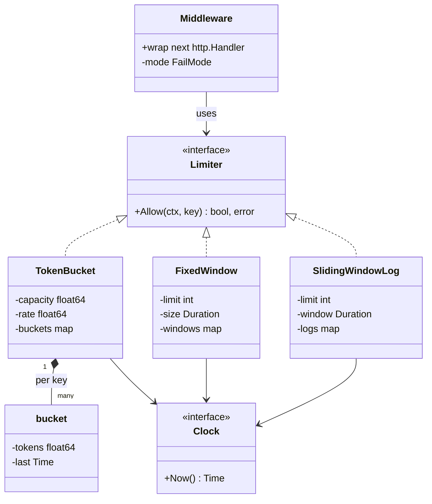

# Rate Limiter LLD in Go

## Problem statement

```text
Design a rate limiter. It allows at most N requests per key (user, IP, or API key)
per time unit and rejects the rest with HTTP 429. Support more than one algorithm
(fixed window, sliding window, token bucket) and explain how it works across many
app instances and what happens when Redis is down.
```

- It tests algorithm choice (fixed window vs sliding window vs token bucket), the Strategy pattern, per-key state under a lock, and testable time through an injected clock.
- It also tests production judgment: middleware wiring, multi-instance limits with Redis plus Lua, and fail-open vs fail-closed.

## How to use this note

- Open the drawing in [[#Drawing]] and redraw it yourself on paper or Excalidraw before reading the code. The token bucket picture is the one to remember.
- Attempt each step yourself (write your answer, 2-5 minutes) before reading the step here.
- Time box it like the real round (from [[LLD Practice Roadmap]]): 10 min requirements + entities, 10 min APIs + storage, 25-40 min core code, 10 min edge cases, 5 min explaining out loud.

## Step 1: Clarify requirements

### Questions to ask

- Limit by what: user, IP, API key, endpoint, or a mix? *Assume: one key string per request, built by a key function (user ID if logged in, else IP).*
- Are bursts allowed? *Assume: yes for normal APIs (token bucket); strict limits use sliding window.*
- Single instance or many pods behind a load balancer? *Assume: code in-memory first, then explain Redis for the global limit.*
- If the limiter store (Redis) is down, allow or block? *Assume: fail open by default, fail closed for login, OTP, and payment endpoints.*
- Different limits per plan or per endpoint? *Assume: limits come from a policy table; one limiter per policy.*
- Return quota headers like `X-RateLimit-Remaining`? *Assume: return `Retry-After` on 429; remaining-quota headers are an extension.*

### Functional

- `Allow(ctx, key)` returns allow or deny.
- Limits are per key: user ID, IP, or API key.
- Three swappable algorithms: fixed window, sliding window log, token bucket.
- HTTP middleware returns `429 Too Many Requests` with `Retry-After`.
- Config per limiter: capacity or limit, plus refill rate or window size.
- Configurable failure mode when the limiter errors: fail open or fail closed.

### Non-functional

- Low latency: the check runs on every request, so O(1) or close to it, no SQL on the hot path.
- Thread-safe: many requests for the same key at once must never exceed the limit.
- Testable without `time.Sleep`: inject a clock.
- Memory: idle keys must eventually be cleaned up.
- Multi-instance deployment needs a shared store (Redis) for a global limit.

### Out of scope

- Concurrency limiting (max in-flight requests). Mention a semaphore if asked.
- DDoS protection at the network edge (that is a CDN or WAF job).
- Billing or quota for the month (that is a metering system, not a rate limiter).

## Step 2: Actors and use cases

| Actor | Use case |
|---|---|
| API client (user, IP, API key) | Sends a request; it is allowed or gets 429 |
| HTTP middleware | Builds the key, calls `Allow`, writes 429 or 503, or passes through |
| Limiter (algorithm) | Decides allow or deny for one key at the current time |
| Admin / config service | Creates or changes a policy: algorithm, limit, window, refill rate |
| Janitor job | Removes state for idle keys so memory does not grow forever |

Hardest use case: `Allow(ctx, key)` under concurrency. Refill or window reset, check, and decrement must be one atomic step. That is the one to code.

## Step 3: Entities

| Entity | Key fields | Why it exists |
|---|---|---|
| `Limiter` (interface) | `Allow(ctx, key) (bool, error)` | The Strategy contract; middleware depends only on this |
| `TokenBucket` | `capacity`, `rate`, `buckets map[key]*bucket` | Allows bursts up to capacity, average rate = refill rate |
| `bucket` | `tokens float64`, `last time.Time` | Per-key state; refilled lazily from elapsed time |
| `FixedWindow` | `limit`, `size`, `windows map[key]*window` | Simplest: one counter per key per window; maps to Redis `INCR` |
| `window` | `start`, `count` | Per-key counter for the current window |
| `SlidingWindowLog` | `limit`, `window`, `logs map[key][]time.Time` | Exact limit over any rolling window; O(limit) memory per key |
| `Clock` (interface) | `Now()` | Tests move time by hand instead of sleeping |
| `RateLimitPolicy` | `name`, `algorithm`, `capacity`, `refill_per_sec`, `window_seconds` | Config row; a Factory turns it into a `Limiter` |
| `FailMode` | `FailOpen`, `FailClosed` | What to do when the limiter itself errors |

Modeling insight: the **rule** (policy: limit, window) and the **state** (per-key bucket or counter) are different things. One policy has millions of per-key states. Keep config in SQL and state in memory or Redis, never counters in SQL.

## Step 4: Relationships



- **Implementation (realization):** `TokenBucket`, `FixedWindow`, `SlidingWindowLog` implement `Limiter`. This is the Strategy seam.
- **Composition:** each limiter owns its per-key state map (`bucket`, `window`, timestamp slice). The state has no life outside the limiter.
- **Association:** limiters use a `Clock`; the middleware uses a `Limiter`. Both are injected, so they can be swapped (fake clock in tests, Redis limiter in production).

## Step 5: APIs and public methods

The limiter is middleware, so there is no "rate limit" endpoint for clients. What clients see is the response of any wrapped route. The only REST API is admin config for policies.

```text
Any route wrapped by the middleware:
  200            -> handler runs as normal
  429 Too Many Requests
      Retry-After: 1
      body: "too many requests"
  503 Service Unavailable   (only FailClosed routes, when Redis is down)

Admin config:
GET  /rate-limits/{policy}
PUT  /rate-limits/{policy}   {"algorithm": "token_bucket", "capacity": 10, "refill_per_sec": 5}
```

```go
type Limiter interface {
    Allow(ctx context.Context, key string) (bool, error)
}

func NewTokenBucket(capacity int, ratePerSec float64, clock Clock) (*TokenBucket, error)
func NewFixedWindow(limit int, size time.Duration, clock Clock) (*FixedWindow, error)
func NewSlidingWindowLog(limit int, window time.Duration, clock Clock) (*SlidingWindowLog, error)

func Middleware(l Limiter, keyFn KeyFunc) func(http.Handler) http.Handler // fail open
func MiddlewareWithMode(l Limiter, keyFn KeyFunc, mode FailMode) func(http.Handler) http.Handler
```

## Step 6: Storage and repositories

Only config goes in SQL. Counters live in memory (single instance) or Redis (many instances). A SQL write per request is far too slow.

```sql
CREATE TABLE rate_limit_policies (
    id             BIGSERIAL PRIMARY KEY,
    name           TEXT NOT NULL UNIQUE,      -- e.g. "checkout_per_user"
    algorithm      TEXT NOT NULL CHECK (algorithm IN ('fixed_window', 'sliding_window', 'token_bucket')),
    capacity       INT  NOT NULL CHECK (capacity > 0),
    refill_per_sec NUMERIC CHECK (refill_per_sec > 0),  -- token bucket
    window_seconds INT CHECK (window_seconds > 0),       -- windows
    fail_mode      TEXT NOT NULL DEFAULT 'open' CHECK (fail_mode IN ('open', 'closed')),
    updated_at     TIMESTAMPTZ NOT NULL DEFAULT now()
);

-- Redis keys (state, not SQL):
--   fixed window:   rl:{policy}:{key}:{windowStart}  -> INCR + EXPIRE
--   token bucket:   rl:{policy}:{key}                -> HASH {tokens, last}
--   sliding log:    rl:{policy}:{key}                -> ZSET of timestamps
```

```go
// Config lookup, cached in memory; refreshed on change.
type PolicyRepository interface {
    Get(ctx context.Context, name string) (RateLimitPolicy, error)
}

// The atomic counter store. The Redis version runs one Lua script per call.
type CounterStore interface {
    // IncrWindow increments the counter for key in the current window and
    // returns the new count. The key expires with the window.
    IncrWindow(ctx context.Context, key string, window time.Duration) (int64, error)
}
```

## Step 7: Patterns

| Pattern | Where | Why here |
|---|---|---|
| [[Strategy Pattern in Go]] | `Limiter` with `TokenBucket`, `FixedWindow`, `SlidingWindowLog` | Algorithms change by endpoint and over time; middleware should not care |
| [[Decorator Middleware Pattern in Go]] | `Middleware` wraps any `http.Handler` (same as a Gin `HandlerFunc`) | Adds limiting to a route without touching the handler |
| [[Factory Pattern in Go]] | Build the right limiter from a policy row (`algorithm` column) | One place maps config to a concrete strategy |
| [[Repository Pattern in Go]] | `PolicyRepository`, `CounterStore` (memory or Redis) | Swap in-memory state for Redis without changing algorithm callers |
| Dependency injection, see [[Testing LLD Code in Go]] | `Clock` interface | Tests move time without `time.Sleep` |
| [[Error Handling and Interfaces in Go LLD]] | `ErrInvalidConfig`, `ErrEmptyKey` sentinel errors | Callers check with `errors.Is` |

Patterns NOT used and why:

- No Singleton for the limiter: it is created once in `main` and injected. A global makes tests share state.
- No background refill goroutine per key (no Observer or ticker): lazy refill on `Allow` gives the same result with zero goroutines.

## Folder structure

```text
ratelimiter/
  limiter.go        -> Limiter + Clock interfaces, errors, RealClock
  token_bucket.go   -> TokenBucket
  fixed_window.go   -> FixedWindow
  sliding_window.go -> SlidingWindowLog
  middleware.go     -> Middleware, MiddlewareWithMode, FailMode
  factory.go        -> NewFromPolicy(policy) Limiter
  redis.go          -> Redis-backed limiter using Lua (production)
  ratelimiter_test.go -> tests with a fake clock
cmd/demo/main.go    -> wiring: build limiter, wrap routes, start server
```

- `limiter.go`: the contracts every other file depends on.
- One file per algorithm, each owning its own per-key state and mutex.
- `middleware.go`: HTTP concerns only (key, status codes, headers).
- `factory.go` and `redis.go` are production extensions; the code below keeps everything in one file so it compiles standalone.

## Step 8: Core code

Main logic only. Full runnable code is folded below.

```go
// Limiter is the Strategy interface (token bucket, fixed window, sliding log, Redis).
type Limiter interface {
    Allow(ctx context.Context, key string) (bool, error)
}

type bucket struct {
    tokens float64
    last   time.Time
}

type TokenBucket struct {
    mu       sync.Mutex
    capacity float64 // max burst
    rate     float64 // tokens added per second
    clock    Clock
    buckets  map[string]*bucket
}

func (l *TokenBucket) Allow(ctx context.Context, key string) (bool, error) {
    if key == "" {
        return false, ErrEmptyKey
    }
    now := l.clock.Now()
    l.mu.Lock()
    defer l.mu.Unlock()
    b, ok := l.buckets[key]
    if !ok {
        b = &bucket{tokens: l.capacity, last: now}
        l.buckets[key] = b
    }
    // Lazy refill: add tokens for the time elapsed since last call.
    elapsed := now.Sub(b.last).Seconds()
    if elapsed > 0 { // clock going backwards never removes tokens
        b.tokens = min(l.capacity, b.tokens+elapsed*l.rate)
        b.last = now
    }
    if b.tokens < 1 {
        return false, nil
    }
    b.tokens--
    return true, nil
}

// ... FixedWindow.Allow: start = now.Truncate(size); new start resets count; allow while count < limit
// ... SlidingWindowLog.Allow: drop timestamps <= now-window; allow if len < limit, append now

// Inside MiddlewareWithMode (Decorator):
ok, err := l.Allow(r.Context(), keyFn(r))
switch {
case err != nil && mode == FailClosed:
    http.Error(w, "rate limiter unavailable", http.StatusServiceUnavailable)
    return
case err != nil: // FailOpen: log + metric in real code, then serve
case !ok:
    w.Header().Set("Retry-After", "1")
    http.Error(w, "too many requests", http.StatusTooManyRequests)
    return
}
next.ServeHTTP(w, r)
```

Gin wiring is the same idea as the `net/http` middleware (shown as text so the note keeps one compilable Go block):

```text
func GinRateLimit(l Limiter) gin.HandlerFunc {
    return func(c *gin.Context) {
        ok, err := l.Allow(c.Request.Context(), c.ClientIP())
        if err == nil && !ok {
            c.Header("Retry-After", "1")
            c.AbortWithStatusJSON(429, gin.H{"error": "too many requests"})
            return
        }
        c.Next()
    }
}
```

### Walkthrough

`TokenBucket.Allow(ctx, key)`:

1. Reject an empty key with `ErrEmptyKey`.
2. Read `now` from the injected clock.
3. Lock the mutex. Read, refill, check and decrement must be one atomic step.
4. If the key has no bucket, create a full one (`tokens = capacity`). New users get their full burst.
5. Lazy refill: `tokens = min(capacity, tokens + elapsed * rate)`. No background goroutine; tokens are computed when a request arrives. `elapsed > 0` guards against the clock going backwards.
6. If `tokens < 1`, deny. Otherwise `tokens--` and allow.

`FixedWindow.Allow`:

1. `start = now.Truncate(size)`: 10:00:37 becomes 10:00:00 for a 1-minute window.
2. If the stored window start is different, reset the counter (new window).
3. Allow while `count < limit`, then `count++`.
4. Weak spot: 2x burst at the edge. Limit 100/min allows 100 at 10:00:59 and 100 at 10:01:00. The test shows this.

`SlidingWindowLog.Allow`:

1. Keep a sorted slice of timestamps per key.
2. Drop timestamps older than `now - window`.
3. Allow only if fewer than `limit` remain, then append `now`. Exact, but O(limit) memory per key.

Sliding window counter (memory-cheap middle ground): keep counts for the current and previous fixed windows and estimate `prev * (1 - elapsedFraction) + curr`. Use it when limits are large.

| Algorithm | Memory per key | Burst at edges | Best for |
|---|---|---|---|
| Fixed window | 1 counter | Up to 2x at boundary | Simple quotas, cheap Redis `INCR` |
| Sliding window log | `limit` timestamps | None (exact) | Strict, low limits (login, OTP) |
| Sliding window counter | 2 counters | Small approximation error | Large limits, strict-ish |
| Token bucket | 2 numbers | Allowed up to capacity, by design | General APIs: bursts OK, average controlled |

`MiddlewareWithMode`:

1. Build the key with `keyFn(r)` and call `Allow`.
2. Limiter error + `FailClosed` -> 503. Limiter error + `FailOpen` -> serve the request (log and alert in real code).
3. Denied -> 429 with `Retry-After`. Allowed -> call `next`.

> [!example]- Full runnable code (click to open)
> ```go
> package ratelimiter
>
> import (
>     "context"
>     "errors"
>     "net/http"
>     "sync"
>     "time"
> )
>
> var (
>     ErrInvalidConfig = errors.New("ratelimiter: invalid config")
>     ErrEmptyKey      = errors.New("ratelimiter: empty key")
> )
>
> // Clock is injected so tests can control time.
> type Clock interface{ Now() time.Time }
>
> type RealClock struct{}
>
> func (RealClock) Now() time.Time { return time.Now() }
>
> // Limiter is the Strategy interface. ctx exists because a Redis-backed
> // implementation does network I/O and can fail.
> type Limiter interface {
>     Allow(ctx context.Context, key string) (bool, error)
> }
>
> // ---------- Token bucket: allows bursts up to capacity, average = rate ----------
>
> type bucket struct {
>     tokens float64
>     last   time.Time
> }
>
> type TokenBucket struct {
>     mu       sync.Mutex
>     capacity float64 // max burst
>     rate     float64 // tokens added per second
>     clock    Clock
>     buckets  map[string]*bucket
> }
>
> func NewTokenBucket(capacity int, ratePerSec float64, clock Clock) (*TokenBucket, error) {
>     if capacity <= 0 || ratePerSec <= 0 || clock == nil {
>         return nil, ErrInvalidConfig
>     }
>     return &TokenBucket{
>         capacity: float64(capacity),
>         rate:     ratePerSec,
>         clock:    clock,
>         buckets:  make(map[string]*bucket),
>     }, nil
> }
>
> func (l *TokenBucket) Allow(ctx context.Context, key string) (bool, error) {
>     if key == "" {
>         return false, ErrEmptyKey
>     }
>     now := l.clock.Now()
>
>     l.mu.Lock()
>     defer l.mu.Unlock()
>
>     b, ok := l.buckets[key]
>     if !ok {
>         b = &bucket{tokens: l.capacity, last: now}
>         l.buckets[key] = b
>     }
>     // Lazy refill: add tokens for the time elapsed since last call.
>     elapsed := now.Sub(b.last).Seconds()
>     if elapsed > 0 { // clock going backwards never removes tokens
>         b.tokens = min(l.capacity, b.tokens+elapsed*l.rate)
>         b.last = now
>     }
>     if b.tokens < 1 {
>         return false, nil
>     }
>     b.tokens--
>     return true, nil
> }
>
> // ---------- Fixed window: one counter per key per window ----------
>
> type window struct {
>     start time.Time
>     count int
> }
>
> type FixedWindow struct {
>     mu      sync.Mutex
>     limit   int
>     size    time.Duration
>     clock   Clock
>     windows map[string]*window
> }
>
> func NewFixedWindow(limit int, size time.Duration, clock Clock) (*FixedWindow, error) {
>     if limit <= 0 || size <= 0 || clock == nil {
>         return nil, ErrInvalidConfig
>     }
>     return &FixedWindow{limit: limit, size: size, clock: clock, windows: make(map[string]*window)}, nil
> }
>
> func (l *FixedWindow) Allow(ctx context.Context, key string) (bool, error) {
>     if key == "" {
>         return false, ErrEmptyKey
>     }
>     start := l.clock.Now().Truncate(l.size) // e.g. 10:00:37 -> 10:00:00 for a 1m window
>
>     l.mu.Lock()
>     defer l.mu.Unlock()
>
>     w, ok := l.windows[key]
>     if !ok || !w.start.Equal(start) {
>         w = &window{start: start} // new window: counter resets
>         l.windows[key] = w
>     }
>     if w.count >= l.limit {
>         return false, nil
>     }
>     w.count++
>     return true, nil
> }
>
> // ---------- Sliding window log: exact, O(limit) memory per key ----------
>
> type SlidingWindowLog struct {
>     mu     sync.Mutex
>     limit  int
>     window time.Duration
>     clock  Clock
>     logs   map[string][]time.Time
> }
>
> func NewSlidingWindowLog(limit int, window time.Duration, clock Clock) (*SlidingWindowLog, error) {
>     if limit <= 0 || window <= 0 || clock == nil {
>         return nil, ErrInvalidConfig
>     }
>     return &SlidingWindowLog{
>         limit:  limit,
>         window: window,
>         clock:  clock,
>         logs:   make(map[string][]time.Time),
>     }, nil
> }
>
> func (l *SlidingWindowLog) Allow(ctx context.Context, key string) (bool, error) {
>     if key == "" {
>         return false, ErrEmptyKey
>     }
>     now := l.clock.Now()
>     cutoff := now.Add(-l.window)
>
>     l.mu.Lock()
>     defer l.mu.Unlock()
>
>     ts := l.logs[key]
>     // Drop timestamps outside the window (slice is sorted by time).
>     i := 0
>     for i < len(ts) && !ts[i].After(cutoff) {
>         i++
>     }
>     ts = ts[i:]
>     if len(ts) >= l.limit {
>         l.logs[key] = ts
>         return false, nil
>     }
>     l.logs[key] = append(ts, now)
>     return true, nil
> }
>
> // ---------- HTTP middleware (Decorator) ----------
>
> type KeyFunc func(r *http.Request) string
>
> // FailMode decides what happens when the limiter itself errors (e.g. Redis down).
> type FailMode int
>
> const (
>     FailOpen   FailMode = iota // let the request through: availability first
>     FailClosed                 // reject: protection first (login, OTP, payments)
> )
>
> // Middleware is the common case: fail open.
> func Middleware(l Limiter, keyFn KeyFunc) func(http.Handler) http.Handler {
>     return MiddlewareWithMode(l, keyFn, FailOpen)
> }
>
> func MiddlewareWithMode(l Limiter, keyFn KeyFunc, mode FailMode) func(http.Handler) http.Handler {
>     return func(next http.Handler) http.Handler {
>         return http.HandlerFunc(func(w http.ResponseWriter, r *http.Request) {
>             ok, err := l.Allow(r.Context(), keyFn(r))
>             switch {
>             case err != nil && mode == FailClosed:
>                 http.Error(w, "rate limiter unavailable", http.StatusServiceUnavailable)
>                 return
>             case err != nil: // FailOpen: log + metric in real code, then serve
>             case !ok:
>                 w.Header().Set("Retry-After", "1")
>                 http.Error(w, "too many requests", http.StatusTooManyRequests)
>                 return
>             }
>             next.ServeHTTP(w, r)
>         })
>     }
> }
> ```

## Test cases

| Test | Proves |
|---|---|
| `TestLimiters/token bucket` | Burst of `capacity`, deny when empty, per-key isolation, refill of exactly 1 token after 1s |
| `TestLimiters/fixed window` | Counter resets at the boundary; shows the 2x edge burst |
| `TestLimiters/sliding window log` | Oldest timestamp leaves the window and frees a slot |
| `TestLimiters` (each) | Empty key returns `ErrEmptyKey` |
| `TestInvalidConfig` | Constructors reject zero limit, zero window, nil clock |
| `TestConcurrentExactlyCapacity` | 100 goroutines, limit 10: exactly 10 allowed, for all three algorithms |
| `TestMiddleware` | 200 then 429; Redis down -> 200 with FailOpen, 503 with FailClosed |

> [!example]- Full test code (click to open)
> ```go
> package ratelimiter
>
> import (
>     "context"
>     "errors"
>     "net/http"
>     "net/http/httptest"
>     "sync"
>     "sync/atomic"
>     "testing"
>     "time"
> )
>
> type fakeClock struct {
>     mu sync.Mutex
>     t  time.Time
> }
>
> func (f *fakeClock) Now() time.Time      { f.mu.Lock(); defer f.mu.Unlock(); return f.t }
> func (f *fakeClock) Add(d time.Duration) { f.mu.Lock(); f.t = f.t.Add(d); f.mu.Unlock() }
>
> // step is one Allow call: advance the clock first, then expect a result.
> type step struct {
>     advance time.Duration
>     key     string
>     want    bool
> }
>
> func TestLimiters(t *testing.T) {
>     tests := []struct {
>         name  string
>         build func(c Clock) Limiter
>         steps []step
>     }{
>         {
>             name:  "token bucket: burst of 2, then refill 1 per second",
>             build: func(c Clock) Limiter { l, _ := NewTokenBucket(2, 1, c); return l },
>             steps: []step{
>                 {0, "u", true}, {0, "u", true}, {0, "u", false}, // burst used up
>                 {0, "v", true},                                  // other key has its own bucket
>                 {time.Second, "u", true}, {0, "u", false},      // exactly one token refilled
>             },
>         },
>         {
>             name:  "fixed window: 2 per minute, counter resets at boundary",
>             build: func(c Clock) Limiter { l, _ := NewFixedWindow(2, time.Minute, c); return l },
>             steps: []step{
>                 {50 * time.Second, "u", true}, {0, "u", true}, {0, "u", false}, // 00:50
>                 {10 * time.Second, "u", true}, {0, "u", true},                  // 01:00 new window: edge burst
>                 {0, "u", false},
>             },
>         },
>         {
>             name:  "sliding window log: 2 per minute, oldest expires",
>             build: func(c Clock) Limiter { l, _ := NewSlidingWindowLog(2, time.Minute, c); return l },
>             steps: []step{
>                 {0, "u", true}, {30 * time.Second, "u", true}, {0, "u", false},
>                 {31 * time.Second, "u", true}, // first timestamp left the window
>                 {0, "u", false},
>             },
>         },
>     }
>     for _, tc := range tests {
>         t.Run(tc.name, func(t *testing.T) {
>             clk := &fakeClock{t: time.Unix(0, 0)}
>             l := tc.build(clk)
>             for i, s := range tc.steps {
>                 clk.Add(s.advance)
>                 got, err := l.Allow(context.Background(), s.key)
>                 if err != nil || got != s.want {
>                     t.Fatalf("step %d: got %v, %v want %v", i, got, err, s.want)
>                 }
>             }
>             if _, err := l.Allow(context.Background(), ""); !errors.Is(err, ErrEmptyKey) {
>                 t.Fatalf("empty key: %v", err)
>             }
>         })
>     }
> }
>
> func TestInvalidConfig(t *testing.T) {
>     c := &fakeClock{}
>     if _, err := NewTokenBucket(0, 1, c); !errors.Is(err, ErrInvalidConfig) {
>         t.Fatal(err)
>     }
>     if _, err := NewFixedWindow(1, 0, c); !errors.Is(err, ErrInvalidConfig) {
>         t.Fatal(err)
>     }
>     if _, err := NewSlidingWindowLog(1, time.Second, nil); !errors.Is(err, ErrInvalidConfig) {
>         t.Fatal(err)
>     }
> }
>
> // 100 goroutines hit one key with capacity 10: exactly 10 must win, for every algorithm.
> func TestConcurrentExactlyCapacity(t *testing.T) {
>     clk := &fakeClock{t: time.Unix(0, 0)}
>     tb, _ := NewTokenBucket(10, 1, clk)
>     fw, _ := NewFixedWindow(10, time.Minute, clk)
>     sw, _ := NewSlidingWindowLog(10, time.Minute, clk)
>     for _, l := range []Limiter{tb, fw, sw} {
>         var allowed int64
>         var wg sync.WaitGroup
>         for i := 0; i < 100; i++ {
>             wg.Add(1)
>             go func() {
>                 defer wg.Done()
>                 if ok, _ := l.Allow(context.Background(), "k"); ok {
>                     atomic.AddInt64(&allowed, 1)
>                 }
>             }()
>         }
>         wg.Wait()
>         if allowed != 10 {
>             t.Fatalf("%T: want 10 allowed, got %d", l, allowed)
>         }
>     }
> }
>
> // downLimiter simulates Redis being unavailable.
> type downLimiter struct{}
>
> func (downLimiter) Allow(context.Context, string) (bool, error) {
>     return false, errors.New("redis: connection refused")
> }
>
> func TestMiddleware(t *testing.T) {
>     ok := http.HandlerFunc(func(w http.ResponseWriter, r *http.Request) {})
>     key := func(r *http.Request) string { return "ip" }
>     serve := func(h http.Handler) int {
>         rec := httptest.NewRecorder()
>         h.ServeHTTP(rec, httptest.NewRequest("GET", "/", nil))
>         return rec.Code
>     }
>
>     tb, _ := NewTokenBucket(1, 1, &fakeClock{t: time.Unix(0, 0)})
>     h := Middleware(tb, key)(ok)
>     if a, b := serve(h), serve(h); a != 200 || b != 429 {
>         t.Fatal(a, b)
>     }
>     if c := serve(MiddlewareWithMode(downLimiter{}, key, FailOpen)(ok)); c != 200 {
>         t.Fatal("fail open should serve, got", c)
>     }
>     if c := serve(MiddlewareWithMode(downLimiter{}, key, FailClosed)(ok)); c != 503 {
>         t.Fatal("fail closed should reject, got", c)
>     }
> }
> ```

Run with `go test -race -count=1 ./...`.

## Step 9: Edge cases

| Edge case | What happens | How the design handles it |
|---|---|---|
| Race: 100 requests read `tokens = 1` at once | All decrement, limit blown | Refill + check + decrement under one `sync.Mutex`; test asserts exactly 10 of 100 |
| Race across pods: Redis `GET` then `SET` | Two pods both see room | One Lua script per check; Redis runs it atomically |
| Many instances, in-memory state | 5 pods allow 5x the limit | Move state to Redis (shared), or divide the limit per pod as a rough fallback |
| Redis unavailable | `Allow` returns an error | `FailMode`: fail open for normal APIs (availability), fail closed for login/OTP/payments (security). Optionally fall back to a local in-memory limiter. Always alert |
| Burst at fixed-window edge | 2x limit across the boundary | Use sliding window or token bucket where it matters |
| Clock skew between pods | Windows disagree | Use Redis server time (`TIME`) inside the Lua script, not each pod's clock |
| Clock going backwards | Negative elapsed time | `elapsed > 0` check; never remove tokens |
| Idle keys never removed | Memory leak | Janitor deletes buckets idle longer than `capacity / rate` (full anyway); in Redis use `EXPIRE` |
| One global mutex is a hotspot | Lock contention under load | Shard the map by `hash(key) % N`, one mutex per shard |
| Empty or spoofed key | All anonymous traffic shares a key, or `X-Forwarded-For` is faked | Reject empty keys; trust the proxy header only from the known load balancer; prefer user ID when logged in |
| Retry storms | Clients retry instantly after 429 | `Retry-After` header; clients use backoff with jitter |

## Step 10: Tradeoffs and extensions

| Follow-up | Design change |
|---|---|
| Distributed fixed window | Redis Lua: `local c = redis.call('INCR', KEYS[1]); if c == 1 then redis.call('EXPIRE', KEYS[1], ARGV[1]) end; return c`. Allow if `c <= limit`. Key = `rl:{user}:{windowStart}` |
| Distributed token bucket | Redis hash `{tokens, last}` per key. One Lua script: `HMGET`, refill by elapsed, check, decrement, `HMSET`, `PEXPIRE` |
| Distributed sliding window log | Redis sorted set: `ZREMRANGEBYSCORE` old entries, `ZCARD`, `ZADD now`, `PEXPIRE`, all in one Lua script |
| Different limits per plan or endpoint | Policy lookup before `Allow`; Factory builds `map[policy]Limiter` from the policy table |
| Return remaining quota | Return `Decision{Allowed, Remaining, RetryAfter}`; set `X-RateLimit-Limit/Remaining/Reset` headers |
| Redis down for a long time | Fall back to a local in-memory limiter with `limit / podCount`; looser but still protective |
| Limit concurrency, not rate | Semaphore: buffered channel of size N, acquire on request, release on done |
| Hot keys at huge scale | Local token bucket per pod that leases batches of tokens from Redis |

### Tradeoffs I chose

- In-memory map + mutex first, Redis second: correct and testable in 40 minutes; the Redis design is explained, not coded.
- Lazy refill over a ticker goroutine: no goroutine per key, same math.
- Token bucket as the default: allows natural bursts while controlling the average rate.
- Fail open by default: a limiter outage should not take the whole API down. Fail closed only where abuse is worse than downtime (login, OTP, payments).
- `Allow` returns `(bool, error)`, not just `bool`: a Redis version can fail, and the caller must choose the fail mode.

## Drawing

![[Rate Limiter LLD Drawing.excalidraw]]

The drawing shows:

- Entities: `Limiter` interface with the three algorithms, per-key state, `Clock`, and the middleware.
- The token bucket: bucket with capacity 10, refill 5 tokens per second, requests taking a token (allowed) or finding it empty (429).
- Core flow: client -> middleware -> limiter -> handler, with the 429 branch and the Redis-down branch (fail open vs fail closed).
- Storage: the policy table (config) vs Redis keys (state).

Redraw it from memory:

- [ ] `Limiter` interface with 3 implementations, all using `Clock`.
- [ ] Token bucket: capacity, refill rate, allowed and denied arrows.
- [ ] Middleware flow with the 429 branch and the fail open / fail closed branch.
- [ ] Policy table in SQL, counters in Redis, and why.

## Interview explanation

```text
I define a Limiter interface with Allow(ctx, key) and implement fixed window, sliding window log and token bucket as strategies, each keeping per-key state in a map guarded by a mutex.
Token bucket is my default: it refills lazily from elapsed time using an injected Clock, so tests move time without sleeping, and refill, check and decrement happen under one lock so concurrent requests cannot overspend.
Fixed window is simplest but allows 2x bursts at the boundary; sliding window log is exact but costs memory per request.
An HTTP or Gin middleware decorates handlers, builds the key from the user or IP, and returns 429 with Retry-After.
For many pods I move state to Redis and do the whole check in one Lua script so it stays atomic, and if Redis is down I fail open for normal APIs and fail closed for login, OTP and payments.
```

## Related

- [[LLD Practice Roadmap]]
- [[LLD Question Bank with Answers]]
- [[Strategy Pattern in Go]]
- [[Decorator Middleware Pattern in Go]]
- [[Factory Pattern in Go]]
- [[Repository Pattern in Go]]
- [[Concurrency in Go LLD]]
- [[Testing LLD Code in Go]]
- [[UML for LLD Interviews]]
- [[Error Handling and Interfaces in Go LLD]]
