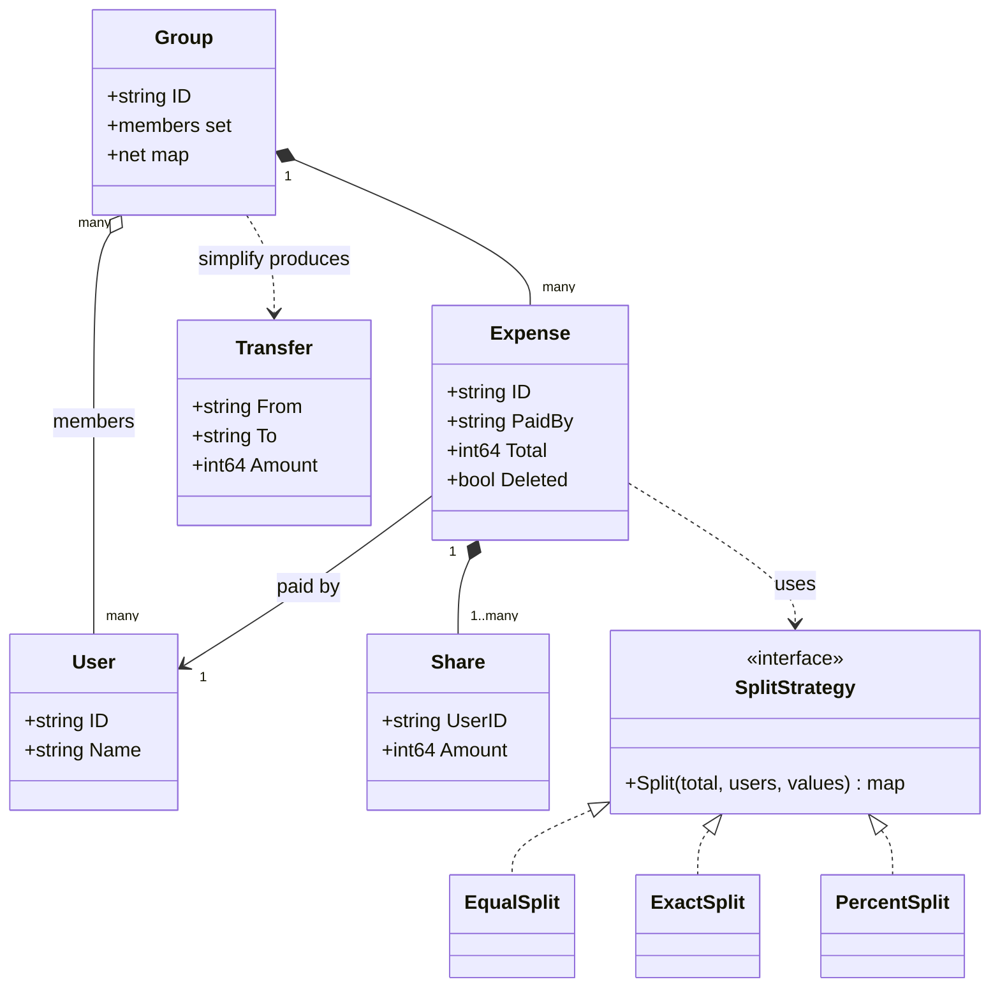

# Splitwise Expense Sharing LLD in Go

## Problem statement

```text
Design Splitwise-like expense sharing. Users create groups and add expenses.
An expense can be split equally, by exact amounts, or by percentage. Show each
user's balance, suggest a simplified set of payments to settle the group, and
support deleting an expense.
```

- It tests a clean Strategy for split types, strict input validation, and **exact money math with no lost paise**.
- It also tests the balance model (one net number per user per group), reversibility (delete = undo the deltas), and a small greedy algorithm (simplify debts).

## How to use this note

- Open the drawing in [[#Drawing]] and redraw it yourself first. The worked simplify-debts example (7 debts -> 3 transfers) is the one to be able to do by hand.
- Attempt each step yourself (2-5 minutes of writing) before reading the step here.
- Time box it like the real round (from [[LLD Practice Roadmap]]): 10 min requirements + entities, 10 min APIs + storage, 25-40 min core code, 10 min edge cases, 5 min explaining out loud.

## Step 1: Clarify requirements

### Questions to ask

- Can the payer be outside the participants (paid only for others)? *Assume: yes; payer must still be a group member.*
- Multiple payers for one expense? *Assume: single payer; multiple payers is a follow-up.*
- Percent precision? *Assume: basis points, 10000 = 100%, so 33.33% is exact.*
- Multi-currency? *Assume: one currency (INR) per group, stored in paise.*
- Simplify debts: optimal minimum or good enough? *Assume: greedy is fine (optimal is NP-hard); at most n-1 transfers.*
- Can expenses be edited or deleted? *Assume: delete yes (reverse its balance changes); edit = delete + add.*
- What if a participant is not in the group? *Assume: reject the whole expense with `ErrNotGroupMember`.*

### Functional

- Create groups with members.
- Add an expense: payer, total, participants, split type (EQUAL, EXACT, PERCENT).
- Show balances: net per user in the group.
- Simplify debts: a small set of "X pays Y" transfers that settles everyone.
- Record a settlement payment between two users.
- Delete an expense, reversing its effect on balances.

### Non-functional

- Money as `int64` paise, never float. Rs 100 split 3 ways = 3334 + 3333 + 3333.
- Shares always sum to the total exactly; nets in a group always sum to zero.
- Leftover paise go to users in sorted ID order: same input, same output.
- Concurrent expense adds in one group must not lose updates.
- Retries of "add expense" must not double count.

### Out of scope

- Friends outside groups (treat as a 2-person group if asked).
- Receipts, images, comments, notifications.
- Currency conversion, recurring expenses.

## Step 2: Actors and use cases

| Actor | Use case |
|---|---|
| User | Create group, add expense, delete expense, view balances, settle up |
| Group member | Sees their net balance and suggested transfers |
| System | Validates splits, updates balances, simplifies debts |
| Notification service | Tells participants an expense was added (extension) |

Hardest use case: `AddExpense` (pick the strategy, split exactly with no lost paise, validate members, apply balance deltas atomically). `SimplifyDebts` is the algorithm to explain. Code both.

## Step 3: Entities

| Entity | Key fields | Why it exists |
|---|---|---|
| `User` | `ID`, `Name` | A person who pays or owes |
| `Group` | `ID`, `members`, `net map[user]int64` | Scope for expenses and balances |
| `Expense` | `ID`, `GroupID`, `PaidBy`, `Total`, `Shares`, `Deleted` | One bill; keeps its shares so it can be reversed |
| `Share` (split) | `UserID`, `AmountPaise` | One participant's part of an expense |
| `SplitStrategy` | `Split(total, users, values)` | Equal, exact, percent behind one interface |
| `Balance` | `UserID`, `NetPaise` | Positive = others owe this user; negative = this user owes |
| `Transfer` (Settlement) | `From`, `To`, `Amount` | Output of simplify debts, or a recorded payment |

Modeling insight: **store one net number per user per group, not a pairwise debt graph.** "A owes B" edges are derived later by simplify debts. Nets make add and delete O(participants) and make the invariant easy: sum of nets = 0.

Second insight: the `Expense` stores its computed `Shares`. Delete reverses those exact numbers. Never re-run the split strategy on delete (rounding could differ if the code changed).

## Step 4: Relationships



- **Aggregation:** Group has Users, but users exist without the group and can be in many groups (many-to-many).
- **Composition:** Group owns its Expenses; an Expense owns its Shares. Delete the expense, the shares go with it.
- **Implementation:** three split types implement `SplitStrategy`.
- **Dependency:** `AddExpense` uses a strategy picked by a Factory from the request's split type.

## Step 5: APIs and public methods

```text
POST   /groups                               -> {name, member_ids}
POST   /groups/{id}/expenses                 -> {request_id, paid_by, total_paise, split_type,
                                                 participants: [user_id...], values: [int...]}
                                                400 bad split, 403/422 user not in group
DELETE /groups/{id}/expenses/{expense_id}    -> reverses balances; 204 (idempotent)
GET    /groups/{id}/balances                 -> [{user_id, net_paise}]
GET    /groups/{id}/settlements/suggested    -> [{from, to, amount_paise}]
POST   /groups/{id}/settlements              -> {from, to, amount_paise}
```

```go
type SplitStrategy interface {
    Split(total int64, users []string, values []int64) (map[string]int64, error)
}

func NewSplitStrategy(t SplitType) (SplitStrategy, error)

func (s *Service) CreateGroup(ctx context.Context, groupID string, users []string) error
func (s *Service) AddExpense(ctx context.Context, req AddExpenseRequest) (Expense, error)
func (s *Service) DeleteExpense(ctx context.Context, groupID, expenseID string) error
func (s *Service) Settle(ctx context.Context, groupID, from, to string, amount int64) error
func (s *Service) GetBalances(ctx context.Context, groupID string) (map[string]int64, error)
func (s *Service) SimplifyDebts(ctx context.Context, groupID string) ([]Transfer, error)
```

## Step 6: Storage and repositories

```sql
CREATE TABLE users  (id TEXT PRIMARY KEY, name TEXT NOT NULL);
CREATE TABLE groups (id TEXT PRIMARY KEY, name TEXT NOT NULL);
CREATE TABLE group_members (
    group_id TEXT NOT NULL REFERENCES groups(id),
    user_id  TEXT NOT NULL REFERENCES users(id),
    PRIMARY KEY (group_id, user_id)                -- enforces "user in group" with an FK below
);

CREATE TABLE expenses (
    id          TEXT PRIMARY KEY,
    group_id    TEXT NOT NULL REFERENCES groups(id),
    paid_by     TEXT NOT NULL,
    total_paise BIGINT NOT NULL CHECK (total_paise > 0),
    split_type  TEXT NOT NULL CHECK (split_type IN ('EQUAL', 'EXACT', 'PERCENT')),
    request_id  TEXT,                              -- client idempotency key
    deleted_at  TIMESTAMPTZ,                       -- soft delete keeps the audit trail
    created_at  TIMESTAMPTZ NOT NULL,
    FOREIGN KEY (group_id, paid_by) REFERENCES group_members (group_id, user_id),
    UNIQUE (group_id, request_id)
);

CREATE TABLE expense_shares (
    expense_id  TEXT NOT NULL REFERENCES expenses(id),
    group_id    TEXT NOT NULL,
    user_id     TEXT NOT NULL,
    share_paise BIGINT NOT NULL CHECK (share_paise >= 0),
    PRIMARY KEY (expense_id, user_id),             -- no duplicate participant
    FOREIGN KEY (group_id, user_id) REFERENCES group_members (group_id, user_id)
);

-- Denormalised running balance, updated in the same transaction as the expense.
CREATE TABLE group_balances (
    group_id  TEXT NOT NULL,
    user_id   TEXT NOT NULL,
    net_paise BIGINT NOT NULL DEFAULT 0,
    PRIMARY KEY (group_id, user_id)
);
-- Relative update, never read-modify-write in the app:
-- UPDATE group_balances SET net_paise = net_paise + $1 WHERE group_id = $2 AND user_id = $3;
-- Delete: UPDATE expenses SET deleted_at = now() WHERE id = $1 AND deleted_at IS NULL;
--         if 1 row changed, apply the negated shares in the same transaction.
```

```go
type ExpenseRepository interface {
    // Create inserts expense + shares and applies balance deltas in one transaction.
    Create(ctx context.Context, e Expense, requestID string) (Expense, error)
    // SoftDelete marks deleted and applies negated deltas; returns false if already deleted.
    SoftDelete(ctx context.Context, groupID, expenseID string) (bool, error)
}

type GroupRepository interface {
    IsMember(ctx context.Context, groupID, userID string) (bool, error)
    Balances(ctx context.Context, groupID string) (map[string]int64, error)
}
```

## Step 7: Patterns

| Pattern | Where | Why here |
|---|---|---|
| [[Strategy Pattern in Go]] | `EqualSplit`, `ExactSplit`, `PercentSplit` behind `SplitStrategy` | Same flow, different math; new split type = new struct, no service change |
| [[Factory Pattern in Go]] | `NewSplitStrategy(splitType)` | Maps the API string to a strategy in one place |
| [[Repository Pattern in Go]] | `ExpenseRepository`, `GroupRepository` | Swap maps for Postgres without touching split or simplify logic |
| [[Command Pattern in Go]] | Expense add/delete as reversible operations (`applyDeltas` with sign +1 / -1) | Delete is an exact undo of add |
| [[Observer Pattern in Go]] | Notify participants on expense added (extension) | Expense flow does not wait for notifications |

Patterns NOT used and why:

- No State pattern: an expense is only active or deleted; a `Deleted` flag is enough.
- No Singleton or global balance sheet: balances live per group inside the service, which is injected.

## Folder structure

```text
splitwise/
  model.go        -> Expense, Transfer, AddExpenseRequest, SplitType, errors
  split.go        -> SplitStrategy, EqualSplit, ExactSplit, PercentSplit, distribute, factory
  repository.go   -> ExpenseRepository, GroupRepository + in-memory impl
  service.go      -> AddExpense, DeleteExpense, Settle, GetBalances
  simplify.go     -> SimplifyDebts greedy algorithm
  service_test.go -> tests
cmd/demo/main.go  -> wiring: repos, service, HTTP handlers
```

- `split.go`: pure functions, no locks, easy to unit test alone.
- `service.go`: validation, membership, locking, balance deltas.
- `simplify.go`: works on a copy of balances, never holds the lock while computing.
- The code below puts all of it in one file so it compiles standalone.

## Step 8: Core code

Main logic only. Full runnable code is folded below.

```go
// Equal/Exact/PercentSplit implement it; NewSplitStrategy(t) is the Factory.
type SplitStrategy interface {
    Split(total int64, users []string, values []int64) (map[string]int64, error)
}

// distribute: floor each weighted share, leftover paise go 1 by 1 in sorted ID order.
func distribute(total int64, users []string, weights []int64) map[string]int64 {
    // ... wsum = sum(weights)
    out := make(map[string]int64, len(users))
    var given int64
    for i, u := range users {
        out[u] = total * weights[i] / wsum
        given += out[u]
    }
    order := append([]string(nil), users...)
    sort.Strings(order)
    for i := 0; given < total; i++ {
        out[order[i%len(order)]]++
        given++
    }
    return out
}

func (s *Service) AddExpense(ctx context.Context, req AddExpenseRequest) (Expense, error) {
    // ... validate amount > 0, participants present, no duplicates (no lock)
    strategy, err := NewSplitStrategy(req.SplitType)
    shares, err := strategy.Split(req.TotalPaise, req.Participants, req.Values) // pure, outside the lock
    s.mu.Lock()
    defer s.mu.Unlock()
    // ... RequestID seen before -> return the earlier expense (client retry)
    // ... group exists, payer and every participant are members
    s.seq++
    e := &Expense{ID: fmt.Sprintf("exp-%d", s.seq), GroupID: req.GroupID, PaidBy: req.PaidBy,
        Total: req.TotalPaise, Shares: shares}
    applyDeltas(g, e, +1) // DeleteExpense calls applyDeltas(g, e, -1)
    s.expenses[e.ID] = e // ... and s.byRequest[req.RequestID] = e.ID
    return copyExpense(e), nil
}

func applyDeltas(g *group, e *Expense, sign int64) {
    g.net[e.PaidBy] += sign * e.Total
    for u, amt := range e.Shares {
        g.net[u] -= sign * amt
    }
}

// SimplifyDebts: biggest debtor pays biggest creditor, repeat. At most n-1 transfers.
func (s *Service) SimplifyDebts(ctx context.Context, groupID string) ([]Transfer, error) {
    bal, err := s.GetBalances(ctx, groupID) // copy, so no lock held while computing
    for {
        cred, debt := "", "" // ... pick max creditor and max debtor (ties by user ID)
        if cred == "" || debt == "" {
            return transfers, nil
        }
        amt := min(bal[cred], -bal[debt])
        transfers = append(transfers, Transfer{From: debt, To: cred, Amount: amt})
        bal[cred] -= amt
        bal[debt] += amt
    }
}
```

### Walkthrough

`distribute(total, users, weights)` (used by Equal and Percent):

1. Each user gets `floor(total * weight / sumWeights)` paise. Integer division rounds down, so the sum is `<= total`.
2. The gap `total - given` is smaller than the number of users.
3. Sort user IDs and give 1 paisa each to the first users until the gap is zero. Same input = same output.
4. Example: 10000 paise, 3 users equal -> 3333 each, 1 left -> first sorted user gets 3334.

`AddExpense(ctx, req)`:

1. Validate cheap things without the lock: amount > 0, participants present, no duplicates.
2. Factory picks the strategy from `req.SplitType`; unknown type -> `ErrUnknownSplitType`.
3. Run the strategy (pure function) to get shares. It validates EXACT sum = total and PERCENT = 10000 bps.
4. Lock. If `RequestID` was seen, return the earlier expense (client retry).
5. Check the group exists and the payer and every participant are members, else `ErrNotGroupMember`. Nothing has changed yet, so a reject is clean.
6. `applyDeltas(+1)`: payer net `+= total`; each participant net `-= share`. Shares sum to total, so nets still sum to zero.
7. Store the expense with its shares (needed for delete).

`DeleteExpense(ctx, groupID, expenseID)`:

1. Lock, find the expense in this group, else `ErrExpenseNotFound`.
2. Already deleted -> return nil (idempotent retry, balances not touched twice).
3. `applyDeltas(-1)` with the **stored** shares: exact reverse of the add. Mark deleted (soft delete, audit trail).

`SimplifyDebts(ctx, groupID)`:

1. Copy net balances (no lock held while computing).
2. Pick the biggest creditor and the biggest debtor (ties by user ID).
3. Debtor pays `min(credit, debt)`; at least one of them becomes zero.
4. Repeat until no creditors or debtors. At most `n-1` transfers.

Worked example (same as the drawing and `TestSimplifyAndDelete`), amounts in rupees:

| Expense | Paid by | Split | a | b | c | d |
|---|---|---|---|---|---|---|
| Dinner 12 | a | equal 4 ways (3 each) | +9 | -3 | -3 | -3 |
| Movie 4 | b | exact c 2, d 2 | | +4 | -2 | -2 |
| Taxi 2 | c | 50% a, 50% d | -1 | | +2 | -1 |
| **Net** | | | **+8** | **+1** | **-3** | **-6** |

- Before: 7 raw debts (b->a 3, c->a 3, d->a 3, c->b 2, d->b 2, a->c 1, d->c 1).
- Greedy: d (-6) pays a (+8) 6 -> a +2. c (-3) pays a (+2) 2 -> c -1. c (-1) pays b (+1) 1. Done.
- After: 3 transfers: d->a 6, c->a 2, c->b 1.
- Delete taxi: nets become a +9, b +1, c -5, d -5 (taxi deltas reversed exactly).

> [!example]- Full runnable code (click to open)
> ```go
> package splitwise
>
> import (
>     "context"
>     "errors"
>     "fmt"
>     "sort"
>     "sync"
> )
>
> var (
>     ErrInvalidAmount    = errors.New("amount must be positive")
>     ErrNoParticipants   = errors.New("no participants")
>     ErrValuesMismatch   = errors.New("values count does not match participants")
>     ErrSharesNotTotal   = errors.New("exact shares do not sum to total")
>     ErrPercentNot100    = errors.New("percent shares must sum to 100%")
>     ErrUnknownSplitType = errors.New("unknown split type")
>     ErrGroupNotFound    = errors.New("group not found")
>     ErrNotGroupMember   = errors.New("user not in group")
>     ErrDuplicateMember  = errors.New("duplicate participant")
>     ErrExpenseNotFound  = errors.New("expense not found")
> )
>
> // ---------- Split strategies (pure functions, no locks) ----------
>
> // SplitStrategy returns paise per user. The sum must equal total.
> type SplitStrategy interface {
>     Split(total int64, users []string, values []int64) (map[string]int64, error)
> }
>
> type EqualSplit struct{}
>
> func (EqualSplit) Split(total int64, users []string, _ []int64) (map[string]int64, error) {
>     weights := make([]int64, len(users))
>     for i := range weights {
>         weights[i] = 1
>     }
>     return distribute(total, users, weights), nil
> }
>
> type ExactSplit struct{}
>
> func (ExactSplit) Split(total int64, users []string, values []int64) (map[string]int64, error) {
>     if len(values) != len(users) {
>         return nil, ErrValuesMismatch
>     }
>     var sum int64
>     out := make(map[string]int64, len(users))
>     for i, u := range users {
>         if values[i] < 0 {
>             return nil, ErrInvalidAmount
>         }
>         sum += values[i]
>         out[u] = values[i]
>     }
>     if sum != total {
>         return nil, ErrSharesNotTotal
>     }
>     return out, nil
> }
>
> // PercentSplit values are basis points: 10000 = 100%, 3333 = 33.33%.
> type PercentSplit struct{}
>
> func (PercentSplit) Split(total int64, users []string, values []int64) (map[string]int64, error) {
>     if len(values) != len(users) {
>         return nil, ErrValuesMismatch
>     }
>     var sum int64
>     for _, v := range values {
>         if v < 0 {
>             return nil, ErrInvalidAmount
>         }
>         sum += v
>     }
>     if sum != 10000 {
>         return nil, ErrPercentNot100
>     }
>     return distribute(total, users, values), nil
> }
>
> // distribute splits total by weight, floors each share, then hands leftover
> // paise one by one to users in sorted ID order (deterministic, nothing lost).
> func distribute(total int64, users []string, weights []int64) map[string]int64 {
>     var wsum int64
>     for _, w := range weights {
>         wsum += w
>     }
>     out := make(map[string]int64, len(users))
>     var given int64
>     for i, u := range users {
>         out[u] = total * weights[i] / wsum
>         given += out[u]
>     }
>     order := append([]string(nil), users...)
>     sort.Strings(order)
>     for i := 0; given < total; i++ {
>         out[order[i%len(order)]]++
>         given++
>     }
>     return out
> }
>
> type SplitType string
>
> const (
>     Equal   SplitType = "EQUAL"
>     Exact   SplitType = "EXACT"
>     Percent SplitType = "PERCENT"
> )
>
> // NewSplitStrategy is the Factory: API string -> strategy.
> func NewSplitStrategy(t SplitType) (SplitStrategy, error) {
>     switch t {
>     case Equal:
>         return EqualSplit{}, nil
>     case Exact:
>         return ExactSplit{}, nil
>     case Percent:
>         return PercentSplit{}, nil
>     }
>     return nil, fmt.Errorf("%w: %q", ErrUnknownSplitType, t)
> }
>
> // ---------- Domain ----------
>
> type AddExpenseRequest struct {
>     RequestID    string // client idempotency key; retries return the same expense
>     GroupID      string
>     PaidBy       string
>     TotalPaise   int64
>     SplitType    SplitType
>     Participants []string
>     Values       []int64 // exact paise or percent basis points; nil for EQUAL
> }
>
> type Expense struct {
>     ID      string
>     GroupID string
>     PaidBy  string
>     Total   int64
>     Shares  map[string]int64
>     Deleted bool
> }
>
> type Transfer struct {
>     From, To string
>     Amount   int64
> }
>
> type group struct {
>     members map[string]bool
>     net     map[string]int64 // + means others owe this user
> }
>
> type Service struct {
>     mu        sync.Mutex
>     groups    map[string]*group
>     expenses  map[string]*Expense
>     byRequest map[string]string // RequestID -> expense ID
>     seq       int
> }
>
> func NewService() *Service {
>     return &Service{groups: map[string]*group{}, expenses: map[string]*Expense{}, byRequest: map[string]string{}}
> }
>
> func (s *Service) CreateGroup(ctx context.Context, groupID string, users []string) error {
>     s.mu.Lock()
>     defer s.mu.Unlock()
>     g := &group{members: map[string]bool{}, net: map[string]int64{}}
>     for _, u := range users {
>         g.members[u] = true
>     }
>     s.groups[groupID] = g
>     return nil
> }
>
> func (s *Service) AddExpense(ctx context.Context, req AddExpenseRequest) (Expense, error) {
>     if err := ctx.Err(); err != nil {
>         return Expense{}, err
>     }
>     if req.TotalPaise <= 0 {
>         return Expense{}, ErrInvalidAmount
>     }
>     if len(req.Participants) == 0 {
>         return Expense{}, ErrNoParticipants
>     }
>     seen := map[string]bool{}
>     for _, u := range req.Participants {
>         if seen[u] {
>             return Expense{}, ErrDuplicateMember
>         }
>         seen[u] = true
>     }
>     strategy, err := NewSplitStrategy(req.SplitType)
>     if err != nil {
>         return Expense{}, err
>     }
>     shares, err := strategy.Split(req.TotalPaise, req.Participants, req.Values) // pure, outside the lock
>     if err != nil {
>         return Expense{}, err
>     }
>
>     s.mu.Lock()
>     defer s.mu.Unlock()
>     if id, ok := s.byRequest[req.RequestID]; ok && req.RequestID != "" {
>         return copyExpense(s.expenses[id]), nil
>     }
>     g, ok := s.groups[req.GroupID]
>     if !ok {
>         return Expense{}, ErrGroupNotFound
>     }
>     if !g.members[req.PaidBy] {
>         return Expense{}, fmt.Errorf("%w: payer %s", ErrNotGroupMember, req.PaidBy)
>     }
>     for _, u := range req.Participants {
>         if !g.members[u] {
>             return Expense{}, fmt.Errorf("%w: %s", ErrNotGroupMember, u)
>         }
>     }
>     s.seq++
>     e := &Expense{ID: fmt.Sprintf("exp-%d", s.seq), GroupID: req.GroupID, PaidBy: req.PaidBy,
>         Total: req.TotalPaise, Shares: shares}
>     applyDeltas(g, e, +1)
>     s.expenses[e.ID] = e
>     if req.RequestID != "" {
>         s.byRequest[req.RequestID] = e.ID
>     }
>     return copyExpense(e), nil
> }
>
> // DeleteExpense reverses exactly the deltas the expense applied. Idempotent.
> func (s *Service) DeleteExpense(ctx context.Context, groupID, expenseID string) error {
>     s.mu.Lock()
>     defer s.mu.Unlock()
>     e, ok := s.expenses[expenseID]
>     if !ok || e.GroupID != groupID {
>         return ErrExpenseNotFound
>     }
>     if e.Deleted {
>         return nil // retry of a delete: balances already reversed
>     }
>     applyDeltas(s.groups[groupID], e, -1)
>     e.Deleted = true
>     return nil
> }
>
> // applyDeltas: payer +total, each participant -share. sign = -1 undoes it.
> // Shares sum to total, so the group's nets always sum to zero.
> func applyDeltas(g *group, e *Expense, sign int64) {
>     g.net[e.PaidBy] += sign * e.Total
>     for u, amt := range e.Shares {
>         g.net[u] -= sign * amt
>     }
> }
>
> // Settle records a real payment: from pays to, so from's debt shrinks.
> func (s *Service) Settle(ctx context.Context, groupID, from, to string, amount int64) error {
>     if amount <= 0 {
>         return ErrInvalidAmount
>     }
>     s.mu.Lock()
>     defer s.mu.Unlock()
>     g, ok := s.groups[groupID]
>     if !ok {
>         return ErrGroupNotFound
>     }
>     if !g.members[from] || !g.members[to] {
>         return ErrNotGroupMember
>     }
>     g.net[from] += amount
>     g.net[to] -= amount
>     return nil
> }
>
> func (s *Service) GetBalances(ctx context.Context, groupID string) (map[string]int64, error) {
>     s.mu.Lock()
>     defer s.mu.Unlock()
>     g, ok := s.groups[groupID]
>     if !ok {
>         return nil, ErrGroupNotFound
>     }
>     out := make(map[string]int64, len(g.net))
>     for u, v := range g.net {
>         if v != 0 {
>             out[u] = v
>         }
>     }
>     return out, nil
> }
>
> // SimplifyDebts: repeatedly match the biggest debtor with the biggest creditor.
> // At most n-1 transfers. Greedy, not guaranteed minimum (that is NP-hard).
> func (s *Service) SimplifyDebts(ctx context.Context, groupID string) ([]Transfer, error) {
>     bal, err := s.GetBalances(ctx, groupID) // copy, so no lock held while computing
>     if err != nil {
>         return nil, err
>     }
>     var transfers []Transfer
>     for {
>         cred, debt := "", ""
>         for u, v := range bal { // ties broken by user ID for determinism
>             if v > 0 && (cred == "" || v > bal[cred] || (v == bal[cred] && u < cred)) {
>                 cred = u
>             }
>             if v < 0 && (debt == "" || v < bal[debt] || (v == bal[debt] && u < debt)) {
>                 debt = u
>             }
>         }
>         if cred == "" || debt == "" {
>             return transfers, nil
>         }
>         amt := min(bal[cred], -bal[debt])
>         transfers = append(transfers, Transfer{From: debt, To: cred, Amount: amt})
>         bal[cred] -= amt
>         bal[debt] += amt
>     }
> }
>
> func copyExpense(e *Expense) Expense {
>     c := *e
>     c.Shares = make(map[string]int64, len(e.Shares))
>     for u, v := range e.Shares {
>         c.Shares[u] = v
>     }
>     return c
> }
> ```

## Test cases

| Test | Proves |
|---|---|
| `TestSplits` (table) | Equal leftover paisa goes to the first sorted user; percent of an odd total is exact; percent != 100, exact sum mismatch, missing values are rejected |
| `TestAddExpenseValidation` (table) | Payer or participant not in group, unknown group, zero amount, duplicate participant, unknown split type; a rejected add changes no balance |
| `TestSimplifyAndDelete` | The worked example: nets, 3 simplified transfers in exact order, delete reverses deltas, delete twice is a no-op, unknown expense errors |
| `TestIdempotentAdd` | Same `RequestID` twice -> one expense, balance counted once |
| `TestConcurrentAdd` | 50 goroutines add expenses: no lost update, exact nets, simplify gives 2 transfers |

> [!example]- Full test code (click to open)
> ```go
> package splitwise
>
> import (
>     "context"
>     "errors"
>     "reflect"
>     "sync"
>     "testing"
> )
>
> func TestSplits(t *testing.T) {
>     tests := []struct {
>         name    string
>         s       SplitStrategy
>         total   int64
>         users   []string
>         values  []int64
>         want    map[string]int64
>         wantErr error
>     }{
>         {"equal, leftover paisa to first sorted user", EqualSplit{}, 10000, []string{"c", "a", "b"}, nil,
>             map[string]int64{"a": 3334, "b": 3333, "c": 3333}, nil},
>         {"percent 50/50 of odd total", PercentSplit{}, 1001, []string{"a", "b"}, []int64{5000, 5000},
>             map[string]int64{"a": 501, "b": 500}, nil},
>         {"percent not 100", PercentSplit{}, 100, []string{"a"}, []int64{9000}, nil, ErrPercentNot100},
>         {"exact ok", ExactSplit{}, 100, []string{"a", "b"}, []int64{70, 30},
>             map[string]int64{"a": 70, "b": 30}, nil},
>         {"exact does not sum", ExactSplit{}, 100, []string{"a", "b"}, []int64{50, 40}, nil, ErrSharesNotTotal},
>         {"exact values missing", ExactSplit{}, 100, []string{"a", "b"}, []int64{100}, nil, ErrValuesMismatch},
>     }
>     for _, tc := range tests {
>         t.Run(tc.name, func(t *testing.T) {
>             got, err := tc.s.Split(tc.total, tc.users, tc.values)
>             if !errors.Is(err, tc.wantErr) {
>                 t.Fatalf("err %v want %v", err, tc.wantErr)
>             }
>             if tc.want != nil && !reflect.DeepEqual(got, tc.want) {
>                 t.Fatalf("got %v want %v", got, tc.want)
>             }
>         })
>     }
> }
>
> func newGroup(t *testing.T) (*Service, context.Context) {
>     s, ctx := NewService(), context.Background()
>     if err := s.CreateGroup(ctx, "g", []string{"a", "b", "c", "d"}); err != nil {
>         t.Fatal(err)
>     }
>     return s, ctx
> }
>
> func TestAddExpenseValidation(t *testing.T) {
>     tests := []struct {
>         name    string
>         req     AddExpenseRequest
>         wantErr error
>     }{
>         {"payer not in group", AddExpenseRequest{GroupID: "g", PaidBy: "z", TotalPaise: 300, SplitType: Equal, Participants: []string{"a"}}, ErrNotGroupMember},
>         {"participant not in group", AddExpenseRequest{GroupID: "g", PaidBy: "a", TotalPaise: 300, SplitType: Equal, Participants: []string{"a", "z"}}, ErrNotGroupMember},
>         {"unknown group", AddExpenseRequest{GroupID: "x", PaidBy: "a", TotalPaise: 300, SplitType: Equal, Participants: []string{"a"}}, ErrGroupNotFound},
>         {"zero amount", AddExpenseRequest{GroupID: "g", PaidBy: "a", TotalPaise: 0, SplitType: Equal, Participants: []string{"a"}}, ErrInvalidAmount},
>         {"duplicate participant", AddExpenseRequest{GroupID: "g", PaidBy: "a", TotalPaise: 300, SplitType: Equal, Participants: []string{"a", "a"}}, ErrDuplicateMember},
>         {"unknown split type", AddExpenseRequest{GroupID: "g", PaidBy: "a", TotalPaise: 300, SplitType: "SHARES", Participants: []string{"a"}}, ErrUnknownSplitType},
>     }
>     for _, tc := range tests {
>         t.Run(tc.name, func(t *testing.T) {
>             s, ctx := newGroup(t)
>             if _, err := s.AddExpense(ctx, tc.req); !errors.Is(err, tc.wantErr) {
>                 t.Fatalf("got %v want %v", err, tc.wantErr)
>             }
>             if bal, _ := s.GetBalances(ctx, "g"); len(bal) != 0 {
>                 t.Fatal("failed add changed balances", bal)
>             }
>         })
>     }
> }
>
> // Worked example from the drawing: 4 friends, 3 expenses, simplify to 2 transfers.
> func TestSimplifyAndDelete(t *testing.T) {
>     s, ctx := newGroup(t)
>     add := func(req AddExpenseRequest) Expense {
>         req.GroupID = "g"
>         e, err := s.AddExpense(ctx, req)
>         if err != nil {
>             t.Fatal(err)
>         }
>         return e
>     }
>     add(AddExpenseRequest{PaidBy: "a", TotalPaise: 1200, SplitType: Equal, Participants: []string{"a", "b", "c", "d"}})
>     add(AddExpenseRequest{PaidBy: "b", TotalPaise: 400, SplitType: Exact, Participants: []string{"c", "d"}, Values: []int64{200, 200}})
>     taxi := add(AddExpenseRequest{PaidBy: "c", TotalPaise: 200, SplitType: Percent, Participants: []string{"a", "d"}, Values: []int64{5000, 5000}})
>
>     bal, _ := s.GetBalances(ctx, "g")
>     want := map[string]int64{"a": 800, "b": 100, "c": -300, "d": -600}
>     if !reflect.DeepEqual(bal, want) {
>         t.Fatalf("balances %v want %v", bal, want)
>     }
>     tr, _ := s.SimplifyDebts(ctx, "g")
>     wantTr := []Transfer{{"d", "a", 600}, {"c", "a", 200}, {"c", "b", 100}}
>     if !reflect.DeepEqual(tr, wantTr) {
>         t.Fatalf("transfers %v want %v", tr, wantTr)
>     }
>
>     // Delete the taxi expense: its deltas are reversed exactly, twice is a no-op.
>     for i := 0; i < 2; i++ {
>         if err := s.DeleteExpense(ctx, "g", taxi.ID); err != nil {
>             t.Fatal(err)
>         }
>     }
>     bal, _ = s.GetBalances(ctx, "g")
>     want = map[string]int64{"a": 900, "b": 100, "c": -500, "d": -500}
>     if !reflect.DeepEqual(bal, want) {
>         t.Fatalf("after delete %v want %v", bal, want)
>     }
>     if err := s.DeleteExpense(ctx, "g", "exp-99"); !errors.Is(err, ErrExpenseNotFound) {
>         t.Fatal(err)
>     }
> }
>
> func TestIdempotentAdd(t *testing.T) {
>     s, ctx := newGroup(t)
>     req := AddExpenseRequest{RequestID: "r1", GroupID: "g", PaidBy: "a", TotalPaise: 200, SplitType: Equal, Participants: []string{"a", "b"}}
>     e1, _ := s.AddExpense(ctx, req)
>     e2, _ := s.AddExpense(ctx, req) // client retry
>     bal, _ := s.GetBalances(ctx, "g")
>     if e1.ID != e2.ID || bal["a"] != 100 {
>         t.Fatal(e1.ID, e2.ID, bal)
>     }
> }
>
> // 50 concurrent expenses: no lost update, nets still sum to zero.
> func TestConcurrentAdd(t *testing.T) {
>     s, ctx := newGroup(t)
>     var wg sync.WaitGroup
>     for i := 0; i < 50; i++ {
>         wg.Add(1)
>         go func() {
>             defer wg.Done()
>             req := AddExpenseRequest{GroupID: "g", PaidBy: "a", TotalPaise: 300, SplitType: Equal, Participants: []string{"a", "b", "c"}}
>             if _, err := s.AddExpense(ctx, req); err != nil {
>                 t.Error(err)
>             }
>         }()
>     }
>     wg.Wait()
>     b, _ := s.GetBalances(ctx, "g")
>     if b["a"] != 10000 || b["b"] != -5000 || b["c"] != -5000 {
>         t.Fatal(b)
>     }
>     tr, _ := s.SimplifyDebts(ctx, "g")
>     if len(tr) != 2 || tr[0] != (Transfer{"b", "a", 5000}) {
>         t.Fatal(tr)
>     }
> }
> ```

Run with `go test -race -count=1 ./...`.

## Step 9: Edge cases

| Edge case | What happens | How the design handles it |
|---|---|---|
| Race: two expenses update the same user's net | Lost update | Mutex around balance updates; in DB one transaction with relative `net = net + $1` |
| Percent does not sum to 100 | Shares would not equal total | `PercentSplit` returns `ErrPercentNot100` before anything changes |
| Exact split does not sum to amount | Same | `ExactSplit` returns `ErrSharesNotTotal` |
| User not in group (payer or participant) | Balance for a stranger | Membership check under the lock returns `ErrNotGroupMember`; DB composite FK to `group_members` |
| Rounding errors | 100/3 loses a paisa | `int64` paise; floor then distribute leftover in sorted order; shares always sum to total |
| Deleting an expense | Balances must go back | Reverse the stored shares (`applyDeltas(-1)`); soft delete keeps the audit trail |
| Deleting twice (retry) | Double reversal | `Deleted` flag (DB: `WHERE deleted_at IS NULL`) makes it a no-op |
| Duplicate add on client retry | Expense counted twice | `RequestID` idempotency; DB `UNIQUE (group_id, request_id)` |
| Duplicate participant in one expense | Share counted twice | Rejected with `ErrDuplicateMember`; DB primary key `(expense_id, user_id)` |
| Member leaves with non-zero balance | Money disappears | Block removal until net = 0 |
| Overflow | int64 paise | Max is about 9.2e16 rupees; not a concern, but say it |

## Step 10: Tradeoffs and extensions

| Follow-up | Design change |
|---|---|
| Multiple payers for one expense | `Payers map[user]int64`; each payer net += paid; validate payers sum = total |
| Add a SHARES split, e.g. 2:1:1 | New strategy reusing `distribute` with weights; add one case to the factory (Open/Closed) |
| Edit an expense | Reverse old shares and apply new ones in one transaction; keep version history |
| Optimal minimum transactions | NP-hard in general; greedy is fine; for tiny groups, backtracking over subsets that sum to zero |
| Multi-currency | Store currency per expense; convert to the group base currency with a stored FX rate at expense time |
| Expense outside any group | Implicit 2-person group keyed by the sorted user pair |
| Pairwise view "who owes me" | Derive from simplify output, or keep a `pair_balances` table if the product needs it |

### Tradeoffs I chose

- Net balance per user over pairwise ledger: O(participants) updates, simple invariant; pairwise edges are derived.
- Running balance table (denormalised) over recomputing from all expenses: fast reads; the expense rows are still the source of truth for rebuilds.
- Soft delete with exact reversal over hard delete: audit trail, idempotent retries.
- Greedy simplify: at most n-1 transfers, deterministic, easy to explain; not always the true minimum.
- One mutex for the service: simple; per-group locks if contention shows up.

## Drawing

![[Splitwise LLD Drawing.excalidraw]]

The drawing shows:

- Entities: Group, User, Expense, Share, `SplitStrategy` with three implementations, Transfer.
- Core flow: client -> `AddExpense` -> factory -> strategy -> membership check -> apply deltas, with red reject branches (bad split, user not in group), plus delete = negated deltas.
- Worked simplify-debts example: 4 people, 7 raw debts before, 3 transfers after.
- Storage: `group_members`, `expenses`, `expense_shares`, `group_balances` with their keys.

Redraw it from memory:

- [ ] `SplitStrategy` with 3 implementations and the factory.
- [ ] `AddExpense` flow and where each validation error comes from.
- [ ] Net balances for the 3-expense example, then the greedy transfers.
- [ ] Why delete reverses stored shares instead of re-splitting.

## Interview explanation

```text
I keep money as int64 paise and make splitting a Strategy: equal, exact and percent each return a map of user to share, and they validate that exact amounts sum to the total and percents sum to 100 percent.
For equal and percent I floor each share and give the leftover paise one by one in sorted user order, so the result is exact and deterministic.
Each group keeps one net balance per user; AddExpense checks the payer and participants are members, then adds the total to the payer and subtracts each share, under a lock or in one DB transaction with relative updates, so nets always sum to zero.
The expense stores its shares, so delete simply applies the same deltas negated, and a deleted flag makes it idempotent.
Simplify debts is a greedy loop matching the largest debtor with the largest creditor, giving at most n minus one transfers.
```

## Related

- [[LLD Practice Roadmap]]
- [[LLD Question Bank with Answers]]
- [[Strategy Pattern in Go]]
- [[Factory Pattern in Go]]
- [[Repository Pattern in Go]]
- [[Command Pattern in Go]]
- [[Observer Pattern in Go]]
- [[Concurrency in Go LLD]]
- [[Testing LLD Code in Go]]
- [[UML for LLD Interviews]]
- [[Error Handling and Interfaces in Go LLD]]
