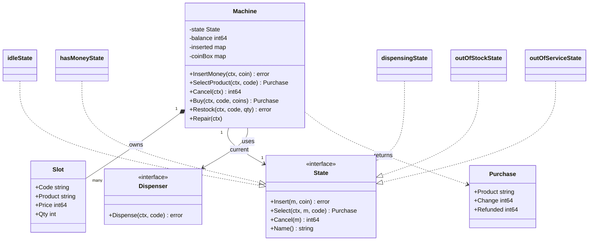
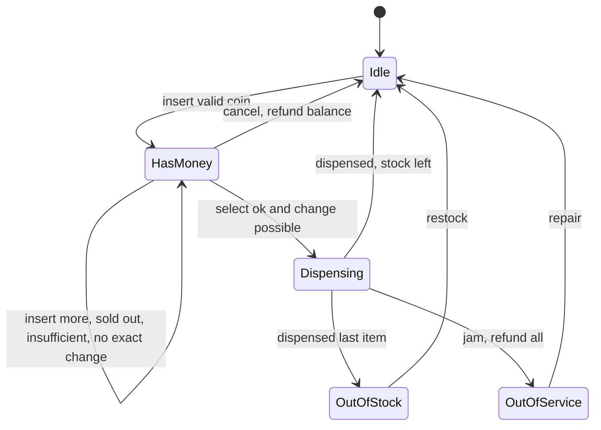

# Vending Machine LLD in Go

## Problem statement

```text
Design a vending machine that accepts coins and notes, lets the user choose a product,
dispenses the item, and returns change. Handle sold-out slots, cancel/refund,
exact change unavailable, and a jammed dispenser.
```

- The textbook State pattern problem: the same button (insert, select, cancel) does different things in idle, has-money, dispensing, out-of-stock and out-of-service.
- Also tests money safety: balance, coin box and stock must change together, and the user never loses money on a failed sale.

## How to use this note

- Open the drawing in [[#Drawing]] once, then close it and redraw the state machine yourself before reading further.
- Attempt each step yourself first (2-3 minutes), then read the step and compare.
- Time box like the real round: 10 min requirements + entities (Steps 1-4), 10 min APIs + storage (Steps 5-6), 25-40 min core code (Steps 7-8), 10 min edge cases (Step 9), 5 min explaining it out loud.

## Step 1: Clarify requirements

### Questions to ask

- Which coins and notes are accepted? *Assume: INR 1, 2, 5, 10, 20, 50, 100, stored as paise.*
- Does the machine have a limited coin box for change? *Assume: yes; if change cannot be made, refuse the sale before dispensing and keep the balance so the user can cancel or pay exact.*
- One item per session or many? *Assume: one item, then change, back to idle.*
- Sold-out slot: refund or choose again? *Assume: keep the balance, user picks another slot or cancels.*
- What if the motor jams? *Assume: refund everything, go out of service until an operator repairs it.*
- Card / UPI? *Assume: app flow pays and selects in one call (`Buy`); card reader is a follow-up via Adapter.*
- One machine or a fleet with a backend? *Assume: code one machine in memory; show the fleet DB schema.*

### Functional

- Slots (`A1`, `B2`...) each hold one product with price and quantity.
- Insert money: only accepted denominations; multiple inserts add up.
- Select product: if slot valid, in stock, balance enough and change possible, dispense and return change.
- Cancel: refund the full balance.
- App flow: pay + select atomically (`Buy`), refund in the same call if the sale fails.
- Operator: restock slots, load coins, repair a jam.

### Non-functional

- Balance, coin box and stock are consistent under concurrent calls (keypad + app).
- User never loses money: every failed sale keeps or refunds the balance.
- Invalid action in a state returns a typed error, never a panic or silent ignore.
- Money as `int64` paise.

### Out of scope

- Real hardware drivers (hidden behind `Dispenser`).
- Card/UPI gateway integration, receipts, loyalty.
- Multi-item cart in one session.

## Step 2: Actors and use cases

| Actor | Use case |
|---|---|
| Customer at keypad | Insert money, select product, cancel |
| Customer on app/UPI | Buy (pay + select in one call) |
| Operator | Restock slot, load change coins, repair a jam |
| Dispenser hardware | Drop the item or report a jam |
| Fleet backend (follow-up) | Track stock and sales per machine |

Hardest use case: **SelectProduct in has-money state** (validate slot, stock, balance, exact change, dispense, roll back on jam). Code that first.

## Step 3: Entities

| Entity | Key fields | Why it exists |
|---|---|---|
| `Machine` | state, balance, inserted (escrow), coinBox, slots, dispenser | Context object; owns the lock and delegates to the state |
| `State` | `Insert`, `Select`, `Cancel`, `Name` | Behavior per mode, no giant switch |
| `Slot` | Code, Product, Price, Qty | Inventory unit; stock is per slot, not per product |
| `Purchase` | Product, Change, Coins, Refunded | Result of a sale or of a failed one (refund amount) |
| Coin box | `map[denomination]count` | Makes "exact change unavailable" a real check |
| Escrow (`inserted`) | `map[denomination]count` | Coins of the current session; refund gives these back, so refund always works |
| `Dispenser` | `Dispense(ctx, slot) error` | Hardware boundary; lets tests simulate a jam |

Modeling insight: keep **escrow separate from the coin box**. Inserted coins are only committed to the box after a successful dispense, so cancel and jam refunds are always possible, and change is computed from box + escrow.

## Step 4: Relationships





- **Composition** Machine to Slot: slots are part of the machine.
- **Association** Machine to State: exactly one current state, replaced on every transition; states are stateless values.
- **Dependency on interface** Machine to Dispenser: hardware injected; tests pass a fake that succeeds or jams.
- **Realization** five state types implement `State`.

## Step 5: APIs and public methods

The machine itself is an in-memory component, so its API is the Go method set. For a fleet with a backend (app purchases):

```text
POST /machines/{id}/purchases        body: {slot, paymentRef}  header: Idempotency-Key
                                     -> 200 {product, change}  | 409 sold out | 503 out of service
PUT  /machines/{id}/slots/{code}     body: {addQty}            -> 200 {qty}
PUT  /machines/{id}/coins            body: {denomination, count}
GET  /machines/{id}/slots                                      -> 200 [{code, product, price, qty}]
```

```go
type VendingMachine interface {
    InsertMoney(ctx context.Context, coin int64) error
    SelectProduct(ctx context.Context, code string) (Purchase, error)
    Cancel(ctx context.Context) (int64, error)
    Buy(ctx context.Context, code string, coins ...int64) (Purchase, error) // app flow
    Restock(ctx context.Context, code string, qty int) error              // operator
    Repair(ctx context.Context)                                           // operator
    StateName() string
}
```

## Step 6: Storage and repositories

A single machine needs no DB (state lives in the device). For a fleet, the backend keeps inventory and sales:

```sql
CREATE TABLE slots (
    machine_id  TEXT   NOT NULL,
    code        TEXT   NOT NULL,
    product_id  TEXT   NOT NULL,
    price_paise BIGINT NOT NULL CHECK (price_paise > 0),
    qty         INT    NOT NULL CHECK (qty >= 0),
    PRIMARY KEY (machine_id, code)
);

CREATE TABLE coin_box (
    machine_id   TEXT   NOT NULL,
    denomination BIGINT NOT NULL,
    count        INT    NOT NULL CHECK (count >= 0),
    PRIMARY KEY (machine_id, denomination)
);

CREATE TABLE sales (
    id              TEXT PRIMARY KEY,
    machine_id      TEXT   NOT NULL,
    slot_code       TEXT   NOT NULL,
    paid_paise      BIGINT NOT NULL,
    change_paise    BIGINT NOT NULL,
    status          TEXT   NOT NULL,          -- completed | refunded_jam
    idempotency_key TEXT   NOT NULL UNIQUE,   -- app retry never vends twice
    created_at      TIMESTAMPTZ NOT NULL DEFAULT now()
);

-- decrement only if stock remains; 0 rows = sold out
UPDATE slots SET qty = qty - 1
WHERE machine_id = $1 AND code = $2 AND qty > 0;
```

```go
type SlotRepo interface {
    Get(ctx context.Context, machineID, code string) (Slot, error)
    Decrement(ctx context.Context, machineID, code string) error // ErrSoldOut on 0 rows
    Add(ctx context.Context, machineID, code string, qty int) error
}

type SaleRepo interface {
    // Create fails with a duplicate error on a reused idempotency key.
    Create(ctx context.Context, machineID, slot string, p Purchase, idemKey string) error
}
```

## Step 7: Patterns

| Pattern | Where | Why here |
|---|---|---|
| [[State Pattern in Go]] | `idleState`, `hasMoneyState`, `dispensingState`, `outOfStockState`, `outOfServiceState` | Every action behaves differently per mode; each state rejects invalid actions with a typed error |
| [[Adapter Pattern in Go]] | `Dispenser` (and a `PaymentInput` for card/UPI later) | Hide vendor hardware/SDK behind a small interface; fake it in tests |
| [[Strategy Pattern in Go]] | change-making (`makeChange`) | Greedy works for INR; a DP strategy is needed for odd coin sets |
| [[Singleton Pattern in Go]] | one `Machine` per device, built at boot and injected | One owner for balance and stock, no global |
| [[Repository Pattern in Go]] | `SlotRepo`, `SaleRepo` for the fleet backend | Swap storage without touching state logic |
| [[Observer Pattern in Go]] | publish `slot.empty`, `machine.jammed` to backend (follow-up) | Restock and repair alerts without polling |

Patterns NOT used and why:

- No Factory for states: states are empty structs, `hasMoneyState{}` is clearer than a factory (KISS).
- Change-making is a method, not yet an interface: only one algorithm today; extract the interface when a second one appears (YAGNI).

## Folder structure

```text
vending/
  model.go        -> Slot, Purchase, Err* errors
  state.go        -> State interface + idle, hasMoney, dispensing, outOfStock, outOfService
  dispenser.go    -> Dispenser interface + DispenserFunc (hardware adapter seam)
  repository.go   -> SlotRepo, SaleRepo (fleet backend only)
  service.go      -> Machine: NewMachine, InsertMoney, SelectProduct, Cancel, Buy, Restock, Repair, helpers
  service_test.go -> table-driven select tests, session flow, jam, concurrent Buy
cmd/demo/main.go  -> builds slots and coin box, injects the real dispenser
```

- `model.go`: data and errors only.
- `state.go`: all transition logic; the only place that assigns `m.state`.
- `dispenser.go`: the hardware boundary.
- `service.go`: the mutex, public methods and money helpers (`addCoin`, `refundAll`, `makeChange`, `restingState`).
- `service_test.go`: fake dispensers `okMotor` and `jamMotor`.
- `cmd/demo/main.go`: wiring only.

## Step 8: Core code

Main logic only. Full runnable code is folded below.

```go
// State decides how the machine reacts to each user action.
type State interface {
    Insert(m *Machine, coin int64) error
    Select(ctx context.Context, m *Machine, code string) (Purchase, error)
    Cancel(m *Machine) (int64, error)
}
// idleState, hasMoneyState, dispensingState, outOfStockState, outOfServiceState

type Machine struct {
    mu        sync.Mutex
    state     State
    balance   int64
    inserted  map[int64]int // coins held in escrow for the current session
    coinBox   map[int64]int // coins available for change
    slots     map[string]*Slot
    dispenser Dispenser
    // ... denoms, accepted
}

func (hasMoneyState) Select(ctx context.Context, m *Machine, code string) (Purchase, error) {
    slot, ok := m.slots[code]
    if !ok {
        return Purchase{}, ErrInvalidSlot
    }
    if slot.Qty == 0 {
        return Purchase{}, ErrSoldOut // keep balance, user can pick again
    }
    if m.balance < slot.Price {
        return Purchase{}, ErrInsufficientFunds
    }
    change := m.balance - slot.Price
    coins, ok := m.makeChange(change)
    if !ok {
        return Purchase{}, ErrExactChange // refuse BEFORE dispensing
    }

    m.state = dispensingState{}
    if err := m.dispenser.Dispense(ctx, code); err != nil {
        refund := m.refundAll() // item not delivered: give all money back
        m.state = outOfServiceState{}
        return Purchase{Refunded: refund}, fmt.Errorf("%w: %w", ErrDispenseFailed, err)
    }

    // commit: inserted coins go to the box, change coins leave it
    for d, n := range m.inserted {
        m.coinBox[d] += n
    }
    for d, n := range coins {
        m.coinBox[d] -= n
    }
    m.inserted = map[int64]int{}
    m.balance = 0
    slot.Qty--
    m.state = m.restingState()
    return Purchase{Product: slot.Product, Change: change, Coins: coins}, nil
}

// SelectProduct locks m.mu and calls m.state.Select(ctx, m, code).
// ... makeChange (greedy), refundAll, restingState, InsertMoney, Cancel, Buy, Restock, Repair
```

### Walkthrough

`SelectProduct(ctx, code)` locks the machine and delegates to the current state. The real logic is `hasMoneyState.Select`:

1. Look up the slot. Unknown code: `ErrInvalidSlot`, state unchanged.
2. `Qty == 0`: `ErrSoldOut`, state stays has-money, user keeps the balance.
3. `balance < price`: `ErrInsufficientFunds`, user can insert more.
4. Compute `change = balance - price` and try `makeChange` from coin box + escrow, largest coin first. If it cannot be made: `ErrExactChange` **before** anything is dispensed; balance kept so the user can cancel or pay exact.
5. Move to `dispensingState` and call the `Dispenser`.
6. Jam: `refundAll` gives back the escrowed coins, stock is not decremented (item never left), machine goes `outOfServiceState`, error wraps `ErrDispenseFailed` and the hardware cause.
7. Success: commit escrow into the coin box, remove change coins, reset balance, `Qty--`, move to the resting state (`idle`, or `out_of_stock` if every slot is empty).

`Buy(ctx, code, coins...)` is the app flow: validate denominations, lock, reject if a keypad session holds money, insert through the state, select, and on any failure cancel in the same call so the refund is returned with the error.

> [!example]- Full runnable code (click to open)
> ```go
> package vending
>
> import (
>     "context"
>     "errors"
>     "fmt"
>     "sort"
>     "sync"
> )
>
> var (
>     ErrInvalidDenomination = errors.New("coin or note not accepted")
>     ErrNoMoney             = errors.New("insert money first")
>     ErrInvalidSlot         = errors.New("invalid slot")
>     ErrSoldOut             = errors.New("slot sold out")
>     ErrInsufficientFunds   = errors.New("insufficient balance")
>     ErrExactChange         = errors.New("exact change unavailable")
>     ErrOutOfStock          = errors.New("machine out of stock")
>     ErrOutOfService        = errors.New("machine out of service")
>     ErrBusy                = errors.New("machine is busy")
>     ErrDispenseFailed      = errors.New("dispense failed, money refunded")
> )
>
> type Slot struct {
>     Code    string
>     Product string
>     Price   int64 // paise
>     Qty     int
> }
>
> // Purchase is the result of a select. Change and Refunded are in paise.
> type Purchase struct {
>     Product  string
>     Change   int64
>     Coins    map[int64]int // denomination -> count returned as change
>     Refunded int64         // set when the sale failed after money was taken
> }
>
> // Dispenser wraps the motor hardware (Adapter over the device driver).
> type Dispenser interface {
>     Dispense(ctx context.Context, slotCode string) error
> }
>
> // DispenserFunc lets a plain function act as a Dispenser.
> type DispenserFunc func(ctx context.Context, slotCode string) error
>
> func (f DispenserFunc) Dispense(ctx context.Context, code string) error { return f(ctx, code) }
>
> // State decides how the machine reacts to each user action.
> type State interface {
>     Name() string
>     Insert(m *Machine, coin int64) error
>     Select(ctx context.Context, m *Machine, code string) (Purchase, error)
>     Cancel(m *Machine) (int64, error)
> }
>
> type (
>     idleState         struct{}
>     hasMoneyState     struct{}
>     dispensingState   struct{}
>     outOfStockState   struct{}
>     outOfServiceState struct{} // jammed; needs an operator
> )
>
> func (idleState) Name() string { return "idle" }
> func (idleState) Insert(m *Machine, coin int64) error {
>     m.addCoin(coin)
>     m.state = hasMoneyState{}
>     return nil
> }
> func (idleState) Select(context.Context, *Machine, string) (Purchase, error) {
>     return Purchase{}, ErrNoMoney
> }
> func (idleState) Cancel(*Machine) (int64, error) { return 0, ErrNoMoney }
>
> func (hasMoneyState) Name() string { return "has_money" }
> func (hasMoneyState) Insert(m *Machine, coin int64) error {
>     m.addCoin(coin)
>     return nil
> }
> func (hasMoneyState) Select(ctx context.Context, m *Machine, code string) (Purchase, error) {
>     slot, ok := m.slots[code]
>     if !ok {
>         return Purchase{}, ErrInvalidSlot
>     }
>     if slot.Qty == 0 {
>         return Purchase{}, ErrSoldOut // keep balance, user can pick again
>     }
>     if m.balance < slot.Price {
>         return Purchase{}, ErrInsufficientFunds
>     }
>     change := m.balance - slot.Price
>     coins, ok := m.makeChange(change)
>     if !ok {
>         return Purchase{}, ErrExactChange // refuse BEFORE dispensing
>     }
>
>     m.state = dispensingState{}
>     if err := m.dispenser.Dispense(ctx, code); err != nil {
>         refund := m.refundAll() // item not delivered: give all money back
>         m.state = outOfServiceState{}
>         return Purchase{Refunded: refund}, fmt.Errorf("%w: %w", ErrDispenseFailed, err)
>     }
>
>     // commit: inserted coins go to the box, change coins leave it
>     for d, n := range m.inserted {
>         m.coinBox[d] += n
>     }
>     for d, n := range coins {
>         m.coinBox[d] -= n
>     }
>     m.inserted = map[int64]int{}
>     m.balance = 0
>     slot.Qty--
>     m.state = m.restingState()
>     return Purchase{Product: slot.Product, Change: change, Coins: coins}, nil
> }
> func (hasMoneyState) Cancel(m *Machine) (int64, error) {
>     refund := m.refundAll()
>     m.state = idleState{}
>     return refund, nil
> }
>
> func (dispensingState) Name() string                 { return "dispensing" }
> func (dispensingState) Insert(*Machine, int64) error { return ErrBusy }
> func (dispensingState) Select(context.Context, *Machine, string) (Purchase, error) {
>     return Purchase{}, ErrBusy
> }
> func (dispensingState) Cancel(*Machine) (int64, error) { return 0, ErrBusy }
>
> func (outOfStockState) Name() string                 { return "out_of_stock" }
> func (outOfStockState) Insert(*Machine, int64) error { return ErrOutOfStock }
> func (outOfStockState) Select(context.Context, *Machine, string) (Purchase, error) {
>     return Purchase{}, ErrOutOfStock
> }
> func (outOfStockState) Cancel(*Machine) (int64, error) { return 0, ErrNoMoney }
>
> func (outOfServiceState) Name() string                 { return "out_of_service" }
> func (outOfServiceState) Insert(*Machine, int64) error { return ErrOutOfService }
> func (outOfServiceState) Select(context.Context, *Machine, string) (Purchase, error) {
>     return Purchase{}, ErrOutOfService
> }
> func (outOfServiceState) Cancel(*Machine) (int64, error) { return 0, ErrNoMoney }
>
> type Machine struct {
>     mu        sync.Mutex
>     state     State
>     balance   int64
>     inserted  map[int64]int // coins held in escrow for the current session
>     coinBox   map[int64]int // coins available for change
>     denoms    []int64       // accepted denominations, largest first
>     accepted  map[int64]bool
>     slots     map[string]*Slot
>     dispenser Dispenser
> }
>
> func NewMachine(slots []Slot, accepted []int64, coinBox map[int64]int, d Dispenser) *Machine {
>     m := &Machine{
>         inserted: map[int64]int{}, coinBox: map[int64]int{},
>         accepted: map[int64]bool{}, slots: map[string]*Slot{}, dispenser: d,
>     }
>     for i := range slots {
>         s := slots[i]
>         m.slots[s.Code] = &s
>     }
>     for _, d := range accepted {
>         m.accepted[d] = true
>         m.denoms = append(m.denoms, d)
>     }
>     sort.Slice(m.denoms, func(i, j int) bool { return m.denoms[i] > m.denoms[j] })
>     for d, n := range coinBox {
>         m.coinBox[d] = n
>     }
>     m.state = m.restingState()
>     return m
> }
>
> // --- helpers, all called with m.mu held ---
>
> func (m *Machine) addCoin(coin int64) {
>     m.inserted[coin]++
>     m.balance += coin
> }
>
> // refundAll returns the escrowed coins; refund is always possible.
> func (m *Machine) refundAll() int64 {
>     r := m.balance
>     m.balance = 0
>     m.inserted = map[int64]int{}
>     return r
> }
>
> // makeChange is greedy over coin box + escrow. Greedy is optimal for
> // canonical coin systems like INR 1,2,5,10,20,50,100.
> func (m *Machine) makeChange(amount int64) (map[int64]int, bool) {
>     out := map[int64]int{}
>     for _, d := range m.denoms {
>         have := int64(m.coinBox[d] + m.inserted[d])
>         n := min(amount/d, have)
>         if n > 0 {
>             out[d] = int(n)
>             amount -= n * d
>         }
>     }
>     return out, amount == 0
> }
>
> // restingState is idle if anything is left to sell, else out_of_stock.
> func (m *Machine) restingState() State {
>     for _, s := range m.slots {
>         if s.Qty > 0 {
>             return idleState{}
>         }
>     }
>     return outOfStockState{}
> }
>
> // --- public API ---
>
> func (m *Machine) InsertMoney(ctx context.Context, coin int64) error {
>     if err := ctx.Err(); err != nil {
>         return err
>     }
>     if !m.accepted[coin] { // read-only after construction
>         return ErrInvalidDenomination
>     }
>     m.mu.Lock()
>     defer m.mu.Unlock()
>     return m.state.Insert(m, coin)
> }
>
> func (m *Machine) SelectProduct(ctx context.Context, code string) (Purchase, error) {
>     if err := ctx.Err(); err != nil {
>         return Purchase{}, err
>     }
>     m.mu.Lock()
>     defer m.mu.Unlock()
>     return m.state.Select(ctx, m, code)
> }
>
> func (m *Machine) Cancel(ctx context.Context) (int64, error) {
>     if err := ctx.Err(); err != nil {
>         return 0, err
>     }
>     m.mu.Lock()
>     defer m.mu.Unlock()
>     return m.state.Cancel(m)
> }
>
> // Buy is the app/UPI flow: pay and select in one atomic call. If the sale
> // is refused, the money is refunded in the same call.
> func (m *Machine) Buy(ctx context.Context, code string, coins ...int64) (Purchase, error) {
>     if err := ctx.Err(); err != nil {
>         return Purchase{}, err
>     }
>     for _, c := range coins {
>         if !m.accepted[c] {
>             return Purchase{}, ErrInvalidDenomination
>         }
>     }
>     m.mu.Lock()
>     defer m.mu.Unlock()
>     if m.balance > 0 {
>         return Purchase{}, ErrBusy // someone is mid-session at the keypad
>     }
>     for _, c := range coins {
>         if err := m.state.Insert(m, c); err != nil {
>             return Purchase{}, err // only the first coin can fail; nothing taken
>         }
>     }
>     p, err := m.state.Select(ctx, m, code)
>     if err != nil && m.balance > 0 {
>         p.Refunded, _ = m.state.Cancel(m)
>     }
>     return p, err
> }
>
> // Restock is an operator action; it wakes an out-of-stock machine.
> func (m *Machine) Restock(ctx context.Context, code string, qty int) error {
>     m.mu.Lock()
>     defer m.mu.Unlock()
>     s, ok := m.slots[code]
>     if !ok {
>         return ErrInvalidSlot
>     }
>     s.Qty += qty
>     if _, out := m.state.(outOfStockState); out {
>         m.state = m.restingState()
>     }
>     return nil
> }
>
> // Repair is the operator clearing a jam.
> func (m *Machine) Repair(ctx context.Context) {
>     m.mu.Lock()
>     defer m.mu.Unlock()
>     if _, broken := m.state.(outOfServiceState); broken {
>         m.state = m.restingState()
>     }
> }
>
> func (m *Machine) StateName() string {
>     m.mu.Lock()
>     defer m.mu.Unlock()
>     return m.state.Name()
> }
> ```

## Test cases

| Test | Proves |
|---|---|
| `TestSelectProduct` | No money, bad slot, insufficient, sold out keeps money, exact amount, change from box, exact change unavailable, jam refunds all and goes out of service |
| `TestSessionFlow` | Invalid coin, exact change refusal then cancel refund, purchase, out-of-stock rejects money, restock wakes the machine |
| `TestJamThenRepair` | App `Buy` on a jammed motor refunds, machine rejects money until `Repair` |
| `TestConcurrentBuyExactWinners` | 100 concurrent `Buy` calls on 5 items: exactly 5 sold, 95 `ErrOutOfStock` |

> [!example]- Full test code (click to open)
> ```go
> package vending
>
> import (
>     "context"
>     "errors"
>     "sync"
>     "testing"
> )
>
> var inr = []int64{100, 200, 500, 1000, 2000, 5000, 10000} // paise
>
> var okMotor = DispenserFunc(func(context.Context, string) error { return nil })
> var jamMotor = DispenserFunc(func(context.Context, string) error { return errors.New("motor stuck") })
>
> func TestSelectProduct(t *testing.T) {
>     tests := []struct {
>         name       string
>         qty        int
>         coinBox    map[int64]int
>         motor      Dispenser
>         insert     []int64
>         code       string
>         wantErr    error
>         wantChange int64
>         wantRefund int64
>         wantState  string
>     }{
>         {"no money", 1, nil, okMotor, nil, "A1", ErrNoMoney, 0, 0, "idle"},
>         {"bad slot", 1, nil, okMotor, []int64{5000}, "Z9", ErrInvalidSlot, 0, 0, "has_money"},
>         {"insufficient", 1, nil, okMotor, []int64{2000}, "A1", ErrInsufficientFunds, 0, 0, "has_money"},
>         {"sold out keeps money", 0, nil, okMotor, []int64{5000}, "A1", ErrSoldOut, 0, 0, "has_money"},
>         {"exact amount", 1, nil, okMotor, []int64{2000, 2000}, "A1", nil, 0, 0, "idle"},
>         {"change from box", 2, map[int64]int{1000: 1}, okMotor, []int64{5000}, "A1", nil, 1000, 0, "idle"},
>         {"no change in box", 2, nil, okMotor, []int64{5000}, "A1", ErrExactChange, 0, 0, "has_money"},
>         {"jam refunds all", 2, nil, jamMotor, []int64{2000, 2000}, "A1", ErrDispenseFailed, 0, 4000, "out_of_service"},
>     }
>     for _, tc := range tests {
>         t.Run(tc.name, func(t *testing.T) {
>             ctx := context.Background()
>             slots := []Slot{{"A1", "Coke", 4000, tc.qty}, {"B1", "Water", 2000, 5}}
>             m := NewMachine(slots, inr, tc.coinBox, tc.motor)
>             for _, c := range tc.insert {
>                 if err := m.InsertMoney(ctx, c); err != nil {
>                     t.Fatal(err)
>                 }
>             }
>             p, err := m.SelectProduct(ctx, tc.code)
>             if !errors.Is(err, tc.wantErr) {
>                 t.Fatalf("err %v want %v", err, tc.wantErr)
>             }
>             if p.Change != tc.wantChange || p.Refunded != tc.wantRefund {
>                 t.Fatalf("purchase %+v", p)
>             }
>             if got := m.StateName(); got != tc.wantState {
>                 t.Fatalf("state %s want %s", got, tc.wantState)
>             }
>         })
>     }
> }
>
> func TestSessionFlow(t *testing.T) {
>     ctx := context.Background()
>     m := NewMachine([]Slot{{"A1", "Chips", 2000, 1}}, inr, nil, okMotor)
>     if err := m.InsertMoney(ctx, 300); !errors.Is(err, ErrInvalidDenomination) {
>         t.Fatal(err)
>     }
>     m.InsertMoney(ctx, 5000)
>     if _, err := m.SelectProduct(ctx, "A1"); !errors.Is(err, ErrExactChange) {
>         t.Fatal(err) // box is empty, cannot return 30 rupees
>     }
>     if r, err := m.Cancel(ctx); err != nil || r != 5000 || m.StateName() != "idle" {
>         t.Fatal(r, err)
>     }
>     m.InsertMoney(ctx, 1000)
>     m.InsertMoney(ctx, 1000)
>     if p, err := m.SelectProduct(ctx, "A1"); err != nil || p.Product != "Chips" {
>         t.Fatal(p, err)
>     }
>     if err := m.InsertMoney(ctx, 1000); !errors.Is(err, ErrOutOfStock) {
>         t.Fatal(err)
>     }
>     m.Restock(ctx, "A1", 3)
>     if m.StateName() != "idle" {
>         t.Fatal(m.StateName())
>     }
> }
>
> func TestJamThenRepair(t *testing.T) {
>     ctx := context.Background()
>     m := NewMachine([]Slot{{"A1", "Coke", 2000, 2}}, inr, nil, jamMotor)
>     p, err := m.Buy(ctx, "A1", 2000)
>     if !errors.Is(err, ErrDispenseFailed) || p.Refunded != 2000 {
>         t.Fatal(p, err)
>     }
>     if err := m.InsertMoney(ctx, 1000); !errors.Is(err, ErrOutOfService) {
>         t.Fatal(err)
>     }
>     m.Repair(ctx)
>     if m.StateName() != "idle" {
>         t.Fatal(m.StateName())
>     }
> }
>
> func TestConcurrentBuyExactWinners(t *testing.T) {
>     ctx := context.Background()
>     m := NewMachine([]Slot{{"A1", "Chips", 1000, 5}}, inr, nil, okMotor)
>     var (
>         wg       sync.WaitGroup
>         mu       sync.Mutex
>         sold     int
>         rejected int
>     )
>     for i := 0; i < 100; i++ {
>         wg.Add(1)
>         go func() {
>             defer wg.Done()
>             _, err := m.Buy(ctx, "A1", 1000)
>             mu.Lock()
>             defer mu.Unlock()
>             switch {
>             case err == nil:
>                 sold++
>             case errors.Is(err, ErrOutOfStock):
>                 rejected++
>             default:
>                 t.Error(err)
>             }
>         }()
>     }
>     wg.Wait()
>     if sold != 5 || rejected != 95 || m.StateName() != "out_of_stock" {
>         t.Fatalf("sold %d rejected %d state %s", sold, rejected, m.StateName())
>     }
> }
> ```

## Step 9: Edge cases

| Edge case | What happens | How the design handles it |
|---|---|---|
| Race: two buyers for the last item | Both pass the stock check if checked outside the lock | Check + decrement under one mutex; fleet DB uses `UPDATE ... WHERE qty > 0` |
| Race: insert and cancel at the same time | Refund could miss a coin | Both serialize on the mutex; refund equals balance at that moment |
| App retries a purchase | Could vend twice | Idempotency key unique in `sales`; retry returns the first result |
| Insufficient money | Sale refused | `ErrInsufficientFunds`, balance kept, user inserts more |
| Out of stock (slot) | Slot empty | `ErrSoldOut`, balance kept, user picks another slot or cancels |
| Out of stock (machine) | Nothing to sell | `outOfStockState` rejects money up front |
| Exact change unavailable | Box cannot make the change | `makeChange` fails, `ErrExactChange` before dispensing, balance kept; display "exact change only" |
| User cancels | Wants money back | Escrowed coins returned, so refund never depends on the coin box |
| Machine jam / dispense failure | Item not delivered | Refund all, stock unchanged, `outOfServiceState` until `Repair`; Observer alert in fleet |
| Keypad session + app Buy at once | Mixed balances | `Buy` returns `ErrBusy` if a keypad balance exists |
| Invalid coin | Fake or foreign coin | `ErrInvalidDenomination`, checked before locking (accepted set is read-only) |

### Common mistakes

- One giant `switch state` in every method instead of State types (fine for tiny code, but interviews want the pattern).
- Losing the user's money on sold-out, insufficient, exact-change or jam errors.
- Decrementing stock before the dispenser confirms.
- Putting inserted coins straight into the change box, so a refund can fail.
- Forgetting out-of-stock and out-of-service states and accepting money with nothing to sell.
- Using `float64` for money; checking stock and decrementing it without a lock.

## Step 10: Tradeoffs and extensions

| Follow-up | Design change |
|---|---|
| Card / UPI | Adapter per payment method behind `PaymentInput`; new `awaitingPayment` state |
| Multiple items per session | Stay in has-money after dispense while balance remains |
| Admin / maintenance mode | `maintenanceState` rejects users, allows restock and price change |
| Physical dispense takes seconds | Release the lock while dispensing; `dispensingState` returns `ErrBusy`; a `DispenseDone` callback finishes the sale |
| Odd coin sets where greedy fails | Change-making Strategy with DP (min coins with limited counts) |
| Fleet telemetry | Observer publishes `slot.empty`, `sale.completed`, `machine.jammed` |
| Price change while user has money | Read price at select time; document that the shown price can change |

### Tradeoffs I chose

- Dispenser called while holding the mutex: one physical customer at a time, so blocking others is correct and simple; for slow motors, release the lock and rely on `dispensingState`.
- Escrow + coin box instead of only a balance number: a bit more code, but makes exact-change and refunds correct.
- Greedy change: optimal for canonical systems like INR; DP only if the coin set needs it.
- `Buy` reuses the State methods instead of a separate code path: one set of rules for keypad and app.

## Drawing

![[Vending Machine LLD Drawing.excalidraw]]

The drawing shows:

- Section 1: Machine (context) with Slots, the `State` interface and its five states, and the `Dispenser` interface.
- Section 2: the select flow in has-money state with red boxes for sold out, insufficient, exact change unavailable and jam.
- Section 3: the state machine with labeled transitions.
- Section 4: the fleet tables `slots`, `coin_box`, `sales`.

Redraw it from memory:

- [ ] The five states and every labeled transition, including jam -> out of service -> repair
- [ ] Select flow order: slot, stock, balance, change, dispense, commit
- [ ] Where money goes: escrow vs coin box
- [ ] Machine -> State and Machine -> Dispenser interface boxes
- [ ] `sales.idempotency_key UNIQUE` and `qty > 0` conditional update

## Interview explanation

```text
I model the machine with the State pattern: a State interface with Insert, Select and Cancel, implemented by idle, has-money, dispensing, out-of-stock and out-of-service, and the Machine just delegates to the current state under one mutex. Has-money is the important one: it validates slot, stock and balance, then checks that change can be made from the coin box before dispensing, so exact-change failures never take the user's money. Inserted coins sit in escrow until the dispenser confirms, so cancel and a jam can always refund them, and a jam moves the machine out of service until an operator repairs it. One lock guards balance, stock and coins, so two buyers can never get the last item; in a fleet backend I would use a conditional UPDATE with qty greater than zero and an idempotency key on sales. Payment methods, change-making and alerts plug in as Adapter, Strategy and Observer.
```

## Related

- [[LLD Practice Roadmap]]
- [[LLD Question Bank with Answers]]
- [[State Pattern in Go]]
- [[Adapter Pattern in Go]]
- [[Strategy Pattern in Go]]
- [[Singleton Pattern in Go]]
- [[Repository Pattern in Go]]
- [[Observer Pattern in Go]]
- [[Concurrency in Go LLD]]
- [[Testing LLD Code in Go]]
- [[UML for LLD Interviews]]
- [[Error Handling and Interfaces in Go LLD]]
- [[Go LLD Folder Structure for Practice]]
