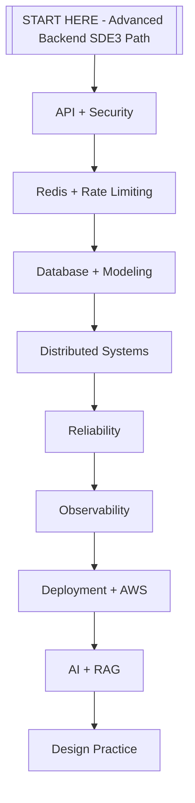

# 2026 SDE3 Gap Checklist

Use this as a final audit after finishing [[START HERE - Advanced Backend SDE3 Path]].

## Must know deeply

- API design: REST, GraphQL basics, gRPC, WebSocket, webhooks, pagination, versioning, CORS, gateway, CDN.
- Security: auth vs authorization, JWT, sessions, OAuth, refresh tokens, secrets, OWASP API risks.
- Redis: cache, sessions, pub/sub, streams/queues, distributed locks, fixed window, sliding window, token bucket, leaky bucket.
- Database: indexes, transactions, isolation, replication, sharding, backup, migrations, SQL vs NoSQL modeling.
- Distributed systems: consistency, CAP, quorum, leader election, consensus, saga, outbox, idempotency.
- Reliability: retries, timeout, backoff, jitter, circuit breaker, DLQ, worker architecture, graceful degradation.
- Observability: OpenTelemetry, logs, metrics, traces, SLO/SLI/SLA, alerting, incident response, postmortems.
- Deployment: Docker, CI/CD, blue-green, canary, rollback, Kubernetes, autoscaling, AWS basics.
- AI backend: LLM APIs, RAG, vector DBs, embeddings, agents, evals, guardrails, cost/rate limits.

## Visual map

## Red flags while revising

- You know the definition but cannot explain a real production example.
- You can draw the happy path but not the failure path.
- You mention a tool but not why it is chosen over alternatives.
- You cannot explain how you would monitor, scale, or roll back the design.

## Newly added missing topics

- [[API Error Handling]]
- [[Feature Flags]]
- [[Graceful Degradation]]
- [[Clock Skew and Time]]
- [[Event Streaming]]
- [[Schema Registry]]
- [[Global CDN and Edge]]
- [[Durable Job Scheduler]]

## Senior interview bank

These are topic-specific questions and strong answers for `2026 SDE3 Gap Checklist`.

### 1. What is the first thing you ask?

Clarify requirements: users, core features, read/write ratio, scale, latency, availability, consistency, geography, security, and what is explicitly out of scope.

### 2. What design path should you follow?

Requirements -> scale estimate -> APIs -> data model -> high-level design -> deep dive -> failure modes -> observability -> tradeoffs.

### 3. What separates senior from mid-level?

Senior answers discuss tradeoffs, failure modes, ownership, rollout, metrics, and recovery. Mid-level answers often stop at listing components.

### 4. How do you choose the deep dive?

Pick the hardest product risk: feed fanout, payment idempotency, chat ordering, file upload consistency, search latency, or notification delivery.

### 5. How do you close the interview?

Summarize the design, name key tradeoffs, say what you would monitor, and mention the first bottleneck or future improvement.

## Topic-specific drill

### How would I answer `2026 SDE3 Gap Checklist` if the interviewer asks directly?

For `2026 SDE3 Gap Checklist`, I would explain requirements, scale estimates, APIs, data model, high-level design, deep-dive bottleneck, failure modes, observability, and tradeoffs.

### What is the trap question for `2026 SDE3 Gap Checklist`?

The trap is giving only a definition. A senior answer must include a concrete production example, a failure mode, a tradeoff, and a metric.

### What should I draw?

Draw the smallest flow that shows where `2026 SDE3 Gap Checklist` sits, then add the failure path next to the happy path.

## Reviewer checklist

- Can I explain this without reading the note?
- Can I draw the happy path and failure path?
- Can I name one concrete metric?
- Can I explain the tradeoff against a simpler option?
- Can I give a production example in under two minutes?
