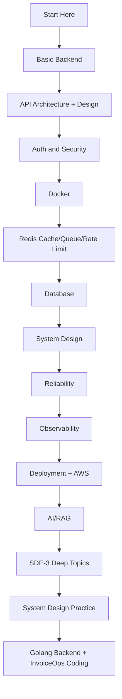

# START HERE - Advanced Backend SDE3 Path

## How to use this vault

Start here and follow the links in order. This path goes from backend basics to SDE-3 system design depth.

## Main path

1. [[Basic backend content table]]
2. [[Api architecture cntent table]]
3. [[API Design Content Table]]
4. [[Auth Security Content Table]]
5. [[Docker Content Table]]
6. [[redis Content table]]
7. [[Database Content Table]]
8. [[System Design Content Table]]
9. [[Reliability Content Table]]
10. [[Observability Content Table]]
11. [[Deployment Strategies Content Table]]
12. [[AWS Services Content Table]]
13. [[AI Engineering Content Table]]
14. [[RAG Content Table]]
15. [[SDE3 Backend Roadmap]]
16. [[Distributed Systems Content Table]]
17. [[Data Modeling Content Table]]
18. [[Performance Engineering Content Table]]
19. [[Production Debugging Content Table]]
20. [[Testing Strategy Content Table]]
21. [[Architecture Patterns Content Table]]
22. [[System Design Practice Content Table]]
23. [[Golang Backend Content Table]]

## Visual path

## Completion checklist

- I can design REST/GraphQL/gRPC/WebSocket APIs.
- I can explain auth, JWT, sessions, OAuth, and CORS.
- I can dockerize and deploy an app.
- I can use Redis for caching, queue, rate limiting, and sessions.
- I can model SQL/NoSQL data and choose indexes.
- I can design scaling, load balancing, replication, and sharding.
- I can explain reliability patterns: retries, circuit breakers, DLQ, idempotency.
- I can debug production using logs, metrics, traces, SLOs, and incidents.
- I can discuss distributed systems tradeoffs: consistency, consensus, locks, saga, outbox.
- I can solve design problems like URL shortener, chat, payment, feed, file storage.
- I can implement backend concepts in Go through REST, gRPC, WebSocket, Redis, SQL, workers, testing, observability, and deployment.

## Best revision method

For every topic note:

1. Read complete notes.
2. Redraw the diagram from memory.
3. Explain one example out loud.
4. Say one failure mode.
5. Say one tradeoff.

## Final gap check

- [[2026 SDE3 Gap Checklist]]

## Senior interview bank

These are topic-specific questions and strong answers for `START HERE - Advanced Backend SDE3 Path`.

### 1. What is the first thing you ask?

Clarify requirements: users, core features, read/write ratio, scale, latency, availability, consistency, geography, security, and what is explicitly out of scope.

### 2. What design path should you follow?

Requirements -> scale estimate -> APIs -> data model -> high-level design -> deep dive -> failure modes -> observability -> tradeoffs.

### 3. What separates senior from mid-level?

Senior answers discuss tradeoffs, failure modes, ownership, rollout, metrics, and recovery. Mid-level answers often stop at listing components.

### 4. How do you choose the deep dive?

Pick the hardest product risk: feed fanout, payment idempotency, chat ordering, file upload consistency, search latency, or notification delivery.

### 5. How do you close the interview?

Summarize the design, name key tradeoffs, say what you would monitor, and mention the first bottleneck or future improvement.

## Topic-specific drill

### How would I answer `START HERE - Advanced Backend SDE3 Path` if the interviewer asks directly?

For `START HERE - Advanced Backend SDE3 Path`, I would explain requirements, scale estimates, APIs, data model, high-level design, deep-dive bottleneck, failure modes, observability, and tradeoffs.

### What is the trap question for `START HERE - Advanced Backend SDE3 Path`?

The trap is giving only a definition. A senior answer must include a concrete production example, a failure mode, a tradeoff, and a metric.

### What should I draw?

Draw the smallest flow that shows where `START HERE - Advanced Backend SDE3 Path` sits, then add the failure path next to the happy path.

## Reviewer checklist

- Can I explain this without reading the note?
- Can I draw the happy path and failure path?
- Can I name one concrete metric?
- Can I explain the tradeoff against a simpler option?
- Can I give a production example in under two minutes?
