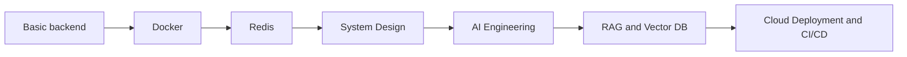

# Advance backend content table

- [[START HERE - Advanced Backend SDE3 Path]]

## Course Part 1

- [[Basic backend content table]]
- [[Docker Content Table]]
- [[redis Content table]]
- [[API Caching with Redis]]
- [[Rate limiting with Redis]]
- [[Message Queue with Redis]]
- [[System Design Content Table]]

## Course Part 2

- [[AI Engineering Content Table]]
- [[RAG Content Table]]
- [[Cloud Deployment Content Table]]

## Full course study order

1. [[Basic backend content table]]
2. [[Docker Content Table]]
3. [[redis Content table]]
4. [[API Caching with Redis]]
5. [[Rate limiting with Redis]]
6. [[Message Queue with Redis]]
7. [[System Design Content Table]]
8. [[AI Engineering Content Table]]
9. [[RAG Content Table]]
10. [[Cloud Deployment Content Table]]

## Revision dashboard

Advanced Backend + AI means learning how modern backend systems run, scale, [[cache]], queue work, design architecture, connect with LLMs, retrieve knowledge, and deploy to cloud.

## Big picture diagram

## Source coverage checklist

- Level 0 Basic Backend Revision
- Level 1 Docker
- Level 2 Redis
- API Caching
- Rate Limiting Project
- Message Queue
- Level 3 System Design
- Scaling Concepts
- Nginx
- Microservices
- Database Replication
- Database Sharding
- Level 4 AI Full Course
- LLM Fundamentals
- LangChain
- LangGraph
- AI Agents
- Prompt Engineering
- RAG
- Embedding Models
- Vector Databases
- Semantic Search
- Document Processing
- AI Chat with PDFs and Websites
- Level 5 Cloud Deployment
- AWS Deployment
- CI/CD Pipeline
- ECR and ECS services
- Production Best Practices

## Quick revision

- Docker packages apps.
- Redis handles cache, queues, sessions, and rate limits.
- System design handles scaling and databases.
- AI engineering connects backend with LLMs and tools.
- RAG connects LLMs with private documents.
- AWS/CI-CD deploys the system to production.

## Missing topic groups added

- [[API Design Content Table]]
- [[Auth Security Content Table]]
- [[Database Content Table]]
- [[Reliability Content Table]]
- [[Observability Content Table]]
- [[Deployment Strategies Content Table]]
- [[AWS Services Content Table]]

## Language backend implementation track

- [[Golang Backend Content Table]]

## SDE-3 upgrade topics

- [[SDE3 Backend Roadmap]]
- [[Distributed Systems Content Table]]
- [[Data Modeling Content Table]]
- [[Production Debugging Content Table]]
- [[Testing Strategy Content Table]]
- [[Architecture Patterns Content Table]]
- [[Performance Engineering Content Table]]
- [[System Design Practice Content Table]]
