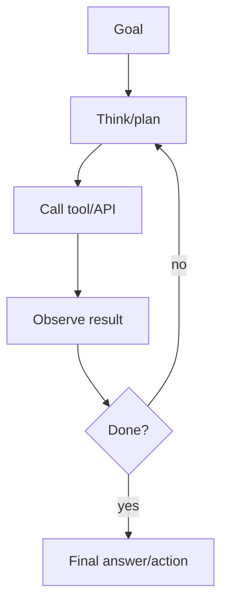
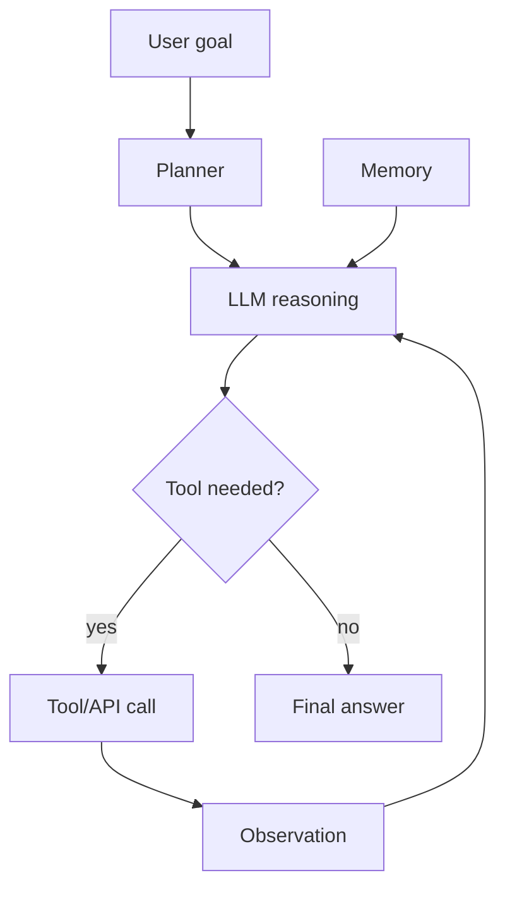

# AI Agents

## Complete notes

AI agent is an LLM-based system that can decide steps and use tools to complete a task.

## Agent loop

## Agent parts

- LLM for reasoning.
- Tools for actions.
- Memory for context.
- Planner/control flow.
- Guardrails for safety.
- Observability for debugging.

## Examples

- Research agent.
- Customer support agent.
- Code assistant.
- Data analysis agent.
- Booking/scheduling assistant.

## Common problems

- Tool calls can fail.
- Agent can loop too long.
- Model can choose wrong tool.
- Cost and latency can grow.
- Needs permission for sensitive actions.

## Quick revision

Agent = LLM + tools + loop + memory + control.

## Deep revision

### Agent vs normal chatbot

Normal chatbot answers from prompt/context.

Agent can decide actions:

- search
- call API
- read database
- run tool
- ask follow-up
- retry

### Agent architecture

### Types of agents

- Tool-using agent: calls tools/APIs.
- RAG agent: retrieves documents before answering.
- Planner agent: breaks large task into steps.
- Multi-agent system: multiple specialized agents.
- Human-in-the-loop agent: asks approval before risky action.

### Tool design rules

- Tool name should be clear.
- Tool description should say when to use it.
- Tool input schema should be strict.
- Tool output should be predictable.
- Tool should handle errors.

### Production risks

- Tool misuse.
- Infinite loops.
- Expensive repeated calls.
- Data leakage.
- Wrong action without approval.

### Guardrails

- Limit tool permissions.
- Add max steps.
- Validate tool input.
- Require human approval for risky actions.
- Log every tool call.
