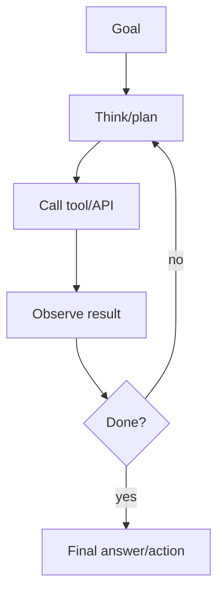
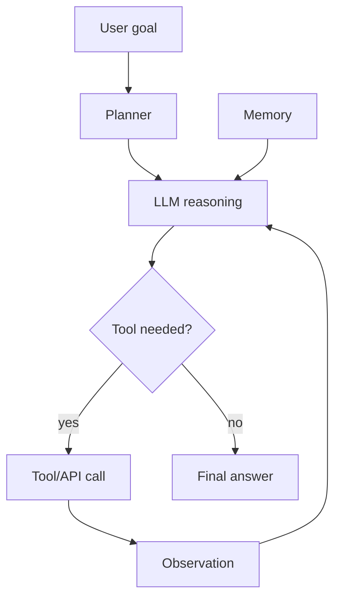

# AI Agents

## Complete notes

AI agent is an [[LLM Fundamentals|LLM]]-based system that can decide steps and use tools to complete a task.

## Easy explanation

An AI agent uses an LLM plus tools and a loop to decide steps, act, observe, and finish a task.

In simple words: if you can explain `AI Agents` with one real request, one failure case, and one metric, you understand the topic much better than just memorizing the definition.

## Simple example

Think of using LLMs in production, not just a demo. This topic explains prompts, tools, agents, evals, guardrails, cost, latency, and monitoring.

For `AI Agents`, ask yourself:

1. What is the normal happy path?
2. What can fail?
3. What is the tradeoff?
4. What would I monitor in production?

## Agent loop

## Agent parts

- LLM for reasoning.
- Tools for actions.
- Memory for context.
- Planner/control flow.
- Guardrails for safety.
- Observability for debugging.

## Examples

- Research agent.
- Customer support agent.
- Code assistant.
- Data analysis agent.
- Booking/scheduling assistant.

## Common problems

- Tool calls can fail.
- Agent can loop too long.
- Model can choose wrong tool.
- Cost and latency can grow.
- Needs permission for sensitive actions.

## Real-life examples

### Easy real-life example

An assistant checks your calendar and drafts a reply using tools.

### Difficult production example

A production agent has tool schemas, max steps, guardrails, evals, human approval for risky actions, cost/latency monitoring, and audit logs.

### How to relate this topic

When reading `AI Agents`, connect it to:

- one user action
- one backend component
- one failure case
- one tradeoff
- one metric

## Important points

- Core idea: `AI Agents` must be understood through its production use case, not just its definition.
- When to use it: Focus on model calls, prompts, tools, evals, guardrails, retrieval, cost, latency, safety, and production monitoring.
- At scale: explain the bottleneck, failure path, operational owner, and rollback/fallback.
- What to monitor: latency, token cost, model error rate, eval score, fallback rate, safety/refusal rate, and user feedback.
- Interview rule: always give one concrete example, one tradeoff, one failure mode, and one metric.

## Common mistakes

- No evals, only manual vibes.
- No prompt/model versioning.
- Unsafe tool use or prompt injection risk.
- No cost/latency tracking.
- No fallback or human review path.

## Quick revision

Agent = LLM + tools + loop + memory + control.

## Deep revision

### Agent vs normal chatbot

Normal chatbot answers from prompt/context.

Agent can decide actions:

- search
- call API
- read database
- run tool
- ask follow-up
- retry

### Agent architecture

### Types of agents

- Tool-using agent: calls tools/APIs.
- RAG agent: retrieves documents before answering.
- Planner agent: breaks large task into steps.
- Multi-agent system: multiple specialized agents.
- Human-in-the-loop agent: asks approval before risky action.

### Tool design rules

- Tool name should be clear.
- Tool description should say when to use it.
- Tool input schema should be strict.
- Tool output should be predictable.
- Tool should handle errors.

### Production risks

- Tool misuse.
- Infinite loops.
- Expensive repeated calls.
- Data leakage.
- Wrong action without approval.

### Guardrails

- Limit tool permissions.
- Add max steps.
- Validate tool input.
- Require human approval for risky actions.
- Log every tool call.

## Deep understanding checklist

To fully understand `AI Agents`, be able to answer:

1. Where does it sit in the architecture?
2. What production problem does it solve?
3. What is the simplest implementation?
4. What breaks when traffic or data grows?
5. What is the main failure mode?
6. What tradeoff does it introduce?
7. Which metric proves it is healthy?

Strong answer focus: Focus on model calls, prompts, tools, evals, guardrails, retrieval, cost, latency, safety, and production monitoring.

## Senior interview bank

These are topic-specific questions and strong answers for `AI Agents`.

### 1. How do you evaluate quality?

Use golden datasets, human review, automated evals, regression tests, groundedness checks, safety tests, and production feedback. Do not rely on vibes.

### 2. What can go wrong?

Hallucination, prompt injection, unsafe tool use, high token cost, latency, model drift, bad retrieval, and leaking private data.

### 3. How do guardrails work?

Validate input, constrain tools, enforce permissions, filter unsafe output, require confirmation for risky actions, and treat retrieved/user content as untrusted.

### 4. How do you control cost and latency?

Track token usage, cache safe deterministic outputs, use smaller/faster models where possible, stream responses, batch offline jobs, and rate limit expensive flows.

### 5. What is the production answer?

Version prompts/models/tools, run evals before rollout, monitor quality/cost/latency, add fallbacks, and keep a human review path for high-risk actions.

## Topic-specific drill

### How would I answer `AI Agents` if the interviewer asks directly?

For `AI Agents`, I would explain model/prompt/tool versioning, evals, guardrails, cost, latency, fallback, and safety monitoring.

### What is the trap question for `AI Agents`?

The trap is giving only a definition. A senior answer must include a concrete production example, a failure mode, a tradeoff, and a metric.

### What should I draw?

Draw the smallest flow that shows where `AI Agents` sits, then add the failure path next to the happy path.

## Reviewer checklist

- Can I explain this without reading the note?
- Can I draw the happy path and failure path?
- Can I name one concrete metric?
- Can I explain the tradeoff against a simpler option?
- Can I give a production example in under two minutes?
