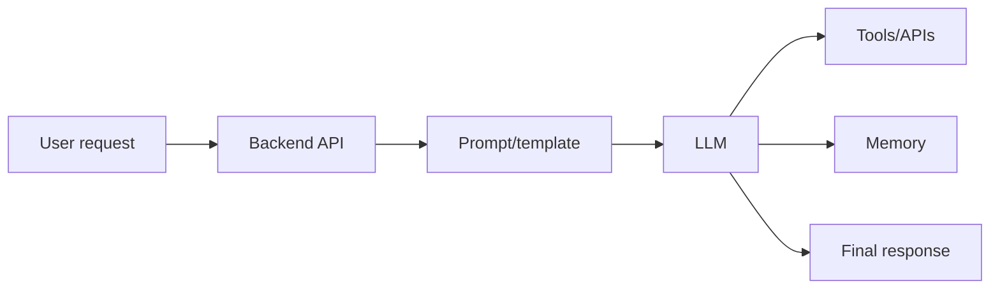
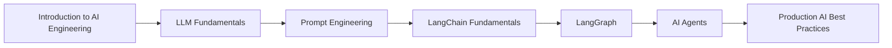

# AI Engineering Content Table

## Course topics from Part 2

- [[Introduction to AI Engineering]]
- [[LLM Fundamentals]]
- [[LangChain Fundamentals]]
- [[LangGraph]]
- [[AI Agents]]
- [[Prompt Engineering]]
- [[Production AI Best Practices]]

## Revision dashboard

AI engineering means building real applications around LLMs, tools, memory, retrieval, workflows, and deployment.

## Study order

1. [[Introduction to AI Engineering]]
2. [[LLM Fundamentals]]
3. [[Prompt Engineering]]
4. [[LangChain Fundamentals]]
5. [[LangGraph]]
6. [[AI Agents]]
7. [[Production AI Best Practices]]

## Big picture diagram

## Quick revision

- LLM gives reasoning/text generation.
- Prompt controls instruction and context.
- Tools let AI call real functions/APIs.
- Memory keeps useful information.
- LangChain provides building blocks.
- LangGraph controls multi-step agent flow.

## Visual topic map

Use this map like the Excalidraw roadmap: follow the arrows first, then open the linked notes.

## Color legend

- Blue = core concept
- Green = recommended pattern
- Red = risk or failure mode
- Purple = tradeoff
- Orange = current 2026 update

## Linked notes in this map

- [[Introduction to AI Engineering]]
- [[LLM Fundamentals]]
- [[Prompt Engineering]]
- [[LangChain Fundamentals]]
- [[LangGraph]]
- [[AI Agents]]
- [[Production AI Best Practices]]
