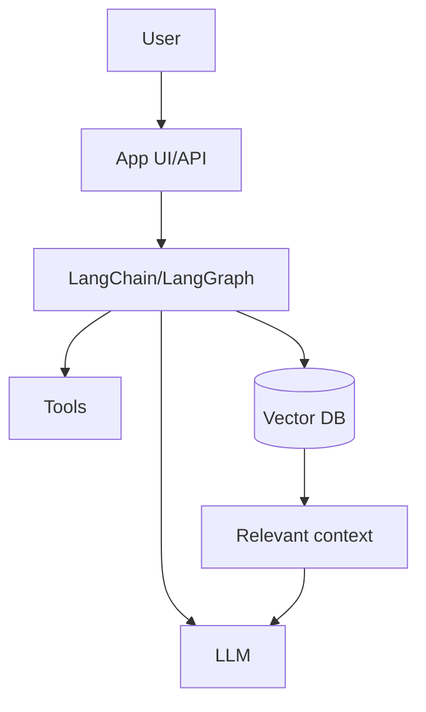

# Introduction to AI Engineering

## Complete notes

AI engineering is the practice of building useful software with AI models.

It is not only asking ChatGPT questions. It means connecting [[LLM Fundamentals|LLMs]] with backend APIs, databases, tools, documents, memory, and user workflows.

## Easy explanation

AI engineering is the practice of building useful software with AI models.

In simple words: if you can explain `Introduction to AI Engineering` with one real request, one failure case, and one metric, you understand the topic much better than just memorizing the definition.

## Simple example

Think of using LLMs in production, not just a demo. This topic explains prompts, tools, agents, evals, guardrails, cost, latency, and monitoring.

For `Introduction to AI Engineering`, ask yourself:

1. What is the normal happy path?
2. What can fail?
3. What is the tradeoff?
4. What would I monitor in production?

## What AI engineer builds

- Chatbot for app/company.
- AI support assistant.
- PDF/document question-answering app.
- Website chatbot.
- RAG system.
- Agent that can use tools.
- Workflow automation with AI.

## Main parts

- LLM model.
- Prompt.
- Backend API.
- Tools/functions.
- Embeddings.
- Vector database.
- RAG pipeline.
- Monitoring and evaluation.

## Diagram

## Real-life examples

### Easy real-life example

A support bot uses an LLM to answer a customer question.

### Difficult production example

A production AI agent uses tools, RAG, evals, guardrails, prompt/model versioning, cost tracking, fallback, human approval, and safety monitoring.

### How to relate this topic

When reading `Introduction to AI Engineering`, connect it to:

- one user action
- one backend component
- one failure case
- one tradeoff
- one metric

## Important points

- Core idea: `Introduction to AI Engineering` must be understood through its production use case, not just its definition.
- When to use it: Focus on model calls, prompts, tools, evals, guardrails, retrieval, cost, latency, safety, and production monitoring.
- At scale: explain the bottleneck, failure path, operational owner, and rollback/fallback.
- What to monitor: latency, token cost, model error rate, eval score, fallback rate, safety/refusal rate, and user feedback.
- Interview rule: always give one concrete example, one tradeoff, one failure mode, and one metric.

## Common mistakes

- No evals, only manual vibes.
- No prompt/model versioning.
- Unsafe tool use or prompt injection risk.
- No cost/latency tracking.
- No fallback or human review path.

## Quick revision

AI engineering = backend engineering + LLM + data + tools + production reliability.

## Important additions

### AI app types

| App type | Example |
|---|---|
| Chatbot | support assistant |
| RAG app | chat with PDF/docs |
| Agent | can use tools |
| Workflow automation | summarize and send email |
| AI search | semantic search |
| AI extraction | convert text to JSON |

### Production mindset

AI app should be treated like backend system:

- validate input
- handle errors
- monitor latency
- monitor cost
- test quality
- protect private data

### Simple stack

React frontend -> Node backend -> LLM API -> [[Vector Databases|Vector DB]]/Redis/Database.

## Deep understanding checklist

To fully understand `Introduction to AI Engineering`, be able to answer:

1. Where does it sit in the architecture?
2. What production problem does it solve?
3. What is the simplest implementation?
4. What breaks when traffic or data grows?
5. What is the main failure mode?
6. What tradeoff does it introduce?
7. Which metric proves it is healthy?

Strong answer focus: Focus on model calls, prompts, tools, evals, guardrails, retrieval, cost, latency, safety, and production monitoring.

## Senior interview bank

These are topic-specific questions and strong answers for `Introduction to AI Engineering`.

### 1. How do you evaluate quality?

Use golden datasets, human review, automated evals, regression tests, groundedness checks, safety tests, and production feedback. Do not rely on vibes.

### 2. What can go wrong?

Hallucination, prompt injection, unsafe tool use, high token cost, latency, model drift, bad retrieval, and leaking private data.

### 3. How do guardrails work?

Validate input, constrain tools, enforce permissions, filter unsafe output, require confirmation for risky actions, and treat retrieved/user content as untrusted.

### 4. How do you control cost and latency?

Track token usage, cache safe deterministic outputs, use smaller/faster models where possible, stream responses, batch offline jobs, and rate limit expensive flows.

### 5. What is the production answer?

Version prompts/models/tools, run evals before rollout, monitor quality/cost/latency, add fallbacks, and keep a human review path for high-risk actions.

## Topic-specific drill

### How would I answer `Introduction to AI Engineering` if the interviewer asks directly?

For `Introduction to AI Engineering`, I would explain model/prompt/tool versioning, evals, guardrails, cost, latency, fallback, and safety monitoring.

### What is the trap question for `Introduction to AI Engineering`?

The trap is giving only a definition. A senior answer must include a concrete production example, a failure mode, a tradeoff, and a metric.

### What should I draw?

Draw the smallest flow that shows where `Introduction to AI Engineering` sits, then add the failure path next to the happy path.

## Reviewer checklist

- Can I explain this without reading the note?
- Can I draw the happy path and failure path?
- Can I name one concrete metric?
- Can I explain the tradeoff against a simpler option?
- Can I give a production example in under two minutes?
