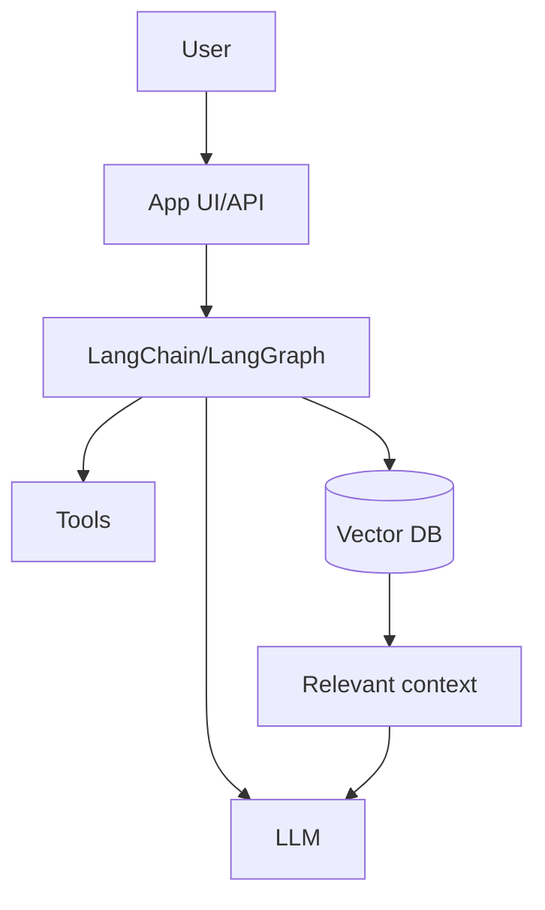

# Introduction to AI Engineering

## Complete notes

AI engineering is the practice of building useful software with AI models.

It is not only asking ChatGPT questions. It means connecting LLMs with backend APIs, databases, tools, documents, memory, and user workflows.

## What AI engineer builds

- Chatbot for app/company.
- AI support assistant.
- PDF/document question-answering app.
- Website chatbot.
- RAG system.
- Agent that can use tools.
- Workflow automation with AI.

## Main parts

- LLM model.
- Prompt.
- Backend API.
- Tools/functions.
- Embeddings.
- Vector database.
- RAG pipeline.
- Monitoring and evaluation.

## Diagram

## Quick revision

AI engineering = backend engineering + LLM + data + tools + production reliability.

## Important additions

### AI app types

| App type | Example |
|---|---|
| Chatbot | support assistant |
| RAG app | chat with PDF/docs |
| Agent | can use tools |
| Workflow automation | summarize and send email |
| AI search | semantic search |
| AI extraction | convert text to JSON |

### Production mindset

AI app should be treated like backend system:

- validate input
- handle errors
- monitor latency
- monitor cost
- test quality
- protect private data

### Simple stack

React frontend -> Node backend -> LLM API -> Vector DB/Redis/Database.
