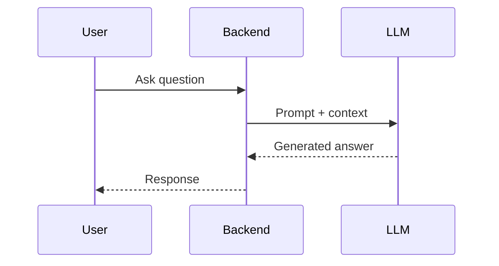
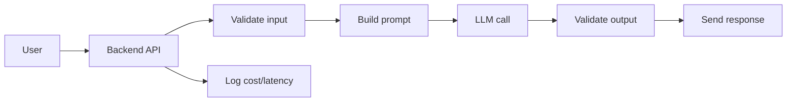

# LLM Fundamentals

## Complete notes

LLM means Large Language Model.

It predicts and generates text based on input context.

## Easy explanation

LLM means Large Language Model.

In simple words: if you can explain `LLM Fundamentals` with one real request, one failure case, and one metric, you understand the topic much better than just memorizing the definition.

## Simple example

Think of using LLMs in production, not just a demo. This topic explains prompts, tools, agents, evals, guardrails, cost, latency, and monitoring.

For `LLM Fundamentals`, ask yourself:

1. What is the normal happy path?
2. What can fail?
3. What is the tradeoff?
4. What would I monitor in production?

## Important terms

- Prompt: input instruction/context.
- Token: small piece of text the model reads/writes.
- Context window: maximum tokens model can consider at once.
- Temperature: controls randomness.
- System instruction: high-level behavior instruction.
- Completion/output: generated answer.

## How LLM works in an app

## Limitations

- Can hallucinate.
- Does not automatically know your private data.
- Can be sensitive to prompt wording.
- May need guardrails for production.
- Cost and latency matter.

## Real-life examples

### Easy real-life example

A support bot uses an LLM to answer a customer question.

### Difficult production example

A production AI agent uses tools, RAG, evals, guardrails, prompt/model versioning, cost tracking, fallback, human approval, and safety monitoring.

### How to relate this topic

When reading `LLM Fundamentals`, connect it to:

- one user action
- one backend component
- one failure case
- one tradeoff
- one metric

## Important points

- Core idea: `LLM Fundamentals` must be understood through its production use case, not just its definition.
- When to use it: Focus on model calls, prompts, tools, evals, guardrails, retrieval, cost, latency, safety, and production monitoring.
- At scale: explain the bottleneck, failure path, operational owner, and rollback/fallback.
- What to monitor: latency, token cost, model error rate, eval score, fallback rate, safety/refusal rate, and user feedback.
- Interview rule: always give one concrete example, one tradeoff, one failure mode, and one metric.

## Common mistakes

- No evals, only manual vibes.
- No prompt/model versioning.
- Unsafe tool use or prompt injection risk.
- No cost/latency tracking.
- No fallback or human review path.

## Quick revision

LLM is powerful for language/reasoning, but production apps need context, validation, tools, and [[Monitoring and Alerting|monitoring]].

## Deep revision

### More important concepts

#### Tokens

LLM does not read text exactly like humans.
It breaks text into tokens.

More tokens means:

- more cost
- more latency
- more context usage

#### Context window

Context window is the maximum amount of text the model can read at one time.

If document is bigger than context window, use [[RAG]] or summarization.

#### Temperature

- Low temperature gives more stable output.
- High temperature gives more creative output.
- For backend/API work, lower temperature is usually safer.

#### Hallucination

Hallucination means model gives confident but wrong answer.

Reduce hallucination by:

- giving source context
- using RAG
- asking for citations
- validating output
- limiting answer to known data

### Production LLM flow

### Interview answer

An LLM is a model that generates text from input context. In production, we should not use it alone. We wrap it with prompts, validation, logging, RAG, tools, and guardrails.

## Deep understanding checklist

To fully understand `LLM Fundamentals`, be able to answer:

1. Where does it sit in the architecture?
2. What production problem does it solve?
3. What is the simplest implementation?
4. What breaks when traffic or data grows?
5. What is the main failure mode?
6. What tradeoff does it introduce?
7. Which metric proves it is healthy?

Strong answer focus: Focus on model calls, prompts, tools, evals, guardrails, retrieval, cost, latency, safety, and production monitoring.

## Senior interview bank

These are topic-specific questions and strong answers for `LLM Fundamentals`.

### 1. How do you evaluate quality?

Use golden datasets, human review, automated evals, regression tests, groundedness checks, safety tests, and production feedback. Do not rely on vibes.

### 2. What can go wrong?

Hallucination, prompt injection, unsafe tool use, high token cost, latency, model drift, bad retrieval, and leaking private data.

### 3. How do guardrails work?

Validate input, constrain tools, enforce permissions, filter unsafe output, require confirmation for risky actions, and treat retrieved/user content as untrusted.

### 4. How do you control cost and latency?

Track token usage, cache safe deterministic outputs, use smaller/faster models where possible, stream responses, batch offline jobs, and rate limit expensive flows.

### 5. What is the production answer?

Version prompts/models/tools, run evals before rollout, monitor quality/cost/latency, add fallbacks, and keep a human review path for high-risk actions.

## Topic-specific drill

### How would I answer `LLM Fundamentals` if the interviewer asks directly?

For `LLM Fundamentals`, I would explain model/prompt/tool versioning, evals, guardrails, cost, latency, fallback, and safety monitoring.

### What is the trap question for `LLM Fundamentals`?

The trap is giving only a definition. A senior answer must include a concrete production example, a failure mode, a tradeoff, and a metric.

### What should I draw?

Draw the smallest flow that shows where `LLM Fundamentals` sits, then add the failure path next to the happy path.

## Reviewer checklist

- Can I explain this without reading the note?
- Can I draw the happy path and failure path?
- Can I name one concrete metric?
- Can I explain the tradeoff against a simpler option?
- Can I give a production example in under two minutes?
