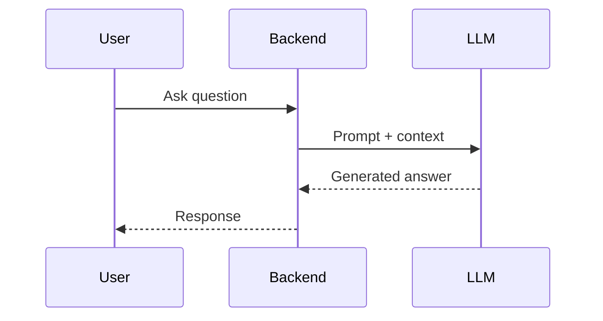
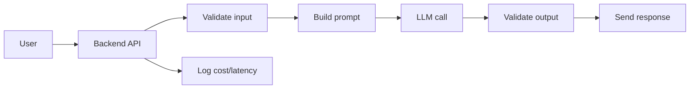

# LLM Fundamentals

## Complete notes

LLM means Large Language Model.

It predicts and generates text based on input context.

## Important terms

- Prompt: input instruction/context.
- Token: small piece of text the model reads/writes.
- Context window: maximum tokens model can consider at once.
- Temperature: controls randomness.
- System instruction: high-level behavior instruction.
- Completion/output: generated answer.

## How LLM works in an app

## Limitations

- Can hallucinate.
- Does not automatically know your private data.
- Can be sensitive to prompt wording.
- May need guardrails for production.
- Cost and latency matter.

## Quick revision

LLM is powerful for language/reasoning, but production apps need context, validation, tools, and monitoring.

## Deep revision

### More important concepts

#### Tokens

LLM does not read text exactly like humans.
It breaks text into tokens.

More tokens means:

- more cost
- more latency
- more context usage

#### Context window

Context window is the maximum amount of text the model can read at one time.

If document is bigger than context window, use RAG or summarization.

#### Temperature

- Low temperature gives more stable output.
- High temperature gives more creative output.
- For backend/API work, lower temperature is usually safer.

#### Hallucination

Hallucination means model gives confident but wrong answer.

Reduce hallucination by:

- giving source context
- using RAG
- asking for citations
- validating output
- limiting answer to known data

### Production LLM flow

### Interview answer

An LLM is a model that generates text from input context. In production, we should not use it alone. We wrap it with prompts, validation, logging, RAG, tools, and guardrails.
