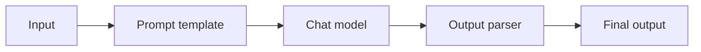
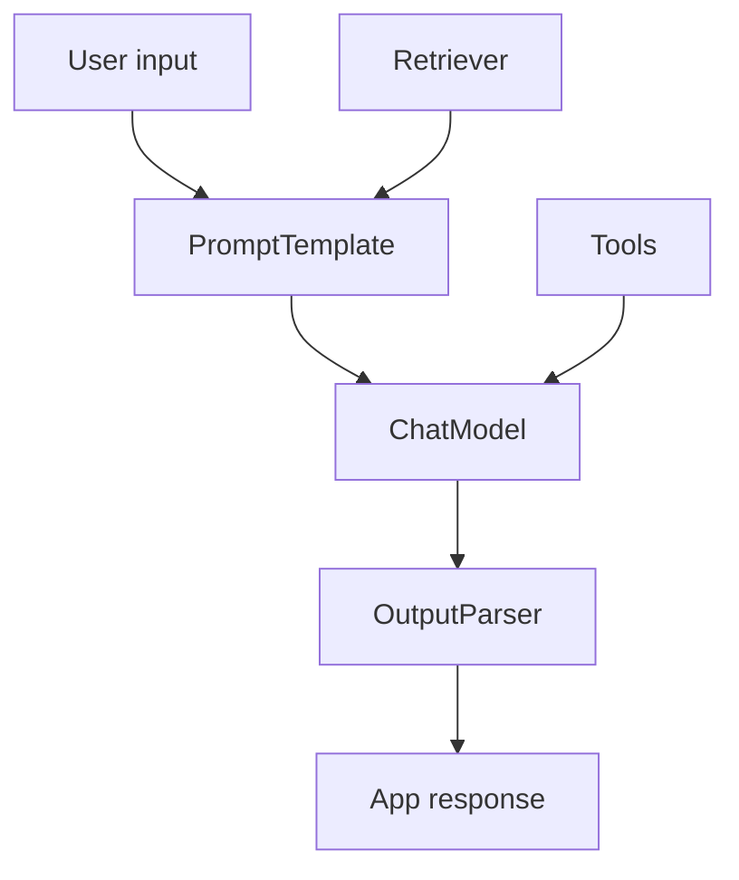

# LangChain Fundamentals

## Complete notes

LangChain is a framework/library ecosystem for building LLM applications.

It helps connect models, prompts, tools, retrievers, memory, and chains.

## Main building blocks

- Chat model: the LLM wrapper.
- Prompt template: reusable prompt.
- Output parser: converts model output into useful format.
- Retriever: fetches relevant documents.
- Tool: function/API model can call.
- Chain/runnable: connects steps together.

## Diagram

## Example flow

1. User asks question.
2. Prompt template formats the question.
3. Model generates response.
4. Parser returns clean output.

## LangChain vs LangGraph

| Tool | Best for |
|---|---|
| LangChain | LLM building blocks and simple chains |
| LangGraph | Stateful workflows, agents, loops, branching |

## Quick revision

LangChain gives components to build LLM apps faster.

## Deep revision

### Why LangChain exists

Without LangChain, you manually write code for prompts, model calls, parsing, tools, memory, retrieval, and chains.

LangChain gives standard building blocks for those repeated AI-app patterns.

### Common architecture

### Important pieces

- PromptTemplate: reusable prompt with variables.
- ChatModel: wrapper around model provider.
- Runnable: composable step in a chain.
- Retriever: gets context from vector DB or search.
- Tool: function the AI can call.
- Output parser: converts model response into format.

### When to use LangChain

Use it when:

- app has multiple LLM steps
- app uses RAG
- app uses tools
- app needs structured output
- app will later become an agent

### When not needed

For one simple model call, direct SDK/API can be simpler.

### Quick production note

LangChain helps build quickly, but you still need tests, evals, logs, retries, and cost control.
