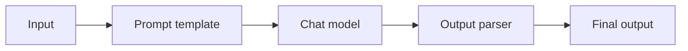
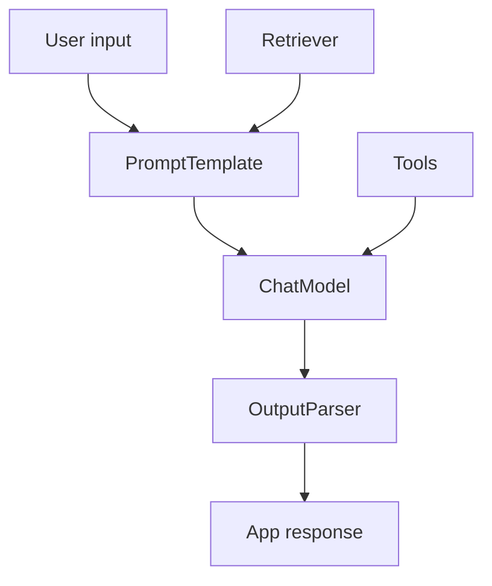

# LangChain Fundamentals

## Complete notes

LangChain is a framework/library ecosystem for building [[LLM Fundamentals|LLM]] applications.

It helps connect models, prompts, tools, retrievers, memory, and chains.

## Easy explanation

LangChain is a framework/library ecosystem for building LLM applications.

In simple words: if you can explain `LangChain Fundamentals` with one real request, one failure case, and one metric, you understand the topic much better than just memorizing the definition.

## Simple example

Think of using LLMs in production, not just a demo. This topic explains prompts, tools, agents, evals, guardrails, cost, latency, and monitoring.

For `LangChain Fundamentals`, ask yourself:

1. What is the normal happy path?
2. What can fail?
3. What is the tradeoff?
4. What would I monitor in production?

## Main building blocks

- Chat model: the LLM wrapper.
- Prompt template: reusable prompt.
- Output parser: converts model output into useful format.
- Retriever: fetches relevant documents.
- Tool: function/API model can call.
- Chain/runnable: connects steps together.

## Diagram

## Example flow

1. User asks question.
2. Prompt template formats the question.
3. Model generates response.
4. Parser returns clean output.

## LangChain vs LangGraph

| Tool | Best for |
|---|---|
| LangChain | LLM building blocks and simple chains |
| LangGraph | Stateful workflows, agents, loops, branching |

## Real-life examples

### Easy real-life example

A support bot uses an LLM to answer a customer question.

### Difficult production example

A production AI agent uses tools, RAG, evals, guardrails, prompt/model versioning, cost tracking, fallback, human approval, and safety monitoring.

### How to relate this topic

When reading `LangChain Fundamentals`, connect it to:

- one user action
- one backend component
- one failure case
- one tradeoff
- one metric

## Important points

- Core idea: `LangChain Fundamentals` must be understood through its production use case, not just its definition.
- When to use it: Focus on model calls, prompts, tools, evals, guardrails, retrieval, cost, latency, safety, and production monitoring.
- At scale: explain the bottleneck, failure path, operational owner, and rollback/fallback.
- What to monitor: latency, token cost, model error rate, eval score, fallback rate, safety/refusal rate, and user feedback.
- Interview rule: always give one concrete example, one tradeoff, one failure mode, and one metric.

## Common mistakes

- No evals, only manual vibes.
- No prompt/model versioning.
- Unsafe tool use or prompt injection risk.
- No cost/latency tracking.
- No fallback or human review path.

## Quick revision

LangChain gives components to build LLM apps faster.

## Deep revision

### Why LangChain exists

Without LangChain, you manually write code for prompts, model calls, parsing, tools, memory, retrieval, and chains.

LangChain gives standard building blocks for those repeated AI-app patterns.

### Common architecture

### Important pieces

- PromptTemplate: reusable prompt with variables.
- ChatModel: wrapper around model provider.
- Runnable: composable step in a chain.
- Retriever: gets context from vector DB or search.
- Tool: function the AI can call.
- Output parser: converts model response into format.

### When to use LangChain

Use it when:

- app has multiple LLM steps
- app uses RAG
- app uses tools
- app needs structured output
- app will later become an agent

### When not needed

For one simple model call, direct SDK/API can be simpler.

### Quick production note

LangChain helps build quickly, but you still need tests, evals, [[Logs Metrics Traces|logs]], retries, and cost control.

## Deep understanding checklist

To fully understand `LangChain Fundamentals`, be able to answer:

1. Where does it sit in the architecture?
2. What production problem does it solve?
3. What is the simplest implementation?
4. What breaks when traffic or data grows?
5. What is the main failure mode?
6. What tradeoff does it introduce?
7. Which metric proves it is healthy?

Strong answer focus: Focus on model calls, prompts, tools, evals, guardrails, retrieval, cost, latency, safety, and production monitoring.

## Senior interview bank

These are topic-specific questions and strong answers for `LangChain Fundamentals`.

### 1. How do you evaluate quality?

Use golden datasets, human review, automated evals, regression tests, groundedness checks, safety tests, and production feedback. Do not rely on vibes.

### 2. What can go wrong?

Hallucination, prompt injection, unsafe tool use, high token cost, latency, model drift, bad retrieval, and leaking private data.

### 3. How do guardrails work?

Validate input, constrain tools, enforce permissions, filter unsafe output, require confirmation for risky actions, and treat retrieved/user content as untrusted.

### 4. How do you control cost and latency?

Track token usage, cache safe deterministic outputs, use smaller/faster models where possible, stream responses, batch offline jobs, and rate limit expensive flows.

### 5. What is the production answer?

Version prompts/models/tools, run evals before rollout, monitor quality/cost/latency, add fallbacks, and keep a human review path for high-risk actions.

## Topic-specific drill

### How would I answer `LangChain Fundamentals` if the interviewer asks directly?

For `LangChain Fundamentals`, I would explain model/prompt/tool versioning, evals, guardrails, cost, latency, fallback, and safety monitoring.

### What is the trap question for `LangChain Fundamentals`?

The trap is giving only a definition. A senior answer must include a concrete production example, a failure mode, a tradeoff, and a metric.

### What should I draw?

Draw the smallest flow that shows where `LangChain Fundamentals` sits, then add the failure path next to the happy path.

## Reviewer checklist

- Can I explain this without reading the note?
- Can I draw the happy path and failure path?
- Can I name one concrete metric?
- Can I explain the tradeoff against a simpler option?
- Can I give a production example in under two minutes?
