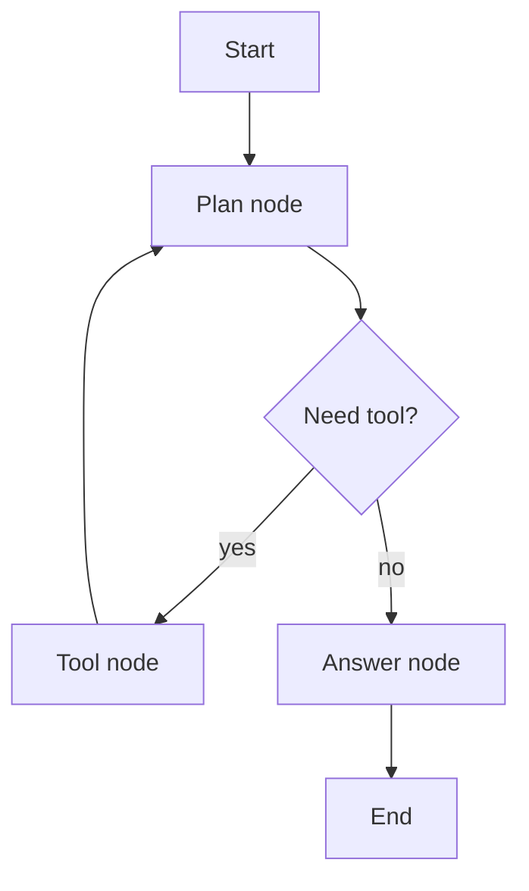
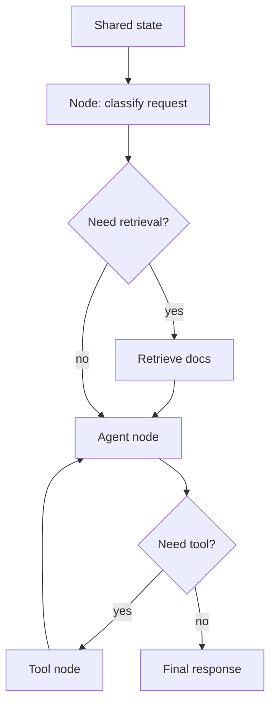

# LangGraph

## Complete notes

LangGraph is used to build stateful agent workflows as graphs.

It is useful when the app needs loops, branches, tool calls, memory, retries, and human approval.

## Main concepts

- State: shared data flowing through graph.
- Node: a function or step.
- Edge: connection deciding next step.
- Conditional edge: choose next node based on state.
- Checkpoint: saved graph state.
- Human-in-the-loop: pause for human review/approval.

## Diagram

## Why LangGraph matters

Normal chain usually goes step by step once.

Agent workflows often need to loop:

- Think.
- Call tool.
- Observe result.
- Think again.
- Stop when answer is ready.

## Persistence

LangGraph can save state using checkpoints.

This helps with:

- Memory.
- Resume after failure.
- Human approval.
- Time travel/debugging.

## Quick revision

LangGraph = graph-based control flow for reliable agents.

## Deep revision

### LangGraph mental model

Think of LangGraph like a state machine for AI workflows.

Each node does one job.
Edges decide where to go next.
State carries memory/context between steps.

### Core flow

### Why graphs are useful

- Branching: choose path based on user input.
- Looping: agent can use tool multiple times.
- Persistence: resume from checkpoint.
- Human approval: pause before risky action.
- Multi-agent: split work into multiple specialized nodes.

### Common LangGraph terms

- StateGraph: graph built around shared state.
- Node: function/runnable.
- Edge: next step.
- Conditional edge: branch logic.
- Checkpointer: saves progress.
- Thread: conversation/run identity for persisted state.

### Common mistakes

- Putting too much logic in one node.
- No stop condition, causing loops.
- No checkpoint for long workflows.
- No logs/tracing, making debugging hard.
