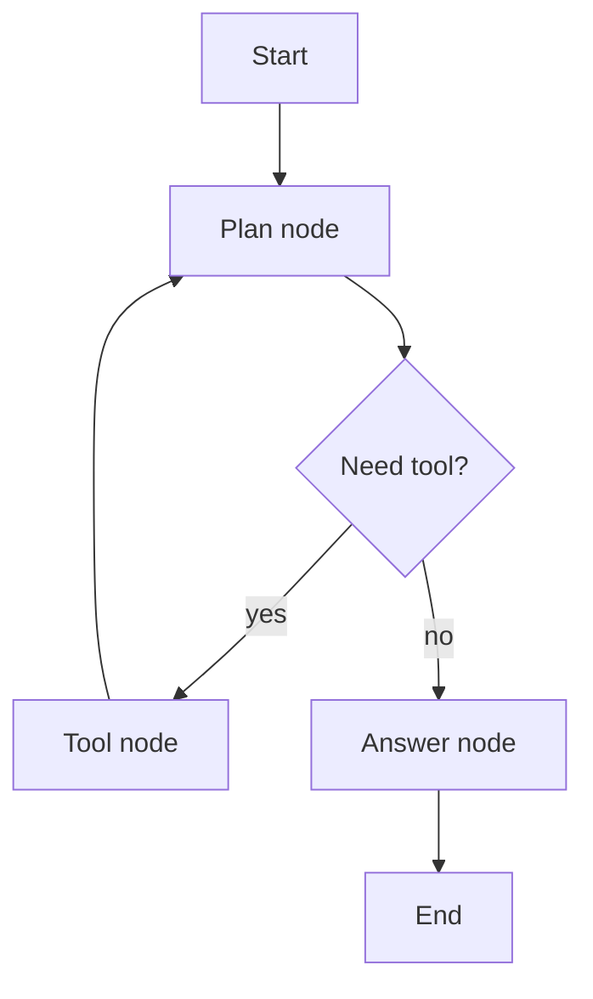
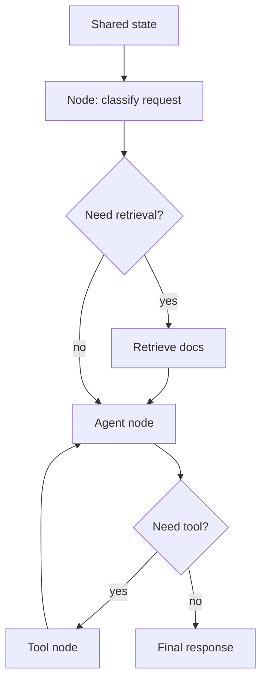

# LangGraph

## Complete notes

LangGraph is used to build stateful agent workflows as graphs.

It is useful when the app needs loops, branches, tool calls, memory, retries, and human approval.

## Easy explanation

LangGraph is used to build stateful agent workflows as graphs.

In simple words: if you can explain `LangGraph` with one real request, one failure case, and one metric, you understand the topic much better than just memorizing the definition.

## Simple example

Think of using LLMs in production, not just a demo. This topic explains prompts, tools, agents, evals, guardrails, cost, latency, and monitoring.

For `LangGraph`, ask yourself:

1. What is the normal happy path?
2. What can fail?
3. What is the tradeoff?
4. What would I monitor in production?

## Main concepts

- State: shared data flowing through graph.
- Node: a function or step.
- Edge: connection deciding next step.
- Conditional edge: choose next node based on state.
- Checkpoint: saved graph state.
- Human-in-the-loop: pause for human review/approval.

## Diagram

## Why LangGraph matters

Normal chain usually goes step by step once.

Agent workflows often need to loop:

- Think.
- Call tool.
- Observe result.
- Think again.
- Stop when answer is ready.

## Persistence

LangGraph can save state using checkpoints.

This helps with:

- Memory.
- Resume after failure.
- Human approval.
- Time travel/debugging.

## Real-life examples

### Easy real-life example

A support bot uses an LLM to answer a customer question.

### Difficult production example

A production AI agent uses tools, RAG, evals, guardrails, prompt/model versioning, cost tracking, fallback, human approval, and safety monitoring.

### How to relate this topic

When reading `LangGraph`, connect it to:

- one user action
- one backend component
- one failure case
- one tradeoff
- one metric

## Important points

- Core idea: `LangGraph` must be understood through its production use case, not just its definition.
- When to use it: Focus on model calls, prompts, tools, evals, guardrails, retrieval, cost, latency, safety, and production monitoring.
- At scale: explain the bottleneck, failure path, operational owner, and rollback/fallback.
- What to monitor: latency, token cost, model error rate, eval score, fallback rate, safety/refusal rate, and user feedback.
- Interview rule: always give one concrete example, one tradeoff, one failure mode, and one metric.

## Quick revision

LangGraph = graph-based control flow for reliable agents.

## Deep revision

### LangGraph mental model

Think of LangGraph like a state machine for AI workflows.

Each node does one job.
Edges decide where to go next.
State carries memory/context between steps.

### Core flow

### Why graphs are useful

- Branching: choose path based on user input.
- Looping: agent can use tool multiple times.
- Persistence: resume from checkpoint.
- Human approval: pause before risky action.
- Multi-agent: split work into multiple specialized nodes.

### Common LangGraph terms

- StateGraph: graph built around shared state.
- Node: function/runnable.
- Edge: next step.
- Conditional edge: branch logic.
- Checkpointer: saves progress.
- Thread: conversation/run identity for persisted state.

### Common mistakes

- Putting too much logic in one node.
- No stop condition, causing loops.
- No checkpoint for long workflows.
- No logs/tracing, making debugging hard.

## Deep understanding checklist

To fully understand `LangGraph`, be able to answer:

1. Where does it sit in the architecture?
2. What production problem does it solve?
3. What is the simplest implementation?
4. What breaks when traffic or data grows?
5. What is the main failure mode?
6. What tradeoff does it introduce?
7. Which metric proves it is healthy?

Strong answer focus: Focus on model calls, prompts, tools, evals, guardrails, retrieval, cost, latency, safety, and production monitoring.

## Senior interview bank

These are topic-specific questions and strong answers for `LangGraph`.

### 1. How do you evaluate quality?

Use golden datasets, human review, automated evals, regression tests, groundedness checks, safety tests, and production feedback. Do not rely on vibes.

### 2. What can go wrong?

Hallucination, prompt injection, unsafe tool use, high token cost, latency, model drift, bad retrieval, and leaking private data.

### 3. How do guardrails work?

Validate input, constrain tools, enforce permissions, filter unsafe output, require confirmation for risky actions, and treat retrieved/user content as untrusted.

### 4. How do you control cost and latency?

Track token usage, cache safe deterministic outputs, use smaller/faster models where possible, stream responses, batch offline jobs, and rate limit expensive flows.

### 5. What is the production answer?

Version prompts/models/tools, run evals before rollout, monitor quality/cost/latency, add fallbacks, and keep a human review path for high-risk actions.

## Topic-specific drill

### How would I answer `LangGraph` if the interviewer asks directly?

For `LangGraph`, I would explain model/prompt/tool versioning, evals, guardrails, cost, latency, fallback, and safety monitoring.

### What is the trap question for `LangGraph`?

The trap is giving only a definition. A senior answer must include a concrete production example, a failure mode, a tradeoff, and a metric.

### What should I draw?

Draw the smallest flow that shows where `LangGraph` sits, then add the failure path next to the happy path.

## Reviewer checklist

- Can I explain this without reading the note?
- Can I draw the happy path and failure path?
- Can I name one concrete metric?
- Can I explain the tradeoff against a simpler option?
- Can I give a production example in under two minutes?

## Common mistakes

- No evals, only manual vibes.
- No prompt/model versioning.
- Unsafe tool use or prompt injection risk.
- No cost/latency tracking.
- No fallback or human review path.
