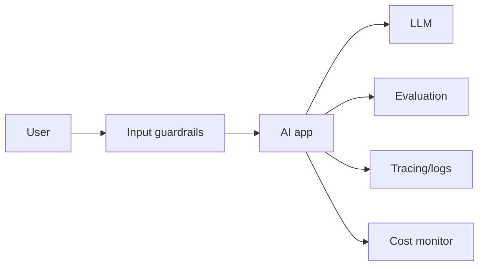
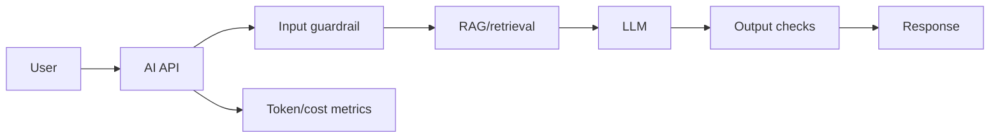

# Production AI Best Practices

## Complete notes

Production AI apps need more than a working demo.

They need reliability, privacy, [[Monitoring and Alerting|monitoring]], evaluation, and cost control.

## Easy explanation

Production AI apps need more than a working demo.

In simple words: if you can explain `Production AI Best Practices` with one real request, one failure case, and one metric, you understand the topic much better than just memorizing the definition.

## Simple example

Think of using LLMs in production, not just a demo. This topic explains prompts, tools, agents, evals, guardrails, cost, latency, and monitoring.

For `Production AI Best Practices`, ask yourself:

1. What is the normal happy path?
2. What can fail?
3. What is the tradeoff?
4. What would I monitor in production?

## Best practices

- Validate user input.
- Do not send secrets to model.
- Use retrieval only from allowed documents.
- Add rate limiting.
- Add logging and tracing.
- Measure latency and cost.
- Evaluate answer quality.
- Add fallback when model/API fails.
- Store citations/source references for RAG.
- Use human approval for risky actions.

## Diagram

## Real-life examples

### Easy real-life example

A support bot uses an LLM to answer a customer question.

### Difficult production example

A production AI agent uses tools, RAG, evals, guardrails, prompt/model versioning, cost tracking, fallback, human approval, and safety monitoring.

### How to relate this topic

When reading `Production AI Best Practices`, connect it to:

- one user action
- one backend component
- one failure case
- one tradeoff
- one metric

## Important points

- Core idea: `Production AI Best Practices` must be understood through its production use case, not just its definition.
- When to use it: Focus on model calls, prompts, tools, evals, guardrails, retrieval, cost, latency, safety, and production monitoring.
- At scale: explain the bottleneck, failure path, operational owner, and rollback/fallback.
- What to monitor: latency, token cost, model error rate, eval score, fallback rate, safety/refusal rate, and user feedback.
- Interview rule: always give one concrete example, one tradeoff, one failure mode, and one metric.

## Common mistakes

- No evals, only manual vibes.
- No prompt/model versioning.
- Unsafe tool use or prompt injection risk.
- No cost/latency tracking.
- No fallback or human review path.

## Quick revision

Production AI = useful answer + safety + monitoring + evaluation + cost control.

## Important additions

### Evals

Evals test whether AI output is good.

Examples:

- answer correctness
- hallucination check
- JSON format check
- retrieval relevance
- safety check

### Observability

Track:

- prompt
- retrieved chunks
- model used
- latency
- token count
- cost
- tool calls
- errors

### Guardrail examples

- refuse unsupported actions
- block unsafe input
- validate JSON schema
- require approval before sending email/payment
- restrict documents by user id

## 2026 update: AI production checklist

> [!warning] AI systems fail differently
> Add evaluation, prompt/version control, guardrails, rate limits, token cost tracking, fallback models, retrieval quality checks, and human review paths. Treat model output as untrusted data.

## Deep understanding checklist

To fully understand `Production AI Best Practices`, be able to answer:

1. Where does it sit in the architecture?
2. What production problem does it solve?
3. What is the simplest implementation?
4. What breaks when traffic or data grows?
5. What is the main failure mode?
6. What tradeoff does it introduce?
7. Which metric proves it is healthy?

Strong answer focus: Focus on model calls, prompts, tools, evals, guardrails, retrieval, cost, latency, safety, and production monitoring.

## Senior interview bank

These are topic-specific questions and strong answers for `Production AI Best Practices`.

### 1. How do you evaluate quality?

Use golden datasets, human review, automated evals, regression tests, groundedness checks, safety tests, and production feedback. Do not rely on vibes.

### 2. What can go wrong?

Hallucination, prompt injection, unsafe tool use, high token cost, latency, model drift, bad retrieval, and leaking private data.

### 3. How do guardrails work?

Validate input, constrain tools, enforce permissions, filter unsafe output, require confirmation for risky actions, and treat retrieved/user content as untrusted.

### 4. How do you control cost and latency?

Track token usage, cache safe deterministic outputs, use smaller/faster models where possible, stream responses, batch offline jobs, and rate limit expensive flows.

### 5. What is the production answer?

Version prompts/models/tools, run evals before rollout, monitor quality/cost/latency, add fallbacks, and keep a human review path for high-risk actions.

## Topic-specific drill

### How would I answer `Production AI Best Practices` if the interviewer asks directly?

For `Production AI Best Practices`, I would explain model/prompt/tool versioning, evals, guardrails, cost, latency, fallback, and safety monitoring.

### What is the trap question for `Production AI Best Practices`?

The trap is giving only a definition. A senior answer must include a concrete production example, a failure mode, a tradeoff, and a metric.

### What should I draw?

Draw the smallest flow that shows where `Production AI Best Practices` sits, then add the failure path next to the happy path.

## Reviewer checklist

- Can I explain this without reading the note?
- Can I draw the happy path and failure path?
- Can I name one concrete metric?
- Can I explain the tradeoff against a simpler option?
- Can I give a production example in under two minutes?
