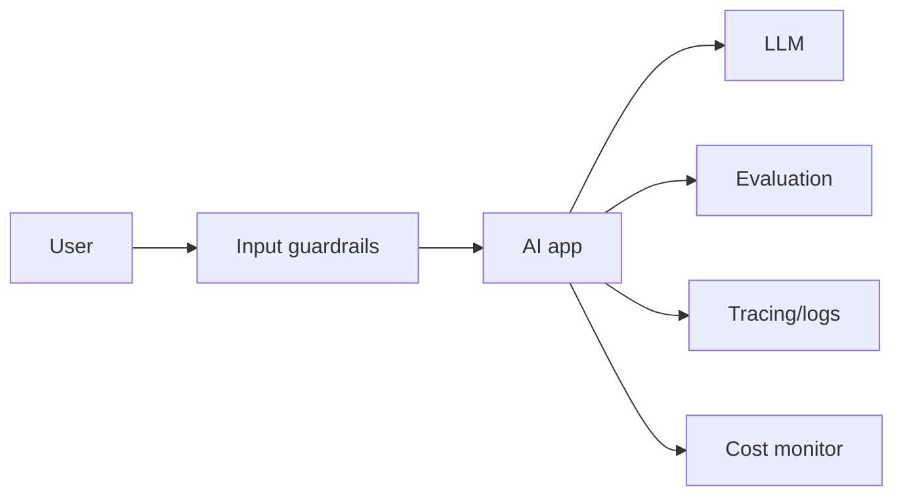

# Production AI Best Practices

## Complete notes

Production AI apps need more than a working demo.

They need reliability, privacy, monitoring, evaluation, and cost control.

## Best practices

- Validate user input.
- Do not send secrets to model.
- Use retrieval only from allowed documents.
- Add rate limiting.
- Add logging and tracing.
- Measure latency and cost.
- Evaluate answer quality.
- Add fallback when model/API fails.
- Store citations/source references for RAG.
- Use human approval for risky actions.

## Diagram

## Common mistakes

- No evals.
- No source citations.
- No monitoring.
- No limit on user requests.
- Model output directly changes production data without approval.

## Quick revision

Production AI = useful answer + safety + monitoring + evaluation + cost control.

## Important additions

### Evals

Evals test whether AI output is good.

Examples:

- answer correctness
- hallucination check
- JSON format check
- retrieval relevance
- safety check

### Observability

Track:

- prompt
- retrieved chunks
- model used
- latency
- token count
- cost
- tool calls
- errors

### Guardrail examples

- refuse unsupported actions
- block unsafe input
- validate JSON schema
- require approval before sending email/payment
- restrict documents by user id
