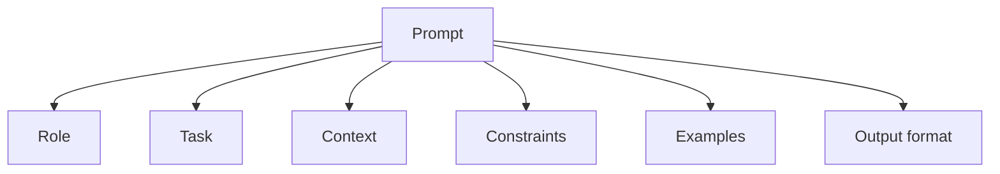

# Prompt Engineering

## Complete notes

Prompt engineering means writing instructions and context so the model gives better output.

## Good prompt structure

- Role: who the model should act as.
- Task: what it should do.
- Context: data it should use.
- Constraints: rules and format.
- Examples: sample input/output.
- Output format: JSON, bullets, table, etc.

## Diagram



## Common techniques

- Zero-shot: ask directly without examples.
- Few-shot: provide examples.
- Chain of thought style planning: ask model to reason internally/stepwise when useful.
- ReAct: reason and use tools.
- Structured output: force JSON/schema-like response.

## Common mistakes

- Vague task.
- No output format.
- Too much irrelevant context.
- No examples for complex output.
- Trusting model answer without validation.

## Quick revision

Good prompt = clear task + useful context + constraints + expected format.

## Deep revision

### Prompt structure template

```text

Role:
You are ...

Task:
Do ...

Context:
Use only this information ...

Rules:
- Do not ...
- Always ...

Output format:
Return JSON/table/bullets ...
```

### Prompting patterns

| Pattern | Meaning | Use case |
|---|---|---|
| Zero-shot | no example | simple task |
| Few-shot | give examples | formatting/classification |
| RAG prompt | context + question | document QA |
| Tool prompt | tell model available tools | agents |
| Structured output | fixed schema | backend integration |

### Good RAG prompt

```text

Answer using only the provided context.
If answer is not in context, say you do not know.
Return answer with source names.
```

### Bad prompt signs

- vague instructions
- conflicting rules
- no output format
- too much unrelated context
- asks model to guess missing facts

### Backend tip

For production, keep prompts in version control and test them like code.
