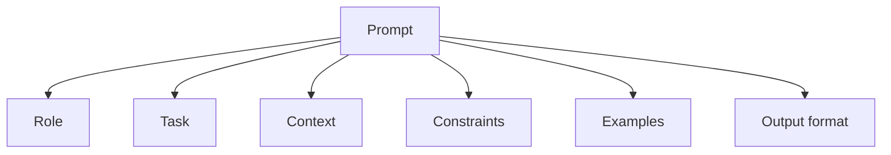

# Prompt Engineering

## Complete notes

Prompt engineering means writing instructions and context so the model gives better output.

## Easy explanation

Prompt engineering means writing instructions and context so the model gives better output.

In simple words: if you can explain `Prompt Engineering` with one real request, one failure case, and one metric, you understand the topic much better than just memorizing the definition.

## Simple example

Think of using LLMs in production, not just a demo. This topic explains prompts, tools, agents, evals, guardrails, cost, latency, and monitoring.

For `Prompt Engineering`, ask yourself:

1. What is the normal happy path?
2. What can fail?
3. What is the tradeoff?
4. What would I monitor in production?

## Good prompt structure

- Role: who the model should act as.
- Task: what it should do.
- Context: data it should use.
- Constraints: rules and format.
- Examples: sample input/output.
- Output format: JSON, bullets, table, etc.

## Diagram



## Common techniques

- Zero-shot: ask directly without examples.
- Few-shot: provide examples.
- Chain of thought style planning: ask model to reason internally/stepwise when useful.
- ReAct: reason and use tools.
- Structured output: force JSON/schema-like response.

## Real-life examples

### Easy real-life example

A support bot uses an LLM to answer a customer question.

### Difficult production example

A production AI agent uses tools, RAG, evals, guardrails, prompt/model versioning, cost tracking, fallback, human approval, and safety monitoring.

### How to relate this topic

When reading `Prompt Engineering`, connect it to:

- one user action
- one backend component
- one failure case
- one tradeoff
- one metric

## Important points

- Core idea: `Prompt Engineering` must be understood through its production use case, not just its definition.
- When to use it: Focus on model calls, prompts, tools, evals, guardrails, retrieval, cost, latency, safety, and production monitoring.
- At scale: explain the bottleneck, failure path, operational owner, and rollback/fallback.
- What to monitor: latency, token cost, model error rate, eval score, fallback rate, safety/refusal rate, and user feedback.
- Interview rule: always give one concrete example, one tradeoff, one failure mode, and one metric.

## Common mistakes

- No evals, only manual vibes.
- No prompt/model versioning.
- Unsafe tool use or prompt injection risk.
- No cost/latency tracking.
- No fallback or human review path.

## Quick revision

Good prompt = clear task + useful context + constraints + expected format.

## Deep revision

### Prompt structure template

```text

Role:
You are ...

Task:
Do ...

Context:
Use only this information ...

Rules:
- Do not ...
- Always ...

Output format:
Return JSON/table/bullets ...
```

### Prompting patterns

| Pattern | Meaning | Use case |
|---|---|---|
| Zero-shot | no example | simple task |
| Few-shot | give examples | formatting/classification |
| RAG prompt | context + question | document QA |
| Tool prompt | tell model available tools | agents |
| Structured output | fixed schema | backend integration |

### Good RAG prompt

```text

Answer using only the provided context.
If answer is not in context, say you do not know.
Return answer with source names.
```

### Bad prompt signs

- vague instructions
- conflicting rules
- no output format
- too much unrelated context
- asks model to guess missing facts

### Backend tip

For production, keep prompts in version control and test them like code.


## Deep understanding checklist

To fully understand `Prompt Engineering`, be able to answer:

1. Where does it sit in the architecture?
2. What production problem does it solve?
3. What is the simplest implementation?
4. What breaks when traffic or data grows?
5. What is the main failure mode?
6. What tradeoff does it introduce?
7. Which metric proves it is healthy?

Strong answer focus: Focus on model calls, prompts, tools, evals, guardrails, retrieval, cost, latency, safety, and production monitoring.

## Senior interview bank

These are topic-specific questions and strong answers for `Prompt Engineering`.

### 1. How do you evaluate quality?

Use golden datasets, human review, automated evals, regression tests, groundedness checks, safety tests, and production feedback. Do not rely on vibes.

### 2. What can go wrong?

Hallucination, prompt injection, unsafe tool use, high token cost, latency, model drift, bad retrieval, and leaking private data.

### 3. How do guardrails work?

Validate input, constrain tools, enforce permissions, filter unsafe output, require confirmation for risky actions, and treat retrieved/user content as untrusted.

### 4. How do you control cost and latency?

Track token usage, cache safe deterministic outputs, use smaller/faster models where possible, stream responses, batch offline jobs, and rate limit expensive flows.

### 5. What is the production answer?

Version prompts/models/tools, run evals before rollout, monitor quality/cost/latency, add fallbacks, and keep a human review path for high-risk actions.

## Topic-specific drill

### How would I answer `Prompt Engineering` if the interviewer asks directly?

For `Prompt Engineering`, I would explain model/prompt/tool versioning, evals, guardrails, cost, latency, fallback, and safety monitoring.

### What is the trap question for `Prompt Engineering`?

The trap is giving only a definition. A senior answer must include a concrete production example, a failure mode, a tradeoff, and a metric.

### What should I draw?

Draw the smallest flow that shows where `Prompt Engineering` sits, then add the failure path next to the happy path.

## Reviewer checklist

- Can I explain this without reading the note?
- Can I draw the happy path and failure path?
- Can I name one concrete metric?
- Can I explain the tradeoff against a simpler option?
- Can I give a production example in under two minutes?
