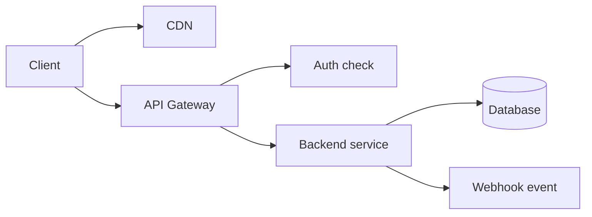
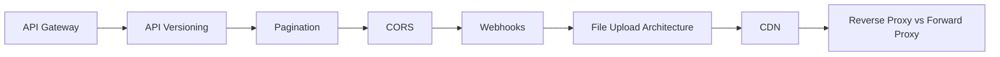

# API Design Content Table

- [[API Gateway]]
- [[Reverse Proxy vs Forward Proxy]]
- [[CDN]]
- [[CORS]]
- [[Webhooks]]
- [[API Versioning]]
- [[Pagination]]
- [[File Upload Architecture]]

## Revision dashboard

API design is about making backend endpoints clear, secure, scalable, and easy for frontend/other services to use.

## Quick revision

- API Gateway is the front door.
- CORS controls browser cross-origin access.
- Pagination protects APIs from returning too much data.
- Webhooks let one system notify another system.

## Visual topic map

Use this map like the Excalidraw roadmap: follow the arrows first, then open the linked notes.

## Color legend

- Blue = core concept
- Green = recommended pattern
- Red = risk or failure mode
- Purple = tradeoff
- Orange = current 2026 update

## Linked notes in this map

- [[API Gateway]]
- [[API Versioning]]
- [[Pagination]]
- [[CORS]]
- [[Webhooks]]
- [[File Upload Architecture]]
- [[CDN]]
- [[Reverse Proxy vs Forward Proxy]]

## Additional SDE-3 topics

- [[API Error Handling]]
- [[Global CDN and Edge]]

## Grill audit additions

- [[API Contract Design]]
- [[Webhook Processing]]

## Complete API design checklist

A good API note should answer:

1. who calls the API
2. what resource or action it exposes
3. request method, URL, headers, body, and query params
4. authentication and authorization rules
5. success response shape
6. error response shape
7. pagination/filter/sort behavior if returning lists
8. idempotency behavior for create/payment/order style APIs
9. rate limits and abuse protection
10. versioning and backward compatibility plan
11. observability: request id, logs, metrics, traces

## Easy real-life example

For a product listing API, `GET /products?category=shoes&page=1` should define query params, response fields, pagination metadata, empty state, auth requirement if any, and errors like invalid category.

## Difficult production example

For `POST /orders`, the API design must handle validation, stock checks, payment side effects, duplicate retries, idempotency keys, partial failures, user permissions, status transitions, webhook events, and a stable response that old mobile apps can still understand.

## Senior interview bank

### 1. How do you design a clean API contract?

I start with the resource and caller. Then I define method, URL, request schema, response schema, auth, errors, pagination, idempotency, and versioning. I also document examples for success, validation failure, unauthorized, conflict, rate limit, and server failure.

### 2. What breaks API clients?

Renaming fields, changing field meaning, adding new required fields, changing error shape, changing pagination behavior, changing status codes, or removing old fields too quickly can break clients. Add fields backward-compatibly and deprecate slowly.

### 3. Where does API design fail in production?

It fails when retries create duplicate side effects, list endpoints return too much data, errors are inconsistent, auth checks are missing at object level, rate limits are absent, or the API has no request id/logs to debug issues.

