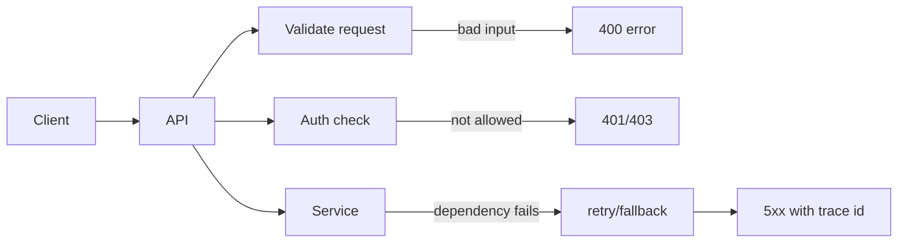

# API Error Handling

## Complete notes

API error handling is the discipline of returning predictable, safe, and debuggable errors to clients.

## Easy explanation

API error handling is the discipline of returning predictable, safe, and debuggable errors to clients.

In simple words: if you can explain `API Error Handling` with one real request, one failure case, and one metric, you understand the topic much better than just memorizing the definition.

## Simple example

Think of a frontend or mobile app calling your backend. This topic decides how the request should look, how the response should look, what happens when the client retries, and how the backend stays safe for old and new clients.

For `API Error Handling`, ask yourself:

1. What is the normal happy path?
2. What can fail?
3. What is the tradeoff?
4. What would I monitor in production?

## Real-life examples

### Easy real-life example

A mobile app calls your backend to show a product page. The API should return the right data, clear errors, and not break older app versions.

### Difficult production example

A public partner API serves thousands of clients with different versions. You need pagination, rate limits, idempotency, clear errors, auth, backward compatibility, and dashboards per endpoint.

### How to relate this topic

When reading `API Error Handling`, connect it to:

- one user action
- one backend component
- one failure case
- one tradeoff
- one metric

## Important points

- Core idea: `API Error Handling` must be understood through its production use case, not just its definition.
- When to use it: Focus on contract stability, client compatibility, validation, security, rate limits, idempotency, and how clients should behave during retries or failures.
- At scale: explain the bottleneck, failure path, operational owner, and rollback/fallback.
- What to monitor: endpoint latency, 4xx/5xx rate, request volume, payload size, auth failures, rate-limit hits, and trace ids.
- Interview rule: always give one concrete example, one tradeoff, one failure mode, and one metric.

## Diagram



## Example response

```json
{
  "error": {
    "code": "ORDER_NOT_FOUND",
    "message": "Order was not found",
    "requestId": "req_123"
  }
}
```

## Common mistakes

- Designing endpoints without defining request/response/error contracts.
- Ignoring idempotency for unsafe retries.
- Returning inconsistent status codes or error shapes.
- Allowing unbounded pagination, filters, or payload size.
- Forgetting auth, authorization, rate limits, and backwards compatibility.

## Quick revision

- One-line meaning: API Error Handling is an API design topic. It should be understood as part of a real production backend, not only as a definition.
- Use it when: Use it when clients need a clear contract, safe retries, compatibility, and predictable errors.
- Failure to mention: partial failure, overload, bad config, stale data, or unsafe retries.
- Tradeoff to mention: simplicity vs production safety.
- Metric to mention: Watch request rate, 4xx/5xx rate, p95 latency, rate-limit hits, and request ids.


## Deep understanding checklist

To fully understand `API Error Handling`, be able to answer:

1. Where does it sit in the architecture?
2. What production problem does it solve?
3. What is the simplest implementation?
4. What breaks when traffic or data grows?
5. What is the main failure mode?
6. What tradeoff does it introduce?
7. Which metric proves it is healthy?

Strong answer focus: Focus on contract stability, client compatibility, validation, security, rate limits, idempotency, and how clients should behave during retries or failures.

## Senior interview bank

These are topic-specific questions and strong answers for `API Error Handling`.

### 1. Design the API contract for this topic.

I would define the endpoint, method, auth requirement, request schema, response schema, error shape, idempotency behavior, pagination/limits if applicable, and versioning plan. A senior answer also explains which fields are stable, which are optional, and how old clients continue working.

### 2. What can break clients in this API?

Breaking clients usually comes from renamed fields, changed meaning of fields, new required fields, different error shape, changed pagination behavior, or undocumented status codes. I would add fields backward-compatibly, deprecate slowly, and track client usage before removal.

### 3. Where do retries create duplicate side effects?

Retries are dangerous on create/update operations like payments, orders, uploads, and webhooks. I would require an idempotency key, store the result atomically, and return the same result on retry instead of executing the side effect again.

### 4. How would you debug a sudden spike in 4xx or 5xx?

For 4xx, check validation errors, auth failures, client version, and rate limits. For 5xx, check recent deploys, dependency errors, traces, logs by request id, and endpoint-specific error rate. I would separate client-caused failures from backend failures before changing code.

### 5. What is the best interview example for this topic?

Use an ecommerce or payment example because it naturally exposes contracts, retries, idempotency, security, and backward compatibility. Explain the happy path and then explain what happens during retry, bad input, and dependency timeout.

## Topic-specific drill

### How would I answer `API Error Handling` if the interviewer asks directly?

For `API Error Handling`, I would explain the API contract, request/response shape, error behavior, retry/idempotency story, compatibility risk, and how clients should behave.

### What is the trap question for `API Error Handling`?

The trap is giving only a definition. A senior answer must include a concrete production example, a failure mode, a tradeoff, and a metric.

### What should I draw?

Draw the smallest flow that shows where `API Error Handling` sits, then add the failure path next to the happy path.

## Reviewer checklist

- Can I explain this without reading the note?
- Can I draw the happy path and failure path?
- Can I name one concrete metric?
- Can I explain the tradeoff against a simpler option?
- Can I give a production example in under two minutes?
