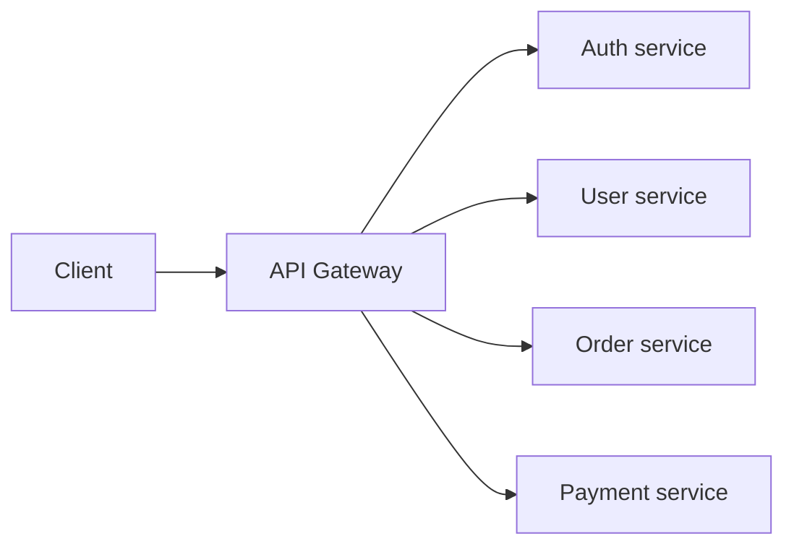
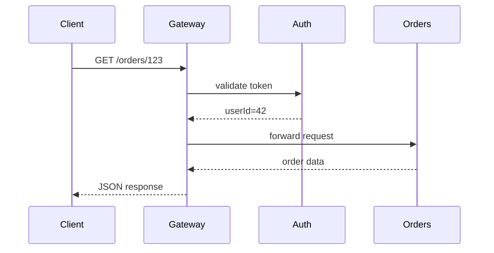
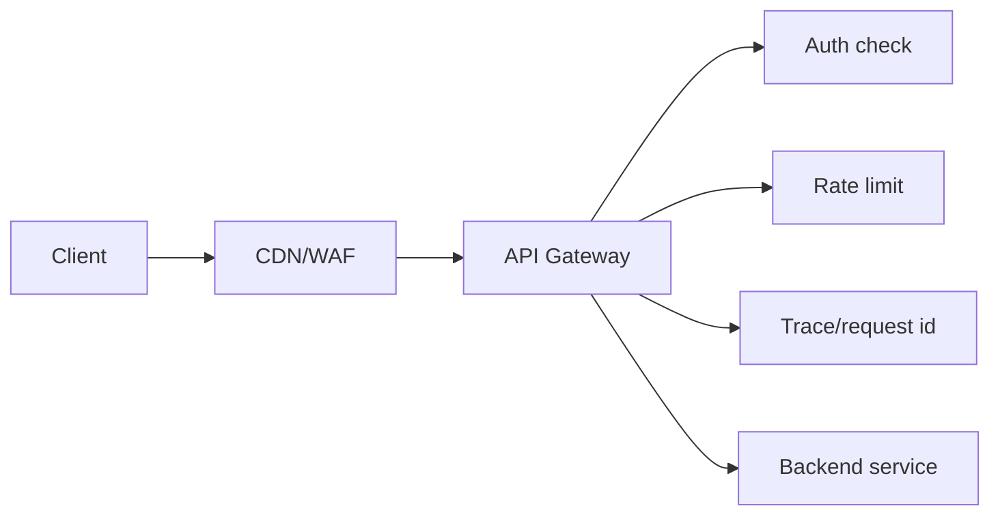

# API Gateway

## Complete notes

API Gateway is the entry point in front of backend services.

![[Pasted image 20260920004936.png|540]]

## Easy explanation

An API Gateway is the front door for APIs; it routes requests and handles shared concerns like auth, rate limits, and logging.

In simple words: if you can explain `API Gateway` with one real request, one failure case, and one metric, you understand the topic much better than just memorizing the definition.

## Simple example

Imagine a mobile app calls one base URL: `/api`. The API Gateway checks auth, applies rate limits, adds a request id, and routes `/orders` to Order Service and `/payments` to Payment Service.

For `API Gateway`, ask yourself:

1. What should the gateway do?
2. What should stay inside services?
3. How can the gateway become a bottleneck?
4. How do I scale and monitor it?
5. How do auth and rate limits work at the gateway?

## Real-life examples

### Easy real-life example

The frontend calls `/api/orders`; the gateway checks auth and routes to Order Service.

### Difficult production example

A gateway handles auth, rate limits, request IDs, route-based upstreams, canary routing, observability, and protects against becoming a single bottleneck.

### How to relate this topic

When reading `API Gateway`, connect it to:

- one user action
- one backend component
- one failure case
- one tradeoff
- one metric

## Important points

- Core idea: `API Gateway` must be understood through its production use case, not just its definition.
- When to use it: Focus on contract stability, client compatibility, validation, security, rate limits, idempotency, and how clients should behave during retries or failures.
- At scale: explain the bottleneck, failure path, operational owner, and rollback/fallback.
- What to monitor: endpoint latency, 4xx/5xx rate, request volume, payload size, auth failures, rate-limit hits, and trace ids.
- Interview rule: always give one concrete example, one tradeoff, one failure mode, and one metric.

## Diagram

## Real use

Frontend calls one base URL like `/api`.
Gateway decides which backend service should handle the request.

## Common mistakes

- Designing endpoints without defining request/response/error contracts.
- Ignoring idempotency for unsafe retries.
- Returning inconsistent status codes or error shapes.
- Allowing unbounded pagination, filters, or payload size.
- Forgetting auth, authorization, rate limits, and backwards compatibility.

## Quick revision

API Gateway is the entry point in front of backend services.

## Examples and deeper diagrams

### Real example

Imagine an ecommerce app:

- `/users/*` goes to User Service.
- `/orders/*` goes to Order Service.
- `/payments/*` goes to Payment Service.
- All requests pass through auth, rate limiting, and logging first.

### What to say in interviews

API Gateway is useful when many clients talk to many backend services. It centralizes cross-cutting concerns like auth, rate limiting, routing, request logging, and sometimes response transformation. But it can also become a bottleneck or single point of failure, so it must be horizontally scalable and monitored.

## 2026 update: Gateway responsibilities

> [!warning] Keep the gateway thin
> Put routing, authentication checks, rate limiting, request ids, logging, and coarse validation in the gateway. Avoid putting business logic there; that turns the gateway into a hidden monolith.

## Deep understanding checklist

To fully understand `API Gateway`, be able to answer:

1. Where does it sit in the architecture?
2. What production problem does it solve?
3. What is the simplest implementation?
4. What breaks when traffic or data grows?
5. What is the main failure mode?
6. What tradeoff does it introduce?
7. Which metric proves it is healthy?

Strong answer focus: Focus on contract stability, client compatibility, validation, security, rate limits, idempotency, and how clients should behave during retries or failures.

## Senior interview bank

These are topic-specific questions and strong answers for `API Gateway`.

### 1. What belongs in an API Gateway?

Routing, TLS termination, authentication checks, authorization delegation, rate limiting, request ids, logging, coarse validation, and sometimes response/request transformation. Business logic should stay in services.

### 2. How can an API Gateway fail?

It can become a bottleneck, single point of failure, latency source, misconfigured auth layer, or hidden monolith if too much logic is added. It needs horizontal scaling, health checks, timeouts, and observability.

### 3. API Gateway vs load balancer?

A load balancer distributes traffic across instances. An API Gateway understands APIs and usually adds auth, rate limits, routing rules, request shaping, API keys, and analytics.

### 4. What would you monitor?

Gateway p95/p99 latency, 4xx/5xx by route, auth failures, rate-limit hits, upstream latency, timeout count, request volume, and saturation.

### 5. What is the interview example?

For ecommerce, `/users`, `/orders`, and `/payments` route through the gateway. The gateway validates token, adds request id, applies per-user rate limit, then forwards to the correct service.

## Topic-specific drill

### How would I answer `API Gateway` if the interviewer asks directly?

For `API Gateway`, I would explain the API contract, request/response shape, error behavior, retry/idempotency story, compatibility risk, and how clients should behave.

### What is the trap question for `API Gateway`?

The trap is giving only a definition. A senior answer must include a concrete production example, a failure mode, a tradeoff, and a metric.

### What should I draw?

Draw the smallest flow that shows where `API Gateway` sits, then add the failure path next to the happy path.

## Reviewer checklist

- Can I explain this without reading the note?
- Can I draw the happy path and failure path?
- Can I name one concrete metric?
- Can I explain the tradeoff against a simpler option?
- Can I give a production example in under two minutes?
