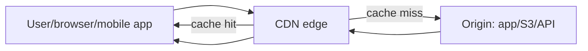
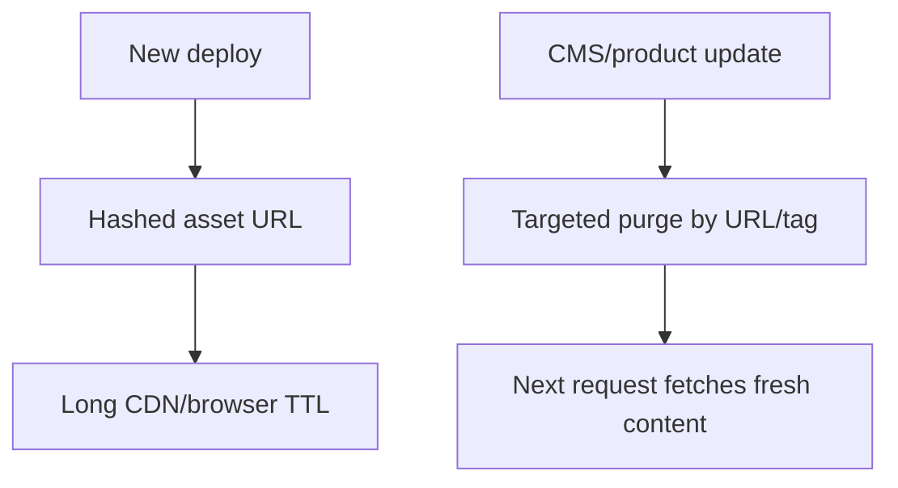

# CDN

## Complete notes

CDN means Content Delivery Network. It is a globally distributed caching layer that serves content from edge locations close to users instead of sending every request to the origin server.

A CDN is not only for speed. In production, it also reduces origin load, absorbs traffic spikes, improves availability during origin problems, supports TLS/HTTP optimizations, and can enforce some edge security controls.

## Easy explanation

A CDN is like putting copies of public content near users so every request does not travel back to your main server.

In simple words: if you can explain `CDN` with one real request, one failure case, and one metric, you understand the topic much better than just memorizing the definition.

## Simple example

Imagine a user in India opens your ecommerce app. Product images are cached at a CDN edge near India, so the browser downloads them from the nearby edge instead of your origin server in another region.

For `CDN`, ask yourself:

1. Was this request a cache hit or cache miss?
2. What is the cache key?
3. How long should the content stay fresh?
4. What happens if the origin is down?
5. How do I prevent private data from being cached publicly?

## Real-life examples

### Easy real-life example

A user in Mumbai opens a product page. Product images load from a CDN edge in India instead of the origin server in another region.

### Difficult production example

A global ecommerce app caches images and public product pages, uses signed URLs for private invoices, purges by cache tag after product updates, and monitors hit ratio and origin load.

### How to relate this topic

When reading `CDN`, connect it to:

- one user action
- one backend component
- one failure case
- one tradeoff
- one metric

## Important points

- Core idea: `CDN` must be understood through its production use case, not just its definition.
- When to use it: Focus on contract stability, client compatibility, validation, security, rate limits, idempotency, and how clients should behave during retries or failures.
- At scale: explain the bottleneck, failure path, operational owner, and rollback/fallback.
- What to monitor: endpoint latency, 4xx/5xx rate, request volume, payload size, auth failures, rate-limit hits, and trace ids.
- Interview rule: always give one concrete example, one tradeoff, one failure mode, and one metric.

## Where CDN fits



The CDN sits between users and your origin. The origin can be an app server, object storage such as S3, media server, or API gateway.

## Cache hit vs cache miss

- Cache hit: edge already has a fresh copy and returns it quickly.
- Cache miss: edge asks the origin, stores the response if cacheable, then returns it.
- Revalidation: edge checks with origin using validators like `ETag` or `Last-Modified`.
- Purge/invalidation: you remove cached content before TTL expires.

## Cache-Control headers

Common headers:

```http
Cache-Control: public, max-age=31536000, immutable
Cache-Control: public, max-age=600, stale-while-revalidate=30
Cache-Control: public, max-age=3600, stale-if-error=60
Cache-Control: private, no-store
```

### What they mean

- `public`: shared caches like CDN can store it.
- `private`: browser may cache, but shared CDN should not.
- `no-store`: do not cache.
- `max-age`: browser freshness lifetime.
- `s-maxage`: shared-cache/CDN freshness lifetime.
- `immutable`: content will not change while fresh, good for hashed assets.
- `stale-while-revalidate`: serve stale content while refreshing in background.
- `stale-if-error`: serve stale content if origin returns 500/502/503/504.

## Cache key

The cache key decides whether two requests are treated as the same cached object.

Typical cache key inputs:

- scheme: HTTP/HTTPS
- host
- path
- query string
- selected headers
- selected cookies
- device or language variation

### Example

`/products/123?currency=INR` and `/products/123?currency=USD` may need different cache entries. But tracking parameters like `utm_source` should usually be ignored, or they will destroy cache hit rate.

## What should be cached

Good CDN candidates:

- Hashed static assets: `/app.8f3a.js`
- Product images
- Public product pages
- Public documentation
- Video thumbnails
- Public downloads
- Public API responses with clear TTL

Be careful or avoid:

- User profile pages
- Cart and checkout
- Authenticated account data
- Admin pages
- Personalized recommendations unless cache key includes safe personalization dimension
- Anything containing tokens, cookies, private user data, or tenant-specific secrets

## Invalidation strategy

Best strategies:

1. Prefer versioned URLs for static assets.
   Example: `/app.abc123.js`. New deploy creates a new URL, so old cache does not matter.
2. Use short TTL for frequently changing public API/data.
3. Use targeted purge by URL/cache tag/prefix for content updates.
4. Avoid `purge everything` unless it is an emergency because it can cause origin traffic spikes.



## Security

- Use HTTPS from user to CDN and CDN to origin.
- Use signed URLs or signed cookies for private downloads/videos.
- Keep origin private when possible so users cannot bypass CDN controls.
- Do not cache responses with `Set-Cookie` unless intentionally configured.
- Be careful with cache poisoning: do not vary cache on untrusted headers unless required.
- Use WAF/bot controls/rate limits at the edge for abusive traffic.

## Failure modes

- Stale content after update because TTL is too long or purge failed.
- Cache stampede when many objects expire together and hit origin.
- Low cache hit ratio because query strings/cookies/headers make too many cache keys.
- Private data leak because authenticated responses were cached publicly.
- Origin overload after purge everything.
- Regional CDN issue or bad edge rule.
- Signed URL expiration too short or too long.

## Metrics to monitor

- Cache hit ratio.
- Edge latency and origin latency.
- 4xx/5xx at CDN and origin.
- Origin request rate.
- Bandwidth/egress cost.
- Top cache-miss URLs.
- Purge/invalidation success.
- `Age`, `CF-Cache-Status`, `X-Cache`, or provider-specific cache headers.

## Use cases

- Website assets.
- Product images.
- Video/static files.
- Public downloads.
- Public documentation.
- Static frontend deployments.
- Public read-heavy APIs.
- Private downloads with signed URLs.

## CDN vs cache vs reverse proxy

| Concept | Main purpose | Scope |
|---|---|---|
| CDN | Serve content from global edge locations | Global |
| Reverse proxy | Route/protect traffic before origin | Usually regional/service edge |
| Application cache | Speed up app/database reads | Inside backend |
| Browser cache | Avoid repeated downloads on one device | User device |

## Common mistakes

- Designing endpoints without defining request/response/error contracts.
- Ignoring idempotency for unsafe retries.
- Returning inconsistent status codes or error shapes.
- Allowing unbounded pagination, filters, or payload size.
- Forgetting auth, authorization, rate limits, and backwards compatibility.

## Quick revision

- CDN serves content from edge locations near users.
- Cache hit means the edge responds without origin.
- Cache miss means the edge asks origin.
- Cache key decides what is considered the same object.
- `Cache-Control` controls freshness and stale behavior.
- Use versioned URLs for long-lived static assets.
- Use signed URLs/cookies for private content.
- Main risks: stale content, low hit ratio, origin overload, and private data leak.

## Senior interview bank

These are topic-specific questions and strong answers for `CDN`.

### 1. When should you use a CDN?

Use a CDN when content is read-heavy, cacheable, geographically distributed, or expensive for the origin to serve repeatedly. Good examples are product images, static frontend assets, public documentation, video thumbnails, and public API responses with clear TTL.

### 2. What is the cache key and why does it matter?

The cache key decides whether requests share the same cached response. If the cache key includes unnecessary query strings or cookies, hit ratio drops. If it ignores important dimensions like currency, language, auth, or device when those change the response, users can get wrong or unsafe content.

### 3. How do you choose TTL and invalidation strategy?

For hashed static assets, use long TTL plus `immutable` because the URL changes on deploy. For dynamic public data, use shorter TTL, `stale-while-revalidate`, and targeted purge by URL/tag. Avoid purging everything because it can overload origin.

### 4. What can go wrong with CDN caching?

The biggest risks are serving stale content, caching private data, cache poisoning, low hit ratio, and origin overload after a global purge. I would prevent these with clear cache headers, safe cache keys, signed URLs for private content, targeted invalidation, and monitoring cache hit ratio/origin traffic.

### 5. How would you debug CDN issues?

Check response headers such as `Cache-Control`, `Age`, `CF-Cache-Status`, `X-Cache`, and `Vary`. Compare edge latency vs origin latency, check whether the request was HIT/MISS/BYPASS, inspect cache key inputs, and verify if purge actually removed the object.

### 6. How do signed URLs/cookies fit in?

Signed URLs or signed cookies allow the CDN to serve private content while preventing public access. They are common for private downloads, videos, invoices, or paid content. The tradeoff is expiration and key management: too short breaks users, too long increases exposure.

## Topic-specific drill

### How would I answer `CDN` if the interviewer asks directly?

For `CDN`, I would explain edge caching, cache hit/miss, cache key, TTL, invalidation, signed URLs for private content, stale behavior, and metrics like cache hit ratio and origin request rate.

### What is the trap question for `CDN`?

The trap is saying only "CDN makes content faster." A senior answer must discuss cache key design, invalidation, private data safety, stale content, and origin protection.

### What should I draw?

Draw user -> CDN edge -> origin, then show cache hit, cache miss, purge, and stale-if-error/stale-while-revalidate paths.

## Reviewer checklist

- Can I explain cache hit vs cache miss?
- Can I explain cache key design?
- Can I choose TTL for static assets vs public API responses?
- Can I explain how stale content is handled?
- Can I protect private content with signed URLs/cookies?
- Can I name CDN metrics and debugging headers?
