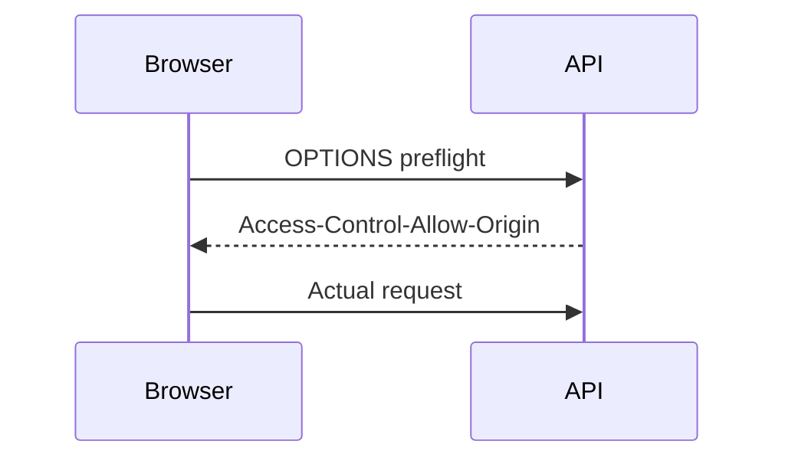

# CORS

## Complete notes

CORS means Cross-Origin Resource Sharing. It controls which browser origins can call your backend.

## Easy explanation

CORS is a browser rule: it decides whether one website is allowed to read a response from another website's API.

In simple words: if you can explain `CORS` with one real request, one failure case, and one metric, you understand the topic much better than just memorizing the definition.

## Simple example

Imagine your frontend runs on `https://app.example.com` and your API runs on `https://api.example.com`. The browser checks CORS before allowing frontend JavaScript to read the API response.

For `CORS`, ask yourself:

1. What origin is making the request?
2. Is this a browser request or server-to-server request?
3. Does the browser send a preflight?
4. Are credentials/cookies involved?
5. Which CORS header is missing or wrong?

## Real-life examples

### Easy real-life example

Your frontend at `app.example.com` calls `api.example.com`; the browser checks if the API allows that origin.

### Difficult production example

A production browser app fails because `Authorization` is missing from allowed headers in preflight, while Postman still works because CORS is browser-only.

### How to relate this topic

When reading `CORS`, connect it to:

- one user action
- one backend component
- one failure case
- one tradeoff
- one metric

## Important points

- CORS is enforced by browsers; it does not stop curl, Postman, servers, or attackers from calling the API.
- It controls whether a browser is allowed to read a cross-origin response.
- Preflight `OPTIONS` checks methods, headers, and credentials before the real request.
- `Access-Control-Allow-Origin` must match trusted origins when credentials/cookies are used.
- CORS is not authentication or authorization.
- Production bugs often come from missing `OPTIONS`, missing `Authorization` in allowed headers, or using `*` incorrectly.
- Monitor browser-facing 4xx, failed preflights, origin allowlist changes, and auth failures separately.

## Diagram



## Common headers

```text

Access-Control-Allow-Origin: https://example.com
Access-Control-Allow-Methods: GET, POST
Access-Control-Allow-Headers: Content-Type, Authorization
```

## Common mistakes

- Thinking CORS protects the API from non-browser clients.
- Using `Access-Control-Allow-Origin: *` with credentialed flows.
- Forgetting to handle `OPTIONS` preflight.
- Not allowing required headers such as `Authorization` or `Content-Type`.
- Allowing too many origins in production.
- Debugging with Postman only and missing browser-only failures.

## Quick revision

CORS means Cross-Origin Resource Sharing. It controls which browser origins can call your backend.

## 2026 update: CORS is browser protection, not API auth

> [!important] Interview line
> <span class="sd-key">CORS controls which browser origins may read responses.</span> It does not stop curl, Postman, backend services, or attackers from calling your API directly. Real API protection still needs auth, authorization, rate limiting, and input validation.


## Deep understanding checklist

To fully understand `CORS`, be able to answer:

1. Where does it sit in the architecture?
2. What production problem does it solve?
3. What is the simplest implementation?
4. What breaks when traffic or data grows?
5. What is the main failure mode?
6. What tradeoff does it introduce?
7. Which metric proves it is healthy?

Strong answer focus: Focus on contract stability, client compatibility, validation, security, rate limits, idempotency, and how clients should behave during retries or failures.


## Production example and edge cases

Example: your frontend runs on `https://app.example.com` and calls `https://api.example.com`. The browser sends a preflight if the request uses `Authorization`. The API must return the exact allowed origin, allowed methods, and allowed headers. If cookies are used, credentials must be configured carefully and wildcard origin is not acceptable.

Edge cases:

- localhost works but production domain is missing from allowlist
- preflight succeeds but real request fails auth
- CDN/proxy strips CORS headers
- mobile app works because CORS does not apply, browser fails
- multiple environments need different origin allowlists
- wildcard origin accidentally allows untrusted sites to read public responses

Interview answer rule: say clearly that CORS is browser read protection, not API authentication.

## Senior interview bank

These are topic-specific questions and strong answers for `CORS`.

### 1. What problem does CORS solve?

CORS controls which browser origins are allowed to read responses from another origin. It is a browser security mechanism, not backend authentication.

### 2. What is a preflight request?

For non-simple cross-origin requests, the browser sends an `OPTIONS` request first to check allowed methods, headers, and credentials before sending the real request.

### 3. Why is `Access-Control-Allow-Origin: *` dangerous with credentials?

Credentialed requests should not allow every origin. If cookies or auth credentials are involved, the backend must allow only trusted origins and set credentials rules carefully.

### 4. What common production bug happens with CORS?

The API works in Postman but fails in browser because CORS is enforced by browsers. Another common bug is missing allowed headers like `Authorization` or missing `OPTIONS` handling.

### 5. How do you debug CORS?

Check browser console, preflight response, `Access-Control-Allow-Origin`, `Access-Control-Allow-Methods`, `Access-Control-Allow-Headers`, `Access-Control-Allow-Credentials`, and whether the origin is exactly allowed.

## Topic-specific drill

### How would I answer `CORS` if the interviewer asks directly?

For `CORS`, I would explain same-origin policy, browser enforcement, preflight `OPTIONS`, allowed origins/methods/headers, credential rules, and why real API security still needs auth, authorization, validation, and rate limits.

### What is the trap question for `CORS`?

The trap is saying CORS prevents attackers from calling your API. It only controls browser access to cross-origin responses.

### What should I draw?

Draw browser -> preflight OPTIONS -> API CORS headers -> actual request, then show that server-to-server requests bypass CORS.

## Reviewer checklist

- Can I explain this without reading the note?
- Can I draw the happy path and failure path?
- Can I name one concrete metric?
- Can I explain the tradeoff against a simpler option?
- Can I give a production example in under two minutes?
