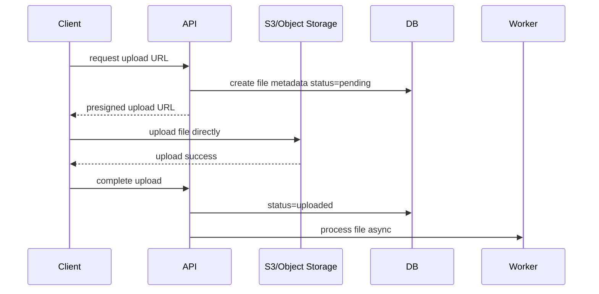

# File Upload Architecture

## Complete notes

File upload architecture handles user files safely without overloading the backend API server. The main production pattern is: API authorizes the upload, returns a presigned URL, client uploads directly to object storage, then backend stores metadata and processes the file asynchronously.

## Easy explanation

File upload architecture handles user files safely without overloading the backend API server.

In simple words: if you can explain `File Upload Architecture` with one real request, one failure case, and one metric, you understand the topic much better than just memorizing the definition.

## Simple example

Imagine a user uploads a 500 MB video. The backend should not receive the whole file. Instead, the backend checks permission, creates a presigned URL, the client uploads directly to object storage, and a worker processes the video later.

For `File Upload Architecture`, ask yourself:

1. Who is allowed to upload?
2. Where is the file stored?
3. How is metadata stored?
4. What happens if upload succeeds but processing fails?
5. How are private downloads protected?

## Real-life examples

### Easy real-life example

A user uploads a profile photo directly to object storage using a URL from the backend.

### Difficult production example

A video platform uses presigned multipart uploads, metadata states, virus scanning, thumbnail workers, signed downloads, orphan cleanup, and queue monitoring.

### How to relate this topic

When reading `File Upload Architecture`, connect it to:

- one user action
- one backend component
- one failure case
- one tradeoff
- one metric

## Important points

- Core idea: `File Upload Architecture` must be understood through its production use case, not just its definition.
- When to use it: Focus on contract stability, client compatibility, validation, security, rate limits, idempotency, and how clients should behave during retries or failures.
- At scale: explain the bottleneck, failure path, operational owner, and rollback/fallback.
- What to monitor: endpoint latency, 4xx/5xx rate, request volume, payload size, auth failures, rate-limit hits, and trace ids.
- Interview rule: always give one concrete example, one tradeoff, one failure mode, and one metric.

## Diagram

## API flow

1. Client asks backend for upload permission.
2. Backend checks auth/authorization/quota.
3. Backend creates metadata row with `pending` status.
4. Backend returns presigned URL with size/type restrictions.
5. Client uploads directly to storage.
6. Client calls complete endpoint or storage sends event.
7. Worker validates/processes file.
8. File becomes available after status changes to `ready`.

## Failure modes

- Client requests URL but never uploads.
- Upload succeeds but metadata update fails.
- Duplicate complete calls.
- File type spoofing.
- Large upload overwhelms backend if not direct-to-storage.
- Private file exposed through public bucket/policy.
- Orphan files in storage.
- Worker fails during thumbnail/transcode/scan.

## Security

- Do not trust client-provided MIME type only.
- Enforce max size and allowed types.
- Keep buckets private by default.
- Use short-lived presigned URLs.
- Store owner/tenant id in metadata.
- Use signed download URLs for private files.
- Scan untrusted files when needed.
- Avoid serving uploaded HTML/JS from same trusted app domain.

## Metrics to monitor

- Upload success/failure rate.
- Presigned URL creation rate.
- Storage 4xx/5xx.
- Average upload size.
- Orphan pending files.
- Worker queue lag.
- Processing failures.
- Malware scan failures if applicable.

## Common mistakes

- Designing endpoints without defining request/response/error contracts.
- Ignoring idempotency for unsafe retries.
- Returning inconsistent status codes or error shapes.
- Allowing unbounded pagination, filters, or payload size.
- Forgetting auth, authorization, rate limits, and backwards compatibility.

## Quick revision

- Direct upload to object storage protects backend from large file traffic.
- API authorizes and returns presigned URL.
- DB stores metadata and status.
- Worker processes file asynchronously.
- Private files need signed download URLs.
- Watch upload failures, orphan files, and worker lag.

## Deep understanding checklist

To fully understand `File Upload Architecture`, be able to answer:

1. Where does it sit in the architecture?
2. What production problem does it solve?
3. What is the simplest implementation?
4. What breaks when traffic or data grows?
5. What is the main failure mode?
6. What tradeoff does it introduce?
7. Which metric proves it is healthy?

Strong answer focus: Focus on contract stability, client compatibility, validation, security, rate limits, idempotency, and how clients should behave during retries or failures.

## Senior interview bank

These are topic-specific questions and strong answers for `File Upload Architecture`.

### 1. Why not upload every file through the backend?

Large uploads consume backend CPU, memory, bandwidth, request time, and connection slots. Direct-to-storage upload lets the backend authorize the upload while object storage handles the heavy file transfer.

### 2. How do presigned URLs work?

The backend creates a short-lived URL that allows a specific upload or download operation. The client uses that URL directly with storage. The backend should restrict file key, expiry, content type/size where possible, and ownership in metadata.

### 3. How do you handle upload completion safely?

Use metadata status transitions: `pending -> uploaded -> processing -> ready`. Make complete calls idempotent, verify the object exists, check size/checksum/type, then enqueue processing.

### 4. What can go wrong?

Orphan files, duplicate complete calls, public bucket exposure, file spoofing, malware, worker failure, multipart upload not completed, and private files accidentally cached or served publicly.

### 5. What should you monitor?

Upload success rate, storage errors, pending-file age, worker queue lag, processing failures, average file size, scan failures, and download 403/404 rates.

## Topic-specific drill

### How would I answer `File Upload Architecture` if the interviewer asks directly?

For `File Upload Architecture`, I would explain presigned URLs, direct-to-storage upload, metadata status, async processing, security validation, failure cleanup, and metrics.

### What is the trap question for `File Upload Architecture`?

The trap is sending all large files through the backend and ignoring orphan files, private access, file validation, and async processing failure.

### What should I draw?

Draw client -> API -> object storage -> DB -> worker, then show failed upload/orphan cleanup and async processing.

## Reviewer checklist

- Can I explain presigned upload?
- Can I explain metadata states?
- Can I handle duplicate complete calls?
- Can I secure private files?
- Can I clean up orphan uploads?
