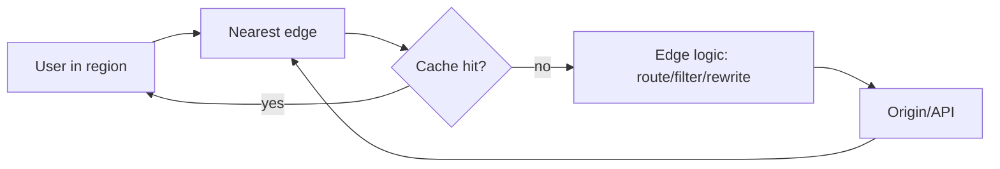

# Global CDN and Edge

## Complete notes

Global CDN and edge architecture places caching, routing, security checks, and lightweight request logic close to users around the world.

It is broader than a normal CDN note: CDN focuses on caching content, while edge architecture can also run logic such as redirects, bot filtering, geo routing, header changes, auth pre-checks, A/B routing, and request normalization before the origin.

## Easy explanation

Global CDN and edge architecture places caching, routing, security checks, and lightweight request logic close to users around the world.

In simple words: if you can explain `Global CDN and Edge` with one real request, one failure case, and one metric, you understand the topic much better than just memorizing the definition.

## Simple example

Imagine a global app that serves users from India, Europe, and the US. Static files are cached at edge locations, bot checks run at the edge, and only cache misses or important API calls go back to the origin.

For `Global CDN and Edge`, ask yourself:

1. What is cached at the edge?
2. What logic safely runs at the edge?
3. What must stay at origin?
4. What happens during a regional edge issue?
5. How do I debug edge vs origin behavior?

## Real-life examples

### Easy real-life example

A mobile app calls your backend to show a product page. The API should return the right data, clear errors, and not break older app versions.

### Difficult production example

A public partner API serves thousands of clients with different versions. You need pagination, rate limits, idempotency, clear errors, auth, backward compatibility, and dashboards per endpoint.

### How to relate this topic

When reading `Global CDN and Edge`, connect it to:

- one user action
- one backend component
- one failure case
- one tradeoff
- one metric

## Important points

- Core idea: `Global CDN and Edge` must be understood through its production use case, not just its definition.
- When to use it: Focus on contract stability, client compatibility, validation, security, rate limits, idempotency, and how clients should behave during retries or failures.
- At scale: explain the bottleneck, failure path, operational owner, and rollback/fallback.
- What to monitor: endpoint latency, 4xx/5xx rate, request volume, payload size, auth failures, rate-limit hits, and trace ids.
- Interview rule: always give one concrete example, one tradeoff, one failure mode, and one metric.

## Diagram

## Edge use cases

- Static asset caching.
- Public API caching.
- Redirects.
- A/B routing.
- Geo routing.
- Bot filtering.
- WAF checks.
- Header normalization.
- Lightweight auth pre-checks.
- Origin failover.

## What should not live at edge

- Complex business transactions.
- Payment correctness logic.
- Writes requiring strong consistency.
- Large stateful workflows.
- Sensitive authorization decisions without origin verification.

## Failure modes

- Wrong edge rule routes users to wrong origin.
- Cached personalized data leaks.
- Bot/WAF rule blocks real users.
- Edge logic differs from origin logic.
- Purge misses some regions.
- Low cache hit ratio due to bad cache key.
- Observability gap between edge and origin.

## Metrics to monitor

- Edge latency.
- Origin latency.
- Cache hit ratio.
- Edge 4xx/5xx.
- Origin request rate.
- WAF/bot challenge rate.
- Route/failover count.
- Regional error rate.

## Common mistakes

- Designing endpoints without defining request/response/error contracts.
- Ignoring idempotency for unsafe retries.
- Returning inconsistent status codes or error shapes.
- Allowing unbounded pagination, filters, or payload size.
- Forgetting auth, authorization, rate limits, and backwards compatibility.

## Quick revision

- CDN caches content near users.
- Edge architecture also runs lightweight request logic near users.
- Best for read-heavy, latency-sensitive, globally distributed traffic.
- Keep critical writes and strong consistency at origin.
- Main risks: wrong cache/routing/security rule and weak observability.

## Deep understanding checklist

To fully understand `Global CDN and Edge`, be able to answer:

1. Where does it sit in the architecture?
2. What production problem does it solve?
3. What is the simplest implementation?
4. What breaks when traffic or data grows?
5. What is the main failure mode?
6. What tradeoff does it introduce?
7. Which metric proves it is healthy?

Strong answer focus: Focus on contract stability, client compatibility, validation, security, rate limits, idempotency, and how clients should behave during retries or failures.

## Senior interview bank

These are topic-specific questions and strong answers for `Global CDN and Edge`.

### 1. What is the difference between CDN and edge logic?

CDN mainly caches and serves content near users. Edge logic executes lightweight code/rules near users before the request reaches origin, such as redirects, bot checks, geo routing, or header rewrites.

### 2. When would you use edge architecture?

Use it for global low-latency reads, static assets, public caching, request filtering, bot mitigation, redirects, and routing decisions that do not require strong origin consistency.

### 3. What should not run at the edge?

Do not put complex transactions, payment correctness, strong authorization decisions, or stateful workflows at the edge unless you have a very deliberate consistency/security design.

### 4. What can go wrong?

Wrong routing rules, stale cache, personalized data leaks, WAF false positives, missing logs, regional CDN issues, and edge-origin behavior mismatch.

### 5. How would you debug it?

Check edge response headers, cache status, route/rule version, regional error rate, origin request rate, WAF events, and compare edge logs with origin logs using request ids.

## Topic-specific drill

### How would I answer `Global CDN and Edge` if the interviewer asks directly?

For `Global CDN and Edge`, I would explain caching plus edge execution, what logic belongs at edge, what must stay at origin, failure modes, and metrics like cache hit ratio, regional latency, and origin request rate.

### What is the trap question for `Global CDN and Edge`?

The trap is assuming edge solves every latency problem. A senior answer must discuss consistency, security, observability, and rollback of edge rules.

### What should I draw?

Draw user -> nearest edge -> cache/rule/WAF -> origin, then show regional failure or cache miss path.

## Reviewer checklist

- Can I explain CDN vs edge logic?
- Can I name safe edge use cases?
- Can I explain what must stay at origin?
- Can I debug regional edge issues?
- Can I name edge metrics?
