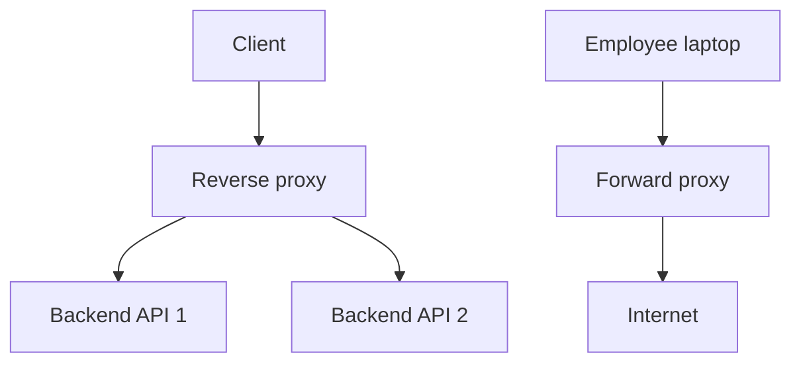

# Reverse Proxy vs Forward Proxy

## Complete notes

A proxy is a server that forwards traffic. A forward proxy represents clients going out to the internet. A reverse proxy represents backend servers and receives traffic from clients before forwarding it to internal services.

## Easy explanation

A proxy is a server that forwards traffic.

In simple words: if you can explain `Reverse Proxy vs Forward Proxy` with one real request, one failure case, and one metric, you understand the topic much better than just memorizing the definition.

## Simple example

Imagine users call `api.example.com`. A reverse proxy receives the request first, terminates TLS, adds forwarding headers, and sends traffic to the correct backend service. A forward proxy is different: it sits on the client side, for example in a company network controlling employee internet access.

For `Reverse Proxy vs Forward Proxy`, ask yourself:

1. Does the proxy represent the client or the server?
2. Does it terminate TLS?
3. Does it route to upstream services?
4. What headers/timeouts can break production?
5. What proxy metrics should be watched?

## Real-life examples

### Easy real-life example

A mobile app calls your backend to show a product page. The API should return the right data, clear errors, and not break older app versions.

### Difficult production example

A public partner API serves thousands of clients with different versions. You need pagination, rate limits, idempotency, clear errors, auth, backward compatibility, and dashboards per endpoint.

### How to relate this topic

When reading `Reverse Proxy vs Forward Proxy`, connect it to:

- one user action
- one backend component
- one failure case
- one tradeoff
- one metric

## Important points

- Core idea: `Reverse Proxy vs Forward Proxy` must be understood through its production use case, not just its definition.
- When to use it: Focus on contract stability, client compatibility, validation, security, rate limits, idempotency, and how clients should behave during retries or failures.
- At scale: explain the bottleneck, failure path, operational owner, and rollback/fallback.
- What to monitor: endpoint latency, 4xx/5xx rate, request volume, payload size, auth failures, rate-limit hits, and trace ids.
- Interview rule: always give one concrete example, one tradeoff, one failure mode, and one metric.

## Diagram

## Difference table

| Type | Represents | Protects | Example |
|---|---|---|---|
| Forward proxy | Client | User/client network | Company internet proxy |
| Reverse proxy | Server | Backend/origin | NGINX before API |

## Reverse proxy responsibilities

- TLS termination.
- Route `/api` to API service and `/static` to static origin.
- Load balance across backend instances.
- Add forwarding headers like `X-Forwarded-For`.
- Buffer slow clients.
- Enforce request body limits.
- Apply compression.
- Cache selected responses.
- Rate limit or block abusive clients.

## Failure modes

- Wrong forwarded headers causing wrong client IP, scheme, or host.
- Missing timeouts causing hung requests.
- Too-large body size blocked unexpectedly.
- TLS/certificate misconfiguration.
- Buffering large uploads and exhausting disk/memory.
- Proxy becomes bottleneck or single point of failure.
- Health checks route traffic to bad upstreams.

## Metrics to monitor

- 4xx/5xx at proxy.
- Upstream response time.
- Proxy latency.
- Active connections.
- Connection errors.
- TLS handshake failures.
- Request body too large errors.
- Upstream health.

## Common mistakes

- Designing endpoints without defining request/response/error contracts.
- Ignoring idempotency for unsafe retries.
- Returning inconsistent status codes or error shapes.
- Allowing unbounded pagination, filters, or payload size.
- Forgetting auth, authorization, rate limits, and backwards compatibility.

## Quick revision

- Forward proxy represents clients.
- Reverse proxy represents backend servers.
- Reverse proxy can terminate TLS, route, load balance, cache, compress, and rate limit.
- Main risks: header mistakes, timeouts, TLS issues, bottleneck, and wrong upstream routing.

## Deep understanding checklist

To fully understand `Reverse Proxy vs Forward Proxy`, be able to answer:

1. Where does it sit in the architecture?
2. What production problem does it solve?
3. What is the simplest implementation?
4. What breaks when traffic or data grows?
5. What is the main failure mode?
6. What tradeoff does it introduce?
7. Which metric proves it is healthy?

Strong answer focus: Focus on contract stability, client compatibility, validation, security, rate limits, idempotency, and how clients should behave during retries or failures.

## Senior interview bank

These are topic-specific questions and strong answers for `Reverse Proxy vs Forward Proxy`.

### 1. What is the core difference?

A forward proxy is used by clients to reach external servers. A reverse proxy is used by servers to receive client traffic and forward it to internal upstream services.

### 2. Why put a reverse proxy in front of backend services?

It centralizes TLS termination, routing, load balancing, compression, request limits, caching, and security controls. It also hides internal service topology from clients.

### 3. What can go wrong?

Wrong forwarded headers, missing timeouts, body-size limits, TLS misconfiguration, bad upstream health checks, and proxy overload can break production traffic.

### 4. How is reverse proxy different from API gateway?

Reverse proxy is a general traffic-forwarding layer. API gateway often adds API-specific features like auth, quota, developer keys, request transformation, and API analytics.

### 5. What would you monitor?

Monitor upstream latency, proxy 4xx/5xx, active connections, TLS errors, upstream health, request size rejections, and retry/timeout counts.

## Topic-specific drill

### How would I answer `Reverse Proxy vs Forward Proxy` if the interviewer asks directly?

For `Reverse Proxy vs Forward Proxy`, I would explain who the proxy represents, where it sits, what traffic controls it provides, and what can break if headers/timeouts/TLS are wrong.

### What is the trap question for `Reverse Proxy vs Forward Proxy`?

The trap is saying both are just "middle servers." A senior answer must explain client-side vs server-side purpose and production responsibilities.

### What should I draw?

Draw client -> reverse proxy -> backend services, and separately client -> forward proxy -> internet.

## Reviewer checklist

- Can I distinguish forward vs reverse proxy?
- Can I explain TLS termination?
- Can I explain forwarding headers?
- Can I explain proxy timeouts/body limits?
- Can I name proxy metrics?
