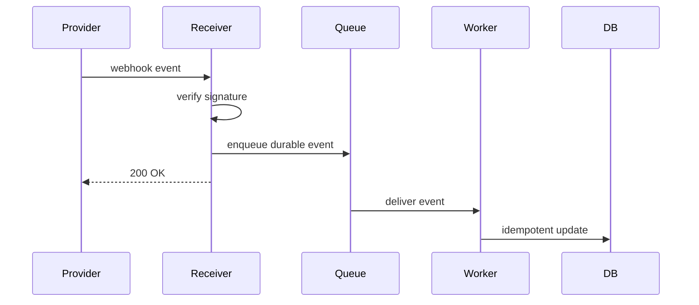

# Webhook Processing

## Complete notes

Webhook processing receives events from external systems and handles them reliably.

## Easy explanation

Webhook processing receives events from external systems and handles them reliably.

In simple words: if you can explain `Webhook Processing` with one real request, one failure case, and one metric, you understand the topic much better than just memorizing the definition.

## Simple example

Think of a frontend or mobile app calling your backend. This topic decides how the request should look, how the response should look, what happens when the client retries, and how the backend stays safe for old and new clients.

For `Webhook Processing`, ask yourself:

1. What is the normal happy path?
2. What can fail?
3. What is the tradeoff?
4. What would I monitor in production?

## Production design

The receiver should validate signature, store or enqueue the event durably, return quickly, and process asynchronously.

## Key ideas

- Webhooks are usually at-least-once.
- Consumers must be idempotent.
- Ordering is not guaranteed unless documented and designed.
- Use DLQ for poison events.
- Store raw payload for audit/replay when safe.

## Common mistakes

- Designing endpoints without defining request/response/error contracts.
- Ignoring idempotency for unsafe retries.
- Returning inconsistent status codes or error shapes.
- Allowing unbounded pagination, filters, or payload size.
- Forgetting auth, authorization, rate limits, and backwards compatibility.

## Quick revision

- One-line meaning: Webhook Processing is an API design topic. It should be understood as part of a real production backend, not only as a definition.
- Use it when: Use it when clients need a clear contract, safe retries, compatibility, and predictable errors.
- Failure to mention: partial failure, overload, bad config, stale data, or unsafe retries.
- Tradeoff to mention: simplicity vs production safety.
- Metric to mention: Watch request rate, 4xx/5xx rate, p95 latency, rate-limit hits, and request ids.

## Deep understanding checklist

To fully understand `Webhook Processing`, be able to answer:

1. Where does it sit in the architecture?
2. What production problem does it solve?
3. What is the simplest implementation?
4. What breaks when traffic or data grows?
5. What is the main failure mode?
6. What tradeoff does it introduce?
7. Which metric proves it is healthy?

Strong answer focus: Focus on contract stability, client compatibility, validation, security, rate limits, idempotency, and how clients should behave during retries or failures.

## Production example and edge cases

Example: for a create-payment API, use validation, auth, idempotency key, clear error codes, rate limits, and a response shape that clients can safely retry and understand.

For `Webhook Processing`, the edge cases to always think about are:

- duplicate request or duplicate event
- dependency timeout or partial failure
- stale data or inconsistent state
- bad input or abusive client
- high traffic causing bottleneck
- rollback or replay after a bad deploy

Interview answer rule: after explaining the concept, immediately give one production example, one failure mode, one tradeoff, and one metric.

## Real-life examples

### Easy real-life example

A mobile app calls your backend to show a product page. The API should return the right data, clear errors, and not break older app versions.

### Difficult production example

A public partner API serves thousands of clients with different versions. You need pagination, rate limits, idempotency, clear errors, auth, backward compatibility, and dashboards per endpoint.

### How to relate this topic

When reading `Webhook Processing`, connect it to:

- one user action
- one backend component
- one failure case
- one tradeoff
- one metric

## Senior interview bank

These are topic-specific questions and strong answers for `Webhook Processing`.

### 1. What is the correct webhook processing architecture?

Receive the webhook, verify signature/timestamp, persist or enqueue the raw event, return `200` quickly, then process asynchronously with idempotency and retry/DLQ handling.

### 2. Why return quickly?

Webhook providers retry when your endpoint times out or returns failure. Slow processing in the request path increases duplicate deliveries and provider-side retry storms.

### 3. How do you handle duplicates and ordering?

Store provider event id or business id with a unique constraint. Assume duplicates. Do not assume global ordering unless provider guarantees it; use entity version or reconciliation when order matters.

### 4. What can go wrong?

Signature validation failure, duplicate events, poison messages, downstream outage, event schema change, replay attacks, queue backlog, and no replay/audit path.

### 5. How would you debug failed webhooks?

Check provider delivery logs, your receiver logs, signature errors, queue lag, event id dedup table, worker failures, DLQ, and whether the downstream side effect is idempotent.

## Topic-specific drill

### How would I answer `Webhook Processing` if the interviewer asks directly?

For `Webhook Processing`, I would explain the API contract, request/response shape, error behavior, retry/idempotency story, compatibility risk, and how clients should behave.

### What is the trap question for `Webhook Processing`?

The trap is giving only a definition. A senior answer must include a concrete production example, a failure mode, a tradeoff, and a metric.

### What should I draw?

Draw the smallest flow that shows where `Webhook Processing` sits, then add the failure path next to the happy path.

## Reviewer checklist

- Can I explain this without reading the note?
- Can I draw the happy path and failure path?
- Can I name one concrete metric?
- Can I explain the tradeoff against a simpler option?
- Can I give a production example in under two minutes?
