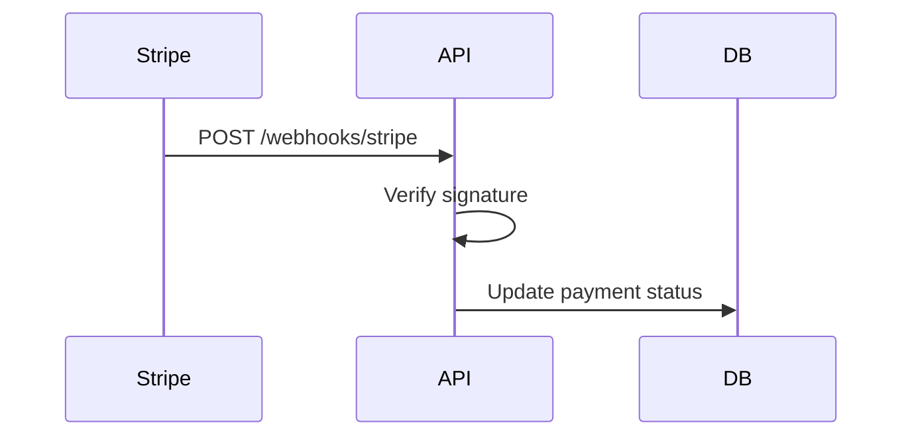

# Webhooks

## Complete notes

Webhook is a callback request sent by one system to another when an event happens.

## Easy explanation

Webhook is a callback request sent by one system to another when an event happens.

In simple words: if you can explain `Webhooks` with one real request, one failure case, and one metric, you understand the topic much better than just memorizing the definition.

## Simple example

Think of a frontend or mobile app calling your backend. This topic decides how the request should look, how the response should look, what happens when the client retries, and how the backend stays safe for old and new clients.

For `Webhooks`, ask yourself:

1. What is the normal happy path?
2. What can fail?
3. What is the tradeoff?
4. What would I monitor in production?

## Real-life examples

### Easy real-life example

A mobile app calls your backend to show a product page. The API should return the right data, clear errors, and not break older app versions.

### Difficult production example

A public partner API serves thousands of clients with different versions. You need pagination, rate limits, idempotency, clear errors, auth, backward compatibility, and dashboards per endpoint.

### How to relate this topic

When reading `Webhooks`, connect it to:

- one user action
- one backend component
- one failure case
- one tradeoff
- one metric

## Important points

- Core idea: `Webhooks` must be understood through its production use case, not just its definition.
- When to use it: Focus on contract stability, client compatibility, validation, security, rate limits, idempotency, and how clients should behave during retries or failures.
- At scale: explain the bottleneck, failure path, operational owner, and rollback/fallback.
- What to monitor: endpoint latency, 4xx/5xx rate, request volume, payload size, auth failures, rate-limit hits, and trace ids.
- Interview rule: always give one concrete example, one tradeoff, one failure mode, and one metric.

## Diagram

## Important

Webhook endpoints should return fast.
For slow work, put job in [[Message Queue with Redis|queue]].

## Common mistakes

- Designing endpoints without defining request/response/error contracts.
- Ignoring idempotency for unsafe retries.
- Returning inconsistent status codes or error shapes.
- Allowing unbounded pagination, filters, or payload size.
- Forgetting auth, authorization, rate limits, and backwards compatibility.

## Quick revision

Webhook is a callback request sent by one system to another when an event happens.

## Deep understanding checklist

To fully understand `Webhooks`, be able to answer:

1. Where does it sit in the architecture?
2. What production problem does it solve?
3. What is the simplest implementation?
4. What breaks when traffic or data grows?
5. What is the main failure mode?
6. What tradeoff does it introduce?
7. Which metric proves it is healthy?

Strong answer focus: Focus on contract stability, client compatibility, validation, security, rate limits, idempotency, and how clients should behave during retries or failures.

## Production example and edge cases

Example: for a create-payment API, use validation, auth, idempotency key, clear error codes, rate limits, and a response shape that clients can safely retry and understand.

For `Webhooks`, the edge cases to always think about are:

- duplicate request or duplicate event
- dependency timeout or partial failure
- stale data or inconsistent state
- bad input or abusive client
- high traffic causing bottleneck
- rollback or replay after a bad deploy

Interview answer rule: after explaining the concept, immediately give one production example, one failure mode, one tradeoff, and one metric.

## Senior interview bank

These are topic-specific questions and strong answers for `Webhooks`.

### 1. What are webhooks used for?

Webhooks let an external system notify your backend asynchronously when an event happens, such as payment succeeded, shipment created, subscription canceled, or document signed.

### 2. How do you secure webhooks?

Verify provider signature, timestamp, and payload. Use HTTPS, reject old timestamps to prevent replay, and store the event id for idempotency.

### 3. Why must webhook handlers be idempotent?

Providers usually retry delivery, so the same event can arrive multiple times. The consumer should store event id or business id and avoid applying the same side effect twice.

### 4. Should webhook processing happen in the HTTP request?

The receiver should validate, enqueue/store durably, and return quickly. Slow business processing should happen asynchronously in a worker.

### 5. What would you monitor?

Webhook receive count, signature failures, 2xx/4xx/5xx responses to provider, queue lag, duplicate event count, DLQ size, and processing failure rate.

## Topic-specific drill

### How would I answer `Webhooks` if the interviewer asks directly?

For `Webhooks`, I would explain the API contract, request/response shape, error behavior, retry/idempotency story, compatibility risk, and how clients should behave.

### What is the trap question for `Webhooks`?

The trap is giving only a definition. A senior answer must include a concrete production example, a failure mode, a tradeoff, and a metric.

### What should I draw?

Draw the smallest flow that shows where `Webhooks` sits, then add the failure path next to the happy path.

## Reviewer checklist

- Can I explain this without reading the note?
- Can I draw the happy path and failure path?
- Can I name one concrete metric?
- Can I explain the tradeoff against a simpler option?
- Can I give a production example in under two minutes?
