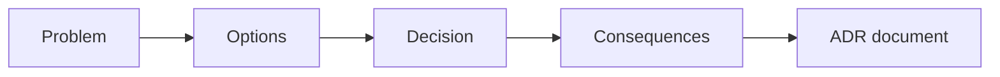

# Architecture Decision Records

## Complete notes

ADR documents important architecture decisions and their context/tradeoffs.

## Easy explanation

ADR documents important architecture decisions and their context/tradeoffs.

In simple words: if you can explain `Architecture Decision Records` with one real request, one failure case, and one metric, you understand the topic much better than just memorizing the definition.

## Simple example

Think of organizing code and services so they remain maintainable as the product/team grows. This topic explains boundaries, coupling, ownership, and migration.

For `Architecture Decision Records`, ask yourself:

1. What is the normal happy path?
2. What can fail?
3. What is the tradeoff?
4. What would I monitor in production?

## Real-life examples

### Easy real-life example

You separate route/controller code from business logic so it is easier to test.

### Difficult production example

A large codebase migrates toward bounded contexts, clean/hexagonal architecture, ADRs, and strangler migration without stopping product delivery.

### How to relate this topic

When reading `Architecture Decision Records`, connect it to:

- one user action
- one backend component
- one failure case
- one tradeoff
- one metric

## Important points

- Core idea: `Architecture Decision Records` must be understood through its production use case, not just its definition.
- When to use it: Focus on coupling, dependency direction, boundaries, ownership, testability, migration path, and when the pattern is overkill.
- At scale: explain the bottleneck, failure path, operational owner, and rollback/fallback.
- What to monitor: change lead time, defect rate, testability, deploy frequency, coupling, and ownership clarity.
- Interview rule: always give one concrete example, one tradeoff, one failure mode, and one metric.

## Diagram

## SDE-3 interview angle

At SDE-3 level, do not only define this topic. Explain tradeoffs, failure modes, production debugging signals, and what you would choose under different requirements.

## Common mistakes

- Applying patterns without a real boundary problem.
- Overengineering small CRUD services.
- Letting infrastructure leak into domain logic.
- No migration strategy.
- No ownership model.

## Quick revision

ADR documents important architecture decisions and their context/tradeoffs.

## Deep understanding checklist

To fully understand `Architecture Decision Records`, be able to answer:

1. Where does it sit in the architecture?
2. What production problem does it solve?
3. What is the simplest implementation?
4. What breaks when traffic or data grows?
5. What is the main failure mode?
6. What tradeoff does it introduce?
7. Which metric proves it is healthy?

Strong answer focus: Focus on coupling, dependency direction, boundaries, ownership, testability, migration path, and when the pattern is overkill.

## Production example and edge cases

Example: if business rules are mixed with Express controllers and ORM calls, clean/hexagonal architecture can isolate the domain logic. The tradeoff is more indirection and files.

For `Architecture Decision Records`, the edge cases to always think about are:

- duplicate request or duplicate event
- dependency timeout or partial failure
- stale data or inconsistent state
- bad input or abusive client
- high traffic causing bottleneck
- rollback or replay after a bad deploy

Interview answer rule: after explaining the concept, immediately give one production example, one failure mode, one tradeoff, and one metric.

## Senior interview bank

These are topic-specific questions and strong answers for `Architecture Decision Records`.

### 1. What coupling does this reduce?

Explain whether the pattern reduces framework, database, domain, service, deployment, or team coupling. A pattern is useful only if the boundary is real.

### 2. When is this overengineering?

It is overengineering when the service is small, low-risk, or changing rapidly and the abstraction adds more ceremony than protection.

### 3. How do you migrate toward it?

Use a strangler approach: create a boundary, move one use case, add tests, keep behavior compatible, and avoid big-bang rewrites.

### 4. How does it affect testing?

Good boundaries make business logic testable without real infrastructure. Bad boundaries make tests slow, brittle, and dependent on databases/services.

### 5. What is the tradeoff?

Better maintainability and testability can cost more files, indirection, and slower onboarding. The tradeoff is worth it when complexity and team size justify it.

## Topic-specific drill

### How would I answer `Architecture Decision Records` if the interviewer asks directly?

For `Architecture Decision Records`, I would explain what coupling it removes, when it becomes overengineering, how to migrate toward it, and how testing/ownership improve.

### What is the trap question for `Architecture Decision Records`?

The trap is giving only a definition. A senior answer must include a concrete production example, a failure mode, a tradeoff, and a metric.

### What should I draw?

Draw the smallest flow that shows where `Architecture Decision Records` sits, then add the failure path next to the happy path.

## Reviewer checklist

- Can I explain this without reading the note?
- Can I draw the happy path and failure path?
- Can I name one concrete metric?
- Can I explain the tradeoff against a simpler option?
- Can I give a production example in under two minutes?
