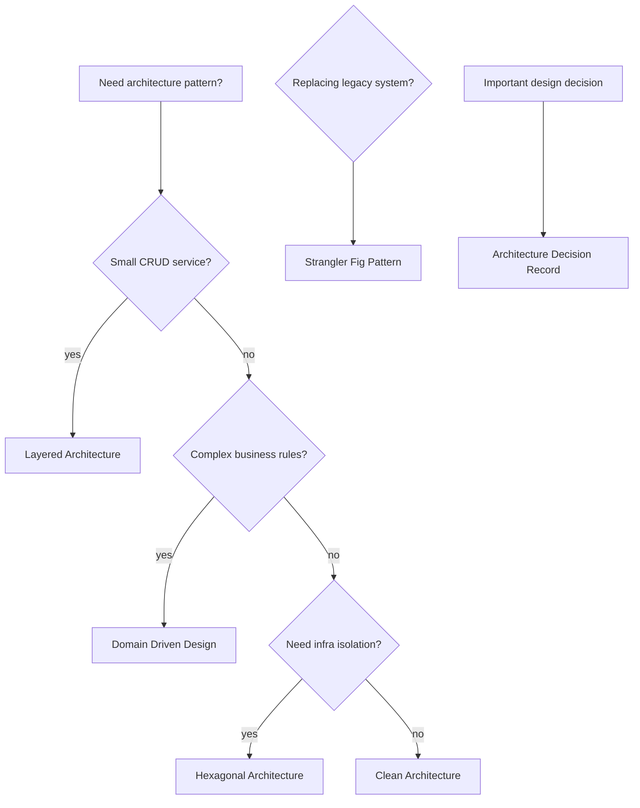

# Architecture Patterns Content Table

Architecture patterns explain how to organize code and evolve systems without creating a tangled backend. Use this section after you understand APIs, data, and basic system design.

## Study order

1. [[Layered Architecture]]
2. [[Clean Architecture]]
3. [[Hexagonal Architecture]]
4. [[Domain Driven Design]]
5. [[Strangler Fig Pattern]]
6. [[Architecture Decision Records]]

## Complete notes

Architecture patterns are not decorations. They decide where business logic lives, how dependencies flow, how tests are written, and how safely the system can change.

For SDE-3 level, do not only define the pattern. Explain:

- what problem it solves
- where code is placed
- dependency direction
- how database/external APIs are isolated
- how the pattern affects testing
- when the pattern is overkill
- how it helps migration/refactoring

## Decision flow



## How this applies to InvoiceOps

InvoiceOps can start with simple layered architecture:

```text
handler -> service -> repository -> database
```

As it grows, use hexagonal/clean boundaries:

- payment provider becomes an outbound port
- email sender becomes an outbound port
- file storage becomes an outbound port
- invoice business rules stay inside service/domain code

## Easy example

Client creation can be layered:

```text
Gin handler validates JSON
Service applies business rule
Repository inserts row
Database stores client
```

## Difficult production example

Payment webhook handling should not put Razorpay logic everywhere. Use boundaries:

```text
Webhook handler -> Payment service -> Invoice service -> PaymentProvider verifier -> Repository transaction
```

This makes duplicate webhook tests easier and lets you change provider later.

## Common mistakes

- using clean architecture for a tiny CRUD toy and adding unnecessary layers
- putting business logic in handlers
- putting database details in domain models
- making every package depend on every other package
- creating huge `utils` packages
- writing ADRs after the decision is already forgotten

## Senior interview bank

### 1. When would you use layered architecture?

Use it for straightforward services where the main flow is request -> business logic -> database. It is easy to understand and fast to build.

### 2. When does layered architecture become painful?

It becomes painful when business rules are complex, integrations grow, and database/provider logic leaks into handlers/services. Then clean or hexagonal boundaries help.

### 3. What is the value of ADRs?

ADRs record why a decision was made, what alternatives were considered, and what tradeoff was accepted. They help future engineers understand context instead of guessing.

## Reviewer checklist

- Can I draw dependency direction?
- Can I say where business logic belongs?
- Can I test service logic without HTTP?
- Can I swap a provider without rewriting everything?
- Can I explain why this pattern is not overkill?
